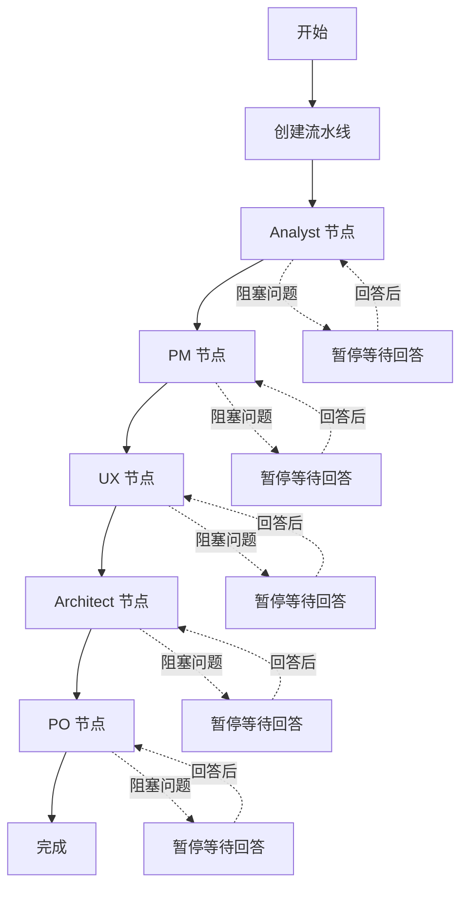
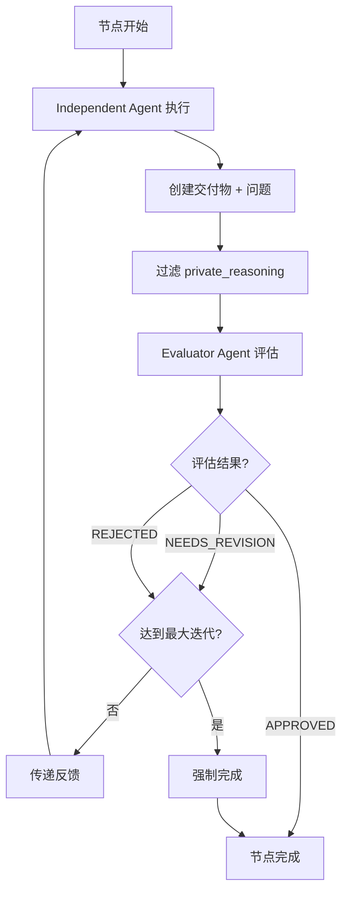

# DocuSwarm - 多智能体文档编排系统

DocuSwarm 是一个基于 BMAD 方法论的多智能体文档编排系统，通过双 Agent 模式（独立 Agent + 评估 Agent）实现文档自动化生成。

## 目录

- [核心特性](#核心特性)
- [系统架构](#系统架构)
- [快速开始](#快速开始)
- [CLI 使用指南](#cli-使用指南)
  - [全局选项](#全局选项)
  - [核心命令](#核心命令)
  - [常用工作流](#常用工作流)
- [工作流程](#工作流程)
- [配置说明](#配置说明)
  - [配置文件位置](#配置文件位置)
  - [环境变量配置](#环境变量配置)
  - [节点配置文件](#节点配置文件)
- [核心概念](#核心概念)
- [开发指南](#开发指南)
- [故障排查](#故障排查)

## 核心特性

### 🎯 双 Agent 协作模式
- **独立 Agent (Independent Agent)**：负责创建交付物（deliverable）和生成问题
- **评估 Agent (Evaluator Agent)**：评估交付物质量并提供反馈
- **迭代优化**：支持多轮迭代直至达到质量标准

### 🔄 基于 LangGraph 的状态机流水线
- **5 个顺序节点**：analyst → pm → ux → architect → po
- **状态管理**：SQLite WAL 模式持久化，使用 `StateManager` 管理流水线状态
- **检查点恢复**：支持中断后从断点恢复执行，使用 `SqliteSaver` 实现检查点机制

### 🛡️ 三层上下文隔离防御
1. **运行时访问控制**：Independent Agent 和 Evaluator Agent 独立上下文
2. **提示模板隔离**：确保 private_reasoning 不泄露给 Evaluator
3. **消息过滤机制**：ContextFilter 过滤敏感字段

### 🔌 Claude Agent SDK 集成
- **会话管理**：`SessionManager` 管理 LLM 会话
- **自动工具调度**：SDK 自动处理工具调用
- **结构化输出**：支持 JSON 格式的结构化响应
- **模式映射**：自动映射 instant、thinking、agent 三种模式

### 📊 质量控制与监控
- **质量判定**：基于评分阈值的智能判定
- **强制完成机制**：达到最大迭代次数时强制完成
- **升级处理**：支持阻塞问题的人工介入
- **指标收集**：`MetricsCollector` 收集执行指标
- **问题管理**：`QuestionHandler` 管理三级优先级问题（BLOCKING、CLARIFYING、OPTIONAL）

## 系统架构

```
DocuSwarm
├── Pipeline (流水线编排)
│   ├── HybridOrchestrator (混合编排器)
│   ├── PipelineState (流水线状态)
│   ├── StateGraph (LangGraph 状态图)
│   ├── VerdictDeterminer (质量判定器)
│   └── QuestionHandler (问题处理器)
│
├── Nodes (节点系统)
│   └── DualAgentNode (双 Agent 节点)
│       ├── IndependentAgent (独立 Agent)
│       └── EvaluatorAgent (评估 Agent)
│
├── Context (上下文管理)
│   ├── ContextManager (上下文管理器)
│   ├── ContextFilter (上下文过滤器)
│   └── IsolationAuditLogger (隔离审计日志)
│
├── Storage (存储层)
│   ├── StateManager (状态管理器)
│   ├── CheckpointManager (检查点管理器)
│   ├── FileStorage (文件存储)
│   └── Database (数据库操作)
│
├── LLM (LLM 集成)
│   ├── SessionManager (会话管理器)
│   ├── ResponseParser (响应解析器)
│   └── ModeMapper (模式映射器)
│
└── Tools (工具函数)
    ├── create_deliverable (创建交付物)
    └── update_context (更新上下文)
```

## 快速开始

### 前置要求

- Python 3.12+
- Anthropic API Key（Claude 模型）
- SQLite 3.35.0+（支持 WAL 模式）

### 安装步骤

1. **安装依赖**

```bash
pip install -r requirements.txt
```

2. **配置环境变量**

创建 `.env` 文件并设置必需的环境变量：

```env
# 必需：Anthropic API Key
ANTHROPIC_API_KEY=your_anthropic_api_key_here

# 可选：Anthropic API Base URL (默认: https://api.anthropic.com/v1/)
ANTHROPIC_BASE_URL=https://api.anthropic.com/v1/

# 可选配置
DOCUSWARM_DB_PATH=docuswarm.db
DOCUSWARM_OUTPUT_DIR=output
DOCUSWARM_LOG_LEVEL=INFO
DOCUSWARM_MAX_ITERATIONS=100
```

3. **验证安装**

```bash
python -m autoBMAD.docuswarm --version
```

## CLI 使用指南

### 全局选项

```bash
python -m autoBMAD.docuswarm [OPTIONS] COMMAND [ARGS]

OPTIONS:
  -v, --verbose              启用详细调试输出
  --log-level TEXT           设置日志级别 (DEBUG|INFO|WARNING|ERROR)
  --log-file PATH            日志文件目录 (默认: ./logs)
  --json-log                 使用 JSON 格式输出日志
  --version                  显示版本信息
```

### 核心命令

#### 1. 启动新流水线

使用上下文文件启动新的文档生成流水线：

```bash
python -m autoBMAD.docuswarm start --context <context_file>
```

**示例**：
```bash
python -m autoBMAD.docuswarm start -c docs/epics/EPIC-01.md
python -m autoBMAD.docuswarm start -c docs/proposal.md
```

**输出**：
```
+ Pipeline started: abc123xyz
  Subject: EPIC-01
  Context: docs/epics/EPIC-01.md
```

#### 2. 查看流水线状态

显示指定流水线的详细进度：

```bash
python -m autoBMAD.docuswarm status <pipeline_id>
```

**示例**：
```bash
python -m autoBMAD.docuswarm status abc123xyz
python -m autoBMAD.docuswarm status pipeline-1771949849410-4aba545c
```

**输出**：
```
Pipeline Status: abc123xyz
┏━━━━━━━━━━━━━━┳━━━━━━━━━━━━━━━━━━━━━━┓
┃ Property     ┃ Value                ┃
┡━━━━━━━━━━━━━━╇━━━━━━━━━━━━━━━━━━━━━━┩
│ Pipeline ID  │ abc123xyz            │
│ Subject      │ EPIC-01              │
│ Status       │ running              │
│ Created At   │ 2026-02-21 10:30:00  │
│ Updated At   │ 2026-02-21 10:35:00  │
└──────────────┴──────────────────────┘

Node Status
┏━━━━━━━━━━┳━━━━━━━━━━━━━━┳━━━━━━━━━━━┓
┃ Node     ┃ Status       ┃ Iteration ┃
┡━━━━━━━━━━╇━━━━━━━━━━━━━━╇━━━━━━━━━━━┩
│ analyst  │ ✓ Completed  │ 3         │
│ pm       │ → Running    │ 1         │
│ ux       │ ○ Pending    │ -         │
│ architect│ ○ Pending    │ -         │
│ po       │ ○ Pending    │ -         │
└──────────┴──────────────┴───────────┘

Current Node: pm
```

#### 3. 恢复中断的流水线

从最后一个检查点恢复执行，或从指定节点重新开始：

```bash
# 从检查点恢复
python -m autoBMAD.docuswarm resume <pipeline_id>

# 从指定节点重新开始
python -m autoBMAD.docuswarm resume <pipeline_id> --node <node_id>

# 强制恢复（即使流水线正在运行）
python -m autoBMAD.docuswarm resume <pipeline_id> --force
```

**示例**：
```bash
# 常规恢复
python -m autoBMAD.docuswarm resume abc123xyz

# 从 ux 节点重新开始
python -m autoBMAD.docuswarm resume abc123xyz --node ux

# 强制恢复
python -m autoBMAD.docuswarm resume abc123xyz -f
```

**可选节点**：`analyst`, `pm`, `ux`, `architect`, `po`

#### 4. 列出所有流水线

显示所有流水线及其状态：

```bash
python -m autoBMAD.docuswarm list-pipelines [--status STATUS]
```

**示例**：
```bash
# 列出所有流水线
python -m autoBMAD.docuswarm list-pipelines

# 仅列出运行中的流水线
python -m autoBMAD.docuswarm list-pipelines --status running
```

**可用状态过滤**：`pending`, `running`, `completed`, `failed`, `paused`, `cancelled`

#### 5. 取消流水线

**取消单个流水线**：

```bash
python -m autoBMAD.docuswarm cancel <pipeline_id>
```

**批量取消流水线**：

```bash
python -m autoBMAD.docuswarm cancel-all [--status STATUS] [--confirm]
```

**示例**：
```bash
# 取消特定流水线
python -m autoBMAD.docuswarm cancel pipeline-1771816177098-8ccefbd8

# 取消所有 pending 的流水线（需要确认）
python -m autoBMAD.docuswarm cancel-all --status pending

# 取消所有流水线（跳过确认）
python -m autoBMAD.docuswarm cancel-all --confirm
```

**可用状态过滤**：`pending`, `running`, `paused`, `failed`

#### 6. 清理流水线数据

永久删除流水线记录和相关数据：

```bash
python -m autoBMAD.docuswarm clean [OPTIONS]
```

**选项**：
- `--status STATUS`：只删除指定状态的流水线
- `--older-than-days N`：只删除 N 天前创建的流水线
- `--confirm`：跳过确认提示

**示例**：
```bash
# 删除所有 cancelled 的流水线（需要确认）
python -m autoBMAD.docuswarm clean --status cancelled

# 删除所有 failed 的流水线（跳过确认）
python -m autoBMAD.docuswarm clean --status failed --confirm

# 删除 7 天前的 completed 流水线
python -m autoBMAD.docuswarm clean --status completed --older-than-days 7
```

**⚠️ 警告**：此操作会永久删除数据（包括数据库记录和 node_results），无法恢复！

**可用状态过滤**：`pending`, `cancelled`, `failed`, `completed`

#### 7. 管理问题与回答

**列出未回答的问题**：

```bash
python -m autoBMAD.docuswarm questions <pipeline_id> [--run RUN_ID]
```

**回答问题**：

```bash
python -m autoBMAD.docuswarm answer <question_id> <answer>
# 或使用选项
python -m autoBMAD.docuswarm answer <question_id> --text "答案内容"
```

**示例**：
```bash
# 查看问题
python -m autoBMAD.docuswarm questions abc123xyz

# 回答问题
python -m autoBMAD.docuswarm answer abc123xyz_analyst_0 "使用 React + TypeScript"
```

**问题优先级**：
- 🚨 **BLOCKING**（阻塞）：必须回答才能继续
- ℹ️ **CLARIFYING**（澄清）：建议回答以提高质量
- ○ **OPTIONAL**（可选）：可选回答

#### 8. 导出交付物

将流水线的所有交付物导出到指定目录：

```bash
python -m autoBMAD.docuswarm export <pipeline_id> [output_dir] [OPTIONS]
```

**选项**：
- `-o, --output PATH`：自定义输出目录
- `--include-metadata`：包含元数据文件

**示例**：
```bash
# 导出到当前目录
python -m autoBMAD.docuswarm export abc123xyz

# 导出到指定目录并包含元数据
python -m autoBMAD.docuswarm export abc123xyz -o ./deliverables --include-metadata
```

### 常用工作流

#### 基本工作流

```bash
# 1. 启动新流水线
python -m autoBMAD.docuswarm start -c docs/proposal.md

# 2. 查看状态
python -m autoBMAD.docuswarm status <pipeline_id>

# 3. 如果需要，回答问题
python -m autoBMAD.docuswarm questions <pipeline_id>
python -m autoBMAD.docuswarm answer <question_id> "答案内容"

# 4. 导出结果
python -m autoBMAD.docuswarm export <pipeline_id> -o ./output
```

#### 批量管理工作流

```bash
# 1. 查看所有流水线
python -m autoBMAD.docuswarm list-pipelines

# 2. 取消所有 pending 的流水线
python -m autoBMAD.docuswarm cancel-all --status pending --confirm

# 3. 清理已取消的流水线
python -m autoBMAD.docuswarm clean --status cancelled --confirm

# 4. 清理失败的流水线
python -m autoBMAD.docuswarm clean --status failed --confirm
```

#### 维护工作流

```bash
# 每周执行：清理旧数据
python -m autoBMAD.docuswarm clean --status cancelled --confirm
python -m autoBMAD.docuswarm clean --status failed --confirm

# 每月执行：清理过旧的已完成流水线（保留30天）
python -m autoBMAD.docuswarm clean --status completed --older-than-days 30 --confirm

# 备份数据库
cp docuswarm.db docuswarm.db.backup-$(date +%Y%m%d)
```

## 工作流程

### 完整执行流程



### 双 Agent 节点执行流程

每个节点内部都运行双 Agent 协作模式：



### 节点角色说明

| 节点 | 角色 | 主要职责 | 输出交付物 |
|------|------|----------|-----------|
| **Analyst** | 业务分析师 | 需求分析、用户场景识别 | 需求分析文档 |
| **PM** | 项目经理 | 任务分解、里程碑规划 | 项目计划文档 |
| **UX** | 用户体验设计师 | 界面设计、交互流程 | UX 设计文档 |
| **Architect** | 架构师 | 技术架构、系统设计 | 架构设计文档 |
| **PO** | 产品负责人 | 验收标准、最终验证 | 验收文档 |

## 配置说明

### 配置文件位置

DocuSwarm 使用多层配置系统：

1. **环境变量文件**：`.env`（项目根目录）
2. **YAML 配置文件**：`autoBMAD/docuswarm/docuswarm.yaml`
3. **节点配置**：`nodes/{node_id}/` 目录下的配置文件

### 配置优先级

配置加载顺序（后者覆盖前者）：

1. **默认值**：代码中定义的默认配置
2. **YAML 配置**：`docuswarm.yaml`
3. **环境变量**：`.env` 文件或系统环境变量

### 环境变量配置

| 环境变量 | 必需 | 默认值 | 说明 |
|---------|------|--------|------|
| `ANTHROPIC_API_KEY` | ✅ | 无 | Anthropic API 密钥（必须设置） |
| `ANTHROPIC_BASE_URL` | ❌ | `https://api.anthropic.com/v1/` | Anthropic API Base URL |
| `DOCUSWARM_DB_PATH` | ❌ | `docuswarm.db` | SQLite 数据库路径 |
| `DOCUSWARM_OUTPUT_DIR` | ❌ | `output` | 交付物输出目录 |
| `DOCUSWARM_LOG_LEVEL` | ❌ | `INFO` | 日志级别（DEBUG/INFO/WARNING/ERROR） |
| `DOCUSWARM_MAX_ITERATIONS` | ❌ | `100` | 最大迭代次数 |

### YAML 配置示例

创建 `autoBMAD/docuswarm/docuswarm.yaml`：

```yaml
# Anthropic API 配置
# 注意：ANTHROPIC_API_KEY 必须通过环境变量设置，不应写入此文件
base_url: https://api.anthropic.com/v1/

# 数据库配置
db_path: docuswarm.db

# 输出目录
output_dir: output

# 日志级别（DEBUG, INFO, WARNING, ERROR）
log_level: INFO

# 最大迭代次数
max_iterations: 100
```

**注意**：
- `ANTHROPIC_API_KEY` 不应写入 YAML 文件，必须通过环境变量设置
- 所有 YAML 配置项都可以被环境变量覆盖

### 节点配置文件

每个节点需要三个配置文件，存放在 `nodes/{node_id}/` 目录：

1. **`node.yaml`**：节点基础配置
2. **`persona.json`**：Independent Agent 的 BMAD 人设
3. **`evaluator.yaml`**：Evaluator Agent 的评估标准

**示例：nodes/analyst/node.yaml**

```yaml
node_id: analyst
name: Business Analyst
description: Analyzes requirements and creates user stories
max_iterations: 10
quality_threshold: 80
```

**示例：nodes/analyst/persona.json**

```json
{
  "role": "Business Analyst",
  "background": "Experienced in requirements analysis and user story creation",
  "expertise": [
    "Requirements gathering",
    "User story writing",
    "Acceptance criteria definition"
  ],
  "guidelines": [
    "Focus on user needs and business value",
    "Write clear and testable acceptance criteria",
    "Consider edge cases and error scenarios"
  ],
  "output_format": {
    "type": "markdown",
    "structure": [
      "Executive Summary",
      "User Stories",
      "Acceptance Criteria"
    ]
  }
}
```

**示例：nodes/analyst/evaluator.yaml**

```yaml
criteria:
  completeness:
    weight: 0.3
    description: "Are all requirements clearly defined?"
    evaluation_points:
      - "All user stories have acceptance criteria"
      - "Edge cases are considered"
      - "Dependencies are identified"
  
  clarity:
    weight: 0.3
    description: "Is the document easy to understand?"
    evaluation_points:
      - "Language is clear and concise"
      - "Technical jargon is explained"
      - "Examples are provided where needed"
  
  feasibility:
    weight: 0.4
    description: "Are the requirements technically feasible?"
    evaluation_points:
      - "Requirements are realistic"
      - "Technical constraints are acknowledged"
      - "Implementation approach is sound"

scoring:
  excellent: 90
  good: 75
  acceptable: 60
  needs_revision: 50
```

## 核心概念

### 流水线状态

| 状态 | 说明 | 可执行操作 |
|------|------|------------|
| `pending` | 待启动 | `start`, `cancel`, `clean` |
| `running` | 运行中 | `status`, `cancel`, `export` |
| `paused` | 暂停（等待回答） | `resume`, `answer`, `questions`, `cancel` |
| `completed` | 已完成 | `status`, `export`, `clean` |
| `failed` | 失败 | `status`, `resume`, `cancel`, `clean` |
| `cancelled` | 已取消 | `status`, `clean` |

**状态转换流程**：
```
pending → running → completed
               ↓
            paused (有阻塞问题)
               ↓
            running (问题回答后)
               ↓
            failed (执行出错)
               ↓
          cancelled (手动取消)
```

### 上下文隔离机制

#### 为什么需要上下文隔离？

在双 Agent 模式中，Independent Agent 的 `private_reasoning` 字段包含其内部思考过程，不应被 Evaluator Agent 看到，以确保评估的公正性。

#### 隔离层次

1. **运行时隔离**：
   - Independent Agent 和 Evaluator Agent 使用独立的上下文实例
   - `ContextManager` 管理上下文的创建和销毁
   - 每个 Agent 有独立的会话 ID

2. **提示模板隔离**：
   - Independent Agent 提示词：`prompts/templates/independent_agent.yaml`
   - Evaluator Agent 提示词：`prompts/templates/evaluator_agent.yaml`
   - 两个模板完全独立，互不引用

3. **消息过滤**：
   - `ContextFilter` 在传递给 Evaluator 前过滤 `private_reasoning`
   - `IsolationAuditLogger` 记录所有过滤操作
   - 自动检测并阻止隔离违规

#### 审计日志

```python
# 查看隔离审计日志
from autoBMAD.docuswarm.context.audit import IsolationAuditLogger

audit_logger = IsolationAuditLogger()
audit_logger.log_isolation_boundary(
    node_id="analyst",
    agent_type="evaluator",
    context_keys=["filtered_keys"]
)
```

### 问题优先级与升级机制

#### 问题优先级

```python
class QuestionPriority:
    BLOCKING = "blocking"       # 阻塞问题：必须回答
    CLARIFYING = "clarifying"   # 澄清问题：建议回答
    OPTIONAL = "optional"       # 可选问题：可跳过
```

#### 升级处理

当遇到阻塞问题时：

1. **自动暂停**：流水线状态变更为 `paused`
2. **等待回答**：使用 `questions` 命令查看问题
3. **提供答案**：使用 `answer` 命令回答
4. **自动恢复**：答案被整合到上下文后自动继续执行

### 检查点与恢复

#### 检查点机制

- **自动保存**：每个节点完成后自动保存检查点
- **WAL 模式**：使用 SQLite WAL 模式提高并发性能
- **线程 ID**：每个流水线有唯一的 thread_id
- **状态持久化**：`SqliteSaver` 将 LangGraph 状态持久化到数据库
- **增量检查点**：仅保存状态变更，提高性能

#### 恢复流程

```python
# 系统自动处理恢复流程
# 1. 从 SqliteSaver 加载最后一个检查点
# 2. 恢复 PipelineState（包括所有字段）
# 3. 恢复会话 ID（如果有未完成的会话）
# 4. 从 current_node 继续执行
```

**恢复场景**：
- **正常恢复**：从最后一个完成的节点继续
- **节点内恢复**：如果节点执行到一半中断，从该节点重新开始
- **手动重启**：使用 `--node` 参数从指定节点重新开始

### 强制完成机制

当节点达到最大迭代次数时触发强制完成：

```python
@dataclass
class ForceCompletion:
    node_id: str
    iteration: int
    reason: str
    timestamp: datetime
    final_score: float
    threshold: float
```

**触发条件**：
- 迭代次数 >= `max_iterations`
- 评估结果仍为 `NEEDS_REVISION` 或 `REJECTED`

**行为**：
- 记录强制完成信息
- 使用最后一次迭代的交付物
- 继续执行下一个节点

## 开发指南

### 项目结构

```
autoBMAD/docuswarm/
├── agents/              # Agent 实现
│   ├── configs/         # Agent 配置文件
│   │   └── independent_agent.yaml
│   ├── evaluator_config/  # Evaluator 配置加载器
│   │   ├── criteria_loader.py
│   │   └── schemas.py
│   ├── base.py          # BaseAgent 基类
│   ├── independent.py   # IndependentAgent
│   ├── evaluator.py     # EvaluatorAgent
│   └── persona.py       # PersonaLoader
├── context/             # 上下文管理
│   ├── isolation.py     # ContextManager
│   ├── filter.py        # ContextFilter
│   ├── audit.py         # IsolationAuditLogger
│   └── memory.py        # ContextMemory
├── llm/                 # LLM 集成
│   ├── session_manager.py  # SessionManager
│   ├── response.py         # ResponseParser
│   ├── approval.py         # ApprovalSystem
│   ├── mode_mapper.py      # ModeMapper
│   └── config.py           # LLM 配置
├── nodes/               # 节点系统
│   ├── dual_agent.py    # DualAgentNode
│   ├── iteration.py     # IterationController
│   └── loader.py        # NodeConfigLoader
├── node_execution/      # 节点执行系统
│   ├── executor.py      # NodeExecutor
│   ├── flow.py          # ExecutionFlow
│   ├── state.py         # ExecutionState
│   ├── metrics.py       # MetricsCollector
│   ├── escalation.py    # EscalationHandler
│   ├── chaining.py      # NodeChaining
│   ├── graph.py         # ExecutionGraph
│   ├── validator.py     # ContextValidator
│   └── run_tracker.py   # RunTracker
├── pipeline/            # 流水线编排
│   ├── orchestrator.py  # HybridOrchestrator
│   ├── state.py         # PipelineState & 状态常量
│   ├── graph.py         # LangGraph 图定义
│   ├── quality.py       # VerdictDeterminer
│   ├── escalation.py    # EscalationHandler
│   ├── questions.py     # QuestionHandler
│   ├── transitions.py   # StateTransitions
│   ├── metrics.py       # PipelineMetrics
│   └── force_completion.py  # ForceCompletion
├── prompts/             # 提示词模板
│   ├── templates/       # YAML 模板文件
│   │   ├── independent_agent.yaml
│   │   └── evaluator_agent.yaml
│   ├── template_loader.py  # 模板加载器
│   ├── validator.py        # 模板验证器
│   ├── independent_agent.py  # Independent Agent 提示词
│   └── evaluator_agent.py    # Evaluator Agent 提示词
├── storage/             # 存储层
│   ├── state_manager.py    # StateManager
│   ├── checkpoints.py      # CheckpointManager
│   ├── database.py         # Database 操作
│   └── files.py            # FileStorage
├── tools/               # 工具函数
│   ├── protocols.py         # 工具协议定义
│   ├── create_deliverable.py  # 创建交付物工具
│   └── update_context.py      # 更新上下文工具
├── utils/               # 工具类
│   ├── logging.py       # 日志配置
│   └── session_ids.py   # Session ID 管理
├── tests/               # 测试文件
│   ├── unit/            # 单元测试
│   ├── integration/     # 集成测试
│   ├── cli/             # CLI 测试
│   └── conftest.py      # Pytest 配置
├── config.py            # 配置管理
├── exceptions.py        # 异常定义
├── main.py              # CLI 入口
├── __main__.py          # 模块入口
├── __init__.py          # 包初始化
├── docuswarm.yaml       # YAML 配置文件
└── pytest.ini           # Pytest 配置
```

### 添加新节点

1. **创建节点配置目录**：

```bash
mkdir -p nodes/my_node
```

2. **创建配置文件**：

**nodes/my_node/node.yaml**：
```yaml
node_id: my_node
name: My Custom Node
description: Description of what this node does
max_iterations: 10
quality_threshold: 80
```

**nodes/my_node/persona.json**：
```json
{
  "role": "My Role",
  "background": "Background description",
  "expertise": ["Skill 1", "Skill 2"],
  "guidelines": ["Guideline 1", "Guideline 2"],
  "output_format": {
    "type": "markdown",
    "structure": ["Section 1", "Section 2"]
  }
}
```

**nodes/my_node/evaluator.yaml**：
```yaml
criteria:
  quality:
    weight: 1.0
    description: "Quality criteria"
    evaluation_points:
      - "Point 1"
      - "Point 2"

scoring:
  excellent: 90
  good: 75
  acceptable: 60
  needs_revision: 50
```

3. **注册节点到流水线**：

在 `pipeline/state.py` 中添加节点 ID：

```python
# Pipeline node order - must execute in sequence
PIPELINE_NODES: list[str] = [
    "analyst",
    "pm",
    "ux",
    "architect",
    "po",
    "my_node",  # 新增节点
]
```

4. **验证节点配置**：

```bash
# 启动流水线，系统会自动加载新节点配置
python -m autoBMAD.docuswarm start -c context.md
```

### 自定义工具

创建自定义工具供 Independent Agent 使用：

```python
# tools/my_tool.py
from kimi_agent_sdk import tool
from typing import Any

@tool
def my_custom_tool(param: str) -> dict[str, Any]:
    """My custom tool description.
    
    Args:
        param: Parameter description
        
    Returns:
        Tool execution result
    """
    # 工具实现
    result = f"Processed: {param}"
    return {"status": "success", "result": result}
```

在 Independent Agent 配置中注册工具：

```python
# agents/configs/independent_agent.yaml
tools:
  - autoBMAD.docuswarm.tools.create_deliverable.create_deliverable
  - autoBMAD.docuswarm.tools.update_context.update_context
  - autoBMAD.docuswarm.tools.my_tool.my_custom_tool  # 新增工具
```

**工具开发注意事项**：
- 必须使用 `@tool` 装饰器
- 函数签名必须有完整的类型注解
- 返回值必须是可 JSON 序列化的
- Docstring 会被 LLM 用于理解工具功能

### 日志与调试

#### 配置日志

```python
from autoBMAD.docuswarm.utils.logging import configure_logging
from pathlib import Path

# 配置日志
logger = configure_logging(
    log_level="DEBUG",
    log_dir=Path("./logs"),
    json_format=False  # True 启用 JSON 格式
)
```

#### CLI 日志选项

```bash
# 启用详细输出（DEBUG 级别）
python -m autoBMAD.docuswarm -v start -c context.md

# 指定日志级别
python -m autoBMAD.docuswarm --log-level DEBUG start -c context.md

# 指定日志目录
python -m autoBMAD.docuswarm --log-file ./my-logs start -c context.md

# 使用 JSON 格式日志
python -m autoBMAD.docuswarm --json-log start -c context.md
```

#### 查看日志

```bash
# 标准日志
tail -f logs/docuswarm.log

# JSON 格式日志（使用 jq 美化）
tail -f logs/docuswarm.json | jq .

# 过滤特定级别的日志
grep "ERROR" logs/docuswarm.log

# 查看特定流水线的日志
grep "pipeline-abc123" logs/docuswarm.log
```

#### 调试技巧

1. **启用详细输出**：
```bash
python -m autoBMAD.docuswarm -v start -c context.md
```

2. **查看隔离审计日志**：
```python
from autoBMAD.docuswarm.context.audit import IsolationAuditLogger

audit_logger = IsolationAuditLogger()
audit_logger.get_audit_trail(node_id="analyst")
```

3. **检查检查点数据**：
```bash
sqlite3 docuswarm.db
.tables
SELECT * FROM checkpoints WHERE thread_id = 'your_pipeline_id';
```

## 故障排查

### 常见问题

#### 1. API Key 错误

**错误信息**：
```
ConfigurationError: ANTHROPIC_API_KEY is required. Please set it in your .env file or as an environment variable.
```

**解决方法**：
- 确保 `.env` 文件存在且包含 `ANTHROPIC_API_KEY`
- 检查环境变量是否正确设置：`echo $ANTHROPIC_API_KEY` (Linux/Mac) 或 `echo %ANTHROPIC_API_KEY%` (Windows)
- 验证 API Key 格式是否正确
- 确认 API Key 不是空字符串

#### 2. 流水线无法恢复

**错误信息**：
```
PipelineNotFoundError: Pipeline not found: abc123xyz
```

**解决方法**：
- 检查 pipeline_id 是否正确（注意大小写）
- 使用 `list-pipelines` 查看所有流水线
- 检查数据库文件是否存在：`ls -l docuswarm.db`
- 验证数据库是否损坏：`sqlite3 docuswarm.db "PRAGMA integrity_check;"`

#### 3. 节点配置加载失败

**错误信息**：
```
FileNotFoundError: Node configuration not found: nodes/analyst/node.yaml
# 或
ValidationError: Invalid persona format
```

**解决方法**：
- 检查节点配置文件是否存在：`ls nodes/analyst/`
- 验证 JSON/YAML 格式是否正确：
  - JSON: `python -m json.tool nodes/analyst/persona.json`
  - YAML: `python -c "import yaml; yaml.safe_load(open('nodes/analyst/node.yaml'))"`
- 确保文件编码为 UTF-8
- 检查文件权限是否可读

#### 4. 上下文隔离失败

**错误信息**：
```
ContextIsolationError: Context isolation violation detected
```

**解决方法**：
- 检查 `ContextFilter` 配置
- 查看隔离审计日志：查看 logs 目录中的审计日志
- 验证消息过滤逻辑是否正确
- 确认 Independent Agent 和 Evaluator Agent 使用独立的上下文实例

#### 5. 数据库锁定

**错误信息**：
```
sqlite3.OperationalError: database is locked
```

**解决方法**：
- 确保只有一个进程访问数据库
- 检查 WAL 模式是否启用：`sqlite3 docuswarm.db "PRAGMA journal_mode;"`
- 关闭其他可能持有数据库连接的进程
- 如果问题持续，尝试重启并使用 WAL 模式：
  ```bash
  sqlite3 docuswarm.db "PRAGMA journal_mode=WAL;"
  ```

#### 6. LLM API 调用失败

**错误信息**：
```
LLMError: API rate limit exceeded
# 或
LLMError: Authentication failed
```

**解决方法**：
- **Rate Limit**：等待一段时间后重试，或减少并发请求
- **Authentication**：检查 `ANTHROPIC_API_KEY` 是否有效且未过期
- **Network**：检查网络连接和 `ANTHROPIC_BASE_URL` 配置
- 查看详细错误信息：
  ```python
  try:
      # ... LLM 调用
  except LLMError as e:
      print(f"Error: {e}")
      print(f"Context: {e.context}")
      print(f"Raw response: {e.raw_response}")
  ```

### 调试工具

#### 查看流水线状态

```bash
python -m autoBMAD.docuswarm status <pipeline_id> -v
```

#### 导出诊断信息

```python
from autoBMAD.docuswarm.storage.state_manager import StateManager

state_manager = StateManager()
pipeline = state_manager.get_pipeline("pipeline_id")
print(json.dumps(pipeline, indent=2))
```

#### 检查节点结果

```python
from autoBMAD.docuswarm.storage.state_manager import StateManager

state_manager = StateManager()
results = state_manager.get_node_results("pipeline_id", "analyst")
for result in results:
    print(f"Iteration {result['iteration']}: {result['status']}")
```

### 性能优化

#### 数据库优化

```sql
-- 启用 WAL 模式
PRAGMA journal_mode=WAL;

-- 设置缓存大小
PRAGMA cache_size=-64000;

-- 优化同步模式
PRAGMA synchronous=NORMAL;
```

#### 并发控制

```python
# 使用连接池
from autoBMAD.docuswarm.storage.database import get_connection

with get_connection() as conn:
    # 执行数据库操作
    pass
```

## 最佳实践

### 1. 上下文文件编写

- **清晰描述**：明确说明项目目标和需求
- **结构化**：使用 Markdown 格式组织内容
- **完整性**：包含足够的背景信息
- **可测试**：提供验收标准

### 2. 问题处理策略

- **及时回答**：优先处理 BLOCKING 问题
- **详细描述**：提供充分的上下文信息
- **验证答案**：确保答案准确完整

### 3. 迭代控制

- **合理设置最大迭代次数**：通常 10 次足够
- **监控强制完成**：关注强制完成的节点
- **质量阈值调整**：根据需求调整质量标准

### 4. 日志管理

- **生产环境**：使用 `INFO` 级别
- **开发环境**：使用 `DEBUG` 级别
- **定期清理**：避免日志文件过大

### 5. 流水线管理

- **定期清理**：定期执行 `clean` 命令清理旧数据
  ```bash
  # 每周清理一次 cancelled 和 failed 的流水线
  python -m autoBMAD.docuswarm clean --status cancelled --confirm
  python -m autoBMAD.docuswarm clean --status failed --confirm
  
  # 每月清理 30 天前的 completed 流水线
  python -m autoBMAD.docuswarm clean --status completed --older-than-days 30 --confirm
  ```
- **及时取消**：对于测试或错误启动的流水线，及时使用 `cancel` 命令
- **状态监控**：定期使用 `list-pipelines` 查看流水线状态
- **批量操作**：使用 `cancel-all` 和 `clean` 的 `--status` 选项进行批量管理

### 6. 备份策略

定期备份数据库和输出目录：

```bash
# 备份数据库
cp docuswarm.db docuswarm.db.backup

# 备份输出目录
tar -czf output-backup.tar.gz output/
```

## 贡献指南

欢迎贡献代码、文档或报告问题！

### 开发流程

1. Fork 仓库
2. 创建特性分支：`git checkout -b feature/my-feature`
3. 提交变更：`git commit -m "Add my feature"`
4. 运行测试：`pytest tests/`
5. 提交 Pull Request

### 代码规范

- 遵循 PEP 8 规范
- 使用完整的类型注解（Python 3.10+）
- 编写单元测试（使用 pytest）
- 添加 Google 风格文档字符串
- 使用 `structlog` 进行结构化日志记录

### 测试要求

```bash
# 运行所有测试
pytest

# 运行特定测试文件
pytest tests/unit/test_cli.py

# 运行带覆盖率报告
pytest --cov=autoBMAD.docuswarm --cov-report=html

# 查看覆盖率报告
open htmlcov/index.html
```

## 许可证

本项目采用 MIT 许可证。详见 LICENSE 文件。

## 联系方式

- 项目主页：https://github.com/your-org/DocuSwarm
- 问题反馈：https://github.com/your-org/DocuSwarm/issues
- 文档：https://docuswarm.readthedocs.io

---

**版本**：1.0.0  
**最后更新**：2026-02-24

## 相关文档

- [配置说明文档](CONFIGURATION.md) - 详细的配置选项说明
- [开发指南](../../../claude_docs/) - 开发规范和最佳实践
- [测试指南](../../../claude_docs/testing_guide.md) - 测试策略和实践
