# DocuSwarm CLI 命令研究报告

## 文档信息

| 属性 | 值 |
|------|---|
| 版本 | 1.0 |
| 创建日期 | 2026-02-23 |
| 状态 | 研究完成 |
| 相关文档 | DocuSwarm流水线CurrentNode问题分析与操作指引.md |

---

## 一、执行摘要

本报告深度分析了 `autoBMAD.docuswarm` 模块的 CLI 命令实现，基于问题分析文档和源码审查，识别出三个核心命令（`start`、`resume`、`status`）存在的设计缺陷和改进需求。

### 核心发现

| 命令 | 当前状态 | 问题级别 | 改进优先级 |
|------|---------|---------|-----------|
| `start` | 仅创建元数据，不执行 | **严重** | P0 |
| `resume` | 不支持指定 node_id | **中等** | P1 |
| `status` | 仅显示 current_node | **中等** | P1 |

---

## 二、系统架构概述

### 2.1 DocuSwarm 核心组件

```
DocuSwarm
├── CLI Layer (main.py)
│   ├── start    → StateManager.create_pipeline()
│   ├── resume   → StateManager.update_pipeline_status()
│   └── status   → StateManager.get_pipeline()
│
├── Orchestration Layer
│   └── HybridOrchestrator (orchestrator.py)
│       ├── start_pipeline()    → LangGraph 执行
│       ├── resume_pipeline()   → 检查点恢复
│       └── get_pipeline_status()
│
├── Pipeline Layer (graph.py, state.py)
│   ├── PIPELINE_NODES = ["analyst", "pm", "ux", "architect", "po"]
│   ├── PipelineState (TypedDict)
│   └── create_pipeline_graph()
│
└── Storage Layer (state_manager.py, checkpoints.py)
    ├── StateManager → 流水线元数据
    └── CheckpointManager → LangGraph 检查点
```

### 2.2 流水线执行流程

```mermaid
graph TD
    subgraph "预期流程"
        A[CLI start] --> B[HybridOrchestrator.start_pipeline]
        B --> C[_validate_context LLM校验]
        C --> D[create_pipeline 创建记录]
        D --> E[update_pipeline_status running]
        E --> F[create_pipeline_graph]
        F --> G[graph.ainvoke 执行LangGraph]
        G --> H[analyst → pm → ux → architect → po]
        H --> I[update_pipeline_status completed]
    end
    
    subgraph "当前实现"
        A2[CLI start] --> D2[StateManager.create_pipeline]
        D2 --> J[返回 pipeline_id]
        J -.-> K[current_node = NULL]
    end
```



### 2.3 节点状态定义

```python
# pipeline/state.py
PIPELINE_NODES: list[str] = ["analyst", "pm", "ux", "architect", "po"]

# 流水线状态
PENDING = "pending"
RUNNING = "running"
COMPLETED = "completed"
FAILED = "failed"
PAUSED = "paused"
CANCELLED = "cancelled"

# 节点状态
APPROVED = "approved"
NEEDS_REVISION = "needs_revision"
BLOCKED = "blocked"
```

---

## 三、`start` 命令深度分析

### 3.1 当前实现分析

**文件位置**: `autoBMAD/docuswarm/main.py:80-134`

```python
@cli.command()
@click.option("--context", "-c", "context_file", required=True, ...)
@click.pass_context
def start(ctx: click.Context, context_file: str) -> None:
    """Start a new pipeline with the provided context file."""
    # 1. 验证上下文文件
    context_path = Path(context_file)
    content = context_path.read_text(encoding="utf-8")
    
    # 2. 仅创建数据库记录
    state_manager = StateManager()
    pipeline_id = state_manager.create_pipeline(
        subject=context_path.stem,
        subject_context={"context_file": str(context_path), "content": content},
    )
    
    # 3. 返回 pipeline_id（流水线并未真正执行）
    console.print(f"[green]+[/green] Pipeline started: [bold]{pipeline_id}[/bold]")
```

### 3.2 问题根因

| 问题 | 原因 | 影响 |
|------|------|------|
| **流水线不执行** | CLI 直接调用 `StateManager.create_pipeline()`，绕过了 `HybridOrchestrator` | `current_node` 永远为 NULL |
| **无 LangGraph 执行** | 没有调用 `create_pipeline_graph()` 和 `graph.ainvoke()` | 5个节点都不会执行 |
| **无 LLM 上下文验证** | 没有调用 `_validate_context()` | 无法校验上下文是否足够 |

### 3.3 预期实现对比

**HybridOrchestrator.start_pipeline** (`orchestrator.py:334-433`):

```python
async def start_pipeline(
    self,
    subject_context: dict[str, Any],
    pipeline_id: str | None = None,
) -> str:
    # Step 1: LLM 校验上下文
    validation_result = await self._validate_context(subject_context)
    
    # Step 2: 创建流水线记录
    db_pipeline_id = self._state_manager.create_pipeline(
        subject=subject,
        subject_context=subject_context,
    )
    
    # Step 3: 设置 current_node 为第一个节点
    _ = self._state_manager.update_pipeline_status(
        final_pipeline_id,
        status=RUNNING,
        current_node=PIPELINE_NODES[0],  # "analyst"
    )
    
    # Step 4: 创建并执行 LangGraph
    graph = create_pipeline_graph(db_path=self._db_path, checkpointer=checkpointer)
    result = await graph.ainvoke(initial_state, config)
    
    # Step 5: 更新状态为 completed
    _ = self._state_manager.update_pipeline_status(
        final_pipeline_id, status="completed"
    )
```

### 3.4 改进方案

#### 方案 A: CLI 直接调用 HybridOrchestrator（推荐）

```python
@cli.command()
@click.option("--context", "-c", "context_file", required=True, ...)
@click.pass_context
def start(ctx: click.Context, context_file: str) -> None:
    """Start a new pipeline with the provided context file."""
    import asyncio
    from autoBMAD.docuswarm.pipeline import HybridOrchestrator
    
    # 1. 读取上下文文件
    context_path = Path(context_file)
    content = context_path.read_text(encoding="utf-8")
    
    # 2. 构建 subject_context
    subject_context = {
        "subject": context_path.stem,
        "context_file": str(context_path),
        "content": content,
    }
    
    # 3. 通过 HybridOrchestrator 启动流水线
    orchestrator = HybridOrchestrator()
    
    async def run_pipeline() -> str:
        return await orchestrator.start_pipeline(subject_context)
    
    try:
        pipeline_id = asyncio.run(run_pipeline())
        console.print(f"[green]+[/green] Pipeline completed: [bold]{pipeline_id}[/bold]")
    except ContextValidationError as e:
        console.print(f"[red]Context validation failed: {e}[/red]")
        raise click.ClickException(str(e))
```

#### 方案 B: 新增 `run` 命令

保留 `start` 仅创建记录，新增 `run` 命令执行完整流水线：

```python
@cli.command()
@click.option("--context", "-c", "context_file", required=True, ...)
@click.option("--async", "-a", "run_async", is_flag=True, help="Run in background")
@click.pass_context
def run(ctx: click.Context, context_file: str, run_async: bool) -> None:
    """Run a complete pipeline with HybridOrchestrator."""
    # ... 完整实现
```

---

## 四、`resume` 命令深度分析

### 4.1 当前实现分析

**文件位置**: `autoBMAD/docuswarm/main.py:198-248`

```python
@cli.command()
@click.argument("pipeline_id")
@click.pass_context
def resume(ctx: click.Context, pipeline_id: str) -> None:
    """Resume an interrupted pipeline from its last checkpoint."""
    state_manager = StateManager()
    pipeline = state_manager.get_pipeline(pipeline_id)
    
    # 问题1: 当 current_node 为空时，填充 "unknown"
    current_node: str = str(cast(str, pipeline.get("current_node")) or "unknown")
    
    # 问题2: 仅更新数据库状态，不执行 LangGraph
    _ = state_manager.update_pipeline_status(
        pipeline_id=pipeline_id,
        status="running",
        current_node=current_node,  # 将 "unknown" 写入数据库
    )
    
    console.print(f"[green]+[/green] Pipeline resumed: [bold]{pipeline_id}[/bold]")
```

### 4.2 问题根因

| 问题 | 原因 | 影响 |
|------|------|------|
| **写入 "unknown"** | `current_node or "unknown"` 将空值替换为字符串 | 数据库中存储无效值 |
| **不支持指定 node_id** | 命令仅接受 `pipeline_id` 参数 | 无法从指定节点重新执行 |
| **不执行 LangGraph** | 没有调用 `HybridOrchestrator.resume_pipeline()` | 流水线实际不恢复执行 |

### 4.3 HybridOrchestrator.resume_pipeline 分析

**文件位置**: `orchestrator.py:435-563`

```python
async def resume_pipeline(self, pipeline_id: str) -> dict[str, Any]:
    """Resume a paused pipeline from its last checkpoint with session recovery."""
    # 1. 获取检查点状态
    pipeline = self._state_manager.get_pipeline(pipeline_id)
    checkpoint_state = pipeline.get("state", {})
    last_node = checkpoint_state.get("current_node")
    session_id = checkpoint_state.get("current_node_session_id")
    
    # 2. 尝试恢复 SDK 会话
    if session_id and last_node:
        session_resumed = await self._attempt_session_resume(
            pipeline_id=pipeline_id,
            session_id=session_id,
            last_node=last_node,
        )
    
    # 3. 从检查点恢复状态
    initial_state["current_node"] = checkpoint_state.get("current_node")
    initial_state["completed_nodes"] = checkpoint_state.get("completed_nodes", [])
    initial_state["deliverables"] = checkpoint_state.get("deliverables", {})
    
    # 4. 继续执行 LangGraph
    result = await graph.ainvoke(initial_state, config)
```

### 4.4 改进方案

#### 需求分析

根据用户需求，`resume` 命令需要支持两种模式：

1. **检查点恢复**: `resume <pipeline_id>` - 从最后检查点恢复
2. **指定节点重执行**: `resume <pipeline_id> --node <node_id>` - 从指定节点重新执行

#### 改进后的命令签名

```python
@cli.command()
@click.argument("pipeline_id")
@click.option("--node", "-n", "node_id", default=None,
              type=click.Choice(["analyst", "pm", "ux", "architect", "po"]),
              help="Restart from specific node (re-executes node and all subsequent nodes)")
@click.option("--force", "-f", is_flag=True,
              help="Force restart even if pipeline is running")
@click.pass_context
def resume(ctx: click.Context, pipeline_id: str, node_id: str | None, force: bool) -> None:
    """Resume an interrupted pipeline from its last checkpoint.
    
    Examples:
        # Resume from last checkpoint
        python -m autoBMAD.docuswarm resume pipeline-123
        
        # Restart from specific node
        python -m autoBMAD.docuswarm resume pipeline-123 --node pm
        
        # Force restart running pipeline
        python -m autoBMAD.docuswarm resume pipeline-123 --node analyst --force
    """
```

#### 改进实现

```python
@cli.command()
@click.argument("pipeline_id")
@click.option("--node", "-n", "node_id", default=None,
              type=click.Choice(["analyst", "pm", "ux", "architect", "po"]))
@click.option("--force", "-f", is_flag=True)
@click.pass_context
def resume(ctx: click.Context, pipeline_id: str, node_id: str | None, force: bool) -> None:
    import asyncio
    from autoBMAD.docuswarm.pipeline import HybridOrchestrator
    from autoBMAD.docuswarm.pipeline.state import PIPELINE_NODES
    
    state_manager = StateManager()
    pipeline = state_manager.get_pipeline(pipeline_id)
    
    if pipeline is None:
        raise click.ClickException(f"Pipeline not found: {pipeline_id}")
    
    current_status = pipeline["status"]
    
    # 状态检查
    if current_status == "completed":
        raise click.ClickException("Pipeline already completed")
    
    if current_status == "running" and not force:
        raise click.ClickException("Pipeline is running. Use --force to restart.")
    
    orchestrator = HybridOrchestrator()
    
    async def do_resume() -> dict[str, Any]:
        if node_id:
            # 从指定节点重新执行
            return await orchestrator.restart_from_node(pipeline_id, node_id)
        else:
            # 从检查点恢复
            return await orchestrator.resume_pipeline(pipeline_id)
    
    try:
        result = asyncio.run(do_resume())
        console.print(f"[green]+[/green] Pipeline resumed successfully")
        console.print(f"  Status: {result.get('status', 'unknown')}")
    except Exception as e:
        console.print(f"[red]Error: {e}[/red]")
        raise click.ClickException(str(e))
```

#### 新增方法: HybridOrchestrator.restart_from_node

```python
async def restart_from_node(
    self,
    pipeline_id: str,
    start_node: str,
) -> dict[str, Any]:
    """Restart pipeline from a specific node.
    
    This method:
    1. Clears completed status for start_node and all subsequent nodes
    2. Preserves deliverables from nodes before start_node
    3. Restarts execution from start_node
    
    Args:
        pipeline_id: The pipeline ID to restart.
        start_node: The node ID to restart from (e.g., "pm").
    
    Returns:
        The final pipeline state after execution.
    """
    if start_node not in PIPELINE_NODES:
        raise ValueError(f"Invalid node: {start_node}")
    
    # 获取当前状态
    pipeline = self._state_manager.get_pipeline(pipeline_id)
    if pipeline is None:
        raise PipelineNotFoundError(f"Pipeline not found: {pipeline_id}")
    
    checkpoint_state = pipeline.get("state", {})
    
    # 计算需要重新执行的节点
    start_index = PIPELINE_NODES.index(start_node)
    nodes_to_rerun = PIPELINE_NODES[start_index:]
    nodes_to_keep = PIPELINE_NODES[:start_index]
    
    # 修改状态：保留之前节点的结果，清除后续节点
    initial_state = create_initial_state(pipeline_id, checkpoint_state.get("subject_context", {}))
    initial_state["completed_nodes"] = [n for n in checkpoint_state.get("completed_nodes", []) 
                                         if n in nodes_to_keep]
    initial_state["deliverables"] = {k: v for k, v in checkpoint_state.get("deliverables", {}).items()
                                      if k in nodes_to_keep}
    initial_state["current_node"] = start_node
    initial_state["status"] = RUNNING
    
    # 更新数据库状态
    self._state_manager.update_pipeline_status(
        pipeline_id, status=RUNNING, current_node=start_node
    )
    
    # 执行 LangGraph
    graph = create_pipeline_graph(db_path=self._db_path, checkpointer=self._checkpointer)
    result = await graph.ainvoke(initial_state, create_checkpoint_config(generate_thread_id(pipeline_id)))
    
    # 更新完成状态
    self._state_manager.update_pipeline_status(pipeline_id, status="completed")
    
    return result
```

---

## 五、`status` 命令深度分析

### 5.1 当前实现分析

**文件位置**: `autoBMAD/docuswarm/main.py:136-195`

```python
@cli.command()
@click.argument("pipeline_id")
@click.pass_context
def status(ctx: click.Context, pipeline_id: str) -> None:
    """Show detailed progress of the specified pipeline."""
    state_manager = StateManager()
    pipeline = state_manager.get_pipeline(pipeline_id)
    
    # 当前输出内容
    table.add_row("Pipeline ID", pipeline_id_val)
    table.add_row("Subject", pipeline_subject)
    table.add_row("Status", pipeline_status)
    table.add_row("Current Node", str(pipeline.get("current_node")) or "N/A")  # 仅显示当前节点
    table.add_row("Created At", created_at)
    table.add_row("Updated At", updated_at)
    
    # 显示 node_results（但不显示完整节点状态）
    for result in node_results:
        results_table.add_row(node_id, iteration, status_val)
```

### 5.2 问题分析

| 问题 | 原因 | 影响 |
|------|------|------|
| **仅显示 current_node** | 没有显示所有 5 个节点的状态 | 用户无法了解完整进度 |
| **缺少节点状态映射** | 没有从 completed_nodes 推断每个节点状态 | 无法知道哪些节点已完成 |
| **node_results 不直观** | 仅显示迭代次数和状态 | 缺少节点级别的状态视图 |

### 5.3 改进方案

#### 预期输出格式

```
Pipeline Status: pipeline-1771817617511-a6eea25d
┏━━━━━━━━━━━━━━┳━━━━━━━━━━━━━━━━━━━━━━┓
┃ Property     ┃ Value                ┃
┡━━━━━━━━━━━━━━╇━━━━━━━━━━━━━━━━━━━━━━┩
│ Pipeline ID  │ pipeline-177181...   │
│ Subject      │ proposal             │
│ Status       │ running              │
│ Current Node │ pm                   │
│ Created At   │ 2026-02-23 10:30:00  │
│ Updated At   │ 2026-02-23 10:35:00  │
└──────────────┴──────────────────────┘

Node Execution Status
┏━━━━━━━━━━━━┳━━━━━━━━━━━━┳━━━━━━━━━━━━┳━━━━━━━━━━━━┓
┃ Node       ┃ Status     ┃ Iterations ┃ Last Run   ┃
┡━━━━━━━━━━━━╇━━━━━━━━━━━━╇━━━━━━━━━━━━╇━━━━━━━━━━━━┩
│ analyst    │ ✓ completed│ 2          │ 10:32:00   │
│ pm         │ ▶ running  │ 1          │ 10:35:00   │
│ ux         │ ○ pending  │ 0          │ -          │
│ architect  │ ○ pending  │ 0          │ -          │
│ po         │ ○ pending  │ 0          │ -          │
└────────────┴────────────┴────────────┴────────────┘
```

#### 改进实现

```python
@cli.command()
@click.argument("pipeline_id")
@click.option("--verbose", "-v", is_flag=True, help="Show detailed node results")
@click.pass_context
def status(ctx: click.Context, pipeline_id: str, verbose: bool) -> None:
    """Show detailed progress of the specified pipeline."""
    from autoBMAD.docuswarm.pipeline.state import PIPELINE_NODES
    
    state_manager = StateManager()
    pipeline = state_manager.get_pipeline(pipeline_id)
    
    if pipeline is None:
        raise click.ClickException(f"Pipeline not found: {pipeline_id}")
    
    # 基础信息表格
    table = Table(title=f"Pipeline Status: {pipeline_id}", show_header=True)
    table.add_column("Property", style="cyan", no_wrap=True)
    table.add_column("Value", style="white")
    
    table.add_row("Pipeline ID", pipeline["pipeline_id"])
    table.add_row("Subject", pipeline["subject"])
    table.add_row("Status", f"[bold]{pipeline['status']}[/bold]")
    table.add_row("Current Node", pipeline.get("current_node") or "N/A")
    table.add_row("Created At", pipeline.get("created_at") or "N/A")
    table.add_row("Updated At", pipeline.get("updated_at") or "N/A")
    
    console.print(table)
    console.print()
    
    # 节点状态表格 - 显示所有 5 个节点
    nodes_table = Table(title="Node Execution Status", show_header=True)
    nodes_table.add_column("Node", style="cyan")
    nodes_table.add_column("Status", style="white")
    nodes_table.add_column("Iterations", style="yellow")
    nodes_table.add_column("Last Run", style="dim")
    
    # 获取状态信息
    current_node = pipeline.get("current_node")
    state = pipeline.get("state", {})
    completed_nodes = state.get("completed_nodes", [])
    node_iterations = state.get("node_iterations", {})
    node_results = pipeline.get("node_results", [])
    
    # 构建节点结果映射
    node_last_run: dict[str, str] = {}
    for result in node_results:
        node_id = result.get("node_id")
        if node_id:
            node_last_run[node_id] = result.get("created_at", "-")
    
    # 显示所有节点状态
    for node_id in PIPELINE_NODES:
        if node_id in completed_nodes:
            status_display = "[green]✓ completed[/green]"
        elif node_id == current_node:
            status_display = "[blue]▶ running[/blue]"
        else:
            status_display = "[dim]○ pending[/dim]"
        
        iterations = node_iterations.get(node_id, 0)
        last_run = node_last_run.get(node_id, "-")
        
        nodes_table.add_row(node_id, status_display, str(iterations), last_run)
    
    console.print(nodes_table)
    
    # 详细模式：显示 node_results
    if verbose and node_results:
        results_table = Table(title="Node Results (Verbose)", show_header=True)
        results_table.add_column("Node", style="cyan")
        results_table.add_column("Iteration", style="yellow")
        results_table.add_column("Status", style="green")
        results_table.add_column("Created At", style="dim")
        
        for result in node_results:
            results_table.add_row(
                result.get("node_id", "unknown"),
                str(result.get("iteration", 1)),
                result.get("status", "unknown"),
                result.get("created_at", "-"),
            )
        
        console.print()
        console.print(results_table)
```

---

## 六、数据模型分析

### 6.1 数据库表结构

#### pipelines 表

```sql
CREATE TABLE pipelines (
    id INTEGER PRIMARY KEY AUTOINCREMENT,
    pipeline_id TEXT UNIQUE NOT NULL,
    subject TEXT NOT NULL,
    status TEXT NOT NULL DEFAULT 'pending',
    current_node TEXT,              -- 当前执行节点
    state_json TEXT,                -- PipelineState JSON
    created_at TIMESTAMP DEFAULT CURRENT_TIMESTAMP,
    updated_at TIMESTAMP DEFAULT CURRENT_TIMESTAMP
);
```

#### node_results 表

```sql
CREATE TABLE node_results (
    id INTEGER PRIMARY KEY AUTOINCREMENT,
    pipeline_id TEXT NOT NULL,
    node_id TEXT NOT NULL,
    iteration INTEGER NOT NULL DEFAULT 1,
    deliverable_json TEXT,
    questions_json TEXT,
    evaluation_json TEXT,
    status TEXT NOT NULL DEFAULT 'pending',
    created_at TIMESTAMP DEFAULT CURRENT_TIMESTAMP,
    FOREIGN KEY (pipeline_id) REFERENCES pipelines(pipeline_id)
);
```

### 6.2 PipelineState 数据结构

```python
class PipelineState(TypedDict):
    """Main pipeline state schema for LangGraph StateGraph."""
    
    pipeline_id: str
    subject_context: dict[str, Any]
    current_node: str | None
    completed_nodes: list[str]          # 已完成节点列表
    deliverables: dict[str, dict[str, Any]]  # 节点交付物
    questions: dict[str, list[dict[str, Any]]]
    evaluations: dict[str, dict[str, Any]]
    node_iterations: dict[str, int]     # 节点迭代次数
    session_ids: dict[str, str]
    session_metadata: dict[str, dict[str, Any]]
    current_node_session_id: str | None
    status: str
    error: dict[str, Any] | None
```

### 6.3 状态字段来源映射

| 显示字段 | 数据来源 | 说明 |
|---------|---------|------|
| `current_node` | `pipelines.current_node` | 当前/最近执行的节点 |
| `completed_nodes` | `state_json.completed_nodes` | 已完成的节点列表 |
| `node_iterations` | `state_json.node_iterations` | 每个节点的迭代次数 |
| `deliverables` | `state_json.deliverables` | 节点交付物 |
| `node_results` | `node_results` 表 | 节点执行历史记录 |

---

## 七、改进方案汇总

### 7.1 优先级排序

| 优先级 | 命令 | 改进内容 | 工作量 |
|-------|------|---------|--------|
| **P0** | `start` | 集成 HybridOrchestrator | 中等 |
| **P1** | `resume` | 支持 `--node` 参数 | 中等 |
| **P1** | `status` | 显示所有节点状态 | 较小 |
| **P2** | 新增 | `restart_from_node()` 方法 | 较大 |

### 7.2 实现步骤

#### Phase 1: start 命令改进

1. 修改 `main.py` 中的 `start` 命令
2. 导入并使用 `HybridOrchestrator`
3. 添加异步执行支持
4. 添加错误处理（`ContextValidationError`）

#### Phase 2: status 命令改进

1. 修改 `status` 命令输出格式
2. 添加节点状态表格
3. 从 `state_json` 解析 `completed_nodes`
4. 添加 `--verbose` 选项

#### Phase 3: resume 命令改进

1. 添加 `--node` 参数
2. 添加 `--force` 参数
3. 在 `HybridOrchestrator` 中实现 `restart_from_node()`
4. 修改状态更新逻辑

---

## 八、测试验证计划

### 8.1 start 命令测试

```bash
# 测试用例 1: 正常启动
python -m autoBMAD.docuswarm start -c docs/proposal.md
# 预期: 流水线从 analyst 开始执行，最终 status=completed

# 测试用例 2: 上下文验证失败
python -m autoBMAD.docuswarm start -c empty.md
# 预期: 显示 ContextValidationError

# 测试用例 3: 查看执行状态
python -m autoBMAD.docuswarm status <pipeline_id>
# 预期: Current Node 显示具体节点名称，不是 "unknown"
```

### 8.2 resume 命令测试

```bash
# 测试用例 1: 检查点恢复
python -m autoBMAD.docuswarm resume pipeline-123
# 预期: 从 current_node 继续执行

# 测试用例 2: 指定节点重执行
python -m autoBMAD.docuswarm resume pipeline-123 --node pm
# 预期: 从 pm 节点重新开始执行

# 测试用例 3: 强制重启运行中的流水线
python -m autoBMAD.docuswarm resume pipeline-123 --node analyst --force
# 预期: 强制重启，从 analyst 开始
```

### 8.3 status 命令测试

```bash
# 测试用例 1: 基本状态查看
python -m autoBMAD.docuswarm status pipeline-123
# 预期: 显示所有 5 个节点的状态

# 测试用例 2: 详细模式
python -m autoBMAD.docuswarm status pipeline-123 -v
# 预期: 额外显示 node_results 表格
```

---

## 九、附录

### 9.1 相关文件清单

| 文件 | 职责 |
|------|------|
| `main.py` | CLI 命令定义 |
| `orchestrator.py` | HybridOrchestrator 编排器 |
| `state.py` | PipelineState 定义 |
| `graph.py` | LangGraph 图定义 |
| `state_manager.py` | 状态管理器 |
| `checkpoints.py` | 检查点管理 |

### 9.2 参考文档

- [DocuSwarm流水线CurrentNode问题分析与操作指引.md](../autoBMAD/docuswarm/docs/DocuSwarm流水线CurrentNode问题分析与操作指引.md)
- [README.md](../autoBMAD/docuswarm/README.md)

### 9.3 版本历史

| 版本 | 日期 | 变更 |
|-----|------|------|
| 1.0 | 2026-02-23 | 初始版本 |
