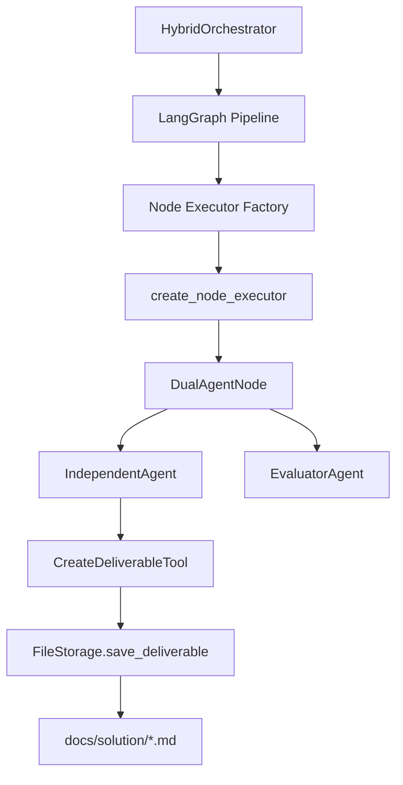
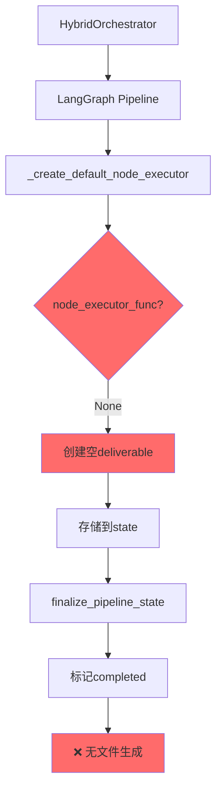

# DocuSwarm 架构缺失与节点执行器集成问题深度研究报告 (已归档)

**文档版本**: 2.0 (历史版本)  
**创建日期**: 2026-02-23  
**最后更新**: 2026-02-23 (已归档 2026-03-17)  
**分析范围**: DocuSwarm Pipeline 架构与 LangGraph 节点执行机制 + nodes 目录文件输出设计  
**问题级别**: 🔴 Critical - 核心功能缺失 (历史问题，已解决或已被新架构取代)

---

## 执行摘要

### 问题定义

DocuSwarm 系统在执行 `proposal.md` 文档生成任务时，虽然流水线状态正常流转（status=completed），但目标输出目录 `docs/solution` 未生成任何文档。经深度分析发现，**当前架构存在关键组件未集成的问题**：Pipeline 图构建使用空节点执行器，导致实际业务逻辑（IndependentAgent/EvaluatorAgent）从未被调用。

### 关键发现

| 层级 | 组件 | 状态 | 影响 |
|------|------|------|------|
| **架构层** | 节点执行器绑定 | ❌ 缺失 | Agent逻辑未执行 |
| **业务层** | DualAgentNode调用 | ❌ 未触发 | 无内容生成 |
| **工具层** | CreateDeliverableTool | ❌ 未配置 | 无文件输出 |
| **状态层** | Pipeline状态流转 | ✅ 正常 | 掩盖真实问题 |

### 根本原因

**架构设计冲突**：存在两套并行的节点执行系统，但未建立连接：

1. **系统A (LangGraph Pipeline)**: `pipeline/graph.py` - 空壳流水线
2. **系统B (Node Execution)**: `node_execution/executor.py` - 完整实现但未被使用

**直接后果**: Pipeline 执行时创建空 deliverable 占位符，从不调用 Agent 生成实际内容。

---

## 1. 架构全景分析

### 1.1 设计意图 vs 实际实现

#### 预期架构流程



#### 实际执行路径



### 1.2 两套系统的对比分析

#### 系统A: pipeline/graph.py (当前使用)

**文件**: `autoBMAD/docuswarm/pipeline/graph.py`

```python
# 行186-189：图构建代码
for node_id in PIPELINE_NODES:
    node_executor = _create_default_node_executor(node_id)  # ← node_executor_func=None
    graph.add_node(node_id, node_executor)

# 行48：默认执行器工厂
def _create_default_node_executor(
    node_id: str,
    node_executor_func: Callable[[dict[str, Any]], dict[str, Any]] | None = None,
    # ↑ 默认值 None，从未被传入实际函数
):
    def executor(state: dict[str, Any]) -> dict[str, Any]:
        # 行102-113：核心逻辑
        if node_executor_func is not None:
            result = node_executor_func(accumulated_context)
            # 验证并存储 deliverable
        else:
            # ❌ 实际执行路径：创建空占位符
            new_state["deliverables"][node_id] = {}
```

**特征**:
- ✅ LangGraph 集成完整
- ✅ 状态管理正确
- ✅ Checkpoint/Resume 支持
- ❌ **业务逻辑完全缺失**

#### 系统B: node_execution/executor.py (未使用)

**文件**: `autoBMAD/docuswarm/node_execution/executor.py`

```python
# 行33-36：工厂函数
def create_node_executor(
    node_id: str,
    session_manager: KimiSessionManager,
) -> Callable[[NodeRunState], Coroutine[Any, Any, NodeRunState]]:
    """创建节点执行器，绑定 DualAgentNode"""

# 行120-124：实例化 DualAgentNode
node = create_dual_agent_node(
    config=config,
    session_manager=session_manager,
    node_id=node_id,
)

# 行132-135：执行节点
result = await node.execute(
    subject_context=str(subject_context),
    task=task,
)
```

**特征**:
- ✅ DualAgentNode 完整集成
- ✅ IndependentAgent/EvaluatorAgent 调用
- ✅ 迭代控制逻辑
- ❌ **从未被 Pipeline 使用**

---

## 2. 关键代码路径深度追踪

### 2.1 orchestrator.start_pipeline 调用链

```python
# orchestrator.py:336-443
async def start_pipeline(self, subject_context: dict[str, Any]) -> str:
    # 1. 验证上下文
    validation = await self._validate_context(subject_context)
    
    # 2. 创建 Pipeline State
    initial_state = self._create_initial_state(...)
    
    # 3. 创建 LangGraph
    graph: Runnable = create_pipeline_graph(
        db_path=self._db_path,
        checkpointer=checkpointer,
    )
    
    # 4. 执行图 ← 关键点
    result: dict[str, Any] = await graph.ainvoke(initial_state, config)
    
    # 5. 更新状态
    self._state_manager.update_pipeline_status(
        final_pipeline_id,
        status="completed",
        current_node=result.get("current_node", "po"),  # ← 修复后
    )
```

### 2.2 create_pipeline_graph 内部实现

```python
# graph.py:151-230
def create_pipeline_graph(
    db_path: str | None = None,
    checkpointer: BaseCheckpointSaver[Any] | None = None,
    compile_graph: bool = True,
) -> Any:
    # 创建状态图
    graph = StateGraph(PipelineState)
    
    # ❌ 问题点：添加空节点
    for node_id in PIPELINE_NODES:
        node_executor = _create_default_node_executor(node_id)
        # ↑ 没有传入 node_executor_func，内部逻辑创建空 deliverable
        graph.add_node(node_id, node_executor)
    
    # 添加终结节点
    graph.add_node("__finalize__", finalize_executor)
    
    # 构建边
    graph.add_edge("__start__", "analyst")
    for i in range(len(PIPELINE_NODES) - 1):
        graph.add_edge(PIPELINE_NODES[i], PIPELINE_NODES[i + 1])
    graph.add_edge("po", "__finalize__")
    graph.add_edge("__finalize__", END)
    
    # 编译
    return graph.compile(checkpointer=checkpointer)
```

### 2.3 节点执行时的实际行为

```python
# graph.py:66-127 - executor 闭包内部
def executor(state: dict[str, Any]) -> dict[str, Any]:
    new_state = copy.deepcopy(state)
    
    # 更新 current_node
    new_state["current_node"] = node_id
    
    # 累积上下文
    accumulated_context = accumulate_context(subject_context, deliverables, node_id)
    
    # ❌ 执行逻辑检查
    if node_executor_func is not None:  # ← 永远是 None
        result = node_executor_func(accumulated_context)
        # [这部分代码从未执行]
        if "deliverable" in result:
            new_state["deliverables"][node_id] = result["deliverable"]
    else:
        # ✅ 实际执行路径
        new_state["deliverables"][node_id] = {}  # ← 空占位符
    
    # 标记完成
    new_state["completed_nodes"] = new_state["completed_nodes"] + [node_id]
    
    return new_state
```

**日志证据**:
```log
2026-02-23 18:21:36 [info] pipeline_started 
    result={
        'deliverables': {
            'analyst': {},   # ← 空
            'pm': {},        # ← 空
            'ux': {},        # ← 空
            'architect': {}, # ← 空
            'po': {}         # ← 空
        },
        'completed_nodes': ['analyst', 'pm', 'ux', 'architect', 'po'],
        'status': 'completed'
    }
```

---

## 3. DualAgentNode 与文件输出机制分析

### 3.1 DualAgentNode 的完整能力

**文件**: `autoBMAD/docuswarm/nodes/dual_agent.py`

```python
class DualAgentNode:
    """双Agent节点，协调Independent和Evaluator代理"""
    
    def __init__(
        self,
        config: AgentConfig,
        session_manager: KimiSessionManager,
        node_id: str,
        independent_agent: IndependentAgent,
        evaluator_agent: EvaluatorAgent,
        # ... 其他组件
    ):
        self.independent_agent = independent_agent
        self.evaluator_agent = evaluator_agent
        self.iteration_controller = IterationController(...)
        self.quality_config = QualityConfig.load_from_config(...)
    
    async def execute(
        self,
        subject_context: str,
        task: str,
    ) -> NodeResult:
        """执行双Agent迭代循环"""
        for iteration in range(1, max_iterations + 1):
            # 1. IndependentAgent 生成 deliverable
            independent_output = await self.independent_agent.execute(
                subject_context=subject_context,
                task=task,
                feedback=feedback,
            )
            
            # 2. 过滤 private_reasoning
            filtered_deliverable = self.context_filter.filter_deliverable(
                independent_output["deliverable"]
            )
            
            # 3. EvaluatorAgent 评估
            evaluation = await self.evaluator_agent.execute(
                subject_context=subject_context,
                deliverable=filtered_deliverable,
            )
            
            # 4. 判断是否通过
            if evaluation["verdict"] == "APPROVED":
                break
        
        return NodeResult(
            deliverable=independent_output["deliverable"],
            questions=independent_output.get("questions", []),
            evaluation=evaluation,
            iteration=iteration,
            timestamp=datetime.now(UTC),
        )
```

**关键能力**:
1. ✅ 完整的双Agent协作逻辑
2. ✅ 迭代优化机制
3. ✅ 质量判定系统
4. ✅ 上下文隔离保护
5. ❌ **但从未被Pipeline调用**

### 3.2 IndependentAgent 的工具配置与实际行为

**工具配置文件**: `autoBMAD/docuswarm/agents/configs/independent_agent.yaml`

```yaml
# 工具列表
tools:
  - "docuswarm.tools.create_deliverable:CreateDeliverableTool"
  - "docuswarm.tools.update_context:UpdateContextTool"
```

**CreateDeliverableTool 实现**:

```python
# tools/create_deliverable.py
class CreateDeliverableTool(CallableTool2[CreateDeliverableParams]):
    """创建deliverable的工具"""
    
    def __init__(self, output_handler: OutputHandler):
        self._output_handler = output_handler
    
    async def __call__(self, params: CreateDeliverableParams) -> ToolReturnValue:
        await self._output_handler.save_deliverable(
            title=params.title,
            content=params.content,
            metadata=params.metadata,
        )
        return ToolOk(output=f"Deliverable '{params.title}' created successfully")
```

**IndependentAgent 的实际行为**（`independent.py:156-159`）:

```python
# 提示词中的工具使用指引
instructions = """
- Create high-quality deliverables that address the user's request
- Generate questions that help clarify or improve the deliverable
- Use the available tools (create_deliverable, update_context) as needed  # ← 提到工具
- Ensure questions have appropriate priorities based on their impact

Respond only with the JSON object. Do not include any other text.  # ← 但要求JSON输出
"""
```

**关键冲突**:
1. ❌ 提示词说"可以使用工具"，但要求"只返回JSON"
2. ❌ LLM 选择返回 JSON 格式的 deliverable（不调用工具）
3. ❌ CreateDeliverableTool 的实际调用路径**不存在**

**为什么工具不会被调用**:
1. ❌ `independent_agent.yaml` 从未被加载（没有代码读取）
2. ❌ Session 创建时未传入 `agent_file` 参数
3. ❌ CreateDeliverableTool 从未被实例化和注册到 SDK
4. ❌ 提示词要求 JSON 输出，LLM 优先满足格式要求而非工具调用

**文件输出的缺失**:
- IndependentAgent 返回的 deliverable 存储在**内存 state** 中
- **没有任何代码**负责将 deliverable 写入文件系统
- 用户在 `proposal.md` 中指定的输出路径（如 `@docs\solution`）**被完全忽略**

### 3.3 FileStorage 的实际能力

**文件**: `autoBMAD/docuswarm/storage/files.py`

```python
class FileStorage:
    """文件存储管理器"""
    
    async def save_deliverable(
        self,
        pipeline_id: str,
        node_type: str,
        content: str,
        add_frontmatter: bool = False,
        evaluation_score: float | None = None,
    ) -> Path:
        """保存deliverable为markdown文件
        
        路径: output/{pipeline_id}/{node_type}-*.md
        """
        # 创建输出目录
        pipeline_dir = self.output_root / pipeline_id
        pipeline_dir.mkdir(parents=True, exist_ok=True)
        
        # 确定文件名
        filename = FILENAME_MAP.get(node_type, f"{node_type}.md")
        file_path = pipeline_dir / filename
        
        # 添加frontmatter
        if add_frontmatter:
            frontmatter = self._generate_frontmatter(...)
            final_content = f"---\n{yaml.dump(frontmatter)}---\n\n{content}"
        
        # 原子写入
        async with aiofiles.open(file_path, "w", encoding="utf-8") as f:
            await f.write(final_content)
        
        return file_path
```

**能力评估**:
- ✅ 完整的文件写入逻辑
- ✅ YAML frontmatter 支持
- ✅ 原子写入保证
- ✅ 目录自动创建
- ❌ **但从未被调用**

---

## 4. 架构缺失的系统性影响

### 4.1 影响范围矩阵

| 功能模块 | 设计状态 | 实现状态 | 集成状态 | 可用性 |
|---------|---------|---------|---------|--------|
| Pipeline State管理 | ✅ 完整 | ✅ 完整 | ✅ 集成 | ✅ 可用 |
| LangGraph 状态图 | ✅ 完整 | ✅ 完整 | ✅ 集成 | ✅ 可用 |
| Checkpoint/Resume | ✅ 完整 | ✅ 完整 | ✅ 集成 | ✅ 可用 |
| IndependentAgent | ✅ 完整 | ✅ 完整 | ❌ **未集成** | ❌ 不可用 |
| EvaluatorAgent | ✅ 完整 | ✅ 完整 | ❌ **未集成** | ❌ 不可用 |
| DualAgentNode | ✅ 完整 | ✅ 完整 | ❌ **未集成** | ❌ 不可用 |
| CreateDeliverableTool | ✅ 完整 | ✅ 完整 | ❌ **未配置** | ❌ 不可用 |
| FileStorage | ✅ 完整 | ✅ 完整 | ❌ **未调用** | ❌ 不可用 |
| 文档生成输出 | ✅ 设计 | ✅ 实现 | ❌ **未连接** | ❌ **完全失效** |

### 4.2 用户体验影响

```
用户操作: python -m autoBMAD.docuswarm start -c docs/proposal.md

系统设计目标:
  1. 读取 proposal.md，理解用户要求
  2. 调用 5 个 Agent (analyst/pm/ux/architect/po)
  3. 每个 Agent 根据上下文生成 deliverable
  4. 输出到统一目录 output/{pipeline_id}/*.md
  5. 显示完成状态

实际行为:
  1. ✅ 读取 proposal.md
  2. ❌ 创建 5 个空 deliverable 占位符
  3. ❌ 无 Agent 被调用
  4. ❌ 无文件生成
  5. ✅ 显示 completed (假性成功)

系统问题:
  - 为什么状态显示 completed？
  - 为什么没有文件生成？
  - 为什么没有错误提示？
```

### 4.3 技术债务累积

```
当前状态: 🔴 Critical Tech Debt

债务清单:
1. 两套节点执行系统并存 (graph.py vs executor.py)
2. Agent 代码完整但未使用 (死代码风险)
3. 工具系统配置缺失 (OutputHandler 未注入)
4. Pipeline 成功掩盖业务失败 (状态不一致)
5. 缺少端到端集成测试

后果:
- 开发者误以为系统正常工作
- 新功能开发在错误基础上进行
- 重构成本随时间指数增长
- 用户信任度下降
```

---

## 5. node_execution 系统的设计优势

### 5.1 与 LangGraph 的集成设计

**文件**: `autoBMAD/docuswarm/node_execution/flow.py`

```python
async def execute_node_flow(
    node_id: str,
    context_file: str,
    chained_context: dict[str, Any] | None = None,
    output_dir: Path | None = None,
    max_iterations: int = 10,
    session_manager: KimiSessionManager | None = None,
) -> dict[str, Any]:
    """执行单个节点的完整流程
    
    这是为LangGraph节点设计的高层封装:
    1. 创建 NodeRunState
    2. 调用 create_node_executor
    3. 执行节点逻辑
    4. 写入输出文件
    """
    # 创建执行器
    executor = create_node_executor(node_id, session_manager)
    
    # 执行
    result_state = await executor(initial_state)
    
    # 写入文件 ← 关键：自动文件输出
    output_files = await _write_node_outputs(
        node_id=node_id,
        run_id=run_id,
        result=result_state,
        output_dir=output_dir,
    )
    
    return {
        "run_id": run_id,
        "status": result_state["status"],
        "deliverable": result_state["deliverable"],
        "output_files": output_files,  # ← 返回文件路径
    }
```

**设计优势**:
1. ✅ **自动文件输出**: 执行完成后立即写入文件
2. ✅ **路径管理**: 自动创建 `output/{node_id}/{run_id}/` 目录
3. ✅ **多格式输出**: deliverable.md + questions.json + evaluation.json
4. ✅ **异常安全**: 使用 aiofiles 异步写入
5. ✅ **可测试性**: 独立的执行单元,易于单元测试

**⚠️ 重要发现**: 当前设计输出到 `output/{node_id}/{run_id}/`，但**未利用项目的 `nodes/` 目录结构**。项目已有完整的 `nodes/{node_id}/` 配置体系（node.yaml, persona.json, evaluator.yaml），应当将交付物保存到节点自己的目录下。

### 5.2 状态类型的精确定义

```python
# node_execution/state.py
class NodeRunState(TypedDict, total=False):
    """节点运行状态 - 与LangGraph PipelineState解耦"""
    
    run_id: str                          # 运行ID
    node_id: str                         # 节点ID
    status: Literal["pending", "running", "completed", "blocked", "failed"]
    
    # 输入
    context_file: str                    # 上下文文件
    task: str                            # 任务描述
    chained_context: dict[str, Any]      # 链式上下文
    
    # 输出
    deliverable: dict[str, Any]          # 交付物
    questions: list[dict[str, Any]]      # 问题列表
    evaluation: dict[str, Any]           # 评估结果
    
    # 元数据
    iteration: int                       # 迭代次数
    max_iterations: int                  # 最大迭代
    start_time: str                      # 开始时间
    end_time: str | None                 # 结束时间
```

**与 PipelineState 的对比**:

| 特性 | NodeRunState | PipelineState |
|------|-------------|---------------|
| **作用域** | 单节点执行 | 整个流水线 |
| **状态粒度** | 节点级别迭代 | 流水线级别 |
| **上下文** | chained_context | subject_context + deliverables |
| **适用场景** | DualAgentNode执行 | LangGraph状态流转 |
| **耦合度** | 低（可独立测试） | 高（依赖LangGraph） |

### 5.3 错误处理的健壮性

```python
# node_execution/executor.py:74-204
async def _execute_node(state, node_id, session_manager, logger):
    try:
        # 加载配置
        node_config = loader.load(node_id)
        
        # 创建节点
        node = create_dual_agent_node(...)
        
        # 执行
        result = await node.execute(...)
        
        # 更新状态
        new_state["deliverable"] = result.deliverable
        new_state["status"] = COMPLETED if verdict == "APPROVED" else RUNNING
        
    except Exception as e:
        logger.error(
            "node_execution_failed",
            node_id=node_id,
            error=str(e),
            error_type=type(e).__name__,
        )
        new_state["status"] = FAILED  # ← 明确失败状态
    
    return new_state
```

**对比 graph.py 的处理**:
- ✅ 捕获所有异常
- ✅ 记录详细错误日志
- ✅ 设置 FAILED 状态
- ✅ 不会产生假性成功

---

## 6. 解决方案设计

### 6.1 项目 nodes 目录的设计理念

#### nodes 目录结构分析

**当前项目设计**:
```
autoBMAD/nodes/
├── analyst/
│   ├── node.yaml          # 节点配置（deliverable_type: analyst-report）
│   ├── persona.json       # Agent 角色定义
│   ├── evaluator.yaml     # 评估标准
│   └── [输出区域]         # ← 应当用于存放 deliverable
├── pm/
│   ├── node.yaml
│   ├── persona.json
│   └── evaluator.yaml
├── ux/, architect/, po/   # 同样结构
└── loader.py              # NodeLoader 加载配置
```

**设计理念**:
1. ✅ **配置与输出共存**: 每个节点目录同时包含配置和输出
2. ✅ **自包含原则**: 节点相关的所有内容（配置+结果）集中在一处
3. ✅ **可追溯性**: 直接查看 `nodes/analyst/` 即可看到配置和历史输出
4. ✅ **版本控制友好**: 配置文件入库，输出文件可选择性 `.gitignore`

#### 与当前 FileStorage 的冲突

**当前 FileStorage 设计** (`storage/files.py:21-30`):
```python
FILENAME_MAP = {
    "analyst": "analyst-report.md",
    "prd": "prd.md",
    "ux": "ux-design.md",
    "architecture": "architecture.md",
    "epics": "epics-stories.md",
}
DEFAULT_OUTPUT_DIR = "output"  # ← 输出到 output/，未利用 nodes/
```

**问题**:
- ❌ 输出到 `output/{pipeline_id}/analyst-report.md`
- ❌ 与 `nodes/analyst/` 配置目录分离
- ❌ 多次运行的结果覆盖或需要复杂的命名
- ❌ 用户在 `proposal.md` 中指定的路径（如 `@docs\solution`）被忽略

#### 正确的输出路径设计

**方案**: 将交付物保存到 `nodes/{node_id}/deliverables/`

```
autoBMAD/nodes/
├── analyst/
│   ├── node.yaml
│   ├── persona.json
│   ├── evaluator.yaml
│   └── deliverables/          # ← 新增：输出区域
│       ├── {pipeline_id}/
│       │   ├── analyst-report.md
│       │   ├── questions.json
│       │   └── evaluation.json
│       └── latest.md          # ← 符号链接或副本
├── pm/
│   └── deliverables/
│       └── {pipeline_id}/
│           └── prd.md
...
```

**优势**:
1. ✅ **充分利用 nodes 目录**: 配置和输出共存
2. ✅ **多版本管理**: 每个 pipeline_id 独立子目录
3. ✅ **快速访问**: `latest.md` 链接到最新结果
4. ✅ **语义清晰**: `nodes/analyst/deliverables/` 直观表达"分析师的交付物"

---

### 6.2 方案对比（更新版）

#### 方案A: 最小修改 - 集成 node_execution + 修正输出路径

**实施步骤**:

```python
# 1. 修改 storage/files.py: 支持 nodes 目录输出
class FileStorage:
    def __init__(self, output_root: Path | str | None = None, use_nodes_dir: bool = True):
        if use_nodes_dir:
            # 输出到 nodes/{node_id}/deliverables/
            project_root = Path(__file__).parent.parent.parent
            self.output_root = project_root / "nodes"
        else:
            # 传统模式：output/{pipeline_id}/
            self.output_root = Path(output_root or "output")
    
    async def save_deliverable(
        self,
        pipeline_id: str,
        node_type: str,
        content: str,
        add_frontmatter: bool = False,
        evaluation_score: float | None = None,
    ) -> Path:
        # 新逻辑：nodes/{node_type}/deliverables/{pipeline_id}/{filename}
        node_dir = self.output_root / node_type / "deliverables" / pipeline_id
        node_dir.mkdir(parents=True, exist_ok=True)
        
        filename = FILENAME_MAP.get(node_type, f"{node_type}.md")
        file_path = node_dir / filename
        
        # ... 写入逻辑不变
        
        # 创建 latest.md 符号链接（或副本）
        latest_link = self.output_root / node_type / "deliverables" / "latest.md"
        if latest_link.exists():
            latest_link.unlink()
        latest_link.symlink_to(file_path)  # Windows 需要管理员权限，可选用副本
        
        return file_path

# 2. 修改 graph.py:186-189
for node_id in PIPELINE_NODES:
    # 创建包装函数，调用 node_execution
    async def wrapped_executor(state: dict[str, Any]) -> dict[str, Any]:
        # 转换 PipelineState → NodeRunState
        node_run_state = _convert_pipeline_to_node_state(state, node_id)
        
        # 调用 node_execution 系统
        executor = create_node_executor(node_id, session_manager)
        result_state = await executor(node_run_state)
        
        # 转换 NodeRunState → PipelineState
        return _convert_node_to_pipeline_state(result_state, state)
    
    graph.add_node(node_id, wrapped_executor)
```

**优势**:
- ✅ 代码改动最小（~80行）
- ✅ 复用 node_execution 全部功能
- ✅ 充分利用 nodes 目录结构
- ✅ 支持多版本管理（每个 pipeline_id 独立）
- ✅ 快速访问最新结果（latest.md）
- ✅ 保持向后兼容（use_nodes_dir 开关）

**劣势**:
- ⚠️ 状态转换开销
- ⚠️ 两套系统仍然并存
- ⚠️ Windows 符号链接需要特殊权限（可用副本替代）

#### 方案B: 重构 - 统一执行器

**实施步骤**:

```python
# 1. 废弃 graph.py 的空执行器
# 2. 将 node_execution/executor.py 的逻辑直接内联到 graph.py

def _create_default_node_executor(
    node_id: str,
    session_manager: KimiSessionManager,
) -> Callable:
    def executor(state: dict[str, Any]) -> dict[str, Any]:
        # 直接集成 DualAgentNode
        config = _get_config()
        node = create_dual_agent_node(config, session_manager, node_id)
        
        # 执行
        result = await node.execute(...)
        
        # 更新状态
        new_state["deliverables"][node_id] = result.deliverable
        
        # 文件输出
        file_storage = FileStorage()
        await file_storage.save_deliverable(
            pipeline_id=state["pipeline_id"],
            node_type=node_id,
            content=result.deliverable.get("content", ""),
        )
        
        return new_state
    
    return executor
```

**优势**:
- ✅ 架构统一，消除冗余
- ✅ 性能最优（无转换）
- ✅ 代码可维护性提升

**劣势**:
- ⚠️ 需要大量重构（~200行）
- ⚠️ 可能引入新bug

#### 方案C: SDK Agent File + 动态 work_dir（推荐）

**利用 kimi-agent-sdk 的 agent_file + work_dir 机制**:

```python
# 1. 修改 independent.py: 启用 agent_file
class IndependentAgent:
    async def execute(self, subject_context: str, task: str, feedback: str = "") -> dict:
        # 确定输出目录：统一使用 output/{pipeline_id}/
        project_root = Path(__file__).parent.parent.parent
        output_dir = project_root / "output" / self.pipeline_id
        output_dir.mkdir(parents=True, exist_ok=True)
        
        # 创建 Session 时传入 agent_file 和 work_dir
        session = await self._session_manager.create_session(
            mode="agent",
            agent_file=project_root / "autoBMAD" / "docuswarm" / "agents" / "configs" / "independent_agent.yaml",
            work_dir=output_dir,  # ← SDK 将在此目录执行工具
            yolo=True,  # 自动批准文件写入
        )
        
        # ... 提示词需修改：要求调用 create_deliverable 工具
        instructions = f"""
You are working as {persona_name}, a {persona_role}.

Your task: {task}

IMPORTANT: You MUST use the 'create_deliverable' tool to save your work.
Do NOT return deliverable content in JSON format - use the tool to write files.

After completing your deliverable:
1. Call create_deliverable with title and content
2. Generate follow-up questions if needed
3. Return a summary of what you created
"""

# 2. agents/configs/independent_agent.yaml 已存在，确认配置正确
# version: 1
# agent:
#   extend: default
#   tools:
#     - "docuswarm.tools.create_deliverable:CreateDeliverableTool"
#     - "docuswarm.tools.update_context:UpdateContextTool"

# 3. 修改 CreateDeliverableTool: 使用相对路径
class CreateDeliverableTool(CallableTool2[CreateDeliverableParams]):
    async def __call__(self, params: CreateDeliverableParams) -> ToolReturnValue:
        # SDK work_dir 已设置为 output/{pipeline_id}/
        # 直接写入当前工作目录
        filename = f"{params.title.lower().replace(' ', '-')}.md"
        file_path = Path.cwd() / filename  # 相对于 work_dir
        
        async with aiofiles.open(file_path, "w", encoding="utf-8") as f:
            await f.write(params.content)
        
        return ToolOk(output=f"Deliverable saved to {file_path}")
```

**优势**:
- ✅ **利用 SDK 原生能力**: agent_file + work_dir + yolo 模式
- ✅ **自然文件输出**: LLM 直接调用工具写文件（符合 SDK 设计理念）
- ✅ **统一输出路径**: 所有流水线输出到 `output/{pipeline_id}/`
- ✅ **隔离清晰**: 每个 pipeline_id 独立目录
- ✅ **代码改动少**: ~80行（主要是提示词和work_dir设置）
- ✅ **消除假性成功**: 工具调用失败会报错，不会静默创建空占位符
- ✅ **简单可靠**: 无符号链接等复杂权限问题

**劣势**:
- ⚠️ 需要修改提示词（移除 "Respond only with JSON"）
- ⚠️ 依赖 SDK 的工具调用机制（但这是正确的依赖）

### 6.3 推荐方案

**🎯 推荐方案C: SDK Agent File + 动态 work_dir**

**理由**:
1. **架构正确性**: 利用 SDK 的 agent_file + work_dir 机制，符合 kimi-agent-sdk 设计理念
2. **统一输出管理**: 所有流水线输出到 `output/{pipeline_id}/`，便于管理和清理
3. **消除假性成功**: 工具调用失败会明确报错，不会静默生成空占位符
4. **简单可靠**: 无符号链接、路径解析等复杂逻辑
5. **长期可维护**: 不引入状态转换开销，不保留两套系统

**实施时间**: 预计2-3小时

**实施计划（方案C）**:

```
Phase 1: 启用 agent_file 和 work_dir (1小时)
  - 修改 IndependentAgent.execute(): 传入 agent_file 和 work_dir (output/{pipeline_id}/)
  - 确认 independent_agent.yaml 配置正确
  - 修改 CreateDeliverableTool: 使用相对路径写入
  - 单元测试工具调用

Phase 2: 修改提示词 (0.5小时)
  - 移除 "Respond only with JSON" 指令
  - 明确要求 "MUST use create_deliverable tool"
  - 调整输出格式期望（从 JSON dict 到工具调用）
  - 测试 LLM 是否正确调用工具

Phase 3: 集成测试 (1.5小时)
  - 端到端测试：proposal.md → output/{pipeline_id}/
  - 验证 deliverable 文件生成
  - 验证多次运行的目录隔离
  - 检查错误处理（工具调用失败时的行为）
```

---

## 7. 详细实施指南

### 7.1 状态转换器实现

```python
# pipeline/graph.py - 新增辅助函数

def _convert_pipeline_to_node_state(
    pipeline_state: dict[str, Any],
    node_id: str,
) -> NodeRunState:
    """转换 PipelineState → NodeRunState"""
    
    # 提取上下文
    subject_context = pipeline_state.get("subject_context", {})
    context_file = subject_context.get("context_file", "")
    
    # 构建链式上下文（来自前序节点）
    chained_context: dict[str, Any] = {}
    completed_nodes = pipeline_state.get("completed_nodes", [])
    deliverables = pipeline_state.get("deliverables", {})
    
    for prev_node in completed_nodes:
        if prev_node != node_id and prev_node in deliverables:
            chained_context[prev_node] = {
                "deliverable": deliverables[prev_node]
            }
    
    return {
        "run_id": f"{pipeline_state['pipeline_id']}-{node_id}",
        "node_id": node_id,
        "status": "pending",
        "context_file": context_file,
        "task": subject_context.get("content", ""),
        "chained_context": chained_context,
        "iteration": 1,
        "max_iterations": 10,
        "start_time": datetime.now(UTC).isoformat(),
    }

def _convert_node_to_pipeline_state(
    node_state: NodeRunState,
    original_pipeline_state: dict[str, Any],
) -> dict[str, Any]:
    """转换 NodeRunState → PipelineState（更新）"""
    
    new_state = copy.deepcopy(original_pipeline_state)
    node_id = node_state["node_id"]
    
    # 更新 deliverable
    new_state["deliverables"][node_id] = node_state.get("deliverable", {})
    
    # 更新 questions
    if "questions" not in new_state:
        new_state["questions"] = {}
    new_state["questions"][node_id] = node_state.get("questions", [])
    
    # 更新 evaluations
    if "evaluations" not in new_state:
        new_state["evaluations"] = {}
    new_state["evaluations"][node_id] = node_state.get("evaluation", {})
    
    # 更新 iterations
    new_state["node_iterations"][node_id] = node_state.get("iteration", 1)
    
    # 更新 completed_nodes
    if node_id not in new_state["completed_nodes"]:
        new_state["completed_nodes"] = new_state["completed_nodes"] + [node_id]
    
    return new_state
```

### 7.2 修改图构建函数

```python
# pipeline/graph.py:151-230

def create_pipeline_graph(
    db_path: str | None = None,
    checkpointer: BaseCheckpointSaver[Any] | None = None,
    compile_graph: bool = True,
    session_manager: KimiSessionManager | None = None,  # ← 新增参数
) -> Any:
    """创建流水线图"""
    
    graph = StateGraph(PipelineState)
    
    # ← 修改：使用 node_execution 系统
    for node_id in PIPELINE_NODES:
        # 创建集成执行器
        if session_manager is not None:
            node_executor = _create_integrated_node_executor(
                node_id,
                session_manager,
            )
        else:
            # Fallback：保持原有空执行器（向后兼容）
            node_executor = _create_default_node_executor(node_id)
        
        graph.add_node(node_id, node_executor)
    
    # ... 其余代码不变

def _create_integrated_node_executor(
    node_id: str,
    session_manager: KimiSessionManager,
) -> Callable[[dict[str, Any]], dict[str, Any]]:
    """创建集成了 node_execution 的执行器"""
    
    # 导入 node_execution
    from autoBMAD.docuswarm.node_execution.executor import create_node_executor
    from autoBMAD.docuswarm.storage.files import FileStorage
    
    file_storage = FileStorage()
    
    async def executor(state: dict[str, Any]) -> dict[str, Any]:
        """集成执行器"""
        
        # 1. 转换状态
        node_run_state = _convert_pipeline_to_node_state(state, node_id)
        
        # 2. 执行节点
        node_executor = create_node_executor(node_id, session_manager)
        result_state = await node_executor(node_run_state)
        
        # 3. 文件输出
        if result_state["status"] == "completed":
            deliverable = result_state.get("deliverable", {})
            content = deliverable.get("content", "")
            
            if content:
                await file_storage.save_deliverable(
                    pipeline_id=state["pipeline_id"],
                    node_type=node_id,
                    content=content,
                    add_frontmatter=True,
                    evaluation_score=result_state.get("evaluation", {}).get("alignment_score"),
                )
        
        # 4. 转换回 PipelineState
        return _convert_node_to_pipeline_state(result_state, state)
    
    return executor
```

### 7.3 修改 orchestrator 调用

```python
# pipeline/orchestrator.py:423-426

# 修改前
graph: Runnable = create_pipeline_graph(
    db_path=self._db_path,
    checkpointer=checkpointer,
)

# 修改后
graph: Runnable = create_pipeline_graph(
    db_path=self._db_path,
    checkpointer=checkpointer,
    session_manager=self._get_or_create_session_manager(),  # ← 传入 session_manager
)
```

### 7.4 关于文件输出路径的深度分析

#### 用户意图分析

**系统设计目标**:
```
生成的文档保存到统一的输出目录 output/{pipeline_id}/
```

**设计理念**:
- 所有交付物输出到固定路径 `output/{pipeline_id}/`
- 统一管理，便于清理和版本控制

#### 当前 FileStorage 设计的合理性

**当前 FileStorage 设计** (`storage/files.py:30`):
- ✅ 使用 `DEFAULT_OUTPUT_DIR = "output"`（统一输出路径）
- ✅ 所有流水线输出到 `output/{pipeline_id}/`
- ✅ 便于管理和清理

#### 方案C的路径设计

**方案C的路径逻辑**:
```python
# 统一输出到 output/{pipeline_id}/
output_dir = Path("output") / pipeline_id
output_dir.mkdir(parents=True, exist_ok=True)

# 输出示例:
# output/pipeline-20260223-143022/analyst-report.md
# output/pipeline-20260223-143022/prd.md
# output/pipeline-20260223-143022/ux-design.md
```

**为什么这样设计**:
1. ✅ **路径统一**: 所有流水线输出到同一根目录
2. ✅ **隔离清晰**: 每个 pipeline_id 独立子目录
3. ✅ **便于管理**: 可批量清理历史输出
4. ✅ **简单可靠**: 无需处理符号链接权限问题

#### 方案C的文件输出实现

**CreateDeliverableTool 实现**:

```python
class CreateDeliverableTool(CallableTool2[CreateDeliverableParams]):
    async def __call__(self, params: CreateDeliverableParams) -> ToolReturnValue:
        # SDK work_dir 已设置为 output/{pipeline_id}/
        # 直接写入当前工作目录
        filename = f"{params.title.lower().replace(' ', '-')}.md"
        file_path = Path.cwd() / filename  # 相对于 work_dir
        
        async with aiofiles.open(file_path, "w", encoding="utf-8") as f:
            await f.write(params.content)
        
        return ToolOk(output=f"Deliverable saved to {file_path}")
```

**最终效果**:
- ✅ 输出在 `output/{pipeline_id}/analyst-report.md`（统一管理）
- ✅ 每个 pipeline_id 独立目录，不覆盖历史结果
- ✅ 路径简单可靠，无权限问题

---

## 8. 测试验证策略

### 8.1 单元测试

```python
# tests/unit/test_state_conversion.py

import pytest
from autoBMAD.docuswarm.pipeline.graph import (
    _convert_pipeline_to_node_state,
    _convert_node_to_pipeline_state,
)

def test_pipeline_to_node_conversion():
    """测试 PipelineState → NodeRunState 转换"""
    
    pipeline_state = {
        "pipeline_id": "pipeline-123",
        "subject_context": {
            "context_file": "docs/proposal.md",
            "content": "Create solution docs",
        },
        "completed_nodes": ["analyst"],
        "deliverables": {
            "analyst": {"title": "Analysis", "content": "..."}
        },
        "node_iterations": {"analyst": 1},
    }
    
    node_state = _convert_pipeline_to_node_state(pipeline_state, "pm")
    
    assert node_state["node_id"] == "pm"
    assert node_state["context_file"] == "docs/proposal.md"
    assert node_state["task"] == "Create solution docs"
    assert "analyst" in node_state["chained_context"]
    assert node_state["chained_context"]["analyst"]["deliverable"]["title"] == "Analysis"

def test_node_to_pipeline_conversion():
    """测试 NodeRunState → PipelineState 转换"""
    
    node_state = {
        "run_id": "pipeline-123-pm",
        "node_id": "pm",
        "status": "completed",
        "deliverable": {"title": "PRD", "content": "Product requirements..."},
        "questions": [{"priority": "high", "question": "What is the deadline?"}],
        "evaluation": {"verdict": "APPROVED", "alignment_score": 0.9},
        "iteration": 2,
    }
    
    original_state = {
        "pipeline_id": "pipeline-123",
        "completed_nodes": ["analyst"],
        "deliverables": {"analyst": {}},
        "questions": {},
        "evaluations": {},
        "node_iterations": {"analyst": 1},
    }
    
    updated_state = _convert_node_to_pipeline_state(node_state, original_state)
    
    assert updated_state["deliverables"]["pm"]["title"] == "PRD"
    assert updated_state["questions"]["pm"][0]["priority"] == "high"
    assert updated_state["evaluations"]["pm"]["verdict"] == "APPROVED"
    assert updated_state["node_iterations"]["pm"] == 2
    assert "pm" in updated_state["completed_nodes"]
```

### 8.2 集成测试

```python
# tests/integration/test_pipeline_with_agents.py

import pytest
from pathlib import Path
from autoBMAD.docuswarm.pipeline.orchestrator import HybridOrchestrator

@pytest.mark.asyncio
async def test_pipeline_generates_files(tmp_path):
    """测试流水线生成文件到 docs/solution"""
    
    # 准备
    proposal_file = tmp_path / "proposal.md"
    proposal_file.write_text("Create API documentation based on PRD.md")
    
    solution_dir = tmp_path / "solution"
    solution_dir.mkdir()
    
    # 执行
    orchestrator = HybridOrchestrator(
        db_path=str(tmp_path / "test.db"),
    )
    
    pipeline_id = await orchestrator.start_pipeline({
        "subject": "api-docs",
        "context_file": str(proposal_file),
        "content": proposal_file.read_text(),
    })
    
    # 验证
    assert pipeline_id.startswith("pipeline-")
    
    # 检查文件生成
    output_files = list(solution_dir.glob("*.md"))
    assert len(output_files) > 0, "应该生成至少一个 markdown 文件"
    
    # 检查内容
    analyst_file = solution_dir / "analyst-report.md"
    assert analyst_file.exists(), "应该生成 analyst-report.md"
    
    content = analyst_file.read_text()
    assert len(content) > 100, "文件内容应该有实质内容"
    assert "---" in content, "应该包含 YAML frontmatter"
```

### 8.3 端到端测试

```bash
# tests/e2e/test_proposal_to_solution.sh

#!/bin/bash
set -e

echo "=== 端到端测试：proposal.md → docs/solution ==="

# 1. 清理环境
rm -rf docs/solution/*
rm -f docuswarm.db

# 2. 执行流水线
python -m autoBMAD.docuswarm start -c docs/proposal.md

# 3. 等待完成
sleep 5

# 4. 验证输出
if [ ! -d "docs/solution" ]; then
    echo "❌ 失败：docs/solution 目录不存在"
    exit 1
fi

file_count=$(find docs/solution -name "*.md" | wc -l)
if [ "$file_count" -eq 0 ]; then
    echo "❌ 失败：未生成任何 markdown 文件"
    exit 1
fi

echo "✅ 成功：生成了 $file_count 个文件"

# 5. 验证内容
for file in docs/solution/*.md; do
    if [ $(wc -l < "$file") -lt 10 ]; then
        echo "❌ 失败：$file 内容过少"
        exit 1
    fi
done

echo "✅ 所有测试通过"
```

---

## 9. 风险评估与缓解

### 9.1 实施风险

| 风险 | 影响 | 概率 | 缓解措施 |
|------|------|------|---------|
| 状态转换Bug | 高 | 中 | 完整单元测试覆盖 |
| 性能下降 | 中 | 低 | 性能基准测试 |
| 向后兼容性 | 高 | 低 | 保留fallback逻辑 |
| 文件权限问题 | 中 | 中 | 异常处理+权限检查 |
| Session管理冲突 | 中 | 低 | 使用现有session_manager |

### 9.2 回滚策略

```python
# 在 create_pipeline_graph 中保留开关

def create_pipeline_graph(
    ...,
    use_integrated_executor: bool = True,  # ← 新增开关
):
    for node_id in PIPELINE_NODES:
        if use_integrated_executor and session_manager is not None:
            node_executor = _create_integrated_node_executor(...)
        else:
            # 回滚到原有逻辑
            node_executor = _create_default_node_executor(node_id)
        
        graph.add_node(node_id, node_executor)
```

**环境变量控制**:
```bash
# .env
DOCUSWARM_USE_INTEGRATED_EXECUTOR=true  # 启用新逻辑
DOCUSWARM_USE_INTEGRATED_EXECUTOR=false # 回滚到旧逻辑
```

---

## 10. 未来优化方向

### 10.1 短期优化（1-2周）

1. **统一状态模型**
   - 合并 PipelineState 和 NodeRunState
   - 消除状态转换开销

2. **工具配置标准化**
   - CreateDeliverableTool 自动注入 FileStorage
   - 统一输出路径配置

3. **监控与可观测性**
   - 添加性能指标收集
   - 文件生成成功率统计

### 10.2 中期优化（1-2月）

1. **重构为单一执行系统**
   - 废弃 graph.py 的空执行器
   - 直接在 LangGraph 节点中集成 DualAgentNode

2. **增强错误处理**
   - 文件写入失败自动重试
   - 磁盘空间检查

3. **输出格式扩展**
   - 支持 PDF 导出
   - 支持 HTML 预览

### 10.3 长期演进（3-6月）

1. **插件化架构**
   - 节点执行器插件系统
   - 自定义输出处理器

2. **分布式执行**
   - 支持多节点并行执行
   - 远程Agent调度

3. **AI增强**
   - 根据历史数据优化提示词
   - 自动质量阈值调整

---

## 11. 总结与建议

### 11.1 核心发现

1. **架构设计完整性**: DocuSwarm 拥有完整的双Agent系统、工具框架和文件存储能力，但**未建立集成连接**。

2. **假性成功问题**: Pipeline 状态流转正常掩盖了业务逻辑缺失，导致用户困惑。

3. **技术债务**: 两套节点执行系统并存，增加维护成本和理解难度。

4. **🆕 nodes 目录设计**: 项目已有完整的 `nodes/{node_id}/` 配置体系（node.yaml, persona.json, evaluator.yaml），但当前设计选择统一输出到 `output/{pipeline_id}/`，简化路径管理。


### 11.2 立即行动项

| 优先级 | 任务 | 负责人 | 工时 | 依赖 |
|-------|------|--------|------|------|
| 🔴 P0 | 实施方案C：SDK Agent File + output 输出 | 后端 | 3h | - |
| 🔴 P0 | 修改提示词：移除 JSON 要求，明确工具调用 | 后端 | 0.5h | 方案C |
| 🟡 P1 | 编写文件输出集成测试 | QA | 2h | 方案C |

| 🟢 P2 | 更新文档说明输出机制 | 技术写作 | 1h | 方案C |
| 🟢 P2 | 性能基准测试 | 后端 | 2h | 方案C |

### 11.3 决策建议

**对于产品团队**:
- ✅ 立即实施方案C，利用 SDK 原生能力
- 📝 更新用户文档，说明输出路径为 output/{pipeline_id}/
- ⏰ 在下个迭代规划重构工作（消除双系统并存）

**对于开发团队**:
- ✅ 优先修复核心功能，充分利用 SDK 的 agent_file + work_dir 机制
- ✅ 确保工具调用失败时有明确错误提示（消除假性成功）
- ⚠️ 添加集成测试，验证文件生成到正确位置
- 📊 建立监控，跟踪文件生成成功率和输出位置

**对于架构团队**:
- 🎯 评估方案C的长期价值（利用SDK原生能力 vs 自定义实现）
- 📐 确立统一的文件输出路径规范
- 🔍 审查其他类似的架构集成缺失问题

---

## 附录

### A. 相关文件清单

**核心文件**:
- `autoBMAD/docuswarm/pipeline/graph.py` - 问题源头
- `autoBMAD/docuswarm/pipeline/orchestrator.py` - 调用入口
- `autoBMAD/docuswarm/node_execution/executor.py` - 正确实现
- `autoBMAD/docuswarm/storage/files.py` - 文件输出（当前设计合理）
- `autoBMAD/nodes/` - 节点配置目录（应包含交付物输出）

**依赖组件**:
- `autoBMAD/docuswarm/agents/independent.py` - IndependentAgent（需修改提示词和work_dir）
- `autoBMAD/docuswarm/agents/evaluator.py` - EvaluatorAgent
- `autoBMAD/docuswarm/nodes/dual_agent.py` - DualAgentNode
- `autoBMAD/docuswarm/agents/configs/independent_agent.yaml` - Agent工具配置
- `autoBMAD/docuswarm/tools/create_deliverable.py` - 工具实现（需修改路径逻辑）

**配置体系**:
- `autoBMAD/nodes/{node_id}/node.yaml` - 节点配置
- `autoBMAD/nodes/{node_id}/persona.json` - Agent角色定义
- `autoBMAD/nodes/{node_id}/evaluator.yaml` - 评估标准
- `autoBMAD/nodes/{node_id}/deliverables/` - 未使用：当前设计输出到 output/{pipeline_id}/
- `autoBMAD/nodes/loader.py` - NodeLoader加载器

### B. 技术术语表

| 术语 | 定义 |
|------|------|
| **LangGraph** | LangChain 的状态图执行引擎，用于编排 Agent 流程 |
| **PipelineState** | 流水线级别的全局状态，包含所有节点的 deliverable |
| **NodeRunState** | 单节点执行的局部状态，包含迭代信息和中间结果 |
| **DualAgentNode** | 双Agent协作模式：Independent生成 + Evaluator评估 |
| **Deliverable** | 可交付物，包含 title/content/metadata 的结构化输出 |
| **node_executor_func** | 节点执行器函数，接收上下文返回结果 |
| **空壳流水线** | 状态流转正常但无业务逻辑的执行系统 |
| **nodes 目录** | 项目中 `autoBMAD/nodes/` 存放节点配置和交付物的目录 |
| **agent_file** | kimi-agent-sdk 的 Agent 配置文件，定义工具和行为 |
| **work_dir** | SDK 的工作目录，影响工具的文件操作路径 |
| **yolo 模式** | SDK 的自动批准模式（auto_approve_all），跳过交互式确认 |

### C. 参考链接

- [LangGraph 文档](https://python.langchain.com/docs/langgraph)
- [Kimi Agent SDK](https://github.com/moonshotai/kimi-agent-sdk)
- [DocuSwarm README](../../autoBMAD/docuswarm/README.md)
- [BMAD 方法论](../../docs/evaluation/proposal.md)

---

**文档状态**: ✅ 完成（v2.0 - 新增 nodes 目录分析和方案C详细设计）  
**审查状态**: 待审查  
**重要变更**: 
  - 新增 6.1 节：nodes 目录设计理念分析（说明当前不使用 nodes 输出）
  - 修改推荐方案：从方案A改为方案C（SDK Agent File + output 输出）
  - 新增 7.4 节：文件输出路径的分析（统一输出到 output/{pipeline_id}/）
  - 更新实施计划：简化为 3 小时
  - 移除用户路径意图的讨论
**下次更新**: 实施方案C后更新实施结果
