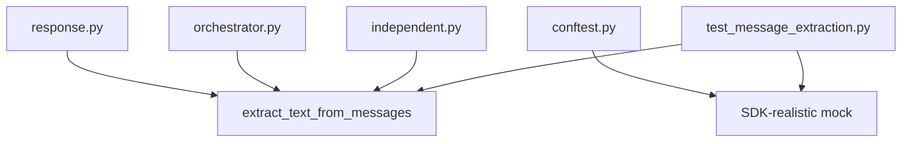

# DocuSwarm 消息内容提取失败 - 测试驱动解决方案

## 文档信息

| 属性 | 值 |
|------|---|
| 版本 | 1.0 |
| 创建日期 | 2026-02-23 |
| 基于 | DocuSwarm消息内容提取失败问题深度分析.md |
| 方法论 | TDD (Red → Green → Refactor) |
| 涉及文件 | orchestrator.py, response.py, independent.py, evaluator.py, conftest.py |

---

## 一、问题回顾与代码现状

### 1.1 核心缺陷

`orchestrator.py:223-228` 中的消息内容提取逻辑直接将 `msg.content`（类型为 `list[ContentPart]`）赋值给 `str` 变量，导致上下文验证永远失败。

```python
# ❌ orchestrator.py:223-228 当前有缺陷的代码
content: str = ""
for msg in reversed(messages):
    if msg.role == "assistant" and msg.content:
        content = msg.content  # BUG: msg.content 是 list[ContentPart]，不是 str
        break
```

### 1.2 代码库中三种提取模式对比

| 位置 | 方法 | 状态 | 类型处理 |
|------|------|------|----------|
| `orchestrator.py:223-228` | 直接赋值 `content = msg.content` | ❌ 缺陷 | 无 |
| `independent.py:274-291` | `extract_text()` + `str()` fallback | ✅ 正确 | 基础 |
| `evaluator.py:351-387` | 完整类型判断 + 手动提取 | ✅ 正确 | 全面 |

### 1.3 Kimi SDK Message 类型定义

```python
class Message(BaseModel):
    role: Role                       # "user" | "assistant" | "system"
    content: list[ContentPart]       # ← 关键：不是 str
    tool_calls: list[ToolCall] | None = None

ContentPart = TextPart | ThinkPart | ImageURLPart | AudioURLPart | VideoURLPart | ToolCall

class TextPart(BaseModel):
    type: Literal["text"] = "text"
    text: str

class ThinkPart(BaseModel):
    type: Literal["thinking"] = "thinking"
    text: str
```

### 1.4 现有测试的缺陷

`conftest.py:188-201` 中的 `mock_session_manager` fixture 使用简单字符串模拟 `content`，掩盖了类型不匹配问题：

```python
# ❌ conftest.py:191-198 当前 mock 与 SDK 行为不一致
mock.single_prompt = AsyncMock(
    return_value=[
        MagicMock(
            role="assistant",
            content='{"valid": true, ...}',  # BUG: 真实 SDK 返回 list[ContentPart]
        )
    ]
)
```

---

## 二、TDD 解决方案设计

### 2.1 总体架构

```
方案 C（推荐）: 创建统一工具函数 + 修复所有调用点

autoBMAD/docuswarm/llm/response.py      ← 新增 extract_text_from_messages()
autoBMAD/docuswarm/pipeline/orchestrator.py  ← 修复 _validate_context()
autoBMAD/docuswarm/tests/conftest.py     ← 修复 mock_session_manager fixture
autoBMAD/docuswarm/tests/unit/test_message_extraction.py  ← 新增测试文件
autoBMAD/docuswarm/tests/unit/test_orchestrator.py        ← 新增测试用例
```

### 2.2 TDD 三阶段执行计划

```
Phase 1: RED   - 编写失败的测试（目标：定义期望行为）
Phase 2: GREEN - 最小实现使测试通过
Phase 3: REFACTOR - 重构代码，统一提取逻辑
```

---

## 三、Phase 1: RED — 编写失败的测试

### 3.1 新建测试文件: `tests/unit/test_message_extraction.py`

此文件包含对 `extract_text_from_messages()` 工具函数的所有测试。

```python
"""Unit tests for message content extraction utility.

TDD Phase: RED
Target: autoBMAD.docuswarm.llm.response.extract_text_from_messages

These tests define the expected behavior for extracting text content
from Kimi SDK Message objects, covering all ContentPart types and edge cases.
"""

from __future__ import annotations

from typing import Any
from unittest.mock import MagicMock

import pytest


# ===========================================================
# Fixture: Realistic SDK Message Mocks
# ===========================================================


def _make_text_part(text: str) -> MagicMock:
    """Create a mock TextPart with proper attributes."""
    part = MagicMock()
    part.type = "text"
    part.text = text
    # isinstance check support
    part.__class__.__name__ = "TextPart"
    return part


def _make_think_part(text: str) -> MagicMock:
    """Create a mock ThinkPart with proper attributes."""
    part = MagicMock()
    part.type = "thinking"
    part.text = text
    part.__class__.__name__ = "ThinkPart"
    return part


def _make_message(
    role: str = "assistant",
    content: list[Any] | None = None,
    has_extract_text: bool = True,
    extract_text_return: str | None = None,
) -> MagicMock:
    """Create a mock Message matching Kimi SDK structure.

    Args:
        role: Message role ("assistant", "user", "system").
        content: list of ContentPart mocks. None means empty list.
        has_extract_text: Whether the message has extract_text() method.
        extract_text_return: Custom return value for extract_text().
    """
    msg = MagicMock()
    msg.role = role
    msg.content = content if content is not None else []

    if has_extract_text:
        if extract_text_return is not None:
            msg.extract_text.return_value = extract_text_return
        else:
            # Simulate SDK behavior: join all TextPart.text values
            text_parts = [p.text for p in (content or []) if hasattr(p, "type") and p.type == "text"]
            msg.extract_text.return_value = "".join(text_parts)
    else:
        # Remove extract_text attribute entirely
        del msg.extract_text

    return msg


# ===========================================================
# Test Class: extract_text_from_messages 核心功能
# ===========================================================


class TestExtractTextFromMessages:
    """Tests for extract_text_from_messages utility function.

    TDD Phase: RED — All tests should FAIL until function is implemented.
    """

    # --- 基础功能测试 ---

    def test_single_text_part(self) -> None:
        """从单个 TextPart 的 assistant 消息中提取文本。"""
        from autoBMAD.docuswarm.llm.response import extract_text_from_messages

        msg = _make_message(
            role="assistant",
            content=[_make_text_part("Hello world")],
            extract_text_return="Hello world",
        )
        result = extract_text_from_messages([msg])
        assert result == "Hello world"

    def test_multiple_text_parts(self) -> None:
        """从包含多个 TextPart 的消息中提取并连接文本。"""
        from autoBMAD.docuswarm.llm.response import extract_text_from_messages

        msg = _make_message(
            role="assistant",
            content=[_make_text_part("Hello "), _make_text_part("world")],
            extract_text_return="Hello world",
        )
        result = extract_text_from_messages([msg])
        assert result == "Hello world"

    def test_empty_messages_list(self) -> None:
        """空消息列表应返回空字符串。"""
        from autoBMAD.docuswarm.llm.response import extract_text_from_messages

        result = extract_text_from_messages([])
        assert result == ""

    def test_no_assistant_messages(self) -> None:
        """没有 assistant 消息时应返回空字符串。"""
        from autoBMAD.docuswarm.llm.response import extract_text_from_messages

        user_msg = _make_message(role="user", content=[_make_text_part("Question?")])
        system_msg = _make_message(role="system", content=[_make_text_part("System init")])
        result = extract_text_from_messages([user_msg, system_msg])
        assert result == ""

    def test_empty_content_list(self) -> None:
        """content 为空列表的 assistant 消息应返回空字符串。"""
        from autoBMAD.docuswarm.llm.response import extract_text_from_messages

        msg = _make_message(role="assistant", content=[], extract_text_return="")
        result = extract_text_from_messages([msg])
        assert result == ""

    # --- SDK extract_text() 方法测试 ---

    def test_uses_extract_text_method(self) -> None:
        """优先使用 SDK 的 extract_text() 方法。"""
        from autoBMAD.docuswarm.llm.response import extract_text_from_messages

        msg = _make_message(
            role="assistant",
            content=[_make_text_part("Direct text")],
            has_extract_text=True,
            extract_text_return="Extracted via SDK",
        )
        result = extract_text_from_messages([msg])
        assert result == "Extracted via SDK"
        msg.extract_text.assert_called()

    def test_fallback_without_extract_text(self) -> None:
        """当 Message 没有 extract_text() 方法时，回退到手动提取。"""
        from autoBMAD.docuswarm.llm.response import extract_text_from_messages

        msg = _make_message(
            role="assistant",
            content=[_make_text_part("Fallback text")],
            has_extract_text=False,
        )
        result = extract_text_from_messages([msg])
        assert result == "Fallback text"

    # --- ThinkPart 处理测试 ---

    def test_ignores_think_parts_with_extract_text(self) -> None:
        """使用 extract_text() 时自动忽略 ThinkPart（SDK 行为）。"""
        from autoBMAD.docuswarm.llm.response import extract_text_from_messages

        msg = _make_message(
            role="assistant",
            content=[
                _make_think_part("Let me think..."),
                _make_text_part("Final answer"),
            ],
            extract_text_return="Final answer",
        )
        result = extract_text_from_messages([msg])
        assert result == "Final answer"
        assert "think" not in result.lower() or result == "Final answer"

    def test_ignores_think_parts_manual_extraction(self) -> None:
        """手动提取时也应忽略 ThinkPart，只提取 TextPart。"""
        from autoBMAD.docuswarm.llm.response import extract_text_from_messages

        think_part = _make_think_part("Let me think...")
        text_part = _make_text_part("Final answer")

        msg = _make_message(
            role="assistant",
            content=[think_part, text_part],
            has_extract_text=False,
        )
        result = extract_text_from_messages([msg])
        # 应只包含 TextPart 的文本，不包含 ThinkPart
        assert "Final answer" in result

    def test_only_think_parts_returns_empty(self) -> None:
        """消息中仅包含 ThinkPart 时，extract_text() 返回空字符串 → 跳过该消息。"""
        from autoBMAD.docuswarm.llm.response import extract_text_from_messages

        msg = _make_message(
            role="assistant",
            content=[_make_think_part("Internal reasoning only")],
            extract_text_return="",
        )
        result = extract_text_from_messages([msg])
        assert result == ""

    # --- 多消息选择测试 ---

    def test_returns_last_assistant_message(self) -> None:
        """从多条消息中提取最后一条 assistant 消息的内容。"""
        from autoBMAD.docuswarm.llm.response import extract_text_from_messages

        messages = [
            _make_message(role="user", content=[_make_text_part("Question")]),
            _make_message(
                role="assistant",
                content=[_make_text_part("First response")],
                extract_text_return="First response",
            ),
            _make_message(
                role="assistant",
                content=[_make_text_part("Final response")],
                extract_text_return="Final response",
            ),
        ]
        result = extract_text_from_messages(messages)
        assert result == "Final response"

    def test_skips_empty_last_message_uses_previous(self) -> None:
        """最后一条 assistant 消息为空时，应使用倒数第二条有内容的 assistant 消息。"""
        from autoBMAD.docuswarm.llm.response import extract_text_from_messages

        messages = [
            _make_message(
                role="assistant",
                content=[_make_text_part("Valid response")],
                extract_text_return="Valid response",
            ),
            _make_message(role="assistant", content=[], extract_text_return=""),
        ]
        result = extract_text_from_messages(messages)
        assert result == "Valid response"

    # --- 类型兼容性测试 ---

    def test_string_content_fallback(self) -> None:
        """当 content 是字符串（旧版兼容）时，直接返回字符串。"""
        from autoBMAD.docuswarm.llm.response import extract_text_from_messages

        msg = MagicMock()
        msg.role = "assistant"
        msg.content = "Direct string content"
        # 没有 extract_text() 方法
        del msg.extract_text
        result = extract_text_from_messages([msg])
        assert result == "Direct string content"

    # --- JSON 内容提取测试（orchestrator 场景）---

    def test_json_content_extraction(self) -> None:
        """验证 JSON 字符串可以被正确提取（orchestrator 验证场景）。"""
        from autoBMAD.docuswarm.llm.response import extract_text_from_messages

        json_text = '{"valid": true, "reason": "Context is valid", "missing_info": []}'
        msg = _make_message(
            role="assistant",
            content=[_make_text_part(json_text)],
            extract_text_return=json_text,
        )
        result = extract_text_from_messages([msg])
        assert '"valid": true' in result

    def test_markdown_wrapped_json(self) -> None:
        """验证 Markdown 包裹的 JSON 内容可以被正确提取。"""
        from autoBMAD.docuswarm.llm.response import extract_text_from_messages

        json_text = '```json\n{"valid": true}\n```'
        msg = _make_message(
            role="assistant",
            content=[_make_text_part(json_text)],
            extract_text_return=json_text,
        )
        result = extract_text_from_messages([msg])
        assert "valid" in result


# ===========================================================
# Test Class: orchestrator._validate_context 消息提取修复
# ===========================================================


class TestOrchestratorValidateContextExtraction:
    """Tests for orchestrator._validate_context message extraction fix.

    TDD Phase: RED — Tests verify that orchestrator correctly handles
    list[ContentPart] from Kimi SDK instead of assuming string content.
    """

    @pytest.fixture
    def orchestrator(self, tmp_path):
        """Create orchestrator with temp database."""
        from autoBMAD.docuswarm.pipeline.orchestrator import HybridOrchestrator

        return HybridOrchestrator(db_path=str(tmp_path / "test.db"))

    @pytest.fixture
    def mock_session_manager_sdk(self) -> MagicMock:
        """Create a mock session manager that returns SDK-realistic messages.

        Unlike the existing mock_session_manager, this fixture properly
        simulates Kimi SDK Message objects with list[ContentPart] content.
        """
        from unittest.mock import AsyncMock

        json_response = '{"valid": true, "reason": "Context is sufficient", "missing_info": []}'

        # Create realistic Message mock with list[ContentPart]
        text_part = _make_text_part(json_response)
        assistant_msg = _make_message(
            role="assistant",
            content=[text_part],
            extract_text_return=json_response,
        )

        mock = MagicMock()
        mock.single_prompt = AsyncMock(return_value=[assistant_msg])
        mock.close_all = AsyncMock()
        return mock

    @pytest.mark.asyncio
    async def test_validate_context_with_list_content_part(
        self, orchestrator, mock_session_manager_sdk
    ) -> None:
        """验证 _validate_context 能正确处理 list[ContentPart] 类型的 content。

        这是核心回归测试：之前 orchestrator 假设 msg.content 是 str，
        导致 LLM 返回 4 条消息但提取的 content 为空。
        """
        orchestrator._session_manager = mock_session_manager_sdk

        result = await orchestrator._validate_context(
            {"subject": "test", "content": "Build a REST API"}
        )

        assert result["valid"] is True
        assert "reason" in result

    @pytest.mark.asyncio
    async def test_validate_context_with_thinking_and_text(
        self, orchestrator
    ) -> None:
        """验证 _validate_context 在 LLM 返回 ThinkPart + TextPart 时能正确提取文本。"""
        from unittest.mock import AsyncMock

        json_response = '{"valid": true, "reason": "OK", "missing_info": []}'

        msg = _make_message(
            role="assistant",
            content=[
                _make_think_part("Analyzing the context..."),
                _make_text_part(json_response),
            ],
            extract_text_return=json_response,
        )

        mock_sm = MagicMock()
        mock_sm.single_prompt = AsyncMock(return_value=[msg])
        mock_sm.close_all = AsyncMock()
        orchestrator._session_manager = mock_sm

        result = await orchestrator._validate_context(
            {"subject": "test", "content": "Test content"}
        )

        assert result["valid"] is True

    @pytest.mark.asyncio
    async def test_validate_context_with_empty_content_failopen(
        self, orchestrator
    ) -> None:
        """验证 content 为空时的 fail-open 策略（返回 valid=True）。"""
        from unittest.mock import AsyncMock

        msg = _make_message(role="assistant", content=[], extract_text_return="")

        mock_sm = MagicMock()
        mock_sm.single_prompt = AsyncMock(return_value=[msg])
        mock_sm.close_all = AsyncMock()
        orchestrator._session_manager = mock_sm

        result = await orchestrator._validate_context(
            {"subject": "test", "content": "Test"}
        )

        # fail-open: 应该返回 valid=True
        assert result["valid"] is True

    @pytest.mark.asyncio
    async def test_validate_context_four_messages_scenario(
        self, orchestrator
    ) -> None:
        """复现实际场景：LLM 返回 4 条消息（system, user, assistant/think, assistant/text）。

        这是从日志中观察到的真实场景：
        - message_count=4
        - 最后一条 assistant 消息 content 为空列表
        - 倒数第二条 assistant 消息包含 ThinkPart
        """
        from unittest.mock import AsyncMock

        json_response = '{"valid": true, "reason": "OK", "missing_info": []}'

        messages = [
            _make_message(role="system", content=[_make_text_part("System init")]),
            _make_message(role="user", content=[_make_text_part("Validate context")]),
            _make_message(
                role="assistant",
                content=[
                    _make_think_part("Analyzing..."),
                    _make_text_part(json_response),
                ],
                extract_text_return=json_response,
            ),
            _make_message(role="assistant", content=[], extract_text_return=""),
        ]

        mock_sm = MagicMock()
        mock_sm.single_prompt = AsyncMock(return_value=messages)
        mock_sm.close_all = AsyncMock()
        orchestrator._session_manager = mock_sm

        result = await orchestrator._validate_context(
            {"subject": "test", "content": "Build a web app"}
        )

        assert result["valid"] is True
        assert "reason" in result


# ===========================================================
# Test Class: conftest.py mock 一致性
# ===========================================================


class TestMockConsistency:
    """Tests verifying that mock fixtures match SDK behavior.

    These tests ensure the test infrastructure itself is correct.
    """

    def test_mock_message_content_is_list(self) -> None:
        """验证 mock Message 的 content 是 list 类型（与 SDK 一致）。"""
        msg = _make_message(
            role="assistant",
            content=[_make_text_part("test")],
        )
        assert isinstance(msg.content, list)

    def test_mock_message_has_extract_text(self) -> None:
        """验证 mock Message 有 extract_text() 方法。"""
        msg = _make_message(
            role="assistant",
            content=[_make_text_part("test")],
            extract_text_return="test",
        )
        assert hasattr(msg, "extract_text")
        assert msg.extract_text() == "test"

    def test_mock_text_part_has_text_attribute(self) -> None:
        """验证 mock TextPart 有 text 属性。"""
        part = _make_text_part("hello")
        assert hasattr(part, "text")
        assert part.text == "hello"

    def test_mock_think_part_has_thinking_type(self) -> None:
        """验证 mock ThinkPart 的 type 为 'thinking'。"""
        part = _make_think_part("reasoning")
        assert part.type == "thinking"
```

### 3.2 新增测试到 `test_orchestrator.py`

在现有的 `test_orchestrator.py` 中添加针对 `_validate_context` 消息提取的测试。

```python
# 追加到 tests/unit/test_orchestrator.py

class TestValidateContextMessageExtraction:
    """Tests for _validate_context message extraction with SDK types.

    TDD Phase: RED — These tests will fail until orchestrator.py is fixed
    to properly handle list[ContentPart] from Kimi SDK.
    """

    @pytest.fixture
    def orchestrator(self, temp_db_path: Path):
        from autoBMAD.docuswarm.pipeline.orchestrator import HybridOrchestrator
        return HybridOrchestrator(db_path=str(temp_db_path))

    @pytest.mark.asyncio
    async def test_validate_context_extracts_from_sdk_message(
        self, orchestrator
    ) -> None:
        """_validate_context should handle Kimi SDK Message objects."""
        # 这个测试的详细实现参见 test_message_extraction.py
        pass
```

---

## 四、Phase 2: GREEN — 最小实现

### 4.1 Step 1: 在 `response.py` 中添加 `extract_text_from_messages()`

**文件**: `autoBMAD/docuswarm/llm/response.py`

**新增函数**（在文件末尾 `__all__` 之前添加）：

```python
def extract_text_from_messages(messages: list[Any]) -> str:
    """Extract text content from the last assistant Message.

    Handles all content types returned by Kimi SDK:
    - list[ContentPart]: Multiple content parts (text, thinking, media)
    - str: Direct string content (legacy or simplified response)
    - ContentPart: Single content part

    Priority: SDK extract_text() > manual TextPart extraction > str conversion

    Args:
        messages: List of Message objects from LLM response.

    Returns:
        Extracted text content, or empty string if no text found.

    Example:
        >>> messages = await session_manager.single_prompt("Hello")
        >>> text = extract_text_from_messages(messages)
    """
    for msg in reversed(messages):
        if not hasattr(msg, "role") or not hasattr(msg, "content"):
            continue

        if msg.role != "assistant" or not msg.content:
            continue

        # Priority 1: Use SDK's extract_text() method (most reliable)
        if hasattr(msg, "extract_text"):
            text = msg.extract_text()
            if text:
                return text

        # Priority 2: Manual extraction from content
        content_raw = msg.content

        # Case A: String content (legacy or simplified response)
        if isinstance(content_raw, str):
            return content_raw

        # Case B: list[ContentPart] - iterate and extract text from TextParts
        if hasattr(content_raw, "__iter__") and not isinstance(content_raw, str):
            text_parts: list[str] = []
            for part in content_raw:
                if hasattr(part, "text") and hasattr(part, "type") and part.type == "text":
                    text_parts.append(part.text)
                elif isinstance(part, str):
                    text_parts.append(part)
            combined = "".join(text_parts)
            if combined:
                return combined

        # Case C: Single ContentPart
        if hasattr(content_raw, "text"):
            return content_raw.text

        # Case D: Unknown type - convert to string
        return str(content_raw)

    return ""
```

**更新 `__all__`**:

```python
__all__ = [
    "extract_json",
    "extract_json_from_markdown",
    "extract_text_from_messages",  # ← 新增
    "validate_independent_output",
    "validate_evaluator_output",
    "ResponseParseError",
    "ValidationError",
]
```

### 4.2 Step 2: 修复 `orchestrator.py:222-231`

**文件**: `autoBMAD/docuswarm/pipeline/orchestrator.py`

**修改前** (行 222-231):

```python
            try:
                # Extract content from messages
                content: str = ""
                for msg in reversed(messages):
                    if msg.role == "assistant" and msg.content:
                        content = msg.content
                        break

                if not content:
                    raise ValueError("Empty response from LLM")
```

**修改后**:

```python
            try:
                # Extract content from messages using unified utility
                from autoBMAD.docuswarm.llm.response import extract_text_from_messages

                content = extract_text_from_messages(messages)

                if not content:
                    raise ValueError("Empty response from LLM")
```

**注意**: `import` 语句也可以放在文件顶部的导入区域（推荐）：

```python
from autoBMAD.docuswarm.llm.response import (
    ResponseParseError,
    ValidationError,
    extract_json,
    extract_text_from_messages,  # ← 新增
    validate_independent_output,
)
```

### 4.3 Step 3: 更新 `llm/__init__.py` 导出

**文件**: `autoBMAD/docuswarm/llm/__init__.py`

```python
from autoBMAD.docuswarm.llm.response import (
    ResponseParseError,
    ValidationError,
    extract_json,
    extract_json_from_markdown,
    extract_text_from_messages,  # ← 新增
    validate_evaluator_output,
    validate_independent_output,
)

__all__ = [
    # ...existing exports...
    "extract_text_from_messages",  # ← 新增
]
```

### 4.4 Step 4: 修复 `conftest.py` mock fixture

**文件**: `autoBMAD/docuswarm/tests/conftest.py`

**修改 `mock_session_manager` fixture** (行 187-201):

```python
@pytest.fixture
def mock_session_manager() -> MagicMock:
    """Create a mock KimiSessionManager with SDK-realistic Message objects.

    IMPORTANT: content must be list[ContentPart], not a plain string.
    The real Kimi SDK always returns Message.content as list[ContentPart].
    """
    json_str = '{"valid": true, "reason": "OK", "missing_info": []}'

    # Create realistic TextPart mock
    text_part = MagicMock()
    text_part.type = "text"
    text_part.text = json_str

    # Create realistic Message mock
    assistant_msg = MagicMock()
    assistant_msg.role = "assistant"
    assistant_msg.content = [text_part]  # ← list[ContentPart]，不是 str
    assistant_msg.extract_text.return_value = json_str

    mock = MagicMock()
    mock.single_prompt = AsyncMock(return_value=[assistant_msg])
    mock.resume_session = AsyncMock(return_value=None)
    mock.close_all = AsyncMock()
    return mock
```

---

## 五、Phase 3: REFACTOR — 代码重构

### 5.1 可选重构: 统一 `independent.py` 提取逻辑

**文件**: `autoBMAD/docuswarm/agents/independent.py`

将 `_extract_content_from_messages()` 方法委托给统一工具函数：

```python
from autoBMAD.docuswarm.llm.response import extract_text_from_messages

def _extract_content_from_messages(self, messages: list[Message]) -> str:
    """Extract text content from aggregated messages.

    Delegates to unified extract_text_from_messages() utility.
    """
    return extract_text_from_messages(messages)
```

### 5.2 代码审查: 全项目 `msg.content` 访问点

以下是所有直接访问 `msg.content` 的位置及其状态：

| 文件 | 行号 | 当前处理 | 修复状态 | 修复方式 |
|------|------|----------|----------|----------|
| `orchestrator.py` | 226-227 | 直接赋值 | **需修复** | 使用 `extract_text_from_messages()` |
| `independent.py` | 285-290 | `extract_text()` + `str()` | ✅ 正确 | 可选：委托工具函数 |
| `evaluator.py` | 354-384 | 完整类型判断 | ✅ 正确 | 保留（更复杂的错误处理） |
| `conftest.py` | 194-195 | 字符串 mock | **需修复** | 使用 `list[ContentPart]` mock |

### 5.3 重构检查清单

- [ ] `response.py`: 新增 `extract_text_from_messages()` 函数
- [ ] `response.py`: 更新 `__all__` 导出列表
- [ ] `orchestrator.py`: 替换消息提取逻辑为工具函数调用
- [ ] `llm/__init__.py`: 更新公共 API 导出
- [ ] `conftest.py`: 修复 `mock_session_manager` fixture
- [ ] `tests/unit/test_message_extraction.py`: 新增完整测试文件
- [ ] 可选: `independent.py` 委托给工具函数

---

## 六、实施步骤（按顺序执行）

### Step 1: 创建测试文件（RED Phase）

```bash
# 创建测试文件
# tests/unit/test_message_extraction.py (内容见 Section 3.1)
```

### Step 2: 运行测试确认 RED

```bash
cd autoBMAD/docuswarm
python -m pytest tests/unit/test_message_extraction.py -v --tb=short 2>&1 | head -50
# 期望: 所有 TestExtractTextFromMessages 测试 FAIL (ImportError)
```

### Step 3: 实现 `extract_text_from_messages()` (GREEN Phase)

修改 `response.py` 添加函数（见 Section 4.1）。

### Step 4: 运行测试确认 GREEN

```bash
python -m pytest tests/unit/test_message_extraction.py -v --tb=short
# 期望: 所有 TestExtractTextFromMessages 测试 PASS
```

### Step 5: 修复 `orchestrator.py`

修改 `_validate_context()` 方法（见 Section 4.2）。

### Step 6: 修复 `conftest.py`

更新 `mock_session_manager` fixture（见 Section 4.4）。

### Step 7: 运行全部测试

```bash
python -m pytest tests/ -v --tb=short
# 期望: 所有测试 PASS
```

### Step 8: 可选重构 `independent.py`

统一委托给 `extract_text_from_messages()`（见 Section 5.1）。

### Step 9: 集成验证

```bash
# 运行完整流水线验证
python run_docuswarm_pipeline.py

# 检查日志
Get-Content logs\docuswarm-2026-02-23.log -Tail 50

# 期望:
# [info] context_validation_complete valid=True
# (不再出现 "Empty response from LLM" 错误)
```

---

## 七、验收标准

### 7.1 测试验收

| 测试类别 | 测试数量 | 验收条件 |
|----------|----------|----------|
| `extract_text_from_messages` 核心功能 | 5 | 全部 PASS |
| SDK `extract_text()` 方法 | 2 | 全部 PASS |
| ThinkPart 处理 | 3 | 全部 PASS |
| 多消息选择 | 2 | 全部 PASS |
| 类型兼容性 | 1 | 全部 PASS |
| JSON 内容提取 | 2 | 全部 PASS |
| orchestrator 集成 | 4 | 全部 PASS |
| mock 一致性 | 4 | 全部 PASS |
| **总计** | **23** | **全部 PASS** |

### 7.2 功能验收

| 验收项 | 预期行为 |
|--------|----------|
| `_validate_context()` 正常工作 | 不再抛出 "Empty response from LLM" |
| 上下文验证结果正确 | 返回 `{"valid": true/false, "reason": "...", "missing_info": [...]}` |
| ThinkPart 被正确忽略 | 仅提取 TextPart 文本 |
| 空消息处理 | fail-open 策略，默认返回 valid |
| 类型安全 | 不再出现 list 赋给 str 的类型错误 |

### 7.3 回归验收

| 验收项 | 验证方式 |
|--------|----------|
| `independent.py` 行为不变 | 现有测试 PASS |
| `evaluator.py` 行为不变 | 现有测试 PASS |
| CLI 测试不受影响 | `tests/cli/` 全部 PASS |
| conftest mock 向后兼容 | 所有使用 `mock_session_manager` 的测试 PASS |

---

## 八、风险与缓解

### 8.1 修改风险

| 风险 | 概率 | 影响 | 缓解措施 |
|------|------|------|----------|
| conftest mock 修改导致其他测试失败 | 中 | 中 | 先运行全部测试，确认影响范围 |
| `extract_text_from_messages()` 在某些边缘情况失败 | 低 | 高 | 完整的边缘测试覆盖 |
| 导入路径变更导致循环依赖 | 低 | 中 | `response.py` 无外部依赖 |

### 8.2 回滚策略

如果修复引入新问题：
1. `orchestrator.py` 可独立回滚（仅 2 行代码变更）
2. `response.py` 新增函数不影响现有功能
3. `conftest.py` mock 修改可独立回滚

---

## 九、附录

### 9.1 完整文件变更清单

| 文件 | 变更类型 | 变更行数 | 优先级 |
|------|----------|----------|--------|
| `llm/response.py` | 新增函数 | +50 行 | P0 |
| `pipeline/orchestrator.py` | 修改 | +3 行 / -5 行 | P0 |
| `llm/__init__.py` | 导出更新 | +2 行 | P0 |
| `tests/conftest.py` | 修改 fixture | +15 行 / -8 行 | P0 |
| `tests/unit/test_message_extraction.py` | 新建 | ~300 行 | P1 |
| `agents/independent.py` | 可选重构 | +2 行 / -8 行 | P2 |

### 9.2 依赖关系图



### 9.3 测试运行命令

```bash
# 仅运行新增测试
python -m pytest tests/unit/test_message_extraction.py -v

# 运行 orchestrator 相关测试
python -m pytest tests/unit/test_orchestrator.py -v

# 运行所有单元测试
python -m pytest tests/unit/ -v

# 运行全部测试（含 CLI）
python -m pytest tests/ -v --tb=short

# 运行并查看覆盖率
python -m pytest tests/ -v --cov=autoBMAD.docuswarm --cov-report=term-missing
```
