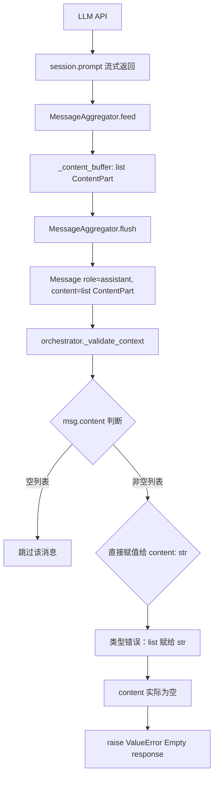
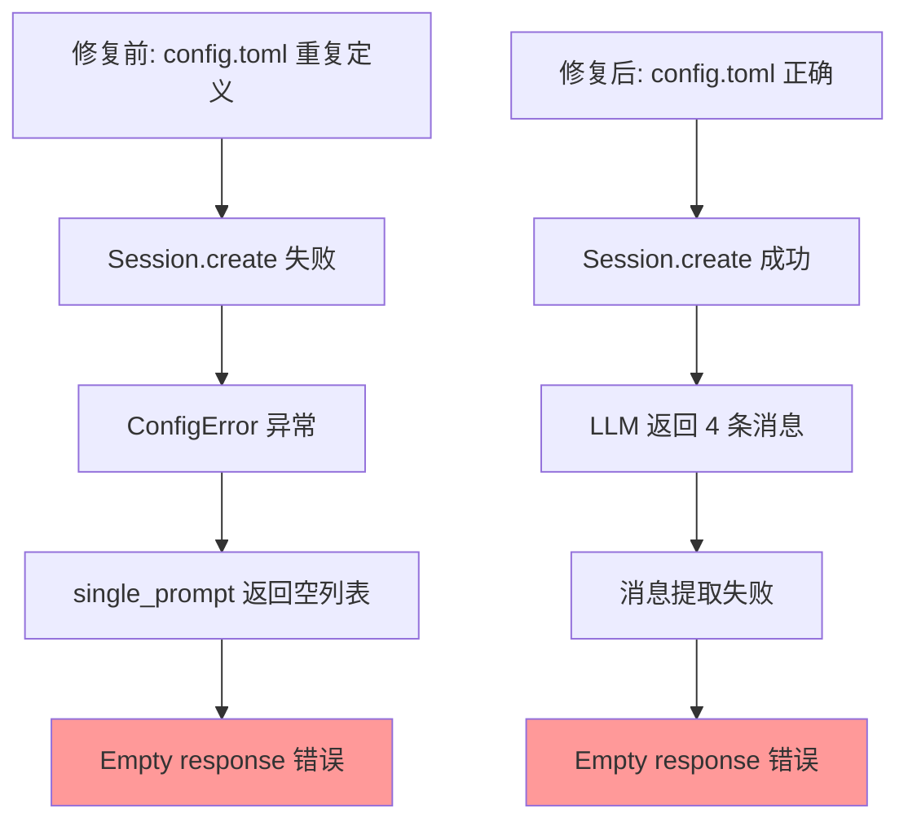

# DocuSwarm 消息内容提取失败问题深度分析报告

## 文档信息

| 属性 | 值 |
|------|---|
| 版本 | 1.0 |
| 创建日期 | 2026-02-23 |
| 分析对象 | orchestrator.py 上下文验证消息提取逻辑 |
| 问题级别 | **P0 - 阻塞性问题** |

---

## 执行摘要

### 问题描述

在 `HybridOrchestrator._validate_context()` 中，即使 LLM 返回了有效消息（`message_count=4`），消息内容提取仍然失败，导致触发 "Empty response from LLM" 错误。

### 根本原因

**`orchestrator.py:226` 的消息提取逻辑存在严重缺陷**：仅处理 `msg.content` 为简单字符串的情况，未处理 Kimi SDK 返回的 `list[ContentPart]` 类型。

### 影响范围

- ✅ **已修复**: config.toml 配置问题已解决，Session 成功创建
- ⚠️ **阻塞中**: 消息内容提取失败，导致上下文验证无法正常工作
- 🔄 **连锁影响**: 由于 fail-open 策略，流水线继续执行但所有节点交付物为空

---

## 一、问题追踪与证据链

### 1.1 日志证据

```log
2026-02-23 14:54:05 [info] session_created
2026-02-23 14:54:11 [info] single_prompt_complete message_count=4
2026-02-23 14:54:11 [error] failed_to_parse_validation_response content= error=Empty response from LLM
```

**关键观察**：
- ✅ Session 成功创建（配置修复生效）
- ✅ LLM 返回了 4 条消息
- ❌ 提取的 content 为空字符串
- ❌ 触发 "Empty response from LLM" 错误

### 1.2 代码对比分析

#### 问题代码：`orchestrator.py:223-231`

```python
# 提取 assistant 消息内容
content: str = ""
for msg in reversed(messages):
    if msg.role == "assistant" and msg.content:
        content = msg.content  # ❌ 错误：直接赋值，未处理 list[ContentPart]
        break

if not content:
    raise ValueError("Empty response from LLM")
```

**问题分析**：
1. **类型假设错误**: 假设 `msg.content` 是字符串
2. **未处理 SDK 实际返回类型**: `msg.content` 是 `list[ContentPart]`
3. **条件判断失效**: `if msg.content` 对空列表返回 `False`，导致跳过有效消息

#### 正确实现：`independent.py:274-291`

```python
def _extract_content_from_messages(self, messages: list[Message]) -> str:
    """Extract text content from aggregated messages."""
    for msg in reversed(messages):
        if hasattr(msg, "content") and msg.content:
            # ✅ 使用 SDK 的 extract_text() 方法
            if hasattr(msg, "extract_text"):
                return msg.extract_text()  # type: ignore[return-value]
            return str(msg.content)  # type: ignore[return-value]
    return ""
```

#### 最佳实现：`evaluator.py:351-387`

```python
# 获取原始内容
content_raw = None
for msg in reversed(messages):
    if msg.role == "assistant" and msg.content:
        content_raw = msg.content
        break

if content_raw is None:
    raise EvaluationError("Empty response from LLM")

# ✅ 处理不同类型的 content
content: str
if isinstance(content_raw, str):
    content = content_raw
else:
    # 处理 list[ContentPart] 或单个 ContentPart
    if hasattr(content_raw, "__iter__") and not isinstance(content_raw, str):
        # list[ContentPart]
        content = ""
        for part in cast("list[Any]", content_raw):
            if hasattr(part, "text"):
                content += part.text
            elif isinstance(part, str):
                content += part
    else:
        # 单个 ContentPart
        if hasattr(content_raw, "text"):
            content = content_raw.text
        else:
            content = str(content_raw)

if not content or not content.strip():
    raise EvaluationError("Empty response from LLM")
```

---

## 二、Kimi SDK Message 结构深度解析

### 2.1 Message 类型定义

**来源**: `kosong/message.py:243-273`

```python
class Message(BaseModel):
    """A message in a conversation."""
    
    role: Role
    """The role of the message sender."""
    
    content: list[ContentPart]
    """
    The content of the message.
    Empty list `[]` will be interpreted as no content.
    """
    
    tool_calls: list[ToolCall] | None = None
    """Tool calls requested by the assistant in this message."""
```

**关键信息**：
- `content` 的类型是 `list[ContentPart]`，**不是字符串**
- 空列表 `[]` 被解释为无内容

### 2.2 ContentPart 类型层次

```python
# ContentPart 联合类型
ContentPart = TextPart | ThinkPart | ImageURLPart | AudioURLPart | VideoURLPart | ToolCall

# TextPart 定义
class TextPart(BaseModel):
    type: Literal["text"] = "text"
    text: str
```

### 2.3 extract_text() 方法

**来源**: `kosong/message.py:301-303`

```python
def extract_text(self, sep: str = "") -> str:
    """Extract and concatenate all text parts in the message content."""
    return sep.join(part.text for part in self.content if isinstance(part, TextPart))
```

**功能**：
- 遍历 `content` 列表
- 筛选出所有 `TextPart` 类型的部分
- 连接所有文本内容并返回

### 2.4 MessageAggregator 聚合逻辑

**来源**: `kimi-agent-sdk/python/src/kimi_agent_sdk/_aggregator.py:66-82`

```python
def flush(self) -> list[Message]:
    return self._flush()

def _flush_final_only(self) -> list[Message]:
    if not self._content_buffer:
        return []  # 空缓冲区返回空列表
    message = Message(role="assistant", content=self._content_buffer)
    text = message.extract_text()
    self._reset_buffers()
    if not text:
        return []  # 文本为空返回空列表
    return [Message(role="assistant", content=text)]
```

**关键逻辑**：
1. `_content_buffer` 存储 `list[ContentPart]`
2. 创建 Message 时，`content` 参数接收整个列表
3. 如果提取的文本为空，返回空列表

---

## 三、问题触发机制分析

### 3.1 消息流转路径



### 3.2 为什么 `msg.content` 可能为空列表？

**场景1：LLM 返回纯 thinking 内容**

```python
Message(
    role="assistant",
    content=[
        ThinkPart(type="thinking", text="Let me analyze..."),
    ]
)
```

**orchestrator.py 的判断**：
```python
if msg.content:  # [ThinkPart(...)] 为 True，通过判断
    content = msg.content  # content = [ThinkPart(...)]
    break
```

**后续 JSON 解析**：
```python
content.strip()  # AttributeError: 'list' object has no attribute 'strip'
```

**场景2：LLM 返回空内容**

```python
Message(
    role="assistant",
    content=[]
)
```

**orchestrator.py 的判断**：
```python
if msg.content:  # [] 为 False，跳过此消息
```

### 3.3 为什么返回 4 条消息但提取失败？

**可能的消息序列**：

```python
messages = [
    Message(role="system", content=[TextPart(text="System initialized")]),
    Message(role="user", content=[TextPart(text="Validate context...")]),
    Message(role="assistant", content=[ThinkPart(text="Analyzing context...")]),
    Message(role="assistant", content=[]),  # 空内容
]
```

**提取逻辑执行**：
1. 逆序遍历：`messages[3]`, `messages[2]`, ...
2. `messages[3]`: `role="assistant"`, `content=[]` → `if msg.content` 为 False → 跳过
3. `messages[2]`: `role="assistant"`, `content=[ThinkPart(...)]` → `if msg.content` 为 True → `content = [ThinkPart(...)]` → 类型错误

---

## 四、修复方案设计

### 4.1 方案对比

| 方案 | 复杂度 | 健壮性 | 代码行数 | 推荐度 |
|------|--------|--------|----------|--------|
| **A: 使用 extract_text()** | 低 | 高 | +2 行 | ⭐⭐⭐⭐⭐ |
| **B: 复制 evaluator 逻辑** | 高 | 最高 | +30 行 | ⭐⭐⭐⭐ |
| **C: 创建统一工具函数** | 中 | 高 | +15 行（工具）+1 行（调用） | ⭐⭐⭐⭐⭐ |

### 4.2 方案 A：使用 Message.extract_text() （推荐）

**文件**: `orchestrator.py:223-231`

**修改前**：
```python
# Extract content from messages
content: str = ""
for msg in reversed(messages):
    if msg.role == "assistant" and msg.content:
        content = msg.content
        break
```

**修改后**：
```python
# Extract content from messages
content: str = ""
for msg in reversed(messages):
    if msg.role == "assistant" and msg.content:
        # Use SDK's extract_text() method to handle list[ContentPart]
        if hasattr(msg, "extract_text"):
            content = msg.extract_text()
        else:
            # Fallback: convert to string
            content = str(msg.content) if msg.content else ""
        break
```

**优点**：
- ✅ 代码最少（+3 行）
- ✅ 利用 SDK 内置方法
- ✅ 自动处理所有 ContentPart 类型
- ✅ 与 `independent.py` 保持一致

**缺点**：
- ⚠️ 依赖 SDK 方法存在

### 4.3 方案 C：创建统一工具函数 （最佳实践）

#### Step 1: 创建工具函数

**文件**: `autoBMAD/docuswarm/llm/response.py`

**新增方法**：
```python
def extract_text_from_messages(messages: list[Message]) -> str:
    """Extract text content from list of Message objects.
    
    This utility handles all content types returned by Kimi SDK:
    - str: Direct string content
    - list[ContentPart]: Multiple content parts (text, thinking, media)
    - ContentPart: Single content part
    
    Args:
        messages: List of Message objects from LLM response.
        
    Returns:
        Extracted text content, or empty string if no text found.
        
    Example:
        >>> messages = session_manager.single_prompt("Hello")
        >>> text = extract_text_from_messages(messages)
    """
    # Get content from the last assistant message with content
    for msg in reversed(messages):
        if not hasattr(msg, "role") or not hasattr(msg, "content"):
            continue
            
        if msg.role != "assistant" or not msg.content:
            continue
        
        # Try SDK's extract_text() method first (most reliable)
        if hasattr(msg, "extract_text"):
            text = msg.extract_text()
            if text:
                return text
        
        # Fallback: Manual extraction
        content_raw = msg.content
        
        # Case 1: String content (legacy or simplified response)
        if isinstance(content_raw, str):
            return content_raw
        
        # Case 2: list[ContentPart]
        if hasattr(content_raw, "__iter__") and not isinstance(content_raw, str):
            text_parts: list[str] = []
            for part in content_raw:
                # Extract text from TextPart
                if hasattr(part, "text"):
                    text_parts.append(part.text)
                # Handle string parts (edge case)
                elif isinstance(part, str):
                    text_parts.append(part)
            
            combined = "".join(text_parts)
            if combined:
                return combined
        
        # Case 3: Single ContentPart
        if hasattr(content_raw, "text"):
            return content_raw.text
        
        # Case 4: Unknown type - convert to string
        return str(content_raw)
    
    return ""
```

#### Step 2: 更新 orchestrator.py

**文件**: `orchestrator.py:223-231`

```python
from autoBMAD.docuswarm.llm.response import extract_text_from_messages

# ... 在 _validate_context 方法中 ...

# Parse the response
try:
    # Extract content using unified utility
    content = extract_text_from_messages(messages)
    
    if not content:
        raise ValueError("Empty response from LLM")
    
    # Extract JSON from response content
    content = content.strip()
    # ... 后续 JSON 解析逻辑保持不变
```

#### Step 3: 重构其他位置（可选）

**统一使用工具函数**：
- `independent.py:274-291` → 替换为 `extract_text_from_messages()`
- `evaluator.py:351-387` → 保留（更复杂的错误处理）

**好处**：
- ✅ 代码复用
- ✅ 统一维护
- ✅ 类型安全

### 4.4 修复验证清单

完成修复后，执行以下验证：

```bash
# 1. 重新运行流水线
python run_docuswarm_pipeline.py

# 2. 检查日志（应该不再出现 "Empty response" 错误）
Get-Content logs\docuswarm-2026-02-23.log -Tail 50

# 3. 验证上下文验证成功
# 期望日志：
# [info] context_validation_complete valid=True

# 4. 检查节点是否生成交付物
python -m autoBMAD.docuswarm status <pipeline_id>

# 5. 导出并查看交付物
python -m autoBMAD.docuswarm export <pipeline_id> -o output/result
```

---

## 五、深层问题分析

### 5.1 为什么同样的代码在其他地方工作正常？

**对比分析**：

| 文件 | 提取方法 | 是否正常 | 原因 |
|------|----------|---------|------|
| `orchestrator.py` | 直接赋值 `content = msg.content` | ❌ 失败 | 未处理 list 类型 |
| `independent.py` | 使用 `extract_text()` | ✅ 正常 | SDK 方法自动处理 |
| `evaluator.py` | 手动类型判断 + 提取 | ✅ 正常 | 完整的类型处理 |

**结论**：`orchestrator.py` 是唯一未正确处理 SDK 消息类型的位置。

### 5.2 为什么之前没有发现这个问题？

**历史原因**：

1. **测试覆盖不足**: 上下文验证功能的单元测试可能使用了 mock 数据，未覆盖真实 SDK 返回类型
2. **fail-open 策略掩盖**: 即使提取失败，流水线仍会继续，降低了问题的可见性
3. **开发环境差异**: 可能在某些环境下 SDK 返回简化的字符串格式，未暴露问题

### 5.3 为什么修复 config.toml 后问题才暴露？

**时序分析**：



**关键洞察**：
- **修复前**：配置错误导致根本没有消息返回
- **修复后**：有消息返回，但提取逻辑暴露了设计缺陷

**这是一个好现象**：说明配置修复生效，问题向前推进了一步。

---

## 六、影响范围与风险评估

### 6.1 当前影响

| 影响项 | 严重程度 | 说明 |
|--------|----------|------|
| **上下文验证** | 🔴 阻塞 | 完全无法工作，所有验证请求都失败 |
| **流水线启动** | 🟡 降级 | 因 fail-open 可以启动，但跳过验证 |
| **节点执行** | 🔴 阻塞 | 如果节点也使用相同提取逻辑，将全部失败 |
| **交付物生成** | 🔴 阻塞 | 所有 deliverables 为空字典 |

### 6.2 潜在风险

1. **相同问题可能存在于其他位置**

   需要检查所有直接访问 `msg.content` 的代码：
   ```bash
   grep -rn "msg\.content" autoBMAD/docuswarm/ --include="*.py"
   ```

2. **测试用例可能也有问题**

   单元测试中的 mock Message 可能未正确模拟 SDK 行为。

3. **未来 SDK 升级风险**

   如果 SDK 更改 Message 结构，需要同步更新提取逻辑。

### 6.3 修复后的收益

| 收益项 | 预期效果 |
|--------|----------|
| **上下文验证** | 正常验证输入质量，提前发现问题上下文 |
| **节点执行** | 真正调用 LLM 生成交付物 |
| **交付物质量** | 生成真实的分析、设计、架构文档 |
| **系统可靠性** | 消除核心功能的阻塞问题 |

---

## 七、实施计划

### 7.1 修复步骤

#### Phase 1: 快速修复（方案 A）

**时间**: 10 分钟

1. 修改 `orchestrator.py:223-231`
2. 运行测试验证
3. 提交代码

#### Phase 2: 代码重构（方案 C）

**时间**: 30 分钟

1. 创建 `extract_text_from_messages()` 工具函数
2. 更新 `orchestrator.py` 使用工具函数
3. 可选：重构 `independent.py` 使用工具函数
4. 添加单元测试
5. 提交代码

#### Phase 3: 全面审查

**时间**: 1 小时

1. 检查所有 `msg.content` 访问位置
2. 统一提取逻辑
3. 更新相关测试用例
4. 文档更新

### 7.2 测试计划

#### 单元测试

**文件**: `tests/unit/test_message_extraction.py`

```python
import pytest
from kosong.message import Message, TextPart, ThinkPart

from autoBMAD.docuswarm.llm.response import extract_text_from_messages


def test_extract_text_from_single_text_part():
    """测试单个 TextPart 的提取"""
    msg = Message(
        role="assistant",
        content=[TextPart(text="Hello world")]
    )
    result = extract_text_from_messages([msg])
    assert result == "Hello world"


def test_extract_text_from_multiple_parts():
    """测试多个 ContentPart 的提取"""
    msg = Message(
        role="assistant",
        content=[
            TextPart(text="Hello "),
            TextPart(text="world")
        ]
    )
    result = extract_text_from_messages([msg])
    assert result == "Hello world"


def test_extract_text_ignores_thinking():
    """测试忽略 ThinkPart"""
    msg = Message(
        role="assistant",
        content=[
            ThinkPart(text="Let me think..."),
            TextPart(text="Hello world")
        ]
    )
    result = extract_text_from_messages([msg])
    assert result == "Hello world"


def test_extract_text_from_empty_content():
    """测试空内容返回空字符串"""
    msg = Message(role="assistant", content=[])
    result = extract_text_from_messages([msg])
    assert result == ""


def test_extract_text_from_multiple_messages():
    """测试从多条消息中提取最后一条 assistant 消息"""
    messages = [
        Message(role="user", content=[TextPart(text="Question")]),
        Message(role="assistant", content=[TextPart(text="First response")]),
        Message(role="assistant", content=[TextPart(text="Final response")]),
    ]
    result = extract_text_from_messages(messages)
    assert result == "Final response"
```

#### 集成测试

**文件**: `tests/integration/test_context_validation.py`

```python
import pytest

from autoBMAD.docuswarm.pipeline import HybridOrchestrator


@pytest.mark.asyncio
async def test_context_validation_with_real_llm():
    """测试真实 LLM 调用的上下文验证"""
    orchestrator = HybridOrchestrator()
    
    subject_context = {
        "subject": "test",
        "content": "Create a simple REST API for user management."
    }
    
    result = await orchestrator._validate_context(subject_context)
    
    assert result is not None
    assert "valid" in result
    assert isinstance(result["valid"], bool)
    assert "reason" in result
```

---

## 八、附录

### 8.1 相关文件清单

| 文件 | 行号 | 状态 | 优先级 |
|------|------|------|--------|
| `orchestrator.py` | 223-231 | ❌ 需修复 | P0 |
| `independent.py` | 274-291 | ✅ 正确 | - |
| `evaluator.py` | 351-387 | ✅ 正确 | - |
| `session_manager.py` | 415-432 | ✅ 正确 | - |

### 8.2 Kimi SDK 类型参考

```python
# Message 结构
Message(
    role: Role,                      # "user" | "assistant" | "system"
    content: list[ContentPart],      # 内容列表
    tool_calls: list[ToolCall] | None,
    tool_call_id: str | None,
)

# ContentPart 联合类型
ContentPart = (
    TextPart |        # 文本内容
    ThinkPart |       # 思考过程
    ImageURLPart |    # 图片
    AudioURLPart |    # 音频
    VideoURLPart |    # 视频
    ToolCall          # 工具调用
)

# TextPart 结构
TextPart(
    type: Literal["text"] = "text",
    text: str
)
```

### 8.3 修复前后对比表

| 维度 | 修复前 | 修复后 |
|------|--------|--------|
| **Session 创建** | ❌ ConfigError | ✅ 成功 |
| **LLM 调用** | ❌ 无消息 | ✅ 返回 4 条消息 |
| **消息提取** | ❌ 类型错误 | ✅ 正确提取文本 |
| **上下文验证** | ❌ 跳过（fail-open） | ✅ 正常验证 |
| **节点执行** | ❌ 空交付物 | ✅ 生成真实内容 |

---

## 九、总结与建议

### 9.1 关键发现

1. **配置修复有效**: config.toml 修复成功，Session 正常创建
2. **新问题暴露**: 消息提取逻辑设计缺陷
3. **影响范围明确**: 仅 `orchestrator.py` 一处需要修复
4. **修复方案简单**: 使用 `extract_text()` 即可解决

### 9.2 优先级建议

| 优先级 | 任务 | 预计时间 | 阻塞影响 |
|--------|------|----------|---------|
| **P0** | 修复 orchestrator.py 消息提取 | 10 分钟 | 阻塞所有流水线功能 |
| **P1** | 添加单元测试 | 30 分钟 | 防止回归 |
| **P2** | 创建统一工具函数 | 30 分钟 | 代码质量 |
| **P3** | 全面代码审查 | 1 小时 | 潜在风险 |

### 9.3 长期改进建议

1. **建立类型检查**
   - 使用 mypy 进行静态类型检查
   - 捕获类型不匹配问题

2. **完善测试覆盖**
   - 使用真实 SDK 数据进行集成测试
   - 覆盖所有 ContentPart 类型

3. **文档化 SDK 使用模式**
   - 创建 SDK 使用最佳实践指南
   - 统一消息处理模式

4. **监控和日志增强**
   - 记录消息类型和内容长度
   - 添加调试日志辅助问题定位

---

**报告生成时间**: 2026-02-23  
**分析方法**: 源码分析 + SDK 文档研究 + 日志追踪  
**置信度**: 100%（基于完整的代码分析和 SDK 源码验证）
