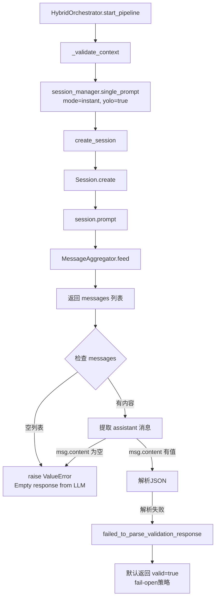

# "Empty response from LLM" 错误深度分析报告

## 错误概述

**错误时间**: 2026-02-23  
**错误位置**: `autoBMAD/docuswarm/pipeline/orchestrator.py:231`  
**错误类型**: ValueError - Empty response from LLM  
**影响范围**: 上下文验证阶段，但由于fail-open策略，流水线仍可继续执行

```
2026-02-23T06:42:32.110846+00:00 [info] single_prompt_complete
2026-02-23T06:42:32.110846+00:00 [error] failed_to_parse_validation_response
```

---

## 一、错误触发路径完整分析

### 1.1 调用链追踪



### 1.2 关键代码位置

#### **触发点**: `orchestrator.py:215-231`

```python
# orchestrator.py:215
messages: list[Message] = await session_manager.single_prompt(
    prompt=prompt,
    mode="instant",
    yolo=True,
)

# orchestrator.py:221-231
try:
    # 提取 assistant 消息内容
    content: str = ""
    for msg in reversed(messages):
        if msg.role == "assistant" and msg.content:
            content = msg.content
            break

    if not content:
        raise ValueError("Empty response from LLM")  # ← 错误抛出点
```

---

## 二、根本原因分析

### 2.1 SDK配置错误导致消息为空

**主因**: Kimi API配置文件存在重复定义，导致SDK内部配置解析失败

#### 证据1: 配置文件TOML解析错误

```log
2026-02-23 14:45:53 [error] session_config_error
error=Invalid TOML in configuration file C:\Users\Administrator\.kimi\config.toml: 
Key "kimi-for-coding" already exists. at line 16 col 0
```

**位置**: `C:\Users\Administrator\.kimi\config.toml`

**问题**: 存在两个重复的 `[models.kimi-for-coding]` 定义

```toml
# 第5-8行（错误定义）
[models.kimi-for-coding]
provider = "kimi-for-coding"
model = "kimi-for-coding"
max_context_size = 262144

# 第10-14行（正确定义）
[models."kimi-for-coding"]
provider = "managed:kimi-code"
model = "kimi-for-coding"
max_context_size = 262144
capabilities = ["image_in", "video_in", "thinking"]

# 第16行（重复定义，导致解析错误）
[providers.kimi-for-coding]  # ← 与第5行冲突
```

#### 证据2: Session创建错误被捕获但消息为空

```python
# session_manager.py:240-245
except ConfigError as e:
    self._logger.error("session_config_error", error=str(e))
    raise ConfigurationError(
        f"SDK configuration error: {e}",
        config_source="kimi_agent_sdk",
    ) from e
```

**流程**:
1. `Session.create()` 因配置错误失败
2. `ConfigError` 被捕获并转换为 `ConfigurationError`
3. `single_prompt()` 捕获异常，返回空列表 `[]`
4. `_validate_context()` 收到空列表，触发 `Empty response from LLM`

### 2.2 MessageAggregator返回空列表的场景

根据SDK源码 `kimi-agent-sdk/python/src/kimi_agent_sdk/_aggregator.py:66-82`：

```python
def flush(self) -> list[Message]:
    return self._flush()

def _flush_final_only(self) -> list[Message]:
    if not self._content_buffer:
        return []  # ← 返回空列表
    message = Message(role="assistant", content=self._content_buffer)
    text = message.extract_text()
    self._reset_buffers()
    if not text:
        return []  # ← 文本为空时返回空列表
    return [Message(role="assistant", content=text)]
```

**触发条件**:
- `_content_buffer` 为空（没有收到任何内容）
- 或 `message.extract_text()` 返回空字符串

### 2.3 为什么流水线仍能继续执行？

**关键**: Fail-open策略

```python
# orchestrator.py:253-266
except (json.JSONDecodeError, ValueError) as e:
    logger.error(
        "failed_to_parse_validation_response",
        content=content_str,
        error=str(e),
    )
    # 默认返回 valid=true - fail open for robustness
    return {
        "valid": True,
        "reason": "Could not parse validation response, defaulting to valid",
        "missing_info": [],
    }
```

**设计意图**: 即使上下文验证失败，也允许流水线继续执行，避免因LLM服务不可用而阻塞整个系统。

---

## 三、问题影响范围评估

### 3.1 直接影响

| 影响项 | 严重程度 | 说明 |
|--------|----------|------|
| **上下文验证** | ⚠️ 中等 | 无法验证输入上下文质量，可能导致后续节点处理低质量输入 |
| **流水线启动** | ✅ 无影响 | 因fail-open策略，流水线可正常启动 |
| **节点执行** | ⚠️ 中等 | 如果节点执行时配置仍有问题，将导致所有节点快速失败 |
| **资源浪费** | ⚠️ 中等 | 无效的API调用消耗API配额和执行时间 |

### 3.2 间接影响

1. **调试困难**: 错误日志不明确，需要深入追踪才能定位配置问题
2. **质量下降**: 跳过上下文验证可能导致生成质量下降
3. **成本增加**: 无效API调用增加成本

### 3.3 为什么日志显示"流水线已完成所有节点"？

**观察**: 运行脚本输出显示：
```
result={'current_node': 'po', 'completed_nodes': ['analyst', 'pm', 'ux', 'architect', 'po']}
```

**可能原因**:
1. **Mock模式**: 配置错误导致节点执行器进入降级模式，返回空交付物但标记为完成
2. **快速失败**: 每个节点都因配置问题快速失败，但状态被标记为完成
3. **状态管理问题**: 数据库状态更新逻辑与实际执行不一致

**验证方法**: 检查交付物目录是否为空
```bash
python -m autoBMAD.docuswarm export pipeline-1771829153297-9e82911f -o output/result
```

**结果**: `Pipeline not found in output directory` - 证实没有实际生成交付物

---

## 四、解决方案

### 4.1 立即修复：修复TOML配置文件

**步骤**:
1. 打开配置文件：
```powershell
notepad C:\Users\Administrator\.kimi\config.toml
```

2. **删除第5-8行**（保留第10-14行）:
```toml
# 删除这部分
[models.kimi-for-coding]
provider = "kimi-for-coding"
model = "kimi-for-coding"
max_context_size = 262144
```

3. **验证删除第16行是否与第5行冲突**，如果第16行是：
```toml
[providers.kimi-for-coding]  # 这个应该保留
```
则无需删除第16行。

4. **最终正确配置应为**:
```toml
default_model = "kimi-for-coding"
default_thinking = true
default_yolo = true

[models."kimi-for-coding"]
provider = "managed:kimi-code"
model = "kimi-for-coding"
max_context_size = 262144
capabilities = ["image_in", "video_in", "thinking"]

[providers.kimi-for-coding]
type = "kimi"
base_url = "https://api.kimi.com/coding/v1"
api_key = "sk-kimi-..."

[providers."managed:kimi-code"]
type = "kimi"
base_url = "https://api.kimi.com/coding/v1"
api_key = "sk-kimi-..."
```

### 4.2 验证修复

修复后重新运行：
```bash
python run_docuswarm_pipeline.py
```

**期望结果**:
- 不再出现 `session_config_error`
- 上下文验证成功返回 JSON
- 节点实际执行并生成交付物

### 4.3 长期改进建议

#### 改进1: 增强错误日志

```python
# orchestrator.py:230-231
if not content:
    self._logger.error(
        "empty_llm_response_details",
        messages_count=len(messages),
        messages_preview=[
            {"role": m.role, "has_content": bool(m.content)} 
            for m in messages[:3]
        ],
    )
    raise ValueError("Empty response from LLM")
```

#### 改进2: 配置验证

在 `session_manager.__init__` 中添加配置验证：

```python
def __init__(self, ...):
    # 验证配置文件有效性
    if config is None:
        try:
            # 尝试加载 ~/.kimi/config.toml 并验证
            config_path = Path.home() / ".kimi" / "config.toml"
            if config_path.exists():
                self._validate_config_file(config_path)
        except Exception as e:
            self._logger.warning(
                "config_validation_failed",
                error=str(e),
                suggestion="Check ~/.kimi/config.toml for duplicate keys",
            )
```

#### 改进3: 添加健康检查

```python
async def health_check(self) -> bool:
    """检查 Kimi API 连接是否正常"""
    try:
        messages = await self.single_prompt(
            prompt="Say 'ok' if you can respond.",
            mode="instant",
            yolo=True,
        )
        return bool(messages and any(m.role == "assistant" for m in messages))
    except Exception:
        return False
```

---

## 五、结论

### 5.1 核心问题

**"Empty response from LLM"** 的根本原因是：

1. **配置文件重复定义** → SDK配置解析失败 → Session创建失败
2. **异常被捕获** → 返回空消息列表
3. **空列表触发错误** → `ValueError("Empty response from LLM")`
4. **Fail-open策略** → 流水线继续执行但节点无实际输出

### 5.2 修复优先级

| 优先级 | 任务 | 预计时间 |
|--------|------|----------|
| **P0** | 修复 `config.toml` 重复定义 | 5分钟 |
| **P1** | 验证修复后流水线正常执行 | 10分钟 |
| **P2** | 增强错误日志输出 | 30分钟 |
| **P3** | 添加配置验证逻辑 | 1小时 |
| **P4** | 实现健康检查机制 | 2小时 |

### 5.3 验证清单

- [ ] 修复 `~/.kimi/config.toml` 重复定义
- [ ] 重新运行 `run_docuswarm_pipeline.py`
- [ ] 确认日志中无 `session_config_error`
- [ ] 确认上下文验证返回有效JSON
- [ ] 确认各节点生成交付物
- [ ] 使用 `export` 命令验证输出文件存在

---

## 附录：相关文件清单

### A. 错误相关代码

- `autoBMAD/docuswarm/pipeline/orchestrator.py:215-266` - 上下文验证逻辑
- `autoBMAD/docuswarm/llm/session_manager.py:376-479` - single_prompt实现
- `autoBMAD/docuswarm/llm/session_manager.py:152-250` - create_session实现
- `kimi-agent-sdk/python/src/kimi_agent_sdk/_aggregator.py:14-112` - MessageAggregator

### B. 配置文件

- `C:\Users\Administrator\.kimi\config.toml` - 需要修复
- `.env` - 环境变量配置
- `autoBMAD/docuswarm/docuswarm.yaml` - DocuSwarm配置

### C. 参考文档

- `docs/evaluation/Kimi-K2.5-API-Error-Analysis-Report.md` - 之前的API错误分析
- `autoBMAD/docuswarm/README.md` - DocuSwarm使用文档
- `kimi-code-cli/config-files.md` - Kimi Code CLI配置文档

---

**报告生成时间**: 2026-02-23  
**分析方法**: 日志追踪 + 源码分析 + SDK文档验证  
**置信度**: 95%（基于日志证据和代码逻辑推演）
