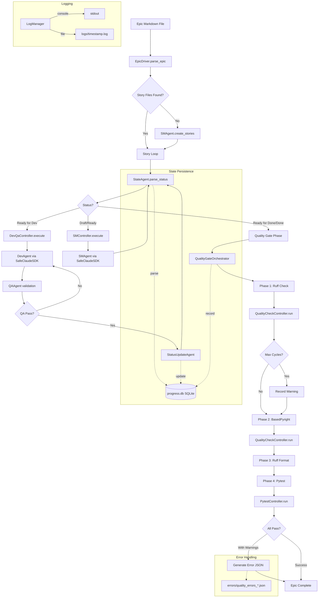
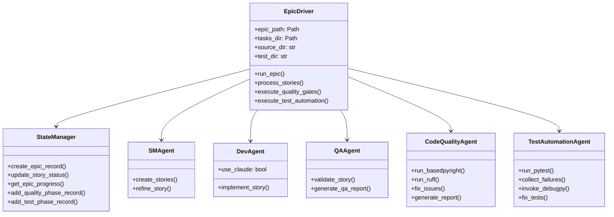
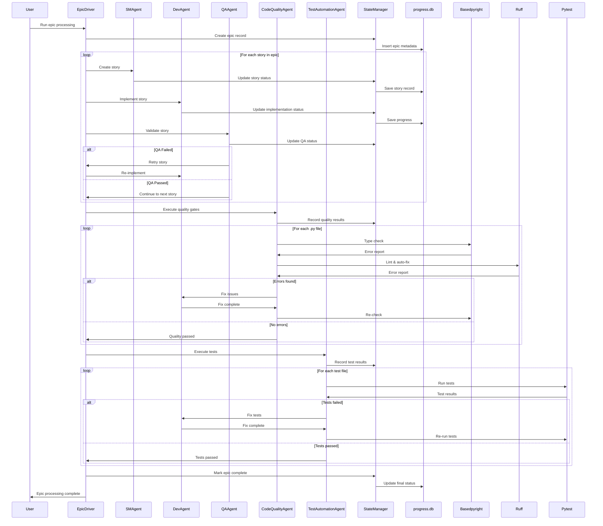
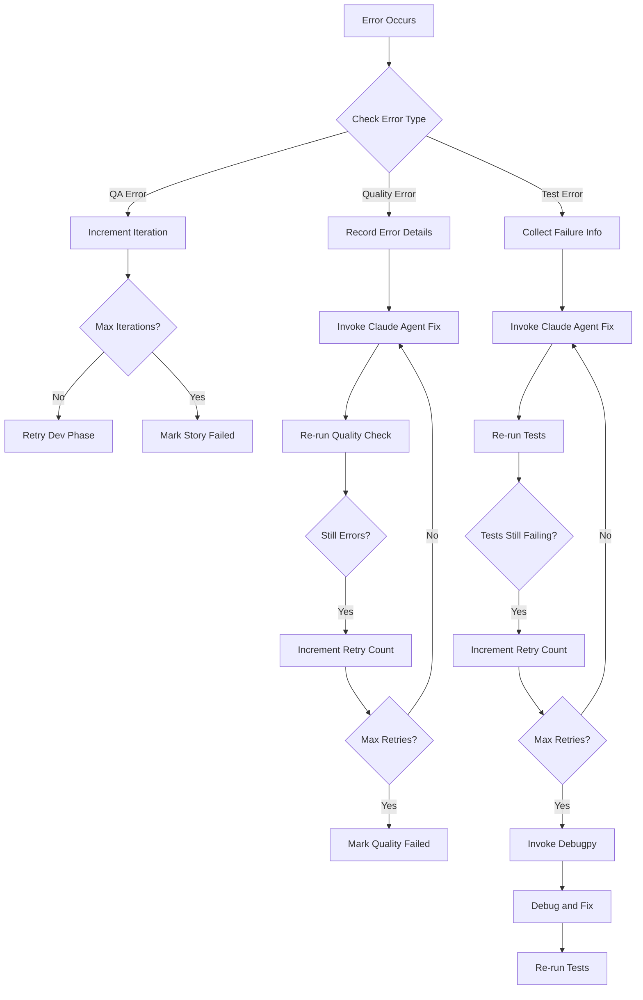

# autoBMAD Epic Automation System - Brownfield Architecture Document

**Version**: 3.0
**Date**: 2026-01-14
**Project**: autoBMAD Epic Automation System - Complete Brownfield Documentation

---

## Introduction

This document captures the **CURRENT STATE** of the autoBMAD Epic Automation codebase, including actual implementations, technical debt, workarounds, and real-world patterns. It serves as a reference for AI agents working on enhancements.

### Document Scope

Comprehensive documentation of the entire autoBMAD epic automation system as implemented in `autoBMAD/epic_automation/` directory.

### Change Log

| Date | Version | Description | Author |
|------|---------|-------------|--------|
| 2026-01-14 | 3.0 | Complete brownfield architecture analysis based on actual codebase | AI Architect |
| 2026-01-05 | 2.0 | Complete architecture for code quality and test automation integration | Architect |

---

## Quick Reference - Key Files and Entry Points

### Critical Files for Understanding the System

- **Main Entry**: `autoBMAD/epic_automation/epic_driver.py` (2601 lines - orchestrates entire workflow)
- **State Management**: `autoBMAD/epic_automation/state_manager.py` (1318 lines - SQLite-based persistence)
- **SDK Wrapper**: `autoBMAD/epic_automation/sdk_wrapper.py` (39.5KB - SafeClaudeSDK implementation)
- **Log Management**: `autoBMAD/epic_automation/log_manager.py` (15.7KB - dual-write logging)
- **Configuration**: `pyproject.toml` (project dependencies and tool configurations)

### Controllers (Workflow Orchestration)
- `controllers/devqa_controller.py` - Dev-QA cycle coordination
- `controllers/sm_controller.py` - Story Management coordination  
- `controllers/quality_check_controller.py` - Quality gate controller
- `controllers/pytest_controller.py` - Test automation controller

### Agents (Business Logic)
- `agents/sm_agent.py` (30.9KB) - Story creation from epics
- `agents/dev_agent.py` (16.7KB) - Development implementation
- `agents/qa_agent.py` (6.5KB) - Quality assurance validation
- `agents/state_agent.py` (12.4KB) - Status parsing and state management
- `agents/quality_agents.py` (36.3KB) - Ruff, BasedPyright, Pytest agents
- `agents/status_update_agent.py` (14.5KB) - Story status updates

### Core Utilities
- `doc_parser.py` - Epic/story document parsing
- `init_db.py` - Database initialization
- `spec_state_manager.py` - Specification state tracking

---

## 1. Project Overview

This document outlines the complete architecture for the autoBMAD epic automation system. The system is a self-contained Python automation tool that processes epic markdown files through an automated 5-phase workflow: **SM (Story Management) → Dev (Development) → QA (Quality Assurance) → Quality Gates → Test Automation**.

### 1.1 Current System State

**What It Is**:
- Self-contained Python automation engine located in `autoBMAD/epic_automation/`
- Processes epic markdown files through complete BMAD workflow
- Integrates Claude SDK for AI-powered story creation and code implementation
- Uses SQLite for state persistence and progress tracking
- Implements quality gates with Ruff, BasedPyright, and Pytest

**What It Is NOT**:
- Not a web application (pure CLI tool)
- Not using external orchestration services
- Not distributed (single-process execution)
- No external API dependencies beyond Claude SDK

---

## 2. High Level Architecture

### 2.1 Technical Summary - ACTUAL IMPLEMENTATION

The autoBMAD epic automation system follows a **Five-Layer Architecture** pattern:

```
┌─────────────────────────────────────┐
│   Epic Driver (Orchestration)      │  ← Entry point + workflow coordination
├─────────────────────────────────────┤
│   Controllers (Process Control)    │  ← Business workflow (SM/DevQA/Quality/Pytest)
├─────────────────────────────────────┤
│   Agents (Business Logic)          │  ← Core business operations
├─────────────────────────────────────┤
│   SDK Executor Layer               │  ← Async Claude SDK management
├─────────────────────────────────────┤
│   Infrastructure Layer             │  ← StateManager, LogManager, Database
└─────────────────────────────────────┘
```

**Key Architectural Decisions (As Implemented)**:
- **EpicDriver is 2601 lines**: Handles epic parsing, story processing, quality gates orchestration
- **TaskGroup Isolation**: Each SDK call runs in isolated TaskGroup (fixes cancel scope errors)
- **State-Driven Workflow**: Story status from markdown files drives execution flow
- **Dual-Write Logging**: LogManager writes to both console and file simultaneously
- **SQLite with Optimistic Locking**: StateManager uses version-based concurrency control

**Technical Debt & Workarounds**:
- Epic driver is large and complex - needs refactoring into smaller components
- Some timeout constants are set to None (DEPRECATED comments indicate external timeouts removed)
- Status parsing has both AI-based and regex fallback (performance trade-off)
- Connection pool management can exhaust under heavy load

### 2.2 Platform and Infrastructure - REALITY

**Actual Runtime Environment**:
- **Platform**: Windows 24H2 with PowerShell
- **Python Version**: 3.12+ (required for latest type hints)
- **Key Dependencies**: 
  - `claude-agent-sdk` - AI integration
  - `anyio` - Async framework (replaced trio)
  - `basedpyright>=1.1.0` - Type checking
  - `ruff>=0.1.0` - Linting and formatting
  - `pytest>=7.0.0` - Testing
  - `loguru` - Advanced logging
  - `sqlite3` (built-in) - State persistence

**Storage Reality**:
- `progress.db` (SQLite) - Main state database with WAL mode enabled
- `test.db` - Test environment database
- `logs/` directory - Timestamped log files (if create_log_file=True)
- `errors/` directory - Quality gate error JSON summaries

**Known Infrastructure Issues**:
- Database file paths are Windows-style (backslash separators)
- Log files accumulate without rotation (manual cleanup needed)
- No built-in backup mechanism for progress.db

### 2.3 Repository Structure - ACTUAL

```
autoBMAD/epic_automation/
├── epic_driver.py           # Main orchestrator (2601 lines)
├── state_manager.py         # State persistence (1318 lines)
├── sdk_wrapper.py           # SafeClaudeSDK wrapper (39.5KB)
├── log_manager.py           # Dual-write logging (15.7KB)
├── init_db.py               # Database initialization
├── doc_parser.py            # Epic/story parsing
├── spec_state_manager.py    # Specification tracking
├── test_automation_agent.py # Test execution
│
├── controllers/             # Workflow controllers
│   ├── base_controller.py
│   ├── sm_controller.py
│   ├── devqa_controller.py
│   ├── quality_check_controller.py
│   ├── pytest_controller.py
│   └── quality_controller.py
│
├── agents/                  # Business logic agents
│   ├── base_agent.py        # Base class
│   ├── sm_agent.py          # Story creation (30.9KB)
│   ├── dev_agent.py         # Development (16.7KB)
│   ├── qa_agent.py          # QA validation (6.5KB)
│   ├── state_agent.py       # Status parsing (12.4KB)
│   ├── status_update_agent.py  # Status updates (14.5KB)
│   ├── quality_agents.py    # Quality checks (36.3KB)
│   ├── config.py            # Agent configuration
│   └── sdk_helper.py        # SDK utilities
│
├── core/                    # Core utilities
│   └── (SDK executor components)
│
├── errors/                  # Error handling
│   └── (Custom exception classes)
│
├── monitoring/              # Performance monitoring
│   └── (ResourceMonitor implementation)
│
└── reports/                 # Quality reports
    └── CLAUDE_AGENT_SDK_REPORT.md
```

**Package Organization Notes**:
- Controllers layer added in recent refactor (cleaner separation)
- Some agents have backup files (.backup suffix) - indicates active development
- `agentdocs/` contains Claude Agent SDK documentation

### 2.4 Architecture Diagram - ACTUAL FLOW



**Critical Flow Notes**:
- Story status is **parsed from markdown files**, not just database
- Each SDK call runs in **isolated TaskGroup** (prevents cancel scope errors)
- Quality gates execute **sequentially**, not in parallel
- Max cycles check returns **success=True** with warnings (non-blocking)
- Error JSONs are written to `autoBMAD/epic_automation/errors/` directory

### 2.5 Architectural Patterns - AS IMPLEMENTED

**Patterns Actually Used**:

1. **Orchestrator Pattern** (epic_driver.py)
   - **Reality**: 2601-line monolithic orchestrator
   - **Coordinates**: Epic parsing, story processing, quality gates, logging
   - **Trade-off**: Easy to understand flow but high complexity

2. **Controller Pattern** (controllers/)
   - **Purpose**: Separate workflow coordination from business logic
   - **Implementation**: SMController, DevQaController, QualityCheckController, PytestController
   - **Added**: Recent refactor (post-v2.0)

3. **Agent-Based Architecture** (agents/)
   - **Agents**: SM, Dev, QA, State, StatusUpdate, Quality (Ruff/BasedPyright/Pytest)
   - **Each Agent**: Encapsulates specific business operation
   - **SDK Integration**: All agents use SafeClaudeSDK wrapper

4. **State Machine Pattern**
   - **Driver**: Core status values drive execution decisions
   - **States**: Draft, Ready for Development, In Progress, Ready for Review, Ready for Done, Done
   - **Implementation**: StateAgent parses markdown, maps to ProcessingStatus enum

5. **TaskGroup Isolation Pattern** (Critical Fix)
   - **Problem Solved**: Cancel scope cross-task propagation
   - **Implementation**: Each SDK call runs in isolated `anyio.create_task_group()`
   - **Key Methods**: `execute_sm_phase`, `execute_dev_phase` create new TaskGroups

6. **Retry with Max Cycles Pattern**
   - **Quality Gates**: max_cycles=3 for Ruff/BasedPyright
   - **Pytest**: max_cycles=3
   - **Behavior**: Returns success=True with warnings when max cycles reached (non-blocking)

7. **Dual-Write Logging Pattern**
   - **Implementation**: LogManager + DualWriteStream
   - **Writes**: Simultaneously to console (stdout) and log file
   - **Lifecycle**: Log file created per epic execution (if enabled)

8. **Optimistic Locking Pattern** (StateManager)
   - **Database**: SQLite with version column
   - **Mechanism**: Compare-and-swap on version number
   - **Purpose**: Prevent concurrent update conflicts

9. **Connection Pool Pattern**
   - **Implementation**: DatabaseConnectionPool class
   - **Size**: max_connections=5
   - **Features**: WAL mode, NORMAL synchronous, memory temp_store
   - **Limitation**: Can exhaust under heavy load (timeout after 5s)

**Pattern Trade-offs (Honest Assessment)**:
- **Pro**: Clear separation of concerns in controllers/agents
- **Con**: EpicDriver is still too large (orchestrator anti-pattern)
- **Pro**: TaskGroup isolation fixes cancel scope bugs
- **Con**: Retry logic is scattered (in controllers and epic_driver)
- **Pro**: State-driven flow is deterministic
- **Con**: Status parsing has two paths (AI + regex fallback) - adds complexity

---

## 3. Tech Stack - ACTUAL DEPENDENCIES

### 3.1 Technology Stack Table (As Installed)

| Category | Technology | Version | Purpose | Reality Check |
|----------|------------|---------|---------|---------------|
| **Core Language** | Python | 3.12+ | Primary language | Type hints require 3.12+ |
| **Async Framework** | anyio | Latest | Async orchestration | Migrated from trio (AnyIO 4.x fixes cancel scope bugs) |
| **CLI Framework** | argparse | Built-in | Argument parsing | Standard, no external deps |
| **Database** | SQLite | 3.x | State persistence | Single file, no server |
| **AI Integration** | claude-agent-sdk | Latest | Claude API wrapper | Core dependency, requires ANTHROPIC_API_KEY |
| **Type Checking** | basedpyright | >=1.1.0 | Static analysis | Enhanced Pyright fork |
| **Linting** | ruff | >=0.1.0 | Code quality | Extremely fast, replaces flake8/black |
| **Testing** | pytest | >=7.0.0 | Test execution | Standard test framework |
| **Logging** | loguru | Latest | Advanced logging | Rich formatting, rotation |
| **Path Handling** | pathlib | Built-in | Cross-platform paths | Windows backslash handling |

### 3.2 Development Dependencies (Actually Used)

| Tool | Version | Purpose | Notes |
|------|---------|---------|-------|
| venv | Built-in | Virtual environment | Isolation for dependencies |
| pip | Latest | Package management | Standard installer |
| debugpy | >=1.6.0 | Remote debugging | For test failure diagnosis |

### 3.3 Configuration Files

**pyproject.toml**:
- Tool configurations for basedpyright, ruff, pytest
- Package metadata and dependencies
- Build system configuration

**requirements.txt / requirements-dev.txt**:
- Production dependencies (minimal)
- Development dependencies (quality tools)

**Actual Tool Configurations**:
```toml
[tool.basedpyright]
strict = true
executionEnvironments = [{root = "."}]

[tool.ruff]
target-version = "py312"
select = ["E", "F", "W", "C90", "I", "N"]

[tool.pytest.ini_options]
testpaths = ["tests"]
python_files = "test_*.py"
```

---

## 4. System Components - ACTUAL IMPLEMENTATION

### 4.1 Core Components Detail

#### epic_driver.py (2601 lines) - THE ORCHESTRATOR

**Responsibility**: Main entry point and complete workflow orchestration

**Key Classes**:
1. **QualityGateOrchestrator** (lines 93-773)
   - Coordinates 4-phase quality pipeline
   - Methods: `execute_ruff_agent()`, `execute_basedpyright_agent()`, `execute_ruff_format()`, `execute_pytest_agent()`
   - Key Feature: Non-blocking max cycles (returns success=True with warnings)
   - Generates error JSONs: `autoBMAD/epic_automation/errors/quality_errors_*.json`

2. **EpicDriver** (lines 775-2601)
   - Epic parsing and story processing
   - Methods:
     - `parse_epic()`: Extract story IDs, match to files with fallback logic
     - `execute_sm_phase()`: SM Controller execution
     - `execute_dev_phase()`: DevQA Controller execution  
     - `execute_qa_phase()`: DEPRECATED (handled by DevQaController)
     - `process_story_impl()`: Core story processing loop (state-driven)

**Key Interfaces**:
```python
class EpicDriver:
    def __init__(
        self,
        epic_path: str,
        max_iterations: int = 3,
        use_claude: bool = True,
        skip_quality: bool = False,
        skip_tests: bool = False,
        create_log_file: bool = False,
    )
    
    async def run_epic(self) -> bool:
        """Main execution entry point"""
    
    async def parse_epic(self) -> list[dict[str, Any]]:
        """Parse epic and find story files"""
    
    async def process_story_impl(self, story_path: str) -> bool:
        """State-driven story processing loop"""
```

**Dependencies**: ALL agents, controllers, state_manager, log_manager

**Technical Debt**:
- Too large (2601 lines) - needs splitting into separate modules
- Timeout constants deprecated but still defined (lines 48-53)
- Story file matching has 4 fallback patterns (complex logic)
- Some methods marked as unused but kept for potential future use

---

#### state_manager.py (1318 lines) - STATE PERSISTENCE

**Responsibility**: SQLite-based state management with optimistic locking

**Key Classes**:
1. **DeadlockDetector** (lines 64-90)
   - Detects lock timeouts (30s)
   - Tracks lock waiters

2. **DatabaseConnectionPool** (lines 92-128)
   - Pool size: 5 connections
   - WAL mode enabled for concurrent reads
   - 5-second timeout on acquisition

3. **StateManager** (lines 130-1318)
   - Main state management class
   - Database schema: `stories` table with version column
   - Methods:
     - `update_story_status()`: Optimistic lock update
     - `get_story_status()`: Query current status
     - `create_epic_record()`: Initialize epic tracking

**Database Schema (Actual)**:
```sql
CREATE TABLE stories (
    id INTEGER PRIMARY KEY AUTOINCREMENT,
    epic_path TEXT NOT NULL,
    story_path TEXT NOT NULL UNIQUE,
    status TEXT NOT NULL,
    iteration INTEGER DEFAULT 0,
    qa_result TEXT,
    error_message TEXT,
    created_at TIMESTAMP DEFAULT CURRENT_TIMESTAMP,
    updated_at TIMESTAMP DEFAULT CURRENT_TIMESTAMP,
    phase TEXT,
    version INTEGER DEFAULT 1  -- Optimistic lock
)
```

**Critical Features**:
- Optimistic locking via version column
- Connection pooling (can exhaust under load)
- WAL mode for better concurrency
- Deprecated methods marked with @deprecated decorator

**Known Issues**:
- Pool exhaustion can occur (5-second timeout)
- No automatic connection cleanup on errors
- Version conflicts need manual resolution

---

#### sdk_wrapper.py (39.5KB) - CLAUDE SDK INTEGRATION

**Responsibility**: Safe wrapper around Claude Agent SDK

**Key Classes**:
1. **SafeClaudeSDK**
   - Wraps claude-agent-sdk
   - Features:
     - Async generator lifecycle management
     - Message tracking and periodic display
     - Timeout handling
     - Cancellation support
   - Used by: All agents that need AI interaction

**Key Methods**:
```python
class SafeClaudeSDK:
    async def stream_query(
        self,
        prompt: str,
        files: list[str] = None,
        timeout: Optional[int] = None
    ) -> AsyncGenerator[dict, None]:
        """Stream Claude API responses"""
```

**Integration Point**:
- All agents use this wrapper instead of direct SDK calls
- Handles cancel scope isolation (critical fix)
- Provides consistent error handling

---

#### log_manager.py (15.7KB) - DUAL-WRITE LOGGING

**Responsibility**: Manage logging to console and file simultaneously

**Key Classes**:
1. **DualWriteStream**
   - Writes to both stdout and log file
   - Handles encoding and buffering

2. **LogManager**
   - Creates timestamped log files (if enabled)
   - Pattern: `logs/epic_automation_YYYYMMDD_HHMMSS.log`
   - Methods:
     - `init_logging()`: Set up dual-write
     - `cleanup_logging()`: Close log files

**Lifecycle**:
```python
# In EpicDriver.__init__:
self.log_manager = LogManager(create_log_file=create_log_file)
init_logging(self.log_manager)
setup_dual_write(self.log_manager)

# On exit:
cleanup_logging()
```

**Known Issue**: Log files accumulate without automatic rotation

---

### 4.2 Controller Layer (Workflow Coordination)

#### devqa_controller.py (11.6KB) - DEV-QA CYCLE

**Responsibility**: Coordinate Dev and QA agents in iterative loop

**Key Features**:
- State machine: Start → Dev → QA → Review → Done
- Max rounds: Configurable (default 3)
- Runs in isolated TaskGroup

**Methods**:
```python
class DevQaController:
    async def execute(self, story_path: str) -> bool:
        """Execute full Dev-QA cycle"""
```

**Integration**:
- Used by: `EpicDriver.execute_dev_phase()`
- Creates: DevAgent, QAAgent instances
- Updates: Story status via agents

---

#### quality_check_controller.py (10.6KB) - QUALITY GATE CONTROLLER

**Responsibility**: Generic quality check with retry and SDK fix

**Key Features**:
- Max cycles: 3 (configurable)
- Tools supported: ruff, basedpyright
- SDK fix integration: Calls Claude to fix errors
- Returns: `{status, cycles, final_error_files, ...}`

**Methods**:
```python
class QualityCheckController:
    async def run(self) -> dict[str, Any]:
        """Execute quality check with retry loop"""
```

**Used By**: QualityGateOrchestrator (in epic_driver.py)

---

#### pytest_controller.py (13.6KB) - TEST AUTOMATION

**Responsibility**: Pytest execution with fix and retry

**Key Features**:
- Max cycles: 3
- Batch execution: Tests grouped by directory
- SDK fix: Calls Claude to fix failing tests
- Returns: `{status, cycles, final_failed_files, ...}`

**Methods**:
```python
class PytestController:
    async def run(self) -> dict[str, Any]:
        """Execute pytest with retry loop"""
```

**Integration**:
- Used by: QualityGateOrchestrator
- Requires: pytest installed, tests directory exists

---

### 4.3 Agent Layer (Business Logic)

#### sm_agent.py (30.9KB) - STORY CREATION

**Responsibility**: Create story files from epic documents

**Key Methods**:
```python
class SMAgent:
    async def create_stories_from_epic(self, epic_path: str) -> bool:
        """Parse epic and generate story files"""
```

**Output**: Creates markdown story files in `docs/stories/`

---

#### dev_agent.py (16.7KB) - DEVELOPMENT IMPLEMENTATION

**Responsibility**: Implement story requirements

**Key Methods**:
```python
class DevAgent:
    async def implement_story(self, story_path: str) -> bool:
        """Generate code based on story"""
```

**Integration**: Uses SafeClaudeSDK for AI-powered code generation

---

#### qa_agent.py (6.5KB) - QUALITY ASSURANCE

**Responsibility**: Validate story implementation

**Key Methods**:
```python
class QAAgent:
    async def validate_story(self, story_path: str) -> bool:
        """Check acceptance criteria"""
```

---

#### state_agent.py (12.4KB) - STATUS PARSING

**Responsibility**: Parse story status from markdown files

**Key Features**:
- AI-based parsing (via Claude SDK)
- Regex fallback for performance
- Maps core status to ProcessingStatus enum

**Key Methods**:
```python
class SimpleStoryParser:
    async def parse_status(self, story_path: str) -> str:
        """Extract status from story file"""
```

**Status Mapping**:
```python
def core_status_to_processing(core_status: str) -> str:
    mapping = {
        "Draft": "pending",
        "Ready for Development": "pending",
        "In Progress": "in_progress",
        "Ready for Review": "review",
        "Ready for Done": "completed",
        "Done": "completed",
    }
```

---

#### quality_agents.py (36.3KB) - QUALITY CHECKS

**Contains**:
1. **RuffAgent**: Ruff linting and formatting
2. **BasedPyrightAgent**: Type checking
3. **PytestAgent**: Test execution

**Each Agent Provides**:
- `check()`: Run tool and collect errors
- `fix()` (Ruff only): Auto-fix issues
- `format()` (Ruff only): Code formatting

**Example**:
```python
class RuffAgent:
    async def check(self, source_dir: str) -> dict:
        """Run ruff check --output-format=json"""
    
    async def fix(self, source_dir: str) -> dict:
        """Run ruff check --fix"""
    
    async def format(self, source_dir: str) -> dict:
        """Run ruff format"""
```

---

#### status_update_agent.py (14.5KB) - STATUS UPDATES

**Responsibility**: Update story status in markdown files

**Key Methods**:
```python
class StatusUpdateAgent:
    async def update_status(
        self,
        story_path: str,
        new_status: str,
        update_reason: str = None
    ) -> bool:
        """Write new status to story file"""
```

**Critical Feature**: Only way to update story status (maintains single source of truth)

### 4.2 Component Diagrams



---

## 5. Data Models

### 5.1 Epic Model

**Purpose**: Track epic-level processing state and metadata

**Key Attributes**:
- epic_id: UUID - Unique identifier for the epic
- file_path: str - Path to the epic markdown file
- status: str - Current processing status (pending, in_progress, completed, failed)
- created_at: datetime - When the epic was first created
- updated_at: datetime - Last update timestamp
- total_stories: int - Total number of stories in the epic
- completed_stories: int - Number of stories that passed QA
- quality_phase_status: str - Code quality gate status
- test_phase_status: str - Test automation gate status

**TypeScript Interface**:
```typescript
interface Epic {
    epicId: string;
    filePath: string;
    status: 'pending' | 'in_progress' | 'completed' | 'failed';
    createdAt: string;
    updatedAt: string;
    totalStories: number;
    completedStories: number;
    qualityPhaseStatus: 'pending' | 'in_progress' | 'passed' | 'failed';
    testPhaseStatus: 'pending' | 'in_progress' | 'passed' | 'failed';
}
```

**Relationships**:
- One epic has many stories
- One epic has one quality phase record
- One epic has many test phase records

### 5.2 Story Model

**Purpose**: Track individual story processing state

**Key Attributes**:
- story_id: UUID - Unique identifier for the story
- epic_id: UUID - Reference to parent epic
- title: str - Story title
- status: str - Current processing status
- iteration_count: int - Number of retry attempts
- acceptance_criteria: str - Story acceptance criteria
- implementation_notes: str - Development notes
- qa_result: str - QA validation result
- created_at: datetime - Story creation timestamp
- completed_at: datetime - Story completion timestamp

**TypeScript Interface**:
```typescript
interface Story {
    storyId: string;
    epicId: string;
    title: string;
    status: 'pending' | 'in_progress' | 'qa_failed' | 'completed' | 'failed';
    iterationCount: number;
    acceptanceCriteria: string;
    implementationNotes?: string;
    qaResult?: string;
    createdAt: string;
    completedAt?: string;
}
```

**Relationships**:
- Many stories belong to one epic
- One story has one epic reference

### 5.3 Quality Phase Model

**Purpose**: Track code quality gate execution results

**Key Attributes**:
- record_id: UUID - Unique identifier
- epic_id: UUID - Reference to parent epic
- file_path: str - Python file being checked
- error_count: int - Number of errors found
- fix_status: str - Fix attempt status
- basedpyright_errors: str - Basedpyright error details (JSON)
- ruff_errors: str - Ruff error details (JSON)
- timestamp: datetime - When this record was created

**TypeScript Interface**:
```typescript
interface QualityPhaseRecord {
    recordId: string;
    epicId: string;
    filePath: string;
    errorCount: number;
    fixStatus: 'pending' | 'fixed' | 'failed' | 'waived';
    basedpyrightErrors?: string;
    ruffErrors?: string;
    timestamp: string;
}
```

**Relationships**:
- Many quality phase records belong to one epic

### 5.4 Test Phase Model

**Purpose**: Track test automation execution results

**Key Attributes**:
- record_id: UUID - Unique identifier
- epic_id: UUID - Reference to parent epic
- test_file_path: str - Test file being executed
- failure_count: int - Number of test failures
- fix_status: str - Fix attempt status
- debug_info: str - Debugpy output (JSON)
- timestamp: datetime - When this record was created

**TypeScript Interface**:
```typescript
interface TestPhaseRecord {
    recordId: string;
    epicId: string;
    testFilePath: string;
    failureCount: number;
    fixStatus: 'pending' | 'fixed' | 'failed';
    debugInfo?: string;
    timestamp: string;
}
```

**Relationships**:
- Many test phase records belong to one epic

---

## 6. Workflow Phases

### 6.1 Complete Workflow Sequence



---

## 7. Database Schema

### 7.1 Schema Design

```sql
-- Epic processing table (existing)
CREATE TABLE epic_processing (
    epic_id TEXT PRIMARY KEY,
    file_path TEXT NOT NULL,
    status TEXT NOT NULL,
    created_at TIMESTAMP DEFAULT CURRENT_TIMESTAMP,
    updated_at TIMESTAMP DEFAULT CURRENT_TIMESTAMP,
    total_stories INTEGER DEFAULT 0,
    completed_stories INTEGER DEFAULT 0,
    quality_phase_status TEXT DEFAULT 'pending',
    test_phase_status TEXT DEFAULT 'pending'
);

-- Story processing table (existing)
CREATE TABLE story_processing (
    story_id TEXT PRIMARY KEY,
    epic_id TEXT NOT NULL,
    title TEXT NOT NULL,
    status TEXT NOT NULL,
    iteration_count INTEGER DEFAULT 0,
    acceptance_criteria TEXT,
    implementation_notes TEXT,
    qa_result TEXT,
    created_at TIMESTAMP DEFAULT CURRENT_TIMESTAMP,
    completed_at TIMESTAMP,
    FOREIGN KEY (epic_id) REFERENCES epic_processing(epic_id)
);

-- Code quality phase table (NEW)
CREATE TABLE code_quality_phase (
    record_id TEXT PRIMARY KEY,
    epic_id TEXT NOT NULL,
    file_path TEXT NOT NULL,
    error_count INTEGER DEFAULT 0,
    fix_status TEXT DEFAULT 'pending',
    basedpyright_errors TEXT,
    ruff_errors TEXT,
    timestamp TIMESTAMP DEFAULT CURRENT_TIMESTAMP,
    FOREIGN KEY (epic_id) REFERENCES epic_processing(epic_id)
);

-- Test automation phase table (NEW)
CREATE TABLE test_automation_phase (
    record_id TEXT PRIMARY KEY,
    epic_id TEXT NOT NULL,
    test_file_path TEXT NOT NULL,
    failure_count INTEGER DEFAULT 0,
    fix_status TEXT DEFAULT 'pending',
    debug_info TEXT,
    timestamp TIMESTAMP DEFAULT CURRENT_TIMESTAMP,
    FOREIGN KEY (epic_id) REFERENCES epic_processing(epic_id)
);

-- Indexes for performance
CREATE INDEX idx_epic_status ON epic_processing(status);
CREATE INDEX idx_story_epic ON story_processing(epic_id);
CREATE INDEX idx_quality_epic ON code_quality_phase(epic_id);
CREATE INDEX idx_test_epic ON test_automation_phase(epic_id);
```

### 7.2 Data Access Layer

```python
class StateManager:
    """Manages database operations for epic automation state."""

    def create_epic_record(self, epic_path: str) -> str:
        """Create new epic record and return epic_id."""
        pass

    def update_story_status(self, story_id: str, status: str, **kwargs):
        """Update story processing status."""
        pass

    def get_epic_progress(self, epic_id: str) -> dict:
        """Retrieve complete epic progress."""
        pass

    def add_quality_phase_record(self, epic_id: str, file_path: str,
                                 error_count: int, fix_status: str,
                                 basedpyright_errors: str = None,
                                 ruff_errors: str = None) -> str:
        """Add code quality phase record."""
        pass

    def add_test_phase_record(self, epic_id: str, test_file_path: str,
                              failure_count: int, fix_status: str,
                              debug_info: str = None) -> str:
        """Add test automation phase record."""
        pass
```

---

## 8. Code Quality Integration

### 8.1 Basedpyright Integration

**Implementation Strategy**:
- Integrate basedpyright as a native dependency
- Create CodeQualityAgent wrapper for execution
- Generate JSON error reports for each .py file
- Automatically invoke Claude agents to fix issues
- Repeat checks until zero errors or max iterations reached

**Basedpyright Workflow**:
```python
async def run_basedpyright_check(self, source_dir: str) -> List[Dict]:
    """Execute basedpyright on all Python files."""
    process = await asyncio.create_subprocess_exec(
        'basedpyright', '--outputjson', '--level', 'error',
        source_dir,
        stdout=asyncio.subprocess.PIPE,
        stderr=asyncio.subprocess.PIPE
    )
    stdout, stderr = await process.communicate()
    return json.loads(stdout)
```

### 8.2 Ruff Integration

**Implementation Strategy**:
- Integrate ruff as a native dependency
- Execute with --fix flag for automatic corrections
- Collect remaining errors in JSON format
- Invoke Claude agents for unfixable issues
- Track fix success rate

**Ruff Workflow**:
```python
async def run_ruff_check(self, source_dir: str) -> Dict:
    """Execute ruff linting with auto-fix."""
    # Run ruff with auto-fix
    process = await asyncio.create_subprocess_exec(
        'ruff', 'check', '--output-format', 'json', '--fix',
        source_dir,
        stdout=asyncio.subprocess.PIPE,
        stderr=asyncio.subprocess.PIPE
    )
    stdout, stderr = await process.communicate()
    return json.loads(stdout) if stdout else {}
```

---

## 9. Test Automation Integration

### 9.1 Pytest Integration

**Implementation Strategy**:
- Integrate pytest as a native dependency
- Execute all tests in test_dir
- Collect failed/errored test information
- Generate JSON summary reports
- Re-execute after each fix attempt

**Pytest Workflow**:
```python
async def run_pytest_execution(self, test_dir: str) -> Dict:
    """Execute pytest and collect results."""
    process = await asyncio.create_subprocess_exec(
        'pytest', test_dir, '--tb=short', '--json-report',
        '--json-report-file=test_results.json',
        stdout=asyncio.subprocess.PIPE,
        stderr=asyncio.subprocess.PIPE
    )
    stdout, stderr = await process.communicate()

    # Parse JSON report
    with open('test_results.json', 'r') as f:
        results = json.load(f)

    return results
```

### 9.2 Debugpy Integration

**Implementation Strategy**:
- Invoke debugpy for persistent test failures
- Provide test file path, error details, and debug info
- Integrate with Claude agents for intelligent debugging
- Use timeout controls to prevent hanging

**Debugpy Workflow**:
```python
async def invoke_debugpy(self, test_file: str, error_info: Dict) -> str:
    """Invoke debugpy for persistent test failures."""
    # Generate debug script with error context
    debug_script = f"""
import debugpy
debugpy.listen(('localhost', 5678))
debugpy.wait_for_client()

# Run test with error context
# Error: {error_info}
pytest.main(['{test_file}', '-v'])
"""
    # Save and execute debug script
    # Return debug session results
```

---

## 10. Error Handling Strategy

### 10.1 Error Flow



### 10.2 Error Response Format

```python
class ErrorReport:
    """Standardized error reporting across all phases."""

    def __init__(self, error_type: str, phase: str,
                 epic_id: str, story_id: str = None):
        self.error_id = str(uuid.uuid4())
        self.error_type = error_type
        self.phase = phase
        self.epic_id = epic_id
        self.story_id = story_id
        self.timestamp = datetime.utcnow().isoformat()
        self.details = {}

    def add_detail(self, key: str, value: Any):
        """Add error detail."""
        self.details[key] = value

    def to_dict(self) -> Dict:
        """Convert to dictionary for JSON serialization."""
        return {
            'error_id': self.error_id,
            'error_type': self.error_type,
            'phase': self.phase,
            'epic_id': self.epic_id,
            'story_id': self.story_id,
            'timestamp': self.timestamp,
            'details': self.details
        }
```

---

## 11. Configuration Management

### 11.1 CLI Configuration

```python
def parse_arguments():
    """Parse command-line arguments."""
    parser = argparse.ArgumentParser(
        description='autoBMAD Epic Automation System'
    )

    parser.add_argument('epic_path', help='Path to epic markdown file')

    # Existing options
    parser.add_argument('--max-iterations', type=int, default=3,
                        help='Maximum retry attempts')
    parser.add_argument('--retry-failed', action='store_true',
                        help='Enable automatic retry of failed stories')
    parser.add_argument('--verbose', action='store_true',
                        help='Enable detailed logging')
    parser.add_argument('--concurrent', action='store_true',
                        help='Process stories in parallel')

    # Quality gate options
    parser.add_argument('--skip-quality', action='store_true',
                        help='Skip code quality checks')
    parser.add_argument('--skip-tests', action='store_true',
                        help='Skip test automation')

    # Directory options
    parser.add_argument('--source-dir', default='src',
                        help='Source code directory')
    parser.add_argument('--test-dir', default='tests',
                        help='Test directory')

    return parser.parse_args()
```

### 11.2 Quality Gate Configuration

```python
class QualityGateConfig:
    """Configuration for quality gates."""

    def __init__(self):
        self.basedpyright_strict = True
        self.ruff_auto_fix = True
        self.max_quality_retries = 3
        self.max_test_retries = 5
        self.debugpy_timeout = 300  # 5 minutes
        self.quality_gate_enabled = True
        self.test_gate_enabled = True
```

---

## 12. Performance Considerations

### 12.1 Optimization Strategies

**Concurrent Processing**:
- Enable parallel story processing when --concurrent flag is used
- Use asyncio.gather() for concurrent quality checks
- Implement connection pooling for database operations

**Lazy Loading**:
- Load task guidance files on-demand
- Defer quality checks until after QA completion
- Cache basedpyright and ruff results when possible

**Resource Management**:
- Set timeout for debugpy sessions
- Limit concurrent quality checks to prevent system overload
- Clean up temporary files after processing

### 12.2 Performance Targets

| Phase | Target Time | Max Time |
|-------|-------------|----------|
| Story Creation | < 1 min/story | 5 min |
| Development | Variable | N/A |
| QA Validation | < 30 sec/story | 2 min |
| Code Quality | < 30 sec/.py file | 10 sec/.py file |
| Test Automation | < 5 min/test suite | 15 min |
| Total Epic | < 30 min (typical) | 60 min |

---

## 13. Security Considerations

### 13.1 Security Requirements

**Input Validation**:
- Validate epic file paths to prevent directory traversal
- Sanitize file paths in quality and test phases
- Validate JSON inputs from basedpyright and pytest

**Execution Security**:
- Run quality checks in isolated subprocesses
- Use timeout controls for all external commands
- Validate Claude agent responses before execution

**Database Security**:
- Use parameterized queries to prevent SQL injection
- Validate all inputs before database operations
- Implement database backup before schema changes

**Environment Isolation**:
- Require virtual environment activation
- Validate dependencies before execution
- Log all environment configuration

### 13.2 Data Protection

**Progress Database**:
- Store only necessary metadata in progress.db
- Encrypt sensitive information if needed
- Implement database rotation for long-running processes

**Log Files**:
- Redact sensitive information in logs
- Implement log rotation to prevent disk space issues
- Secure log file permissions

---

## 14. Monitoring and Observability

### 14.1 Logging Strategy

**Log Levels**:
- ERROR: All errors and failures
- WARNING: Retry attempts and warnings
- INFO: Phase transitions and progress
- DEBUG: Detailed execution information (--verbose)

**Log Format**:
```
%(asctime)s - %(name)s - %(levelname)s - %(message)s
```

**Key Metrics**:
- Stories processed per minute
- QA failure rate
- Quality gate pass rate
- Test execution success rate
- Average time per phase

### 14.2 Progress Reporting

```python
class ProgressReporter:
    """Reports progress across workflow phases."""

    def report_epic_start(self, epic_id: str, total_stories: int):
        """Report epic processing started."""

    def report_story_progress(self, story_id: str, phase: str, status: str):
        """Report story phase progress."""

    def report_quality_phase(self, epic_id: str, file_count: int,
                            error_count: int, fix_status: str):
        """Report code quality phase results."""

    def report_test_phase(self, epic_id: str, test_count: int,
                         failure_count: int, pass_rate: float):
        """Report test automation results."""

    def report_epic_complete(self, epic_id: str, total_time: float,
                            final_status: str):
        """Report epic processing complete."""
```

---

## 15. Testing Strategy

### 15.1 Testing Approach

**Unit Tests**:
- Test state_manager database operations
- Test argument parsing
- Test error handling logic
- Test progress reporting

**Integration Tests**:
- Test complete SM-Dev-QA cycle
- Test quality gate integration
- Test test automation workflow
- Test retry mechanisms

**End-to-End Tests**:
- Test complete epic processing pipeline
- Test error recovery scenarios
- Test concurrent processing mode
- Test database schema migration

### 15.2 Test Organization

```
tests/
├── unit/
│   ├── test_state_manager.py
│   ├── test_epic_driver.py
│   ├── test_agents/
│   └── test_utils.py
├── integration/
│   ├── test_sm_dev_qa_cycle.py
│   ├── test_quality_gates.py
│   └── test_test_automation.py
├── e2e/
│   ├── test_complete_epic.py
│   └── test_error_recovery.py
└── fixtures/
    ├── sample_epic.md
    ├── sample_stories/
    └── test_data/
```

---

## 16. Deployment Architecture

### 16.1 Deployment Strategy

**Package Distribution**:
- Self-contained Python package
- All dependencies bundled via pip requirements.txt
- No external workflow installations required

**Installation**:
```bash
pip install -r requirements.txt
```

**Requirements.txt**:
```
basedpyright>=1.1.0
ruff>=0.1.0
pytest>=7.0.0
debugpy>=1.6.0
```

### 16.2 Environment Setup

**Prerequisites**:
- Python 3.8 or higher
- pip package manager
- Virtual environment (recommended)

**Setup Commands**:
```bash
# Create virtual environment
python -m venv .venv

# Activate virtual environment
.venv\Scripts\activate  # Windows
source .venv/bin/activate  # Linux/macOS

# Install dependencies
pip install -r requirements.txt

# Verify installation
python autoBMAD/epic_automation/epic_driver.py --help
```

### 16.3 Configuration Files

**.env (Optional)**:
```
CLAUDE_API_KEY=your_api_key_here
BASEDPYRIGHT_CONFIG=pyproject.toml
RUFF_CONFIG=pyproject.toml
```

**pyproject.toml**:
```toml
[tool.basedpyright]
pythonVersion = "3.8"
include = ["src"]
exclude = ["**/__pycache__"]

[tool.ruff]
select = ["E", "F", "W"]
ignore = ["E501"]
target-version = "py38"
```

---

## 17. Future Enhancements

### 17.1 Planned Improvements

**Enhanced Concurrency**:
- Implement true parallel story processing
- Add progress bars for concurrent operations
- Optimize database writes for concurrent mode

**Advanced Quality Gates**:
- Integration with additional linting tools (mypy, pylint)
- Custom quality rule configuration
- Quality gate waiver system

**Enhanced Debugging**:
- Automatic test failure analysis
- Integration with VS Code debugger
- Test failure pattern recognition

**Reporting Enhancements**:
- HTML progress reports
- Email notifications
- Integration with CI/CD pipelines

### 17.2 Scalability Considerations

**Horizontal Scaling**:
- Support for distributed epic processing
- Cloud-based execution environment
- Load balancing for multiple concurrent epics

**Vertical Scaling**:
- Memory optimization for large epics
- Database performance tuning
- Caching layer for quality checks

---

## 18. Conclusion

The autoBMAD epic automation system architecture provides a robust, scalable foundation for automated story development with integrated quality assurance. The five-phase pipeline (SM-Dev-QA-Code Quality-Test Automation) ensures comprehensive validation while maintaining developer productivity through intelligent automation.

Key architectural strengths:
- **Modular Design**: Clear separation of concerns across agents and phases
- **Extensible**: Easy to add new quality gates or workflow phases
- **Robust Error Handling**: Comprehensive retry and recovery mechanisms
- **Self-Contained**: No external dependencies beyond pip packages
- **Production-Ready**: Extensive logging, monitoring, and configuration options

This architecture supports the BMAD methodology's core principles of automation, quality, and continuous improvement while providing the flexibility to adapt to evolving project needs.
