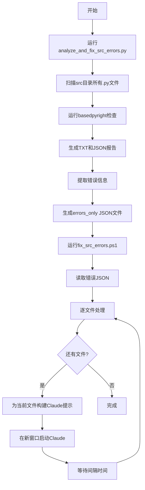

# Src文件夹BasedPyright错误分析与修复系统

## 概述

这套脚本系统用于自动分析src文件夹及其子文件夹中所有Python文件的basedpyright错误，并使用Claude批量修复这些错误。

## 文件说明

### Python脚本

#### `scripts/analyze_and_fix_src_errors.py`
主要分析脚本，功能包括：
- 扫描src目录下所有Python文件
- 运行basedpyright检查并生成详细报告
- 提取错误信息并转换为结构化JSON格式
- 生成适合批量修复的错误数据文件

**输出文件**：
- `results/basedpyright_src_check_YYYYMMDD_HHMMSS.txt` - 文本格式检查结果
- `results/basedpyright_src_check_YYYYMMDD_HHMMSS.json` - JSON格式检查结果
- `results/basedpyright_src_errors_only_YYYYMMDD_HHMMSS.json` - 仅错误信息的JSON文件

### PowerShell脚本

#### `fix_src_errors.ps1`
批量修复脚本，功能包括：
- 读取错误JSON文件
- 逐个文件调用Claude修复错误
- 显示详细的错误统计和进度
- 生成修复日志

**参数**：
- `-ErrorsFile` - 指定错误JSON文件路径（可选，默认使用最新的）
- `-IntervalSeconds` - 两次修复之间的间隔秒数（默认900秒=15分钟）
- `-AutoRun` - 自动运行，跳过确认提示

#### `run_analyze_and_fix_src.ps1`
一键运行脚本，整合分析和修复流程：
- 自动运行分析脚本
- 提取生成的错误文件
- 自动调用修复脚本
- 完整的流程日志记录

**参数**：
- `-IntervalSeconds` - 修复间隔秒数（默认900）
- `-SkipAnalysis` - 跳过分析步骤，直接修复
- `-ErrorsFile` - 指定已有的错误文件（与SkipAnalysis配合使用）

## 使用方法

### 方法一：一键运行（推荐）

最简单的方式，运行完整流程：

```powershell
.\basedpyright\run_analyze_and_fix_src.ps1
```

自定义修复间隔（例如5分钟）：

```powershell
.\basedpyright\run_analyze_and_fix_src.ps1 -IntervalSeconds 300
```

### 方法二：分步执行

#### 步骤1：运行分析

```bash
python basedpyright\scripts\analyze_and_fix_src_errors.py
```

或指定其他目录：

```bash
python basedpyright\scripts\analyze_and_fix_src_errors.py src/services
```

#### 步骤2：批量修复

使用最新的错误文件：

```powershell
.\basedpyright\fix_src_errors.ps1
```

或指定特定错误文件：

```powershell
.\basedpyright\fix_src_errors.ps1 -ErrorsFile "basedpyright\results\basedpyright_src_errors_only_20251109_143022.json"
```

自定义间隔时间（10分钟）：

```powershell
.\basedpyright\fix_src_errors.ps1 -IntervalSeconds 600
```

### 方法三：仅重新修复

如果已经有错误文件，只想重新修复：

```powershell
.\basedpyright\run_analyze_and_fix_src.ps1 -SkipAnalysis -ErrorsFile "basedpyright\results\basedpyright_src_errors_only_20251109_143022.json"
```

## 工作流程



## 输出文件结构

### 错误JSON文件格式

```json
{
  "metadata": {
    "source_file": "basedpyright/results/basedpyright_src_check_20251109_143022.txt",
    "extraction_time": "2025-11-09T14:30:25.123456",
    "total_files_with_errors": 15,
    "total_errors": 87,
    "source_type": "src_folder_errors"
  },
  "errors_by_file": [
    {
      "file": "src/services/crawl_service.py",
      "error_count": 12,
      "errors": [
        {
          "line": 123,
          "column": 45,
          "message": "无法将 \"None\" 类型的表达式赋值给 \"str\" 类型的参数",
          "rule": "reportArgumentType"
        }
      ],
      "errors_by_rule": {
        "reportArgumentType": 8,
        "reportOptionalMemberAccess": 4
      }
    }
  ]
}
```

## 日志文件

所有脚本都会生成详细的日志文件：

- `fix_src_errors_YYYYMMDD_HHMMSS.log` - 修复脚本日志
- `analyze_fix_src_YYYYMMDD_HHMMSS.log` - 完整流程日志

日志包含：
- 时间戳
- 处理进度
- 错误详情
- Claude命令执行状态
- 异常堆栈跟踪

## 配置说明

### 修复间隔时间

默认间隔为900秒（15分钟），建议根据以下因素调整：

- **文件复杂度高**：增加间隔（如1200-1800秒）
- **错误数量少**：减少间隔（如600秒）
- **需要快速处理**：使用最小间隔（如300秒）

### Claude命令参数

脚本使用 `--dangerously-skip-permissions` 参数跳过权限确认，确保批量处理流畅。

如需修改，编辑 `fix_src_errors.ps1` 中的：

```powershell
$commandStr = "claude --dangerously-skip-permissions '$escapedPrompt'"
```

## 注意事项

1. **确保安装basedpyright**：
   ```bash
   pip install basedpyright
   ```

2. **确保Claude CLI可用**：
   脚本需要调用 `claude` 命令

3. **文件编码**：
   - 所有脚本使用UTF-8编码
   - 避免使用UTF-8 BOM

4. **权限要求**：
   - PowerShell脚本需要执行权限
   - 如遇到执行策略限制，运行：
     ```powershell
     Set-ExecutionPolicy -Scope Process -ExecutionPolicy Bypass
     ```

5. **修复过程**：
   - 每个文件在独立的PowerShell窗口中处理
   - 窗口不会自动关闭，便于查看修复结果
   - 建议手动验证修复结果后再处理下一个

6. **中断恢复**：
   - 如果中断，可以使用 `-SkipAnalysis` 参数从断点继续
   - 已修复的文件不会重新处理（需手动从JSON中删除）

## 错误排查

### 找不到basedpyright命令

```bash
pip install basedpyright
# 或
pip install --upgrade basedpyright
```

### PowerShell编码问题

确保脚本顶部包含UTF-8编码设置：

```powershell
[Console]::OutputEncoding = [System.Text.Encoding]::UTF8
$OutputEncoding = [System.Text.Encoding]::UTF8
```

### Claude命令失败

检查：
- Claude CLI是否正确安装
- 网络连接是否正常
- API配置是否正确

## 最佳实践

1. **首次运行**：先对单个文件测试，确认流程正常
2. **备份代码**：修复前使用Git提交当前状态
3. **验证修复**：每次修复后检查代码逻辑是否正确
4. **批量处理**：非工作时间运行，利用间隔时间做其他任务
5. **日志审查**：定期检查日志文件，了解修复进展

## 示例输出

### 分析阶段输出

```
================================================================================
开始运行BasedPyright检查...
检查目录: src
================================================================================
找到 85 个Python文件
--------------------------------------------------------------------------------
运行文本格式检查...
✓ 文本结果已保存到: basedpyright\results\basedpyright_src_check_20251109_143022.txt
运行JSON格式检查...
✓ JSON结果已保存到: basedpyright\results\basedpyright_src_check_20251109_143022.json

================================================================================
检查完成统计:
--------------------------------------------------------------------------------
检查文件数: 85
错误 (Error): 87
警告 (Warning): 23
信息 (Information): 5
================================================================================
```

### 修复阶段输出

```
==========================================
处理文件 [1/15]: src/services/crawl_service.py
错误数量: 12
错误类型分布:
  - reportArgumentType: 8
  - reportOptionalMemberAccess: 4
==========================================
已启动新窗口 (进程ID: 12345)
Claude命令正在新窗口中执行
文件: src/services/crawl_service.py
等待 900 秒后处理下一个文件...
下次执行时间: 2025-11-09 14:45:30
```

## 支持与反馈

如遇到问题或有改进建议，请查看项目文档或联系开发团队。
