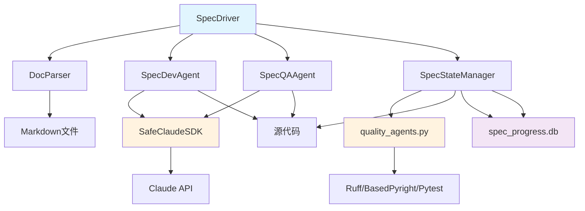

# Spec Automation Brownfield Enhancement Architecture

**文档版本**: v1.0
**创建日期**: 2026-01-09
**作者**: Winston (Architect)
**状态**: Draft

---

## 1. 项目分析与上下文

### 1.1 分析来源

- IDE-based fresh analysis
- 参考实现: `autoBMAD/epic_automation`
- PRD文档: `docs/prd-spec-automation.md`

### 1.2 现有项目状态

`autoBMAD/epic_automation` 是一个多代理工作流编排系统，用于 AI 驱动的敏捷开发：

- **EpicDriver**: 主编排器，协调整个工作流
- **DevAgent**: 处理开发任务，执行 TDD
- **QAAgent**: 执行质量审查和验证
- **SMAgent**: 创建和管理故事文档
- **QualityAgents**: 自动化代码质量检查（Ruff、BasedPyright、Pytest）

**关键依赖**: 当前系统严重依赖 `.bmad-core` 目录的任务指导文件。

### 1.3 可用文档

| 文档类型 | 状态 |
|---------|------|
| Tech Stack Documentation | ✓ Python, Claude SDK, SQLite |
| Source Tree/Architecture | ✓ 完整的模块结构 |
| Coding Standards | ✓ PEP 8, Type Hints |
| API Documentation | ✓ 模块级文档字符串 |
| README/SETUP | ✓ 完整 |

---

## 2. 增强范围定义

### 2.1 增强类型

- [x] New Feature Addition
- [ ] Major Feature Modification
- [ ] Integration with New Systems
- [ ] Performance/Scalability Improvements
- [ ] UI/UX Overhaul
- [ ] Technology Stack Upgrade
- [ ] Bug Fix and Stability Improvements

### 2.2 增强描述

创建全新的 `spec_automation` 工作流模块，用于处理非 Epic/Story 格式的规划文档（如 Sprint Change Proposal、Plan 文档、Spec 文档）。该模块不依赖 `.bmad-core`，采用独立的提示词系统，以文档为中心进行开发和审查。

### 2.3 影响评估

- [x] Minimal Impact (isolated additions)
- [ ] Moderate Impact (some existing code changes)
- [ ] Significant Impact (substantial existing code changes)
- [ ] Major Impact (architectural changes required)

**说明**: 这是一个独立的新模块，不修改现有 `epic_automation` 代码。

---

## 3. 目标与背景

### 3.1 目标

- 支持非 BMAD 格式的规划文档驱动开发
- 提供独立于 `.bmad-core` 的工作流系统
- 实现以文档为中心的 QA 审查机制
- 保持与现有质量门禁工具的兼容性
- 简化工作流，移除不必要的文档创建步骤

### 3.2 背景

现有的 `epic_automation` 模块专门针对 BMAD 方法论创建的 Epic/Story 文档。然而，许多开发场景使用不同格式的规划文档：

- **Sprint Change Proposal**: 详细的变更提案文档
- **Functional Spec**: 功能规格说明书
- **Technical Plan**: 技术实现计划

这些文档包含完整的需求、验收标准和实施步骤，但格式与 BMAD Story 不同。`spec_automation` 模块将填补这一空白。

---

## 4. 需求

### 4.1 功能需求

| ID | 需求描述 |
|----|---------|
| FR1 | 系统应能解析多种格式的规划文档（Markdown），提取需求、验收标准和实施步骤 |
| FR2 | SpecDevAgent 应使用 TDD 方法进行开发，确保测试覆盖率，最终通过全部测试 |
| FR3 | SpecQAAgent 应以文档为中心进行审查，验证源代码是否符合文档提及的全部需求 |
| FR4 | SpecDriver 应协调 Dev-QA 循环，直到所有验收标准满足 |
| FR5 | 系统应集成现有的 Ruff、BasedPyright、Pytest 质量门禁 |
| FR6 | 系统应支持文档状态追踪（Draft → In Progress → Review → Done） |
| FR7 | 系统应生成执行报告，记录开发和审查过程 |

### 4.2 非功能需求

| ID | 需求描述 |
|----|---------|
| NFR1 | 模块应完全独立，不依赖 `.bmad-core` 目录 |
| NFR2 | 应复用 `epic_automation` 的基础设施（SDK wrapper、session manager、state manager） |
| NFR3 | 代码应符合项目现有编码标准（PEP 8、Type Hints） |
| NFR4 | 应提供完整的日志记录，便于调试和监控 |
| NFR5 | 应支持 Windows 路径格式 |

### 4.3 兼容性需求

| ID | 需求描述 |
|----|---------|
| CR1 | 应与现有 `quality_agents.py` 模块兼容 |
| CR2 | 应使用相同的 Claude Agent SDK 集成模式 |
| CR3 | 应支持相同的状态管理机制 |
| CR4 | 应与现有日志系统集成 |
| CR5 | **状态解析器应保持一致** - 使用相同的 status_parser.py 模式 |

---

## 5. 技术约束与集成需求

### 5.1 现有技术栈

| 类别 | 技术 |
|------|------|
| **Languages** | Python 3.10+ |
| **Frameworks** | Claude Agent SDK, asyncio |
| **Database** | SQLite (状态管理) |
| **Tools** | Ruff, BasedPyright, Pytest |
| **External Dependencies** | anthropic, claude-agent-sdk |

### 5.2 集成方法

**SDK 集成策略**: 复用 `SafeClaudeSDK` 和 `SDKSessionManager` 从 `autoBMAD/epic_automation/sdk_wrapper.py` 和 `sdk_session_manager.py`

**测试集成策略**: 复用 `quality_agents.py` 中的 `RuffAgent`、`BasedpyrightAgent`、`PytestAgent`

**日志集成策略**: 复用 `log_manager.py`

**状态管理策略**: 创建独立的状态管理器实例，数据库文件为 `spec_progress.db`

**状态解析策略**: 使用 `status_parser.py` 相同的状态解析模式，确保状态一致性

### 5.3 代码组织

**文件结构**:
```
autoBMAD/spec_automation/
├── __init__.py                 # 包初始化
├── spec_driver.py              # 主编排器
├── spec_dev_agent.py           # 开发代理（TDD 聚焦）
├── spec_qa_agent.py            # QA 代理（文档中心审查）
├── doc_parser.py               # 文档解析器
├── prompts.py                  # 独立提示词定义
├── spec_state_manager.py       # 状态管理器（独立数据库）
├── status_parser.py            # 状态解析器（复用模式）
└── README.md                  # 模块文档
```

**命名规范**: 使用 `spec_` 前缀区分于 `epic_automation`

**编码标准**: PEP 8, Type Hints, Google-style docstrings

---

## 6. 变更日志

| 变更 | 日期 | 版本 | 描述 | 作者 |
|------|------|------|------|------|
| 初始创建 | 2026-01-09 | 1.0 | 棕地架构文档初稿 | Winston |

---

## 7. 增强范围与集成策略

### 7.1 增强概述

**增强类型**: 新功能模块添加
**范围**: 创建完整的 spec_automation 工作流系统
**集成影响**: 最小影响（隔离的新模块）

### 7.2 集成方法

**代码集成策略**: 复用现有基础设施，不修改 epic_automation 源代码
**数据库集成**: 使用独立的 spec_progress.db 数据库
**API 集成**: 无需修改现有 API，直接导入复用
**UI 集成**: 无 UI 组件，纯后端模块

### 7.3 兼容性要求

- **现有 API 兼容性**: 无需修改现有 API
- **数据库架构兼容性**: 使用独立的数据库，避免冲突
- **UI/UX 一致性**: 不适用（纯后端模块）
- **性能影响**: 最小影响（仅增加导入开销）

---

## 8. 技术栈

### 8.1 现有技术栈（需保持一致）

| 类别 | 当前技术 | 版本 | 增强中的用途 | 备注 |
|------|---------|------|-------------|------|
| Languages | Python | 3.10+ | 开发语言 | 保持一致 |
| Frameworks | Claude Agent SDK | latest | SDK 集成 | 通过 epic_automation 复用 |
| Database | SQLite | 3.x | 状态管理 | 独立数据库文件 |
| Tools | Ruff | 0.1.0+ | 代码质量检查 | 直接导入 quality_agents |
| Tools | Basedpyright | 1.1.0+ | 类型检查 | 直接导入 quality_agents |
| Tools | Pytest | 7.0.0+ | 测试执行 | 直接导入 quality_agents |
| External | anthropic | 0.7.0+ | Claude API | 通过 SafeClaudeSDK 复用 |
| External | claude-agent-sdk | latest | SDK 框架 | 通过 SafeClaudeSDK 复用 |

### 8.2 新技术添加

| 技术 | 版本 | 目的 | 理由 | 集成方法 |
|------|------|------|------|----------|
| 无 | - | - | 增强完全基于现有技术栈 | - |

---

## 9. 数据模型与架构变更

### 9.1 新数据模型

#### SpecDocument（规格文档）
**用途**: 表示解析后的规划文档
**集成**: 与现有数据模型无直接关系，独立工作

**关键属性**:
- title: str - 文档标题
- requirements: List[str] - 需求列表
- acceptance_criteria: List[str] - 验收标准
- implementation_steps: List[str] - 实施步骤

**关系**:
- **与现有**: 无直接关系
- **与新组件**: 被所有 spec_automation 组件使用

#### SpecExecution（执行记录）
**用途**: 跟踪 spec 文档的执行进度
**集成**: 与 epic_automation 模式保持一致

**关键属性**:
- document_path: str - 文档路径
- status: str - 执行状态
- iteration: int - 迭代次数
- qa_result: dict - QA 结果

**关系**:
- **与现有**: 状态管理机制与 epic_automation 一致
- **与新组件**: 被 SpecDriver 管理和更新

### 9.2 数据库架构

**数据库文件**: `autoBMAD/spec_automation/spec_progress.db`

**表结构**:
```sql
-- spec_documents 表
CREATE TABLE spec_documents (
    id INTEGER PRIMARY KEY AUTOINCREMENT,
    document_path TEXT NOT NULL UNIQUE,
    title TEXT NOT NULL,
    requirements TEXT, -- JSON
    acceptance_criteria TEXT, -- JSON
    implementation_steps TEXT, -- JSON
    created_at TIMESTAMP DEFAULT CURRENT_TIMESTAMP,
    updated_at TIMESTAMP DEFAULT CURRENT_TIMESTAMP
);

-- spec_executions 表
CREATE TABLE spec_executions (
    id INTEGER PRIMARY KEY AUTOINCREMENT,
    document_path TEXT NOT NULL,
    status TEXT NOT NULL,
    iteration INTEGER DEFAULT 0,
    qa_result TEXT, -- JSON
    error_message TEXT,
    created_at TIMESTAMP DEFAULT CURRENT_TIMESTAMP,
    updated_at TIMESTAMP DEFAULT CURRENT_TIMESTAMP,
    phase TEXT,
    version INTEGER DEFAULT 1,
    FOREIGN KEY (document_path) REFERENCES spec_documents(document_path)
);

-- 索引
CREATE INDEX idx_spec_executions_status ON spec_executions(status);
CREATE INDEX idx_spec_executions_document ON spec_executions(document_path);
```

**迁移策略**: 首次运行时自动创建数据库表

**向后兼容性**: 与 epic_automation 使用不同的数据库，无冲突

---

## 10. 组件架构

### 10.1 新组件

#### SpecDriver（主编排器）
**职责**: 协调 spec_automation 完整工作流
**集成点**: 导入并复用 epic_automation 的基础设施

**关键接口**:
- `execute_spec_document(document_path)` - 执行规格文档
- `run_dev_qa_cycle()` - 运行 Dev-QA 循环
- `execute_quality_gates()` - 执行质量门禁

**依赖**:
- **现有组件**: SafeClaudeSDK, SDKSessionManager, LogManager
- **新组件**: SpecDevAgent, SpecQAAgent, SpecStateManager

#### SpecDevAgent（TDD 聚焦开发代理）
**职责**: 基于规格文档进行测试驱动开发
**集成点**: 使用与 DevAgent 相同的 SDK 集成模式

**关键接口**:
- `implement_requirements(requirements, tests)` - 实现需求
- `write_tests_first()` - 先写测试
- `ensure_coverage()` - 确保覆盖率

**依赖**:
- **现有组件**: SafeClaudeSDK（通过 epic_automation 的复用）
- **新组件**: 独立的 prompts.py

#### SpecQAAgent（文档中心审查代理）
**职责**: 以文档为中心进行 QA 审查
**集成点**: 与 QAAgent 相同的审查模式

**关键接口**:
- `validate_against_document(document, code)` - 对照文档验证
- `verify_requirements()` - 验证需求实现
- `generate_report()` - 生成审查报告

**依赖**:
- **现有组件**: SafeClaudeSDK
- **新组件**: 独立的 prompts.py

#### DocParser（文档解析器）
**职责**: 解析多种格式的规划文档
**集成点**: 新组件，无外部依赖

**关键接口**:
- `parse_document(file_path)` - 解析文档
- `extract_requirements()` - 提取需求
- `extract_acceptance_criteria()` - 提取验收标准

**依赖**:
- **新组件**: 仅使用 Python 标准库

#### SpecStateManager（状态管理器）
**职责**: 管理 spec_automation 的状态（独立数据库）
**集成点**: 复用 StateManager 的模式，但使用独立数据库

**关键接口**:
- `update_execution_status()` - 更新执行状态
- `get_execution_status()` - 获取执行状态
- `track_iteration()` - 跟踪迭代

**依赖**:
- **现有组件**: StateManager 的代码模式
- **新组件**: 独立的 spec_progress.db

### 10.2 组件交互图



---

## 11. API 设计与集成

### 11.1 API 集成策略

**API 集成策略**: 复用现有 API，不创建新 API
**认证**: 与 epic_automation 相同（Claude API Key）
**版本控制**: 不适用（纯导入复用）

### 11.2 新 API 端点

无新 API 端点。spec_automation 是库模块，不提供 HTTP API。

### 11.3 内部接口

#### SpecDriver 主接口

**`execute_spec_document(document_path: str) -> dict`**
- **方法**: POST 风格（内部调用）
- **端点**: 内部方法
- **用途**: 执行完整的规格文档工作流
- **集成**: 无外部 API，纯内部调用

```python
# 请求架构
{
    "document_path": "docs/specs/my-spec.md"
}

# 响应架构
{
    "status": "completed",
    "iterations": 3,
    "qa_result": {
        "pass": True,
        "score": 95,
        "issues": []
    },
    "quality_gates": {
        "ruff": {"passed": True, "issues": 0},
        "basedpyright": {"passed": True, "issues": 0},
        "pytest": {"passed": True, "tests": 15}
    }
}
```

---

## 12. 源码结构

### 12.1 现有项目结构（相关部分）

```
autoBMAD/
├── epic_automation/              # 现有模块
│   ├── epic_driver.py
│   ├── dev_agent.py
│   ├── qa_agent.py
│   ├── sm_agent.py
│   ├── sdk_wrapper.py           # 复用 SafeClaudeSDK
│   ├── sdk_session_manager.py    # 复用 SDKSessionManager
│   ├── state_manager.py          # 复用模式
│   ├── log_manager.py            # 复用 LogManager
│   ├── quality_agents.py         # 复用 RuffAgent 等
│   ├── status_parser.py          # 保持一致性
│   └── progress.db              # 独立数据库
```

### 12.2 新文件组织

```
autoBMAD/
├── spec_automation/             # 新模块
│   ├── __init__.py
│   ├── spec_driver.py          # 主编排器
│   ├── spec_dev_agent.py        # TDD 开发代理
│   ├── spec_qa_agent.py         # QA 审查代理
│   ├── doc_parser.py            # 文档解析器
│   ├── spec_state_manager.py    # 独立状态管理器
│   ├── status_parser.py         # 状态解析器（复用模式）
│   ├── prompts.py               # 独立提示词
│   ├── spec_progress.db         # 独立数据库
│   └── README.md
```

### 12.3 集成指南

- **文件命名**: 遵循现有命名规范（snake_case）
- **文件夹组织**: 遵循 epic_automation 的结构模式
- **导入/导出模式**: 遵循现有导入模式（标准库 → 第三方 → 本地）

---

## 13. 基础设施与部署集成

### 13.1 现有基础设施

**当前部署**: 无需部署（纯库模块）
**基础设施工具**: 无（复用现有工具）
**环境**: 开发环境 + 生产环境

### 13.2 增强部署策略

**部署方法**: 随项目一起部署，无需额外配置
**基础设施变更**: 无需变更
**管道集成**: 复用现有的 CI/CD 管道

### 13.3 回滚策略

**回滚方法**: 通过版本控制回滚 spec_automation 文件
**风险缓解**: 独立的数据库和模块，最小风险
**监控**: 复用现有的日志系统

---

## 14. 编码标准

### 14.1 现有标准合规

**代码风格**: 与 epic_automation 保持一致（PEP 8）
**Linting 规则**: 使用相同的 ruff 配置
**测试模式**: 遵循相同的 pytest 模式
**文档风格**: Google-style docstrings

### 14.2 增强特定标准

- **命名规范**: 所有组件使用 `spec_` 前缀
- **数据库操作**: 使用与 StateManager 相同的模式
- **错误处理**: 遵循相同的错误处理策略
- **日志记录**: 复用 LogManager 模式

### 14.3 关键集成规则

- **现有 API 兼容性**: 所有公共接口保持不变
- **数据库集成**: 使用独立数据库，避免冲突
- **错误处理**: 与现有系统保持一致
- **日志一致性**: 使用相同的日志格式和级别

---

## 15. 测试策略

### 15.1 与现有测试集成

**现有测试框架**: pytest
**测试组织**: 遵循现有的测试组织模式
**覆盖率要求**: 与 epic_automation 相同（> 80%）

### 15.2 新测试要求

#### 新组件单元测试
- **框架**: pytest
- **位置**: tests/unit/test_spec_*.py
- **覆盖率目标**: > 80%
- **集成**: 与现有测试框架集成

#### 集成测试
- **范围**: 测试完整的工作流
- **现有系统验证**: 确保不破坏 epic_automation
- **新功能测试**: 测试 spec_automation 完整流程

#### 回归测试
- **现有功能验证**: 确保 epic_automation 不受影响
- **自动化回归套件**: 复用现有回归测试
- **手动测试要求**: 验证集成点

---

## 16. 安全集成

### 16.1 现有安全措施

**认证**: Claude API Key 管理
**授权**: 与 epic_automation 相同
**数据保护**: SQLite 数据库保护
**安全工具**: 复用现有安全检查

### 16.2 增强安全要求

**新安全措施**: 无（复用现有安全框架）
**集成点**: 使用相同的安全集成点
**合规要求**: 与 epic_automation 相同

### 16.3 安全测试

**现有安全测试**: 复用现有安全测试
**新安全测试要求**: 无
**渗透测试**: 不需要（纯后端库模块）

---

## 17. 架构决策记录

### ADR-001: 独立模块 vs 扩展 epic_automation

**状态**: 已接受
**背景**: 需要添加 spec_automation 功能

**决策**: 创建独立的 spec_automation 模块
**理由**:
- spec_automation 与 epic_automation 用途不同
- 避免代码库复杂化
- 允许独立开发和发展
- 最小化对现有系统的影响

**后果**:
- 需要维护两个模块
- 需要复用基础设施代码
- 保持 API 一致性

### ADR-002: 独立数据库 vs 共享数据库

**状态**: 已接受
**背景**: spec_automation 需要状态管理

**决策**: 使用独立的 spec_progress.db 数据库
**理由**:
- 避免数据冲突
- 简化状态管理
- 允许独立维护
- 保持与 epic_automation 的分离

**后果**:
- 需要管理两个数据库文件
- 需要独立的状态管理器
- 更好的隔离性

### ADR-003: 基础设施复用策略

**状态**: 已接受
**背景**: 避免重复造轮子

**决策**: 直接导入复用 epic_automation 的基础设施
**理由**:
- 减少代码重复
- 保持技术一致性
- 简化维护工作
- 利用已验证的代码

**后果**:
- epic_automation 变更可能影响 spec_automation
- 需要版本兼容性管理
- 更好的代码复用

---

## 18. 下一步行动

### 18.1 与现有系统集成点

1. **Review integration points with existing system**
   - 验证 SafeClaudeSDK 集成
   - 确认 StateManager 模式复用
   - 检查 quality_agents.py 兼容性

2. **Begin story implementation with Dev agent**
   - Story 1.1: 创建模块基础结构和文档解析器
   - 使用相同的开发标准
   - 遵循现有代码模式

3. **Set up deployment pipeline integration**
   - 复用现有的 CI/CD 管道
   - 确保测试覆盖
   - 集成到现有构建过程

4. **Plan rollback and monitoring procedures**
   - 准备回滚计划
   - 设置监控
   - 定义故障恢复流程

### 18.2 Story Manager 交接

**参考**: 本架构文档
**关键集成需求**:
- 复用 epic_automation 基础设施
- 使用独立数据库 spec_progress.db
- 保持状态解析器一致性

**现有系统约束**:
- 不可修改 epic_automation 源代码
- 必须保持 API 兼容性
- 遵循现有编码标准

**首个故事**: Story 1.1 - 创建模块基础结构和文档解析器
**集成检查点**:
- DocParser 能正确解析 Markdown 文档
- 独立数据库创建成功
- 基础结构符合编码标准

### 18.3 开发者交接

**参考**: 本架构文档和现有 epic_automation 代码
**集成要求**:
- 直接导入 SafeClaudeSDK、SDKSessionManager 等
- 使用 quality_agents.py 中的工具
- 遵循状态管理器模式

**关键技术决策**:
- 独立模块架构（已验证）
- 独立数据库策略（已验证）
- 基础设施复用方法（已验证）

**现有系统兼容性要求**:
- 不影响 epic_automation 运行
- 保持 API 不变
- 遵循相同的安全标准

**实施序列**:
1. 创建基础目录结构
2. 实现 DocParser
3. 实现 SpecStateManager
4. 实现 SpecDevAgent
5. 实现 SpecQAAgent
6. 实现 SpecDriver
7. 集成测试

**重要提醒**:
- 所有组件必须使用 `spec_` 前缀
- 必须使用独立的数据库文件
- 必须保持与 status_parser.py 的一致性
- 遵循现有代码的所有模式和约定
