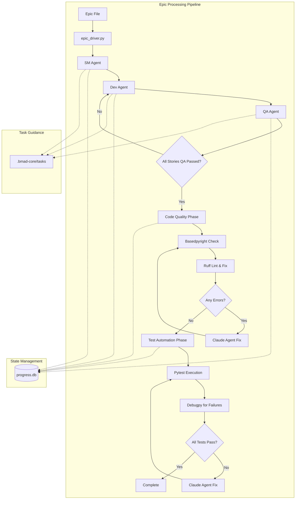
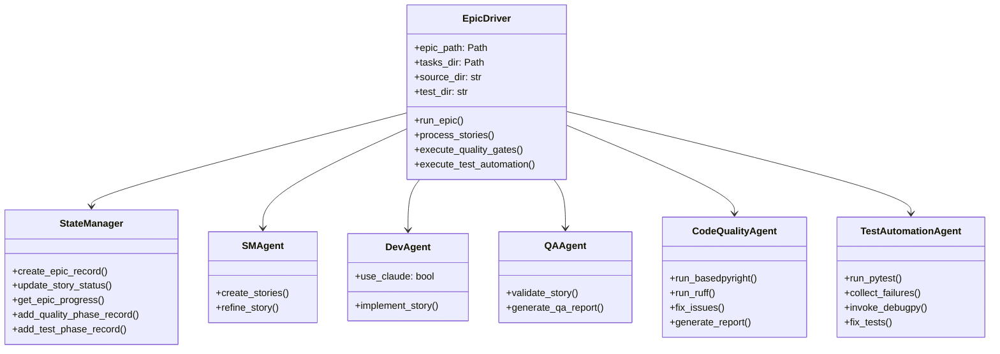
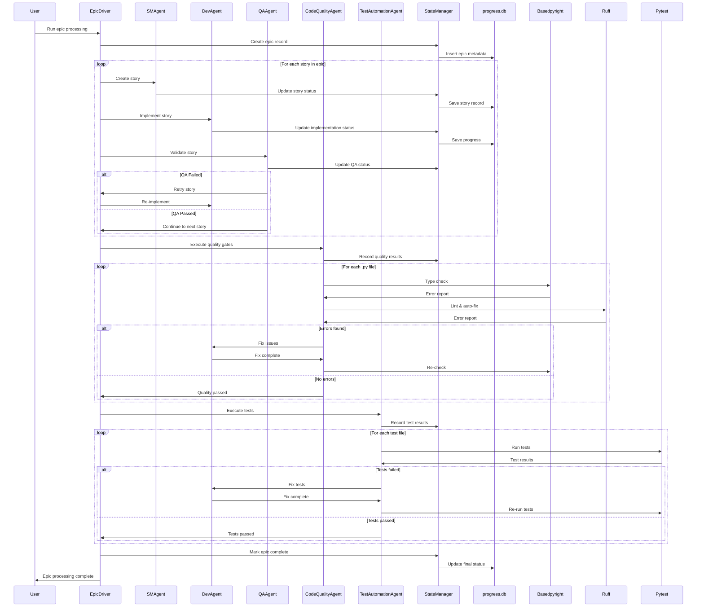
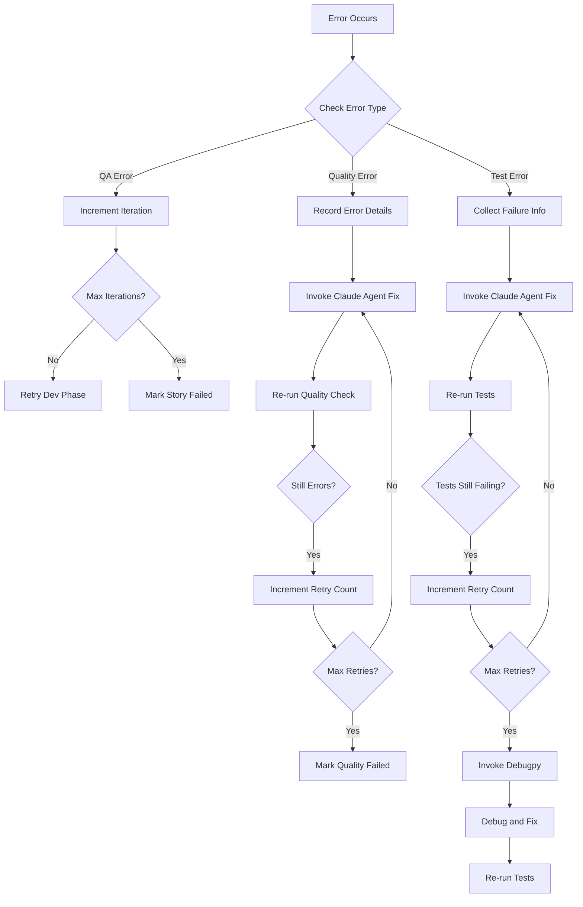

# autoBMAD Epic Automation System Architecture

**Version**: 2.0
**Date**: 2026-01-05
**Project**: Integration of Code Quality and Test Automation into autoBMAD

---

## 1. Introduction

This document outlines the complete architecture for the autoBMAD epic automation system, including the integration of basedpyright-workflow and fixtest-workflow functionality. The system is a self-contained Python automation tool that processes epic markdown files through an automated SM-Dev-QA cycle, enhanced with automated code quality checks and test execution.

### 1.1 Project Overview

**Current System State**:
autoBMAD/epic_automation is a self-contained Python automation system that processes epic markdown files through an automated SM-Dev-QA cycle. The enhancement adds two additional workflow phases: code quality validation and test automation, creating a unified quality assurance pipeline.

### 1.2 Change Log

| Date | Version | Description | Author |
|------|---------|-------------|--------|
| 2026-01-05 | 2.0 | Complete architecture for code quality and test automation integration | Architect |

---

## 2. High Level Architecture

### 2.1 Technical Summary

The autoBMAD epic automation system follows a **Layered Orchestration Architecture** pattern, where the epic_driver.py acts as the central orchestrator managing sequential workflow phases. The system extends from a three-phase SM-Dev-QA cycle to a five-phase pipeline: Story Creation → Development → QA Validation → Code Quality Checks → Test Automation.

**Frontend**: CLI-based command-line interface with argparse for option parsing
**Backend**: Python automation engine with SQLite-based state management
**Integration Points**: Seamless integration with basedpyright, ruff, pytest, and debugpy through native dependencies
**Infrastructure**: Self-contained Python package with virtual environment support

### 2.2 Platform and Infrastructure Choice

**Platform**: Standalone Python CLI Tool
**Key Dependencies**: basedpyright, ruff, pytest, debugpy, SQLite
**Execution Environment**: Python 3.8+ with virtual environment (venv)
**Storage**: SQLite database (progress.db) for state management

### 2.3 Repository Structure

**Structure**: Monorepo with three main components
**autoBMAD Package**: Contains epic automation system
**BasedPyright-Workflow**: Integrated as native dependency
**Fixtest-Workflow**: Integrated as native dependency
**Package Organization**: Self-contained modules with clear separation of concerns

### 2.4 Architecture Diagram



### 2.5 Architectural Patterns

- **Orchestrator Pattern**: epic_driver.py coordinates all workflow phases
- **Agent-Based Architecture**: Separate agents for SM, Dev, QA, Code Quality, and Test Automation
- **State Management Pattern**: SQLite-based persistent state tracking
- **Retry Pattern**: Configurable retry logic for failed operations
- **Pipeline Pattern**: Sequential workflow phases with error handling
- **Quality Gate Pattern**: Post-development validation checkpoints

---

## 3. Tech Stack

### 3.1 Technology Stack Table

| Category | Technology | Version | Purpose | Rationale |
|----------|------------|---------|---------|-----------|
| **Core Language** | Python | 3.8+ | Primary development language | Wide adoption, extensive library ecosystem |
| **CLI Framework** | argparse | Built-in | Command-line interface parsing | Standard library, no external dependencies |
| **Async Framework** | asyncio | Built-in | Concurrent story processing | Built-in async support for experimental concurrency |
| **Database** | SQLite | 3.x | State management | Self-contained, zero-configuration, persistent storage |
| **State Management** | Custom ORM | N/A | Progress tracking | Lightweight, tailored to epic automation needs |
| **Code Quality** | basedpyright | Latest | Type checking | Enhanced Pyright with better Python support |
| **Code Quality** | ruff | Latest | Linting & auto-fix | Extremely fast, comprehensive linting |
| **Testing** | pytest | Latest | Test execution framework | Industry standard, extensive plugin ecosystem |
| **Debugging** | debugpy | Latest | Test failure diagnosis | Remote debugging capabilities |
| **Virtual Environment** | venv | Built-in | Dependency isolation | Standard library, cross-platform |
| **Logging** | logging | Built-in | System logging | Standard library, configurable levels |
| **Path Handling** | pathlib | Built-in | Cross-platform path operations | Modern, object-oriented path handling |

### 3.2 Development Dependencies

| Tool | Version | Purpose |
|------|---------|---------|
| Claude SDK | Latest | AI agent integration for automated fixes |
| pip | Latest | Package management |
| virtualenv/venv | Built-in | Environment isolation |

---

## 4. System Components

### 4.1 Component List

#### epic_driver.py
**Responsibility**: Central orchestrator for the complete workflow pipeline
**Key Interfaces**:
- CLI argument parsing
- Workflow phase coordination
- State manager integration
- Error handling and retry logic
**Dependencies**: All agents, state_manager, task_guidance
**Technology Stack**: Python asyncio, argparse, logging

#### sm_agent.py (Story Master Agent)
**Responsibility**: Create and refine story documents from epic
**Key Interfaces**:
- Story document generation
- Task guidance integration
- Progress reporting
**Dependencies**: task_guidance, state_manager
**Technology Stack**: Python file I/O, markdown processing

#### dev_agent.py (Development Agent)
**Responsibility**: Implement story features using Claude Code CLI
**Key Interfaces**:
- Claude Code CLI integration
- Source code generation
- Feature implementation
**Dependencies**: Claude SDK, task_guidance, state_manager
**Technology Stack**: Python subprocess, Claude SDK

#### qa_agent.py (Quality Assurance Agent)
**Responsibility**: Validate completed stories against acceptance criteria
**Key Interfaces**:
- Acceptance criteria evaluation
- QA report generation
- Retry decision logic
**Dependencies**: task_guidance, state_manager
**Technology Stack**: Python validation logic, file analysis

#### state_manager.py
**Responsibility**: Manage persistent state across workflow phases
**Key Interfaces**:
- Database operations (CRUD)
- Progress tracking
- Schema migration
**Dependencies**: SQLite, database schema
**Technology Stack**: SQLite3, custom ORM

#### code_quality_agent.py (NEW)
**Responsibility**: Orchestrate basedpyright and ruff quality checks
**Key Interfaces**:
- Basedpyright execution
- Ruff linting and auto-fix
- Error collection and reporting
- Claude agent integration for fixes
**Dependencies**: basedpyright, ruff, state_manager, Claude SDK
**Technology Stack**: Python subprocess, JSON parsing, basedpyright API

#### test_automation_agent.py (NEW)
**Responsibility**: Execute pytest and manage test failures
**Key Interfaces**:
- Pytest execution
- Failure collection
- Debugpy integration
- Claude agent fix invocation
**Dependencies**: pytest, debugpy, state_manager, Claude SDK
**Technology Stack**: Python subprocess, JSON parsing, pytest API

### 4.2 Component Diagrams



---

## 5. Data Models

### 5.1 Epic Model

**Purpose**: Track epic-level processing state and metadata

**Key Attributes**:
- epic_id: UUID - Unique identifier for the epic
- file_path: str - Path to the epic markdown file
- status: str - Current processing status (pending, in_progress, completed, failed)
- created_at: datetime - When the epic was first created
- updated_at: datetime - Last update timestamp
- total_stories: int - Total number of stories in the epic
- completed_stories: int - Number of stories that passed QA
- quality_phase_status: str - Code quality gate status
- test_phase_status: str - Test automation gate status

**TypeScript Interface**:
```typescript
interface Epic {
    epicId: string;
    filePath: string;
    status: 'pending' | 'in_progress' | 'completed' | 'failed';
    createdAt: string;
    updatedAt: string;
    totalStories: number;
    completedStories: number;
    qualityPhaseStatus: 'pending' | 'in_progress' | 'passed' | 'failed';
    testPhaseStatus: 'pending' | 'in_progress' | 'passed' | 'failed';
}
```

**Relationships**:
- One epic has many stories
- One epic has one quality phase record
- One epic has many test phase records

### 5.2 Story Model

**Purpose**: Track individual story processing state

**Key Attributes**:
- story_id: UUID - Unique identifier for the story
- epic_id: UUID - Reference to parent epic
- title: str - Story title
- status: str - Current processing status
- iteration_count: int - Number of retry attempts
- acceptance_criteria: str - Story acceptance criteria
- implementation_notes: str - Development notes
- qa_result: str - QA validation result
- created_at: datetime - Story creation timestamp
- completed_at: datetime - Story completion timestamp

**TypeScript Interface**:
```typescript
interface Story {
    storyId: string;
    epicId: string;
    title: string;
    status: 'pending' | 'in_progress' | 'qa_failed' | 'completed' | 'failed';
    iterationCount: number;
    acceptanceCriteria: string;
    implementationNotes?: string;
    qaResult?: string;
    createdAt: string;
    completedAt?: string;
}
```

**Relationships**:
- Many stories belong to one epic
- One story has one epic reference

### 5.3 Quality Phase Model

**Purpose**: Track code quality gate execution results

**Key Attributes**:
- record_id: UUID - Unique identifier
- epic_id: UUID - Reference to parent epic
- file_path: str - Python file being checked
- error_count: int - Number of errors found
- fix_status: str - Fix attempt status
- basedpyright_errors: str - Basedpyright error details (JSON)
- ruff_errors: str - Ruff error details (JSON)
- timestamp: datetime - When this record was created

**TypeScript Interface**:
```typescript
interface QualityPhaseRecord {
    recordId: string;
    epicId: string;
    filePath: string;
    errorCount: number;
    fixStatus: 'pending' | 'fixed' | 'failed' | 'waived';
    basedpyrightErrors?: string;
    ruffErrors?: string;
    timestamp: string;
}
```

**Relationships**:
- Many quality phase records belong to one epic

### 5.4 Test Phase Model

**Purpose**: Track test automation execution results

**Key Attributes**:
- record_id: UUID - Unique identifier
- epic_id: UUID - Reference to parent epic
- test_file_path: str - Test file being executed
- failure_count: int - Number of test failures
- fix_status: str - Fix attempt status
- debug_info: str - Debugpy output (JSON)
- timestamp: datetime - When this record was created

**TypeScript Interface**:
```typescript
interface TestPhaseRecord {
    recordId: string;
    epicId: string;
    testFilePath: string;
    failureCount: number;
    fixStatus: 'pending' | 'fixed' | 'failed';
    debugInfo?: string;
    timestamp: string;
}
```

**Relationships**:
- Many test phase records belong to one epic

---

## 6. Workflow Phases

### 6.1 Complete Workflow Sequence



---

## 7. Database Schema

### 7.1 Schema Design

```sql
-- Epic processing table (existing)
CREATE TABLE epic_processing (
    epic_id TEXT PRIMARY KEY,
    file_path TEXT NOT NULL,
    status TEXT NOT NULL,
    created_at TIMESTAMP DEFAULT CURRENT_TIMESTAMP,
    updated_at TIMESTAMP DEFAULT CURRENT_TIMESTAMP,
    total_stories INTEGER DEFAULT 0,
    completed_stories INTEGER DEFAULT 0,
    quality_phase_status TEXT DEFAULT 'pending',
    test_phase_status TEXT DEFAULT 'pending'
);

-- Story processing table (existing)
CREATE TABLE story_processing (
    story_id TEXT PRIMARY KEY,
    epic_id TEXT NOT NULL,
    title TEXT NOT NULL,
    status TEXT NOT NULL,
    iteration_count INTEGER DEFAULT 0,
    acceptance_criteria TEXT,
    implementation_notes TEXT,
    qa_result TEXT,
    created_at TIMESTAMP DEFAULT CURRENT_TIMESTAMP,
    completed_at TIMESTAMP,
    FOREIGN KEY (epic_id) REFERENCES epic_processing(epic_id)
);

-- Code quality phase table (NEW)
CREATE TABLE code_quality_phase (
    record_id TEXT PRIMARY KEY,
    epic_id TEXT NOT NULL,
    file_path TEXT NOT NULL,
    error_count INTEGER DEFAULT 0,
    fix_status TEXT DEFAULT 'pending',
    basedpyright_errors TEXT,
    ruff_errors TEXT,
    timestamp TIMESTAMP DEFAULT CURRENT_TIMESTAMP,
    FOREIGN KEY (epic_id) REFERENCES epic_processing(epic_id)
);

-- Test automation phase table (NEW)
CREATE TABLE test_automation_phase (
    record_id TEXT PRIMARY KEY,
    epic_id TEXT NOT NULL,
    test_file_path TEXT NOT NULL,
    failure_count INTEGER DEFAULT 0,
    fix_status TEXT DEFAULT 'pending',
    debug_info TEXT,
    timestamp TIMESTAMP DEFAULT CURRENT_TIMESTAMP,
    FOREIGN KEY (epic_id) REFERENCES epic_processing(epic_id)
);

-- Indexes for performance
CREATE INDEX idx_epic_status ON epic_processing(status);
CREATE INDEX idx_story_epic ON story_processing(epic_id);
CREATE INDEX idx_quality_epic ON code_quality_phase(epic_id);
CREATE INDEX idx_test_epic ON test_automation_phase(epic_id);
```

### 7.2 Data Access Layer

```python
class StateManager:
    """Manages database operations for epic automation state."""

    def create_epic_record(self, epic_path: str) -> str:
        """Create new epic record and return epic_id."""
        pass

    def update_story_status(self, story_id: str, status: str, **kwargs):
        """Update story processing status."""
        pass

    def get_epic_progress(self, epic_id: str) -> dict:
        """Retrieve complete epic progress."""
        pass

    def add_quality_phase_record(self, epic_id: str, file_path: str,
                                 error_count: int, fix_status: str,
                                 basedpyright_errors: str = None,
                                 ruff_errors: str = None) -> str:
        """Add code quality phase record."""
        pass

    def add_test_phase_record(self, epic_id: str, test_file_path: str,
                              failure_count: int, fix_status: str,
                              debug_info: str = None) -> str:
        """Add test automation phase record."""
        pass
```

---

## 8. Code Quality Integration

### 8.1 Basedpyright Integration

**Implementation Strategy**:
- Integrate basedpyright as a native dependency
- Create CodeQualityAgent wrapper for execution
- Generate JSON error reports for each .py file
- Automatically invoke Claude agents to fix issues
- Repeat checks until zero errors or max iterations reached

**Basedpyright Workflow**:
```python
async def run_basedpyright_check(self, source_dir: str) -> List[Dict]:
    """Execute basedpyright on all Python files."""
    process = await asyncio.create_subprocess_exec(
        'basedpyright', '--outputjson', '--level', 'error',
        source_dir,
        stdout=asyncio.subprocess.PIPE,
        stderr=asyncio.subprocess.PIPE
    )
    stdout, stderr = await process.communicate()
    return json.loads(stdout)
```

### 8.2 Ruff Integration

**Implementation Strategy**:
- Integrate ruff as a native dependency
- Execute with --fix flag for automatic corrections
- Collect remaining errors in JSON format
- Invoke Claude agents for unfixable issues
- Track fix success rate

**Ruff Workflow**:
```python
async def run_ruff_check(self, source_dir: str) -> Dict:
    """Execute ruff linting with auto-fix."""
    # Run ruff with auto-fix
    process = await asyncio.create_subprocess_exec(
        'ruff', 'check', '--output-format', 'json', '--fix',
        source_dir,
        stdout=asyncio.subprocess.PIPE,
        stderr=asyncio.subprocess.PIPE
    )
    stdout, stderr = await process.communicate()
    return json.loads(stdout) if stdout else {}
```

---

## 9. Test Automation Integration

### 9.1 Pytest Integration

**Implementation Strategy**:
- Integrate pytest as a native dependency
- Execute all tests in test_dir
- Collect failed/errored test information
- Generate JSON summary reports
- Re-execute after each fix attempt

**Pytest Workflow**:
```python
async def run_pytest_execution(self, test_dir: str) -> Dict:
    """Execute pytest and collect results."""
    process = await asyncio.create_subprocess_exec(
        'pytest', test_dir, '--tb=short', '--json-report',
        '--json-report-file=test_results.json',
        stdout=asyncio.subprocess.PIPE,
        stderr=asyncio.subprocess.PIPE
    )
    stdout, stderr = await process.communicate()

    # Parse JSON report
    with open('test_results.json', 'r') as f:
        results = json.load(f)

    return results
```

### 9.2 Debugpy Integration

**Implementation Strategy**:
- Invoke debugpy for persistent test failures
- Provide test file path, error details, and debug info
- Integrate with Claude agents for intelligent debugging
- Use timeout controls to prevent hanging

**Debugpy Workflow**:
```python
async def invoke_debugpy(self, test_file: str, error_info: Dict) -> str:
    """Invoke debugpy for persistent test failures."""
    # Generate debug script with error context
    debug_script = f"""
import debugpy
debugpy.listen(('localhost', 5678))
debugpy.wait_for_client()

# Run test with error context
# Error: {error_info}
pytest.main(['{test_file}', '-v'])
"""
    # Save and execute debug script
    # Return debug session results
```

---

## 10. Error Handling Strategy

### 10.1 Error Flow



### 10.2 Error Response Format

```python
class ErrorReport:
    """Standardized error reporting across all phases."""

    def __init__(self, error_type: str, phase: str,
                 epic_id: str, story_id: str = None):
        self.error_id = str(uuid.uuid4())
        self.error_type = error_type
        self.phase = phase
        self.epic_id = epic_id
        self.story_id = story_id
        self.timestamp = datetime.utcnow().isoformat()
        self.details = {}

    def add_detail(self, key: str, value: Any):
        """Add error detail."""
        self.details[key] = value

    def to_dict(self) -> Dict:
        """Convert to dictionary for JSON serialization."""
        return {
            'error_id': self.error_id,
            'error_type': self.error_type,
            'phase': self.phase,
            'epic_id': self.epic_id,
            'story_id': self.story_id,
            'timestamp': self.timestamp,
            'details': self.details
        }
```

---

## 11. Configuration Management

### 11.1 CLI Configuration

```python
def parse_arguments():
    """Parse command-line arguments."""
    parser = argparse.ArgumentParser(
        description='autoBMAD Epic Automation System'
    )

    parser.add_argument('epic_path', help='Path to epic markdown file')

    # Existing options
    parser.add_argument('--max-iterations', type=int, default=3,
                        help='Maximum retry attempts')
    parser.add_argument('--retry-failed', action='store_true',
                        help='Enable automatic retry of failed stories')
    parser.add_argument('--verbose', action='store_true',
                        help='Enable detailed logging')
    parser.add_argument('--concurrent', action='store_true',
                        help='Process stories in parallel')

    # Quality gate options
    parser.add_argument('--skip-quality', action='store_true',
                        help='Skip code quality checks')
    parser.add_argument('--skip-tests', action='store_true',
                        help='Skip test automation')

    # Directory options
    parser.add_argument('--source-dir', default='src',
                        help='Source code directory')
    parser.add_argument('--test-dir', default='tests',
                        help='Test directory')

    return parser.parse_args()
```

### 11.2 Quality Gate Configuration

```python
class QualityGateConfig:
    """Configuration for quality gates."""

    def __init__(self):
        self.basedpyright_strict = True
        self.ruff_auto_fix = True
        self.max_quality_retries = 3
        self.max_test_retries = 5
        self.debugpy_timeout = 300  # 5 minutes
        self.quality_gate_enabled = True
        self.test_gate_enabled = True
```

---

## 12. Performance Considerations

### 12.1 Optimization Strategies

**Concurrent Processing**:
- Enable parallel story processing when --concurrent flag is used
- Use asyncio.gather() for concurrent quality checks
- Implement connection pooling for database operations

**Lazy Loading**:
- Load task guidance files on-demand
- Defer quality checks until after QA completion
- Cache basedpyright and ruff results when possible

**Resource Management**:
- Set timeout for debugpy sessions
- Limit concurrent quality checks to prevent system overload
- Clean up temporary files after processing

### 12.2 Performance Targets

| Phase | Target Time | Max Time |
|-------|-------------|----------|
| Story Creation | < 1 min/story | 5 min |
| Development | Variable | N/A |
| QA Validation | < 30 sec/story | 2 min |
| Code Quality | < 30 sec/.py file | 10 sec/.py file |
| Test Automation | < 5 min/test suite | 15 min |
| Total Epic | < 30 min (typical) | 60 min |

---

## 13. Security Considerations

### 13.1 Security Requirements

**Input Validation**:
- Validate epic file paths to prevent directory traversal
- Sanitize file paths in quality and test phases
- Validate JSON inputs from basedpyright and pytest

**Execution Security**:
- Run quality checks in isolated subprocesses
- Use timeout controls for all external commands
- Validate Claude agent responses before execution

**Database Security**:
- Use parameterized queries to prevent SQL injection
- Validate all inputs before database operations
- Implement database backup before schema changes

**Environment Isolation**:
- Require virtual environment activation
- Validate dependencies before execution
- Log all environment configuration

### 13.2 Data Protection

**Progress Database**:
- Store only necessary metadata in progress.db
- Encrypt sensitive information if needed
- Implement database rotation for long-running processes

**Log Files**:
- Redact sensitive information in logs
- Implement log rotation to prevent disk space issues
- Secure log file permissions

---

## 14. Monitoring and Observability

### 14.1 Logging Strategy

**Log Levels**:
- ERROR: All errors and failures
- WARNING: Retry attempts and warnings
- INFO: Phase transitions and progress
- DEBUG: Detailed execution information (--verbose)

**Log Format**:
```
%(asctime)s - %(name)s - %(levelname)s - %(message)s
```

**Key Metrics**:
- Stories processed per minute
- QA failure rate
- Quality gate pass rate
- Test execution success rate
- Average time per phase

### 14.2 Progress Reporting

```python
class ProgressReporter:
    """Reports progress across workflow phases."""

    def report_epic_start(self, epic_id: str, total_stories: int):
        """Report epic processing started."""

    def report_story_progress(self, story_id: str, phase: str, status: str):
        """Report story phase progress."""

    def report_quality_phase(self, epic_id: str, file_count: int,
                            error_count: int, fix_status: str):
        """Report code quality phase results."""

    def report_test_phase(self, epic_id: str, test_count: int,
                         failure_count: int, pass_rate: float):
        """Report test automation results."""

    def report_epic_complete(self, epic_id: str, total_time: float,
                            final_status: str):
        """Report epic processing complete."""
```

---

## 15. Testing Strategy

### 15.1 Testing Approach

**Unit Tests**:
- Test state_manager database operations
- Test argument parsing
- Test error handling logic
- Test progress reporting

**Integration Tests**:
- Test complete SM-Dev-QA cycle
- Test quality gate integration
- Test test automation workflow
- Test retry mechanisms

**End-to-End Tests**:
- Test complete epic processing pipeline
- Test error recovery scenarios
- Test concurrent processing mode
- Test database schema migration

### 15.2 Test Organization

```
tests/
├── unit/
│   ├── test_state_manager.py
│   ├── test_epic_driver.py
│   ├── test_agents/
│   └── test_utils.py
├── integration/
│   ├── test_sm_dev_qa_cycle.py
│   ├── test_quality_gates.py
│   └── test_test_automation.py
├── e2e/
│   ├── test_complete_epic.py
│   └── test_error_recovery.py
└── fixtures/
    ├── sample_epic.md
    ├── sample_stories/
    └── test_data/
```

---

## 16. Deployment Architecture

### 16.1 Deployment Strategy

**Package Distribution**:
- Self-contained Python package
- All dependencies bundled via pip requirements.txt
- No external workflow installations required

**Installation**:
```bash
pip install -r requirements.txt
```

**Requirements.txt**:
```
basedpyright>=1.1.0
ruff>=0.1.0
pytest>=7.0.0
debugpy>=1.6.0
```

### 16.2 Environment Setup

**Prerequisites**:
- Python 3.8 or higher
- pip package manager
- Virtual environment (recommended)

**Setup Commands**:
```bash
# Create virtual environment
python -m venv .venv

# Activate virtual environment
.venv\Scripts\activate  # Windows
source .venv/bin/activate  # Linux/macOS

# Install dependencies
pip install -r requirements.txt

# Verify installation
python autoBMAD/epic_automation/epic_driver.py --help
```

### 16.3 Configuration Files

**.env (Optional)**:
```
CLAUDE_API_KEY=your_api_key_here
BASEDPYRIGHT_CONFIG=pyproject.toml
RUFF_CONFIG=pyproject.toml
```

**pyproject.toml**:
```toml
[tool.basedpyright]
pythonVersion = "3.8"
include = ["src"]
exclude = ["**/__pycache__"]

[tool.ruff]
select = ["E", "F", "W"]
ignore = ["E501"]
target-version = "py38"
```

---

## 17. Future Enhancements

### 17.1 Planned Improvements

**Enhanced Concurrency**:
- Implement true parallel story processing
- Add progress bars for concurrent operations
- Optimize database writes for concurrent mode

**Advanced Quality Gates**:
- Integration with additional linting tools (mypy, pylint)
- Custom quality rule configuration
- Quality gate waiver system

**Enhanced Debugging**:
- Automatic test failure analysis
- Integration with VS Code debugger
- Test failure pattern recognition

**Reporting Enhancements**:
- HTML progress reports
- Email notifications
- Integration with CI/CD pipelines

### 17.2 Scalability Considerations

**Horizontal Scaling**:
- Support for distributed epic processing
- Cloud-based execution environment
- Load balancing for multiple concurrent epics

**Vertical Scaling**:
- Memory optimization for large epics
- Database performance tuning
- Caching layer for quality checks

---

## 18. Conclusion

The autoBMAD epic automation system architecture provides a robust, scalable foundation for automated story development with integrated quality assurance. The five-phase pipeline (SM-Dev-QA-Code Quality-Test Automation) ensures comprehensive validation while maintaining developer productivity through intelligent automation.

Key architectural strengths:
- **Modular Design**: Clear separation of concerns across agents and phases
- **Extensible**: Easy to add new quality gates or workflow phases
- **Robust Error Handling**: Comprehensive retry and recovery mechanisms
- **Self-Contained**: No external dependencies beyond pip packages
- **Production-Ready**: Extensive logging, monitoring, and configuration options

This architecture supports the BMAD methodology's core principles of automation, quality, and continuous improvement while providing the flexibility to adapt to evolving project needs.
