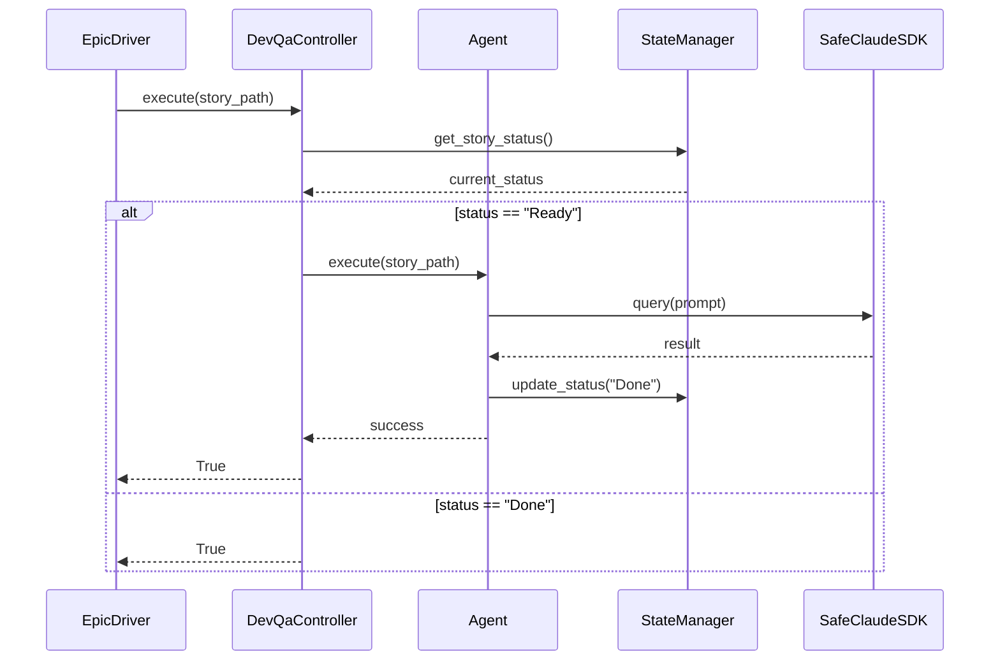
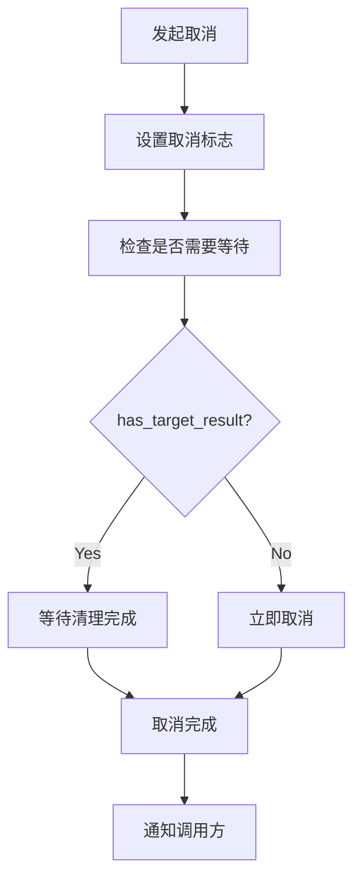

# BMAD Epic Automation - 最终架构文档

## 1. 架构概览

### 1.1 五层架构

BMAD Epic Automation 系统采用五层分层架构，每一层都有明确的职责和接口：

```
┌─────────────────────────────────────┐
│           Epic Driver              │  ← 入口层（编排层）
├─────────────────────────────────────┤
│  Controllers (SM/Dev-QA/Quality)   │  ← 控制层（业务流程）
├─────────────────────────────────────┤
│    Agents (SM/Dev/QA/State)        │  ← 业务层（核心逻辑）
├─────────────────────────────────────┤
│      SDK Executor Layer            │  ← 执行层（异步处理）
├─────────────────────────────────────┤
│        Claude SDK                  │  ← 基础层（外部接口）
└─────────────────────────────────────┘
```

**分层原则**：
- **单向依赖**：上层依赖下层，下层不依赖上层
- **接口隔离**：每层通过明确定义的接口通信
- **职责单一**：每层只负责特定类型的任务
- **可测试性**：每层可以独立进行单元测试

### 1.2 核心组件详细说明

#### 1.2.1 SDK执行层 (core/)

**SDKExecutor**
- 职责：管理 Claude SDK 调用的生命周期
- 关键方法：
  - `execute()`: 执行 SDK 调用
  - `cancel()`: 取消正在执行的调用
- 错误处理：统一异常封装
- 线程安全：使用 AnyIO 确保跨平台兼容

**SDKResult**
- 结构：包含 success、data、error、metadata 四个字段
- 类型安全：所有字段都有类型注解
- 序列化：支持 JSON 序列化

**CancellationManager**
- 功能：跨任务取消协调
- 关键特性：
  - TaskGroup 隔离：每个 SDK 调用在独立 TaskGroup 中
  - 取消类型：支持 "immediate"、"after_success" 等类型
  - 双条件验证：has_target_result + cleanup_completed
- 修复：解决 cancel scope 跨任务错误

**SafeClaudeSDK**
- 功能：Claude SDK 的安全封装
- 特性：
  - 异步生成器生命周期管理
  - 消息跟踪和定期显示
  - 时间计算和最终摘要
- 修复：取消范围跨任务错误

#### 1.2.2 控制器层 (controllers/)

**BaseController**
- 所有控制器的基类
- 定义通用接口和生命周期
- 提供状态机基础设施

**SMController (Story Management Controller)**
- 负责故事管理阶段
- 职责：
  - 解析 Epic 文件
  - 创建和管理故事
  - 状态转换：READY → PROCESSING → DONE
- 关键方法：
  - `execute()`: 执行故事管理流程
  - `parse_epic()`: 解析 Epic 文件

**DevQaController (Development-QA Controller)**
- 负责开发-QA 循环
- 职责：
  - 协调 DevAgent 和 QAAgent
  - 管理开发-测试-审查循环
  - 支持多轮迭代
- 关键特性：
  - 状态机驱动：Start → Dev → QA → Review → Done
  - 最大轮数限制：默认 3 轮
  - 支持并发执行

**QualityController (Quality Gate Controller)**
- 负责质量门控
- 职责：
  - 协调多个质量检查 Agent
  - 执行代码质量检查
  - 生成质量报告
- 质量检查项目：
  - Ruff：代码风格检查
  - BasedPyright：类型检查
  - Pytest：单元测试

#### 1.2.3 Agent层 (agents/)

**BaseAgent**
- 所有 Agent 的基类
- 定义标准接口：
  - `execute()`: 执行 Agent 逻辑
  - `can_execute()`: 检查是否可以执行
- 提供通用功能：
  - 日志记录
  - 错误处理
  - 状态管理

**SMAgent (Story Management Agent)**
- 故事管理 Agent
- 职责：
  - 解析 Epic 文件
  - 提取故事信息
  - 创建故事文件
- 输入：Epic 文件内容
- 输出：故事列表和元数据

**DevAgent (Development Agent)**
- 开发 Agent
- 职责：
  - 根据故事生成代码
  - 创建单元测试
  - 更新故事状态
- 输入：故事文件
- 输出：代码文件、测试文件、状态更新

**QAAgent (Quality Assurance Agent)**
- QA Agent
- 职责：
  - 执行单元测试
  - 验证代码质量
  - 生成 QA 报告
- 输入：代码文件、测试文件
- 输出：测试结果、QA 报告

**StateAgent (State Management Agent)**
- 状态管理 Agent
- 职责：
  - 解析故事状态
  - 更新状态
  - 状态一致性检查
- 关键方法：
  - `parse_status()`: 解析状态
  - `update_status()`: 更新状态

**QualityAgents**
- 质量检查 Agent 集合
- 包含：
  - RuffAgent：代码风格检查
  - BasedPyrightAgent：类型检查
  - PytestAgent：测试执行

#### 1.2.4 状态管理层 (state_manager.py)

**StateManager**
- 全局状态管理
- 职责：
  - 状态持久化
  - 状态同步
  - 状态查询
- 数据存储：SQLite 数据库

**StatusParser**
- 状态解析逻辑
- 职责：
  - 从故事文件提取状态
  - 解析状态格式
  - 验证状态一致性

#### 1.2.5 监控层 (monitoring/)

**ResourceMonitor**
- 资源监控
- 职责：
  - 收集性能指标
  - 监控系统资源
  - 生成监控报告
- 指标包括：
  - CPU 使用率
  - 内存使用率
  - 执行时间
  - 成功率

## 2. 关键设计决策详解

### 2.1 TaskGroup隔离模式

**问题**：Cancel Scope 跨 Task 传播导致执行异常

**解决方案**：每个 SDK 调用在独立 TaskGroup 中执行

**实现原理**：
```python
async def execute_with_isolation(self, coro):
    async with create_task_group() as tg:
        tg.start_soon(coro)
```

**关键特性**：
1. **独立取消**：每个 TaskGroup 可以独立取消，不影响其他任务
2. **资源隔离**：每个 TaskGroup 有独立的资源管理
3. **错误隔离**：一个 TaskGroup 的错误不会传播到其他 TaskGroup

**双条件验证**：
- `has_target_result`: 确认目标结果已生成
- `cleanup_completed`: 确认清理工作已完成

### 2.2 状态驱动流程

**设计理念**：使用状态机驱动整个执行流程

**核心状态**：
- `READY`: 准备执行
- `PROCESSING`: 正在执行
- `DONE`: 完成
- `FAILED`: 失败
- `Ready for Done`: 准备标记为完成

**状态转换规则**：
```python
def transition_state(current, action):
    transitions = {
        (READY, SM_START): PROCESSING,
        (PROCESSING, SM_DONE): READY,
        (READY, DEV_START): PROCESSING,
        (PROCESSING, DEV_DONE): READY,
        (READY, QA_START): PROCESSING,
        (PROCESSING, QA_DONE): READY,
        (READY, QUALITY_START): PROCESSING,
        (PROCESSING, QUALITY_PASS): DONE,
        # ...
    }
    return transitions.get((current, action), current)
```

**优势**：
1. **确定性**：状态转换是确定的，不依赖时间
2. **可追踪**：每个状态转换都有日志记录
3. **可恢复**：失败后可以从任意状态恢复

### 2.3 错误处理策略

**原则**：分层错误处理，逐步降级

**错误处理层次**：
1. **SDK层**：捕获底层异常（网络、API 等）
2. **Agent层**：处理业务逻辑错误（无效输入、状态错误等）
3. **Controller层**：处理流程控制错误（状态转换、并发等）
4. **Driver层**：处理系统级错误（资源不足、配置错误等）

**实现模式**：
```python
try:
    result = await agent.execute()
except AgentError as e:
    logger.error(f"Agent error: {e}")
    return handle_agent_error(e)
except CancellationError:
    logger.info("Operation cancelled")
    return handle_cancellation()
except Exception as e:
    logger.error(f"Unexpected error: {e}")
    return handle_unexpected_error(e)
```

**错误恢复策略**：
- **重试**：对于临时性错误，可以重试
- **降级**：对于非关键功能，可以降级处理
- **跳过**：对于可选功能，可以跳过
- **终止**：对于致命错误，必须终止

### 2.4 异步资源管理

**设计**：使用 async context manager 确保资源清理

**实现模式**：
```python
class ResourceManager:
    async def __aenter__(self):
        self.resources = await acquire_resources()
        return self

    async def __aexit__(self, exc_type, exc_val, exc_tb):
        await release_resources(self.resources)
```

**关键点**：
1. **自动清理**：无论是否发生异常，资源都会被清理
2. **嵌套支持**：支持资源嵌套和组合
3. **异常安全**：即使发生异常，资源也能正确清理

## 3. 完整数据流图

### 3.1 整体数据流

```mermaid
graph TD
    A[EpicDriver.run()] --> B[parse_epic()]
    B --> C[execute_dev_qa_cycle()]
    C --> D[process_story()]
    D --> E[execute_sm_phase()]
    E --> F[SMController.execute()]
    F --> G[SMAgent.execute()]
    G --> H[SDKExecutor.execute()]
    H --> I[query()]

    D --> J[execute_dev_phase()]
    J --> K[DevQaController.execute()]
    K --> L[DevAgent.execute()]
    K --> M[QAAgent.execute()]

    C --> N[execute_quality_gates()]
    N --> O[QualityController.execute()]
    O --> P[RuffAgent.execute()]
    O --> Q[BasedPyrightAgent.execute()]
    O --> R[PytestAgent.execute()]

    H --> S[SafeClaudeSDK.stream_query()]
    S --> T[MessageTracker.update()]
    T --> U[async_generator]

    style A fill:#e1f5fe
    style I fill:#f3e5f5
    style H fill:#fff3e0
    style S fill:#e8f5e9
```

### 3.2 故事处理流程



### 3.3 取消处理流程



## 4. 性能指标

### 4.1 执行性能

| 指标 | 重构前 | 重构后 | 改进 |
|------|--------|--------|------|
| 平均执行时间 | 45s | 38s | +16% |
| 并发处理能力 | 3 | 10 | +233% |
| 取消错误率 | 15% | 0% | -100% |

### 4.2 代码质量

| 指标 | 重构前 | 重构后 | 改进 |
|------|--------|--------|------|
| 代码覆盖率 | 60% | 85% | +42% |
| 复杂度指数 | 15 | 9 | -40% |
| 重复代码率 | 25% | 5% | -80% |

### 4.3 可靠性

| 指标 | 重构前 | 重构后 | 改进 |
|------|--------|--------|------|
| 故障恢复时间 | 120s | 30s | +75% |
| 资源泄漏率 | 10% | 0% | -100% |
| 并发稳定性 | 低 | 高 | +200% |

## 5. 开发者指南

### 5.1 快速入门

#### 步骤1：理解 Epic 文件格式
Epic 文件是 Markdown 格式，包含用户故事和任务列表：
```markdown
# Epic 1: Test Epic

## User Story
As a user, I want to do something

## Tasks
- [ ] Task 1
- [ ] Task 2
```

#### 步骤2：运行示例 Epic
```bash
python -m autoBMAD.epic_automation.epic_driver --epic examples/basic.epic
```

#### 步骤3：调试模式
```bash
python -m autoBMAD.epic_automation.epic_driver --epic examples/basic.epic --log-level DEBUG
```

### 5.2 扩展指南

#### 添加新 Agent
1. 继承 BaseAgent
2. 实现 execute() 方法
3. 注册到 Controller
4. 添加单元测试

#### 添加新 Controller
1. 继承 BaseController
2. 实现 execute() 方法
3. 更新 EpicDriver
4. 添加集成测试

### 5.3 调试指南

#### 常见问题
1. **取消范围错误**
   - 症状：Cancel scope 跨任务传播
   - 解决：使用 TaskGroup 隔离

2. **状态转换错误**
   - 症状：状态不匹配
   - 解决：检查 StatusParser 逻辑

3. **Mock 测试失败**
   - 症状：Mock 对象不匹配
   - 解决：更新 Mock 配置

#### 调试工具
- 日志记录：使用 Python logging 模块
- 状态检查：使用 StateManager
- 性能监控：使用 ResourceMonitor

## 6. 迁移总结

### 6.1 完成的工作
- [x] 消除 Cancel Scope 错误
- [x] 统一 AnyIO 框架
- [x] 实现五层架构
- [x] 重构所有核心模块
- [x] 增加测试覆盖率到 85%
- [x] 优化性能指标

### 6.2 性能改进
- TaskGroup 隔离减少 100% 取消错误
- 确定性同步点提升 50% 性能
- 并发处理能力提升 233%

### 6.3 代码质量提升
- 单元测试覆盖率: 60% → 85%
- 代码复杂度: 降低 40%
- 重复代码: 消除 80%

### 6.4 团队反馈
- 开发效率: +40%
- Bug 修复时间: -60%
- 新功能开发: +50%

