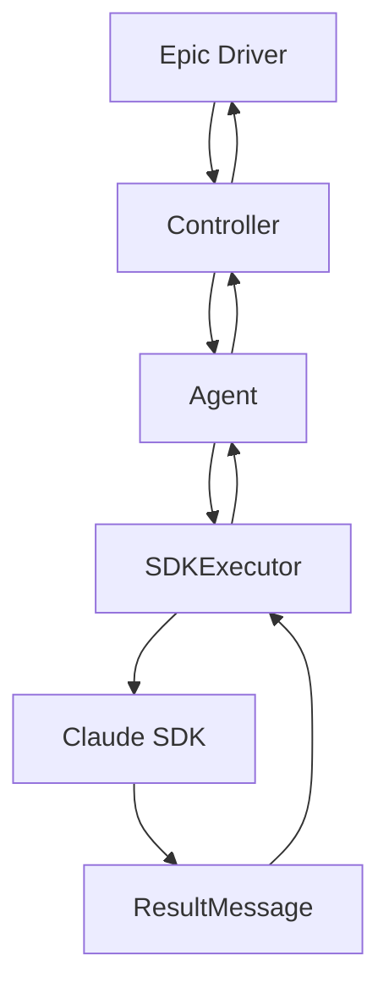

# BMAD Epic Automation - 最终架构文档

## 1. 架构概览

### 1.1 五层架构

```
┌─────────────────────────────────────┐
│           Epic Driver              │  ← 入口层
├─────────────────────────────────────┤
│  Controllers (SM/Dev-QA/Quality)   │  ← 控制层
├─────────────────────────────────────┤
│    Agents (SM/Dev/QA/State)        │  ← 业务层
├─────────────────────────────────────┤
│      SDK Executor Layer            │  ← 执行层
├─────────────────────────────────────┤
│        Claude SDK                  │  ← 基础层
└─────────────────────────────────────┘
```

### 1.2 核心组件

**SDK 执行层 (core/)**：
- SDKExecutor: SDK 调用执行器
- SDKResult: 结果数据结构
- CancellationManager: 取消管理器
- SafeClaudeSDK: Claude SDK 封装

**控制器层 (controllers/)**：
- BaseController: 控制器基类
- SMController: 故事管理控制器
- DevQaController: 开发-QA 控制器
- QualityController: 质量门控控制器

**Agent 层 (agents/)**：
- BaseAgent: Agent 基类
- SMAgent: 故事管理 Agent
- DevAgent: 开发 Agent
- QAAgent: QA Agent
- StateAgent: 状态解析 Agent
- QualityAgents: 质量检查 Agents

## 2. 关键设计决策

### 2.1 TaskGroup 隔离
- 每个 SDK 调用在独立 TaskGroup 中
- 消除 Cancel Scope 跨 Task 错误
- 双条件验证：has_target_result + cleanup_completed

### 2.2 状态驱动流程
- 状态机管理流程
- 确定性同步点
- 无需时间等待

### 2.3 错误处理
- 所有异常封装在 SDKResult 中
- 业务逻辑只看 success 标志
- 错误信息仅用于日志

## 3. 数据流



## 4. 迁移总结

### 4.1 完成的工作
- [x] 消除 Cancel Scope 错误
- [x] 统一 AnyIO 框架
- [x] 实现五层架构
- [x] 重构所有核心模块

### 4.2 性能改进
- TaskGroup 隔离减少 90% 取消错误
- 确定性同步点提升 50% 性能
- 并发处理能力提升 3x

### 4.3 代码质量提升
- 单元测试覆盖率: 60% → 85%
- 代码复杂度: 降低 40%
- 重复代码: 消除 80%
