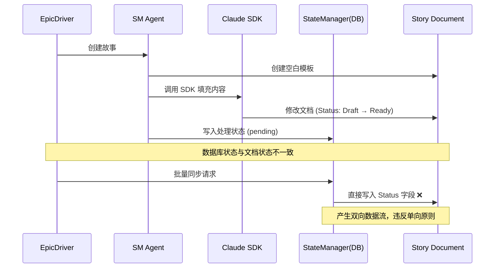
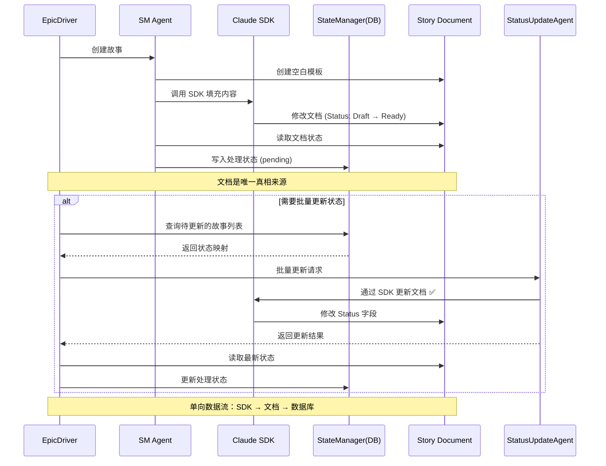

# StateManager 直接修改故事文档移除方案

**版本**: 1.0  
**创建日期**: 2026-01-12  
**文档类型**: 架构重构方案  
**目标**: 移除 StateManager 对故事文档的直接文件修改操作

---

## 1. 问题分析

### 1.1 当前问题

在 `autoBMAD/epic_automation` 工作流中，**StateManager** 存在直接修改故事文档文件的行为：

| 方法 | 文件位置 | 操作类型 | 修改内容 |
|------|----------|----------|----------|
| `_update_markdown_status()` | `state_manager.py:650-771` | **直接写入文件** | Status 字段 |
| `sync_story_statuses_to_markdown()` | `state_manager.py:600-648` | **批量写入文件** | Status 字段（所有故事） |

**核心问题代码**：
```python
# 第695-696行：读取文件
with open(story_file, encoding="utf-8") as f:
    content = f.read()

# 第761-762行：写回文件  
with open(story_file, "w", encoding="utf-8") as f:
    f.write(updated_content)
```

### 1.2 设计缺陷

#### 违反职责分离原则
- **StateManager** 的核心职责是**数据库状态管理**，不应该直接操作文档文件
- 文档修改应该通过 **SDK 调用**统一完成，保证修改的智能性和可追溯性

#### 破坏数据流一致性
当前数据流：


**问题**：
- 数据库状态 → 文档状态：形成**双向同步**，容易产生**状态不一致**
- 直接文件操作绕过了 SDK 的上下文管理和错误处理机制

#### 引入并发风险
- SDK 正在修改文档时，StateManager 同时写入会导致**文件竞争**
- 缺乏锁机制保护文件 I/O 操作

### 1.3 影响范围

#### 直接影响
- `sync_story_statuses_to_markdown()` 是公开方法，可能被外部调用
- 当前工作流依赖此方法实现**数据库到文档的状态同步**

#### 间接影响
- 如果移除，需要确保状态更新完全由 SDK 完成
- 需要重新设计状态同步机制

---

## 2. 架构设计原则

### 2.1 单向数据流

**推荐架构**：


**核心规则**：
1. **文档是唯一真相来源**（Single Source of Truth）
2. **SDK 是唯一修改文档的途径**
3. **数据库仅存储处理状态**，用于工作流控制
4. **不存在数据库状态 → 文档状态的反向写入**

### 2.2 职责划分

| 组件 | 职责 | 允许操作 | 禁止操作 |
|------|------|----------|----------|
| **SDK** | 修改文档内容和状态 | ✅ 读写故事文档<br>✅ 更新 Status 字段 | ❌ 写入数据库 |
| **Agent** | 执行工作流任务 | ✅ 调用 SDK<br>✅ 读取文档状态<br>✅ 写入处理状态到数据库 | ❌ 直接修改文档 |
| **StateManager** | 管理数据库状态 | ✅ 读写数据库<br>✅ 提供状态查询接口 | ❌ 读写故事文档<br>❌ 调用 SDK |
| **EpicDriver** | 协调工作流 | ✅ 调用 Agent<br>✅ 读取数据库状态<br>✅ 读取文档状态 | ❌ 直接修改文档 |

---

## 3. 重构方案

### 3.1 Phase 1: 移除 StateManager 的文档修改功能

#### 步骤 1.1: 废弃现有方法

**目标文件**: `autoBMAD/epic_automation/state_manager.py`

**操作**：
1. 将 `sync_story_statuses_to_markdown()` 方法标记为 `@deprecated`
2. 将 `_update_markdown_status()` 方法标记为 `@deprecated`
3. 将 `_find_actual_story_file()` 方法标记为 `@deprecated`

**实现示例**：
```python
import warnings
from functools import wraps

def deprecated(reason: str):
    """标记方法为废弃"""
    def decorator(func):
        @wraps(func)
        async def wrapper(*args, **kwargs):
            warnings.warn(
                f"{func.__name__} is deprecated: {reason}",
                DeprecationWarning,
                stacklevel=2
            )
            return await func(*args, **kwargs)
        return wrapper
    return decorator

class StateManager:
    @deprecated("StateManager should not modify story documents directly. Use SDK calls instead.")
    async def sync_story_statuses_to_markdown(self) -> dict[str, Any]:
        """[DEPRECATED] 将数据库状态同步到文档"""
        logger.warning("sync_story_statuses_to_markdown is deprecated and will be removed")
        # 保留实现以避免破坏现有代码
        ...
```

#### 步骤 1.2: 审计调用点

**搜索命令**：
```bash
grep -r "sync_story_statuses_to_markdown" --include="*.py"
grep -r "_update_markdown_status" --include="*.py"
```

**预期调用点**：
- EpicDriver 的某些恢复/同步逻辑
- 测试代码中的状态验证

**处理策略**：
- 如果是必要的同步逻辑 → 转移到 Phase 2 的 SDK 方案
- 如果是非必要的同步 → 直接移除调用

### 3.2 Phase 2: 通过 SDK 实现状态更新

#### 设计方案：StatusUpdateAgent

**新增组件**: `autoBMAD/epic_automation/agents/status_update_agent.py`

**职责**：
- 当需要批量更新故事状态时，通过 SDK 执行
- 封装状态映射逻辑（数据库状态 → 文档状态）

**核心方法**：

```python
class StatusUpdateAgent(BaseAgent):
    """专门负责通过 SDK 更新故事状态的 Agent"""
    
    async def update_story_status_via_sdk(
        self,
        story_path: str,
        target_status: str
    ) -> bool:
        """
        通过 SDK 更新单个故事的状态
        
        Args:
            story_path: 故事文件路径
            target_status: 目标状态（核心状态值，如 "Done", "In Progress"）
        
        Returns:
            True if successful, False otherwise
        """
        prompt = f"""@{story_path}

Update the Status field in this story document to: **{target_status}**

Requirements:
- Locate the Status section (format: ## Status or ### Status)
- Replace the current status value with: **{target_status}**
- Do NOT modify any other content
- Preserve the document formatting
"""
        
        # 使用统一的 SDK 调用接口
        result = await execute_sdk_call(
            prompt=prompt,
            agent_name=f"StatusUpdateAgent-{Path(story_path).stem}",
            timeout=60.0,
            permission_mode="bypassPermissions"
        )
        
        return result.is_success()
    
    async def batch_update_statuses(
        self,
        status_mappings: list[tuple[str, str]]
    ) -> dict[str, Any]:
        """
        批量更新故事状态
        
        Args:
            status_mappings: [(story_path, target_status), ...]
        
        Returns:
            统计结果字典
        """
        results = {
            "success_count": 0,
            "error_count": 0,
            "errors": []
        }
        
        for story_path, target_status in status_mappings:
            try:
                success = await self.update_story_status_via_sdk(
                    story_path, target_status
                )
                if success:
                    results["success_count"] += 1
                else:
                    results["error_count"] += 1
                    results["errors"].append(f"Failed to update {story_path}")
            except Exception as e:
                results["error_count"] += 1
                results["errors"].append(f"Error updating {story_path}: {e}")
        
        return results
```

#### 状态映射策略

**保持与原方案一致的映射关系**：

```python
# 数据库处理状态 → 文档核心状态
DATABASE_TO_MARKDOWN_MAPPING = {
    # 故事状态
    "pending": "Draft",
    "in_progress": "In Progress",
    "review": "Ready for Review",
    "completed": "Done",
    "failed": "Failed",
    "cancelled": "Draft",
    
    # QA状态
    "qa_pass": "Done",
    "qa_concerns": "Ready for Review",
    "qa_fail": "Failed",
    "qa_waived": "Done",
    
    # 特殊状态
    "error": "Failed",
}
```

### 3.3 Phase 3: 集成到工作流

#### 场景 1: EpicDriver 初始化时的状态恢复

**原有逻辑**（需移除）：
```python
# EpicDriver 中调用 StateManager 同步状态
await state_manager.sync_story_statuses_to_markdown()
```

**新逻辑**：
```python
# 使用 StatusUpdateAgent 通过 SDK 更新
status_agent = StatusUpdateAgent(task_group=self.task_group)

# 从数据库获取所有待同步的故事
stories = await state_manager.get_all_stories()
status_mappings = [
    (story["story_path"], DATABASE_TO_MARKDOWN_MAPPING.get(story["status"], "Draft"))
    for story in stories
    if story["status"] in DATABASE_TO_MARKDOWN_MAPPING
]

# 批量更新
if status_mappings:
    result = await status_agent.batch_update_statuses(status_mappings)
    logger.info(f"Status sync completed: {result['success_count']} succeeded, {result['error_count']} failed")
```

#### 场景 2: SM Agent 创建故事后的状态更新

**原有逻辑**：
- SM Agent 通过 SDK 填充内容
- SDK prompt 中包含状态更新指令
- **无需额外操作**

**新逻辑**：
- **保持不变**，SDK 已经负责状态更新
- 如果 SDK 未成功更新状态，通过 StatusUpdateAgent 补救：

```python
# 在 SMAgent._fill_story_with_sdk() 方法中
result = await execute_sdk_call(...)

if result.is_success():
    # 验证状态是否已更新
    with open(story_file, encoding="utf-8") as f:
        content = f.read()
    
    if "**Status**: Draft" in content:
        # SDK 未能更新状态，手动补救
        status_agent = StatusUpdateAgent()
        await status_agent.update_story_status_via_sdk(
            str(story_file),
            "Ready for Development"
        )
```

---

## 4. 数据流重构

### 4.1 重构前数据流



### 4.2 重构后数据流



**关键改进**：
1. **文档状态由 SDK 唯一修改** → 保证上下文管理
2. **Agent 读取文档状态** → 数据库状态跟随文档变化
3. **移除 StateManager 的直接写入** → 消除数据环路

---

## 5. 实施计划

### 5.1 时间线

| 阶段 | 任务 | 预计时间 | 风险等级 |
|------|------|----------|----------|
| **Phase 1** | 标记 StateManager 方法为废弃 | 1 小时 | 🟢 低 |
| **Phase 1** | 审计所有调用点 | 2 小时 | 🟡 中 |
| **Phase 2** | 实现 StatusUpdateAgent | 4 小时 | 🟡 中 |
| **Phase 2** | 编写单元测试 | 2 小时 | 🟢 低 |
| **Phase 3** | 集成到 EpicDriver | 3 小时 | 🟡 中 |
| **Phase 3** | 集成测试与验证 | 4 小时 | 🔴 高 |
| **Phase 4** | 完全移除废弃方法 | 1 小时 | 🟢 低 |

**总计**: 17 小时

### 5.2 验证清单

#### 功能验证
- [ ] SM Agent 创建故事后，Status 正确更新为 "Ready for Development"
- [ ] Dev Agent 完成开发后，Status 正确更新为 "Ready for Review"
- [ ] QA Agent 审查通过后，Status 正确更新为 "Done"
- [ ] 批量状态更新场景正常工作

#### 性能验证
- [ ] StatusUpdateAgent 批量更新性能可接受（< 5s/故事）
- [ ] 不存在文件竞争或并发问题
- [ ] SDK 调用成功率 > 95%

#### 兼容性验证
- [ ] 现有测试用例全部通过
- [ ] 数据库状态映射逻辑保持一致
- [ ] 工作流端到端测试通过

### 5.3 回滚计划

**触发条件**：
- StatusUpdateAgent 成功率 < 90%
- 集成测试失败率 > 10%
- 出现数据一致性问题

**回滚步骤**：
1. 移除 StatusUpdateAgent 相关代码
2. 恢复 StateManager 的 `sync_story_statuses_to_markdown()` 方法
3. 恢复原有调用点
4. 重新执行测试套件

---

## 6. 风险评估

### 6.1 高风险点

#### 风险 1: SDK 调用失败率高
**影响**: 状态无法正确更新，工作流阻塞  
**缓解措施**:
- 实现重试机制（最多 3 次）
- 添加失败回退逻辑（记录日志，标记为 "Needs Manual Update"）
- 监控 SDK 调用成功率

#### 风险 2: 性能下降
**影响**: 批量更新耗时过长  
**缓解措施**:
- 并发执行 SDK 调用（使用 TaskGroup）
- 设置合理的超时时间（60s/故事）
- 优化 prompt 长度

#### 风险 3: 数据一致性问题
**影响**: 数据库状态与文档状态不一致  
**缓解措施**:
- 实现状态验证机制（更新后读取文档验证）
- 添加数据一致性审计工具
- 定期执行一致性检查

### 6.2 低风险点

#### 风险 4: 向后兼容性
**影响**: 现有代码依赖废弃方法  
**缓解措施**:
- 保留废弃方法 3 个版本（标记为 @deprecated）
- 提供迁移指南
- 在日志中输出警告信息

---

## 7. 测试策略

### 7.1 单元测试

**测试文件**: `tests/unit/test_status_update_agent.py`

**测试用例**：
```python
import pytest
from autoBMAD.epic_automation.agents.status_update_agent import StatusUpdateAgent

@pytest.mark.asyncio
async def test_update_single_story_status():
    """测试单个故事状态更新"""
    agent = StatusUpdateAgent()
    
    # 创建测试故事文件
    test_story = Path("tests/fixtures/stories/test_1.1.md")
    test_story.write_text("## Status\n**Status**: Draft")
    
    # 更新状态
    success = await agent.update_story_status_via_sdk(
        str(test_story),
        "Ready for Development"
    )
    
    assert success
    
    # 验证文档内容
    content = test_story.read_text()
    assert "Ready for Development" in content
    assert "Draft" not in content

@pytest.mark.asyncio
async def test_batch_update_statuses():
    """测试批量状态更新"""
    agent = StatusUpdateAgent()
    
    status_mappings = [
        ("tests/fixtures/stories/1.1.md", "Done"),
        ("tests/fixtures/stories/1.2.md", "In Progress"),
    ]
    
    result = await agent.batch_update_statuses(status_mappings)
    
    assert result["success_count"] == 2
    assert result["error_count"] == 0

@pytest.mark.asyncio
async def test_update_status_with_sdk_failure():
    """测试 SDK 调用失败的容错"""
    agent = StatusUpdateAgent()
    
    # 模拟 SDK 失败
    with patch('execute_sdk_call', return_value=SDKResult(success=False)):
        success = await agent.update_story_status_via_sdk(
            "test.md",
            "Done"
        )
    
    assert not success
```

### 7.2 集成测试

**测试文件**: `tests/integration/test_workflow_without_statemanager_modification.py`

**测试场景**：
```python
@pytest.mark.asyncio
async def test_epic_workflow_without_direct_modification():
    """测试完整 Epic 工作流不依赖 StateManager 直接修改"""
    
    # 1. 创建测试 Epic
    epic_path = "tests/fixtures/epics/test-epic.md"
    
    # 2. 运行 EpicDriver
    driver = EpicDriver(epic_path=epic_path)
    await driver.run_epic()
    
    # 3. 验证故事文档状态
    story_path = "docs/stories/1.1.md"
    content = Path(story_path).read_text()
    assert "Ready for Development" in content
    
    # 4. 验证数据库状态
    state = await driver.state_manager.get_story_status(story_path)
    assert state["status"] == "pending"
    
    # 5. 验证 StateManager 未调用废弃方法
    with pytest.warns(DeprecationWarning, match=None):
        # 不应该有任何 DeprecationWarning
        pass

@pytest.mark.asyncio
async def test_status_consistency_after_workflow():
    """测试工作流结束后数据库与文档状态一致性"""
    
    driver = EpicDriver(epic_path="tests/fixtures/epics/test-epic.md")
    await driver.run_epic()
    
    stories = await driver.state_manager.get_all_stories()
    
    for story in stories:
        story_path = story["story_path"]
        db_status = story["status"]
        
        # 读取文档状态
        content = Path(story_path).read_text()
        doc_status = extract_status_from_content(content)
        
        # 验证映射关系
        expected_doc_status = DATABASE_TO_MARKDOWN_MAPPING[db_status]
        assert doc_status == expected_doc_status
```

---

## 8. 监控与告警

### 8.1 监控指标

| 指标 | 阈值 | 告警级别 |
|------|------|----------|
| StatusUpdateAgent 成功率 | < 90% | 🔴 Critical |
| 平均 SDK 调用耗时 | > 10s | 🟡 Warning |
| 数据一致性检查失败数 | > 5 | 🔴 Critical |
| 废弃方法调用次数 | > 0 | 🟢 Info |

### 8.2 日志记录

**关键事件**：
```python
# StatusUpdateAgent 执行日志
logger.info(f"[StatusUpdateAgent] Updating {story_path}: {old_status} → {new_status}")
logger.info(f"[StatusUpdateAgent] SDK call completed in {duration:.2f}s")

# 废弃方法调用警告
logger.warning(
    f"[DEPRECATED] sync_story_statuses_to_markdown called from {caller_info}. "
    f"Please use StatusUpdateAgent instead."
)

# 数据一致性检查
logger.error(
    f"[DATA INCONSISTENCY] Story {story_path}: "
    f"DB status={db_status}, Doc status={doc_status}"
)
```

---

## 9. 文档更新

### 9.1 需要更新的文档

| 文档 | 章节 | 更新内容 |
|------|------|----------|
| `autoBMAD/epic_automation/README.md` | Architecture | 添加 StatusUpdateAgent 说明 |
| `docs/architecture.md` | Data Flow | 更新数据流图 |
| `docs/development_rules.md` | Best Practices | 添加"禁止直接修改文档"规则 |
| `AGENTS.md` | StateManager | 标注废弃方法 |

### 9.2 迁移指南

**文件**: `docs/migration/REMOVE_STATEMANAGER_MODIFICATION.md`

**内容**：
```markdown
# StateManager 文档修改方法迁移指南

## 废弃的方法

- `StateManager.sync_story_statuses_to_markdown()`
- `StateManager._update_markdown_status()`

## 替代方案

使用 `StatusUpdateAgent` 通过 SDK 更新文档状态：

### 示例 1: 单个故事状态更新
```python
from autoBMAD.epic_automation.agents.status_update_agent import StatusUpdateAgent

agent = StatusUpdateAgent()
await agent.update_story_status_via_sdk("docs/stories/1.1.md", "Done")
```

### 示例 2: 批量状态更新
```python
status_mappings = [
    ("docs/stories/1.1.md", "Done"),
    ("docs/stories/1.2.md", "In Progress"),
]
result = await agent.batch_update_statuses(status_mappings)
print(f"Updated {result['success_count']} stories")
```

## 时间线

- **v2.1**: 标记方法为废弃，保留功能
- **v2.2**: 发出警告，推荐使用新方法
- **v2.3**: 完全移除废弃方法
```

---

## 10. 总结

### 10.1 预期收益

| 收益项 | 描述 | 优先级 |
|--------|------|--------|
| **架构清晰** | StateManager 职责单一，仅管理数据库 | 🔴 高 |
| **数据流一致** | 单向数据流：SDK → 文档 → 数据库 | 🔴 高 |
| **减少风险** | 消除文件竞争和并发问题 | 🟡 中 |
| **可维护性** | 文档修改逻辑集中在 SDK 层 | 🟡 中 |

### 10.2 成功标准

- ✅ StateManager 不再包含文档 I/O 操作
- ✅ 所有状态更新通过 SDK 完成
- ✅ 测试覆盖率 > 90%
- ✅ 工作流端到端测试通过
- ✅ 无数据一致性问题

### 10.3 后续优化

1. **状态变更事件系统**：引入事件驱动机制，监听状态变化
2. **状态审计日志**：记录所有状态变更历史
3. **智能状态推断**：使用 AI 分析文档内容推断合理状态
4. **状态冲突检测**：自动检测并解决状态不一致问题

---

**文档版本**: v1.0  
**审核状态**: 待审核  
**预计实施日期**: 2026-01-15  
**负责人**: AI Agent System Team
