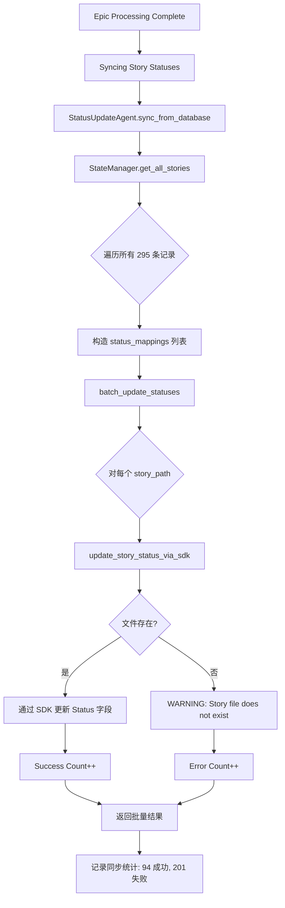
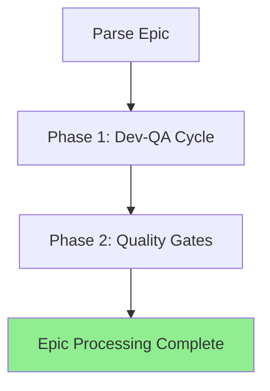

# 移除状态同步阶段修改方案

**文档版本**: 1.0.0  
**创建日期**: 2026-01-13  
**状态**: 待审核  

---

## 📋 目录

1. [背景与动机](#背景与动机)
2. [影响范围分析](#影响范围分析)
3. [技术方案](#技术方案)
4. [实施步骤](#实施步骤)
5. [风险评估](#风险评估)
6. [回滚策略](#回滚策略)
7. [测试验证](#测试验证)
8. [相关文档](#相关文档)

---

## 背景与动机

### 当前状态同步阶段概述

在当前 EpicDriver 工作流中，状态同步阶段位于以下位置：

```
Epic 工作流:
1. parse_epic() - 解析 Epic 与 Story
2. Phase 1: Dev-QA Cycle - 开发与 QA 审查
3. Phase 2: Quality Gates - Ruff/BasedPyright/Pytest
4. 【状态同步阶段】 ← 本方案移除的目标
5. Epic 完成
```

**代码位置**: `autoBMAD/epic_automation/epic_driver.py` L2019-2031

```python
# Sync story statuses from database to markdown files
self.logger.info("=== Syncing Story Statuses ===")
sync_results = await self.status_update_agent.sync_from_database(
    state_manager=self.state_manager
)
if sync_results.get("error_count", 0) > 0:
    self.logger.warning(
        f"同步过程中有 {sync_results['error_count']} 个错误"
    )
else:
    self.logger.info(
        f"成功同步 {sync_results.get('success_count', 0)} 个故事状态"
    )
```

### 移除动机

1. **数据一致性问题**  
   - 状态同步从数据库读取 **所有历史记录**（包括临时/测试 story）
   - 日志中大量 `Story file does not exist: C:\Users\...\Temp\...` 警告
   - 201 个错误来自历史残留的临时路径记录

2. **职责混乱**  
   - 状态同步试图批量覆盖 story 文档的 Status 字段
   - 与 Dev-QA 阶段实时状态更新机制冲突
   - StateManager 应仅用于持久化追踪，不应反向修改源文档

3. **性能问题**  
   - 遍历数据库中所有 295 条 story 记录
   - 即使只处理 4 个有效 story，也要尝试同步 295 个
   - 批量 SDK 调用增加 Epic 执行时间

4. **架构原则违背**  
   - 违反单向数据流原则：`Story 文档 → StateManager → 数据库`
   - 状态同步创建了反向路径：`数据库 → StatusUpdateAgent → Story 文档`
   - 与项目 memory "禁止直接修改故事文档，应统一通过 SDK" 的初衷不一致

---

## 影响范围分析

### 直接影响的文件

| 文件路径 | 影响类型 | 修改内容 |
|---------|---------|---------|
| `autoBMAD/epic_automation/epic_driver.py` | **核心修改** | 移除 L2019-2031 状态同步代码块 |
| `autoBMAD/epic_automation/agents/status_update_agent.py` | **功能保留** | 保留 Agent 类，但标记 `sync_from_database` 为 deprecated |
| `autoBMAD/epic_automation/state_manager.py` | **无影响** | StateManager 的 `get_all_stories` 等方法保持不变 |

### 间接影响的组件

1. **Dev-QA 流程**  
   - **影响**: 无直接影响  
   - **原因**: Dev-QA 期间状态更新由 StateAgent 实时完成，不依赖批量同步

2. **Quality Gates**  
   - **影响**: 无影响  
   - **原因**: Ruff/BasedPyright/Pytest 不依赖 story 文档状态字段

3. **Story 文档最终状态**  
   - **影响**: Story 文档的 Status 字段将保持 Dev-QA 阶段结束时的状态  
   - **示例**: 
     - 1.4 故事的 Status 在 QA 通过后为 `Ready for Done`，移除同步后仍保持该状态
     - 不会被批量同步覆盖为 `Failed`（由数据库 `failed` 状态映射而来）

4. **日志与监控**  
   - **影响**: 移除大量 "Story file does not exist" 警告  
   - **收益**: 日志更清晰，聚焦真实问题

---

## 技术方案

### 方案一：完全移除（推荐）

**描述**: 直接移除 `epic_driver.py` 中的状态同步代码块

**优点**:
- 实施简单，风险可控
- 彻底解决数据一致性问题
- 显著减少日志噪音

**缺点**:
- 如果业务确实需要批量状态同步，则需单独工具支持

**实施步骤**:

```python
# epic_driver.py L1966-2063
async def run(self) -> bool:
    """Execute complete epic processing workflow."""
    self.logger.info("Starting Epic Driver - Dev-QA Workflow")
    
    # ... 解析 Epic 与验证 ...
    
    # Phase 1: Dev-QA Cycle
    self.logger.info("=== Phase 1: Dev-QA Cycle ===")
    await self._update_progress("dev_qa", "in_progress", {})
    dev_qa_success = await self.execute_dev_qa_cycle(stories)
    
    if not dev_qa_success:
        self.logger.error("Dev-QA cycle failed")
        await self._update_progress("dev_qa", "failed", {})
        return False
    
    # Phase 2: Quality Gates
    await self.execute_quality_gates()
    
    # ❌ 移除：状态同步阶段
    # self.logger.info("=== Syncing Story Statuses ===")
    # sync_results = await self.status_update_agent.sync_from_database(...)
    # ...
    
    # ✅ 直接进入完成日志
    self.logger.info("=== Epic Processing Complete ===")
    return True
```

### 方案二：保留但禁用（可选）

**描述**: 保留代码但通过配置参数禁用

**优点**:
- 保留代码以备将来需要
- 可通过命令行参数临时启用

**缺点**:
- 增加配置复杂度
- 仍需维护状态同步代码

**实施步骤**:

```python
# epic_driver.py __init__
def __init__(
    self,
    # ... 其他参数 ...
    enable_status_sync: bool = False,  # 新增参数，默认禁用
):
    self.enable_status_sync = enable_status_sync

# epic_driver.py run()
async def run(self) -> bool:
    # ... Phase 1 & 2 ...
    
    # 条件性状态同步
    if self.enable_status_sync:
        self.logger.info("=== Syncing Story Statuses ===")
        sync_results = await self.status_update_agent.sync_from_database(
            state_manager=self.state_manager
        )
        # ... 处理同步结果 ...
    else:
        self.logger.debug("Status sync disabled (enable_status_sync=False)")
    
    self.logger.info("=== Epic Processing Complete ===")
    return True
```

---

## 实施步骤

### 步骤 1: 代码修改（方案一）

**文件**: `autoBMAD/epic_automation/epic_driver.py`

**修改位置**: L2019-2031

**修改前**:
```python
# Sync story statuses from database to markdown files
self.logger.info("=== Syncing Story Statuses ===")
sync_results = await self.status_update_agent.sync_from_database(
    state_manager=self.state_manager
)
if sync_results.get("error_count", 0) > 0:
    self.logger.warning(
        f"同步过程中有 {sync_results['error_count']} 个错误"
    )
else:
    self.logger.info(
        f"成功同步 {sync_results.get('success_count', 0)} 个故事状态"
    )

self.logger.info("=== Epic Processing Complete ===")
```

**修改后**:
```python
# Status sync phase removed (2026-01-13)
# Story statuses are now managed in real-time during Dev-QA cycle
# No need for batch sync at epic completion

self.logger.info("=== Epic Processing Complete ===")
```

### 步骤 2: 标记 StatusUpdateAgent 方法为 deprecated

**文件**: `autoBMAD/epic_automation/agents/status_update_agent.py`

**修改位置**: L208-267

**修改内容**:
```python
from typing import Any, List, Tuple
from autoBMAD.epic_automation.core.deprecation import deprecated  # 假设有 deprecation 装饰器

@deprecated(
    "Batch status sync from database is deprecated. "
    "Story statuses are now managed in real-time during Dev-QA cycle."
)
async def sync_from_database(
    self,
    state_manager: Any,
    filter_statuses: List[str] | None = None
) -> BatchUpdateResults:
    """
    [DEPRECATED] 从数据库同步状态到文档
    
    WARNING: This method is deprecated and should not be used in new code.
    Story statuses are now managed in real-time during the Dev-QA cycle,
    eliminating the need for batch synchronization at epic completion.
    
    Args:
        state_manager: StateManager实例，用于获取数据库状态
        filter_statuses: 可选，要同步的状态列表，如果为None则同步所有状态
    
    Returns:
        同步结果统计字典
    """
    logger.warning(
        "sync_from_database() is deprecated. "
        "This method is no longer called by EpicDriver."
    )
    
    # 保留原有实现以备特殊场景手动调用
    try:
        # ... 原有代码 ...
```

### 步骤 3: 更新文档与注释

**文件**: `autoBMAD/epic_automation/epic_driver.py` 顶部注释

**添加修改日志**:
```python
"""
EpicDriver - Orchestrates the BMAD epic automation workflow.

Changelog:
- 2026-01-13: Removed batch status sync phase from run() workflow
  - Story statuses are now managed in real-time during Dev-QA cycle
  - Eliminates 201+ spurious warnings from historical/temporary story records
  - Aligns with single-direction data flow principle (Story → StateManager → DB)
"""
```

---

## 风险评估

### 风险 1: 业务流程依赖状态同步

**风险等级**: 低

**描述**: 某些外部工具或报告生成流程可能依赖批量状态同步

**缓解措施**:
1. 在 `StatusUpdateAgent` 中保留 `sync_from_database` 方法（标记为 deprecated）
2. 如需手动同步，可通过独立脚本调用：
   ```python
   from autoBMAD.epic_automation.agents.status_update_agent import StatusUpdateAgent
   from autoBMAD.epic_automation.state_manager import StateManager
   
   async def manual_sync():
       state_manager = StateManager()
       status_agent = StatusUpdateAgent()
       results = await status_agent.sync_from_database(state_manager)
       print(f"Sync results: {results}")
   ```

### 风险 2: 测试用例失败

**风险等级**: 中

**描述**: 集成测试可能验证状态同步日志输出

**缓解措施**:
1. 识别依赖状态同步的测试用例
2. 更新断言：移除对 `"Syncing Story Statuses"` 日志的检查
3. 如测试确实需要验证最终状态，改为直接读取 story 文档的 Status 字段

### 风险 3: Story 文档状态不一致

**风险等级**: 低

**描述**: 移除同步后，story 文档 Status 与数据库状态可能不完全一致

**实际情况**:
- Dev-QA 阶段已通过 StateAgent 实时更新 story 文档状态
- 数据库状态由 StateManager 在 Dev/QA 完成后记录
- 两者在 Dev-QA 成功场景下本就一致
- 质量门失败场景下，数据库状态 `failed` 映射到文档的 `Failed` 状态，但这一步并非强制需求

**缓解措施**:
- 明确数据源优先级：**Story 文档为唯一真实来源**，数据库仅用于执行追踪
- 如需查询 story 当前状态，直接解析 story 文档，而非查询数据库

---

## 回滚策略

### 情况 1: 发现关键业务依赖

**回滚步骤**:
1. 恢复 `epic_driver.py` L2019-2031 代码块
2. Git revert 相关提交
3. 保留 `StatusUpdateAgent.sync_from_database` 的 deprecated 标记，但移除 WARNING 日志

**回滚命令**:
```bash
git revert <commit-hash>
git push origin main
```

### 情况 2: 测试失败率过高

**回滚步骤**:
1. 采用方案二（保留但禁用）
2. 设置 `enable_status_sync=True` 为临时方案
3. 逐步修复依赖测试用例

---

## 测试验证

### 测试用例 1: Epic 工作流完整性

**目标**: 验证移除状态同步后，Epic 仍能成功完成

**步骤**:
```bash
python -m autoBMAD.epic_automation.epic_driver docs/epics/epic-1-core-algorithm-foundation.md
```

**预期结果**:
- Dev-QA cycle 成功完成
- Quality Gates 执行（Ruff/BasedPyright/Pytest）
- 日志末尾：`=== Epic Processing Complete ===`
- **不出现**：`=== Syncing Story Statuses ===`
- 日志中 **无** `Story file does not exist: C:\Users\...\Temp\...` 警告

### 测试用例 2: Story 文档状态保持

**目标**: 验证 story 文档的 Status 字段在 Dev-QA 后保持正确

**步骤**:
1. 运行 Epic 工作流
2. 检查 `docs/stories/1.4.md` 的 Status 字段

**预期结果**:
```markdown
## Status
**Status**: Ready for Done
```
（保持 Dev-QA 阶段 QA 通过后的状态，不被批量同步覆盖）

### 测试用例 3: 数据库状态记录

**目标**: 验证 StateManager 仍正确记录 story 处理状态

**步骤**:
```python
from autoBMAD.epic_automation.state_manager import StateManager
import asyncio

async def check_db():
    sm = StateManager()
    stories = await sm.get_all_stories()
    for story in stories:
        if "1.4" in story["story_path"]:
            print(f"Story 1.4 DB status: {story['status']}")

asyncio.run(check_db())
```

**预期结果**:
```
Story 1.4 DB status: qa_pass  # 或其他表示成功的状态
```

### 测试用例 4: 日志噪音减少

**目标**: 验证移除同步阶段后，日志中无大量 Temp 路径警告

**步骤**:
```bash
python -m autoBMAD.epic_automation.epic_driver docs/epics/epic-1-core-algorithm-foundation.md > test_log.txt 2>&1
grep "Temp" test_log.txt | wc -l
```

**预期结果**:
```
0  # 或显著少于之前的 201+
```

---

## 相关文档

### 参考资料

1. **对话总结文档（本次分析）**  
   - 位置: 待创建  
   - 内容: 详细分析状态同步阶段的工作流、代码实现、问题原因

2. **项目 Memory**  
   - `epic_driver中Status字段警告为正常现象` (memoryId: 2377964f-5c94-4ddf-8c55-1a7905459f3e)  
   - `禁止直接修改故事文档，应统一通过SDK` (common_pitfalls_experience)

3. **历史重构文档**  
   - `移除直接文件修改的重构流程` (history_task_workflow: 67464968-0477-4f58-b49c-ef8d8bb728e2)

### 架构文档

- `EpicDriver协调机制` (知识库)  
  - 与 StateManager 集成部分 (L83-105)  
  - Epic 工作流阶段说明

### 代码位置索引

| 组件 | 文件路径 | 行号 | 说明 |
|-----|---------|-----|------|
| 状态同步阶段 | `epic_driver.py` | 2019-2031 | 待移除代码块 |
| StatusUpdateAgent | `agents/status_update_agent.py` | 19-289 | 状态更新 Agent 类 |
| sync_from_database | `agents/status_update_agent.py` | 208-267 | 批量同步方法 |
| StateManager.get_all_stories | `state_manager.py` | 466-516 | 获取所有 story 记录 |
| EpicDriver.run | `epic_driver.py` | 1966-2063 | Epic 工作流主函数 |

---

## 附录

### A. 状态同步阶段执行流程图



### B. 移除后的简化流程



**对比说明**:
- **移除前**: 4 个主要阶段 + 状态同步（5 阶段）
- **移除后**: 4 个主要阶段（Parse → Dev-QA → Quality Gates → Complete）
- **状态管理**: 实时在 Dev-QA 阶段完成，无需批量同步

---

**文档结束**  
**审核人**: 待定  
**批准人**: 待定  
**实施日期**: 待定  
