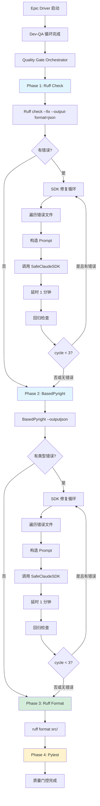

# Ruff & BasedPyright 质量门控架构重构方案

**文档版本**: 1.0  
**创建日期**: 2026-01-13  
**适用范围**: autoBMAD/epic_automation 质量门控系统（Ruff & BasedPyright）  
**参考文档**: 
- 需求文档：`docs/sprint-change.md`
- Pytest重构方案：`docs/refactor/PYTEST_QUALITY_GATE_REFACTOR_PLAN.md`

---

## 一、重构背景与目标

### 1.1 当前问题

现有 Ruff 和 BasedPyright 质量门控实现存在以下局限：

1. **无自动修复机制**：
   - Ruff 和 BasedPyright 检查失败后只记录错误，不进行任何修复尝试
   - 缺少"检查 → SDK修复 → 回归验证"的闭环流程
   - 质量门控变成"单向检测"

2. **缺乏细粒度错误管理**：
   - 无法按文件维度收集和管理错误信息
   - 不支持基于错误信息的自动修复流程

3. **非阻断设计导致失败被忽略**：
   - 质量门控失败不会阻断 epic 流程
   - 缺少后续跟踪和自动修复能力

4. **缺少格式化阶段**：
   - 修复后的代码未经过统一格式化处理
   - 可能存在格式不一致问题

### 1.2 重构目标

1. **建立检查 ↔ SDK 修复的闭环流程**：
   - 检查 → 收集错误详情 → SDK 修复 → 回归验证 → 循环直至通过或达到上限
   - 每次 SDK 调用完成后正确触发取消管理器并等待确认

2. **提供细粒度错误汇总**：
   - 按文件维度收集错误信息
   - 生成结构化数据，供 SDK 修复和人工审查使用

3. **保持非阻断特性**：
   - 即使多轮修复后仍有失败，epic 流程仍能继续
   - 在结果中详细记录修复历史和最终失败状态

4. **增加代码格式化阶段**：
   - 所有检查和修复完成后，执行 `ruff format` 统一代码格式
   - 确保最终代码符合项目规范

5. **与现有架构无缝集成**：
   - 复用 SafeClaudeSDK、SDKExecutor、SDKCancellationManager 等成熟组件
   - 保持 QualityGateOrchestrator 的总控职责不变

---

## 二、架构设计总览

### 2.1 核心组件关系

```
QualityGateOrchestrator
    ↓ (Phase 1: Ruff Check)
QualityCheckController(tool='ruff') (新增)
    ↓ 控制循环
    ├─→ RuffAgent (改造)
    │      ├─ execute() → ruff check --fix 执行
    │      ├─ parse_errors_by_file() → 按文件分组错误
    │      ├─ build_fix_prompt() → 构造修复 Prompt
    │      └─ format() → ruff format 执行 (新增)
    └─→ SafeClaudeSDK → 文件修复

    ↓ (Phase 2: BasedPyright Check)
QualityCheckController(tool='basedpyright') (新增)
    ↓ 控制循环
    ├─→ BasedPyrightAgent (改造)
    │      ├─ execute() → basedpyright 执行
    │      ├─ parse_errors_by_file() → 按文件分组错误
    │      └─ build_fix_prompt() → 构造修复 Prompt
    └─→ SafeClaudeSDK → 文件修复

    ↓ (Phase 3: Ruff Format)
RuffAgent.format() (新增)
    └─→ ruff format 统一格式化
```

### 2.2 完整执行流程

```
┌─────────────────────────────────────────────────────┐
│  Phase 1: Ruff Check 循环（最多 3 轮）                │
│  ┌───────────────────────────────────────────────┐  │
│  │ Round 1: 初始检查                              │  │
│  │  - ruff check --fix --output-format=json     │  │
│  │  - 解析错误 → 按文件分组                       │  │
│  └────────────────┬──────────────────────────────┘  │
│                   ↓                                  │
│         [有错误文件?]                                 │
│                   ↓ YES                              │
│  ┌───────────────────────────────────────────────┐  │
│  │ SDK 修复轮                                     │  │
│  │  - 遍历错误文件                                │  │
│  │  - 构造 Prompt (文件内容+错误信息)             │  │
│  │  - 调用 SafeClaudeSDK (超时10分钟)            │  │
│  │  - 延时 1 分钟后处理下一个文件                 │  │
│  └────────────────┬──────────────────────────────┘  │
│                   ↓                                  │
│  ┌───────────────────────────────────────────────┐  │
│  │ 回归检查轮                                     │  │
│  │  - ruff check --fix --output-format=json     │  │
│  │  - 更新错误文件列表                            │  │
│  └────────────────┬──────────────────────────────┘  │
│                   ↓                                  │
│      [仍有错误 && cycle < 3?]                        │
│                   ↓ YES: 回到 SDK 修复轮             │
│                   ↓ NO: Phase 1 结束                 │
└───────────────────┼──────────────────────────────────┘
                    ↓
┌─────────────────────────────────────────────────────┐
│  Phase 2: BasedPyright Check 循环（最多 3 轮）       │
│  ┌───────────────────────────────────────────────┐  │
│  │ Round 1: 初始检查                              │  │
│  │  - basedpyright --outputjson                 │  │
│  │  - 解析错误 → 按文件分组                       │  │
│  └────────────────┬──────────────────────────────┘  │
│                   ↓                                  │
│         [有类型错误?]                                 │
│                   ↓ YES                              │
│  ┌───────────────────────────────────────────────┐  │
│  │ SDK 修复轮（逻辑同 Ruff）                       │  │
│  │  - 遍历错误文件 → SDK修复 → 延时 1 分钟        │  │
│  └────────────────┬──────────────────────────────┘  │
│                   ↓                                  │
│  ┌───────────────────────────────────────────────┐  │
│  │ 回归检查轮                                     │  │
│  │  - basedpyright --outputjson                 │  │
│  │  - 更新错误文件列表                            │  │
│  └────────────────┬──────────────────────────────┘  │
│                   ↓                                  │
│      [仍有错误 && cycle < 3?]                        │
│                   ↓ YES: 回到 SDK 修复轮             │
│                   ↓ NO: Phase 2 结束                 │
└───────────────────┼──────────────────────────────────┘
                    ↓
┌─────────────────────────────────────────────────────┐
│  Phase 3: Ruff Format（最终格式化）                  │
│  - 执行 ruff format src/                            │
│  - 统一代码格式                                      │
│  - 记录格式化结果                                    │
└─────────────────────────────────────────────────────┘
```

### 2.3 关键约束与配置

| 配置项 | 值 | 说明 |
|-------|-----|------|
| `max_cycles` | 3 | 最大修复循环次数 |
| `sdk_call_delay` | 60秒 (1分钟) | 文件间SDK调用延时 |
| `sdk_timeout` | 600秒 (10分钟) | 单次SDK调用超时 |
| `max_retries_per_file` | 2 | 每文件最大重试次数 |
| `sdk_cancel_confirm` | 必须等待 | 每次SDK调用后必须确认取消成功 |

---

## 三、QualityCheckController 详细设计

### 3.1 类定义与对外接口

```python
class QualityCheckController:
    """
    通用质量检查控制器
    职责：
    - 控制 检查 ↔ SDK 修复 的多轮循环
    - 维护错误文件列表
    - 决定循环终止条件
    - 支持 Ruff 和 BasedPyright 两种工具
    """
    
    def __init__(
        self,
        tool: str,  # 'ruff' | 'basedpyright'
        agent: BaseQualityAgent,
        source_dir: str,
        max_cycles: int = 3,
        sdk_call_delay: int = 60,
        sdk_timeout: int = 600,
    ):
        """
        初始化质量检查控制器
        
        Args:
            tool: 工具类型 ('ruff' 或 'basedpyright')
            agent: 对应的 Agent 实例
            source_dir: 源代码目录
            max_cycles: 最大循环次数
            sdk_call_delay: SDK调用间延时（秒）
            sdk_timeout: SDK超时时间（秒）
        """
        self.tool = tool
        self.agent = agent
        self.source_dir = source_dir
        self.max_cycles = max_cycles
        self.sdk_call_delay = sdk_call_delay
        self.sdk_timeout = sdk_timeout
        
        # 状态
        self.current_cycle: int = 0
        self.error_files: dict[str, list[dict]] = {}
        self.initial_error_files: list[str] = []
        self.final_error_files: list[str] = []
        self.sdk_fix_errors: list[dict[str, Any]] = []
        
        self.logger = logging.getLogger(f"{__name__}.{tool}_controller")
    
    async def run(self) -> dict[str, Any]:
        """
        主入口：执行完整的检查 ↔ SDK 修复循环
        
        Returns:
            {
                "status": "completed" | "failed",
                "tool": "ruff" | "basedpyright",
                "cycles": int,
                "initial_error_files": list[str],
                "final_error_files": list[str],
                "sdk_fix_attempted": bool,
                "sdk_fix_errors": list[dict],
            }
        """
```

### 3.2 方法拆分

#### 3.2.1 主循环驱动：`run()`

```python
async def run(self) -> dict[str, Any]:
    """主循环：检查 → SDK修复 → 回归检查"""
    
    # 1. 首轮全量检查
    self.current_cycle = 1
    error_files = await self._run_check_phase()
    self.initial_error_files = list(error_files.keys())
    
    self.logger.info(
        f"{self.tool} initial check: "
        f"{len(error_files)} files with errors"
    )
    
    # 2. 无错误则直接成功
    if not error_files:
        return self._build_success_result()
    
    # 3. 进入修复循环（最多 3 轮）
    while error_files and self.current_cycle <= self.max_cycles:
        self.logger.info(
            f"{self.tool} cycle {self.current_cycle}/{self.max_cycles}: "
            f"Fixing {len(error_files)} files"
        )
        
        # SDK 修复阶段
        await self._run_sdk_fix_phase(error_files)
        
        # 回归检查阶段
        error_files = await self._run_check_phase()
        
        self.current_cycle += 1
    
    # 4. 构造最终结果
    self.final_error_files = list(error_files.keys())
    return self._build_final_result()
```

#### 3.2.2 检查阶段：`_run_check_phase()`

```python
async def _run_check_phase(self) -> dict[str, list[dict]]:
    """
    执行质量检查，返回按文件分组的错误
    
    Returns:
        {
            "src/module.py": [
                {"line": 10, "message": "...", "code": "F401"},
                {"line": 25, "message": "...", "code": "E501"}
            ],
            "src/utils.py": [...]
        }
    """
    self.logger.info(f"Running {self.tool} check...")
    
    try:
        # 1. 调用 Agent 执行检查
        result = await self.agent.execute(source_dir=self.source_dir)
        
        # 2. 检查执行失败
        if result["status"] != "completed":
            self.logger.error(
                f"{self.tool} check failed: {result.get('error')}"
            )
            return {}
        
        # 3. 提取按文件分组的错误
        issues = result.get("issues", [])
        if not issues:
            self.logger.info(f"{self.tool} check passed: no errors found")
            return {}
        
        # 4. 解析错误
        errors_by_file = self.agent.parse_errors_by_file(issues)
        
        self.logger.info(
            f"{self.tool} found {len(issues)} errors "
            f"in {len(errors_by_file)} files"
        )
        
        return errors_by_file
    
    except Exception as e:
        self.logger.error(f"{self.tool} check exception: {e}", exc_info=True)
        return {}
```

#### 3.2.3 SDK 修复阶段：`_run_sdk_fix_phase()`

```python
async def _run_sdk_fix_phase(
    self,
    error_files: dict[str, list[dict]]
) -> None:
    """
    针对每个错误文件，调用 SDK 修复
    
    核心流程（每个文件）：
    1. 读取文件内容
    2. 构造修复 Prompt
    3. 调用 SafeClaudeSDK
    4. 接收 ResultMessage
    5. 触发取消并等待确认
    6. 延时 1 分钟后处理下一个文件
    
    Args:
        error_files: {"文件路径": [错误列表]}
    """
    total_files = len(error_files)
    
    for idx, (file_path, errors) in enumerate(error_files.items(), 1):
        self.logger.info(
            f"[{idx}/{total_files}] Fixing {file_path} "
            f"({len(errors)} errors) - Cycle {self.current_cycle}"
        )
        
        try:
            # 1. 读取文件内容
            try:
                with open(file_path, "r", encoding="utf-8") as f:
                    file_content = f.read()
            except Exception as e:
                self.logger.error(f"Failed to read {file_path}: {e}")
                self.sdk_fix_errors.append({
                    "file": file_path,
                    "error": f"File read error: {str(e)}",
                    "cycle": self.current_cycle,
                })
                continue
            
            # 2. 构造 Prompt
            prompt = self.agent.build_fix_prompt(
                tool=self.tool,
                file_path=file_path,
                file_content=file_content,
                errors=errors,
            )
            
            # 3. 调用 SDK
            sdk_result = await self._execute_sdk_fix(
                prompt=prompt,
                file_path=file_path,
            )
            
            if not sdk_result.get("success"):
                self.sdk_fix_errors.append({
                    "file": file_path,
                    "error": sdk_result.get("error"),
                    "cycle": self.current_cycle,
                })
            
            # 4. 延时 1 分钟（除最后一个文件）
            if idx < total_files:
                self.logger.debug(
                    f"Waiting {self.sdk_call_delay}s before next SDK call..."
                )
                await asyncio.sleep(self.sdk_call_delay)
        
        except Exception as e:
            self.logger.error(
                f"SDK fix failed for {file_path}: {e}", 
                exc_info=True
            )
            self.sdk_fix_errors.append({
                "file": file_path,
                "error": str(e),
                "cycle": self.current_cycle,
            })
```

#### 3.2.4 SDK 调用与取消：`_execute_sdk_fix()`

```python
async def _execute_sdk_fix(
    self,
    prompt: str,
    file_path: str,
) -> dict[str, Any]:
    """
    执行单个文件的 SDK 修复调用
    
    流程：
    1. 通过 SafeClaudeSDK 发起调用
    2. 监听 ResultMessage（完成信号）
    3. 收到完成信号 → 触发取消
    4. 等待取消确认
    5. 返回结果
    """
    from ..sdk_wrapper import SafeClaudeSDK
    from ..core.sdk_executor import SDKExecutor
    
    try:
        # 构造 SDK 包装器
        sdk = SafeClaudeSDK(
            prompt=prompt,
            options={"model": "claude-3-5-sonnet-20241022"},
            timeout=float(self.sdk_timeout),
        )
        
        # 定义完成标记
        end_markers = [
            "END_OF_FIX",
            f"{self.tool.upper()}_FIX_COMPLETE",
        ]
        
        # 通过 SDKExecutor 执行
        executor = SDKExecutor()
        result = await executor.execute(
            sdk_func=sdk.execute,
            target_predicate=lambda msg: (
                msg.get("type") == "done" or 
                any(marker in str(msg) for marker in end_markers)
            ),
            agent_name=f"{self.tool.capitalize()}Agent",
        )
        
        # SDKExecutor 内部已处理取消逻辑
        self.logger.info(f"SDK fix completed for {file_path}")
        return {"success": True, "result": result}
    
    except Exception as e:
        self.logger.error(f"SDK execution failed for {file_path}: {e}")
        return {"success": False, "error": str(e)}
```

#### 3.2.5 辅助方法

```python
def _build_success_result(self) -> dict[str, Any]:
    """构造成功结果"""
    return {
        "status": "completed",
        "tool": self.tool,
        "cycles": self.current_cycle,
        "initial_error_files": self.initial_error_files,
        "final_error_files": [],
        "sdk_fix_attempted": False,
        "sdk_fix_errors": [],
    }

def _build_final_result(self) -> dict[str, Any]:
    """构造最终结果"""
    success = len(self.final_error_files) == 0
    
    return {
        "status": "completed" if success else "failed",
        "tool": self.tool,
        "cycles": self.current_cycle,
        "initial_error_files": self.initial_error_files,
        "final_error_files": self.final_error_files,
        "sdk_fix_attempted": True,
        "sdk_fix_errors": self.sdk_fix_errors,
    }
```

---

## 四、RuffAgent 接口改造

### 4.1 新增方法

```python
class RuffAgent(BaseQualityAgent):
    """Ruff 代码风格检查 Agent（改造版）"""
    
    def __init__(self, task_group: TaskGroup | None = None):
        super().__init__("Ruff", task_group)
    
    async def execute(
        self,
        source_dir: str,
        **kwargs: Any
    ) -> dict[str, Any]:
        """
        执行 Ruff 检查（增加 --fix 自动修复）
        
        Args:
            source_dir: 源代码目录
        
        Returns:
            {
                "status": "completed" | "failed",
                "errors": int,
                "warnings": int,
                "files_checked": int,
                "issues": list[dict],  # 原始错误列表
                "message": str
            }
        """
        self.logger.info("Running Ruff checks with auto-fix")
        
        try:
            # 构建 Ruff 命令（增加 --fix）
            command = f"ruff check --fix --output-format=json {source_dir}"
            
            result: dict[str, Any] = await self._run_subprocess(command)
            
            if result["status"] == "completed":
                # 解析 JSON 输出
                import json
                try:
                    issues_list: list[Any] = json.loads(result["stdout"]) if result["stdout"] else []
                    error_count = len([i for i in issues_list if i.get("severity") == "error"])
                    warning_count = len([i for i in issues_list if i.get("severity") == "warning"])
                    filenames = {i.get("filename", "") for i in issues_list}
                    files_count = len(filenames)
                    
                    return {
                        "status": "completed",
                        "errors": error_count,
                        "warnings": warning_count,
                        "files_checked": files_count,
                        "issues": issues_list,
                        "message": f"Found {len(issues_list)} issues (after auto-fix)"
                    }
                except json.JSONDecodeError:
                    return {
                        "status": "completed",
                        "errors": 0,
                        "warnings": 0,
                        "files_checked": 0,
                        "issues": [],
                        "message": "Check completed (no JSON output)"
                    }
            else:
                return result
        
        except Exception as e:
            self.logger.error(f"Ruff check failed: {e}")
            return {
                "status": "failed",
                "error": str(e)
            }
    
    def parse_errors_by_file(
        self,
        issues: list[dict]
    ) -> dict[str, list[dict]]:
        """
        按文件路径分组错误
        
        Args:
            issues: ruff JSON 输出的 issues 列表
        
        Returns:
            {"src/a.py": [error1, error2], ...}
        """
        errors_by_file: dict[str, list[dict]] = {}
        
        for issue in issues:
            file_path = issue.get("filename", "")
            if not file_path:
                continue
            
            if file_path not in errors_by_file:
                errors_by_file[file_path] = []
            
            # 提取关键错误信息
            location = issue.get("location", {})
            errors_by_file[file_path].append({
                "line": location.get("row"),
                "column": location.get("column"),
                "code": issue.get("code"),
                "message": issue.get("message"),
                "severity": issue.get("severity", "error"),
            })
        
        return errors_by_file
    
    def build_fix_prompt(
        self,
        tool: str,
        file_path: str,
        file_content: str,
        errors: list[dict],
    ) -> str:
        """
        构造 Ruff 修复 Prompt
        
        Args:
            tool: 工具名称 ('ruff')
            file_path: 文件路径
            file_content: 文件内容
            errors: 错误列表
        
        Returns:
            完整的修复 Prompt
        """
        errors_summary = self._format_errors_summary(errors)
        
        return RUFF_FIX_PROMPT.format(
            file_path=file_path,
            file_content=file_content,
            errors_summary=errors_summary,
        )
    
    def _format_errors_summary(self, errors: list[dict]) -> str:
        """格式化错误摘要"""
        lines = []
        for i, error in enumerate(errors, 1):
            lines.append(f"""
### Error {i}
- **Line**: {error.get('line')}
- **Column**: {error.get('column')}
- **Code**: `{error.get('code')}`
- **Message**: {error.get('message')}
- **Severity**: {error.get('severity')}""".strip())
        
        return "\n\n".join(lines)
    
    async def format(self, source_dir: str) -> dict[str, Any]:
        """
        执行 ruff format（新增）
        
        Args:
            source_dir: 源代码目录
        
        Returns:
            {
                "status": "completed" | "failed",
                "formatted": bool,
                "message": str
            }
        """
        self.logger.info("Running ruff format")
        
        try:
            command = f"ruff format {source_dir}"
            result = await self._run_subprocess(command)
            
            formatted = result["returncode"] == 0
            
            return {
                "status": "completed" if formatted else "failed",
                "formatted": formatted,
                "message": "Code formatted successfully" if formatted else "Format failed",
            }
        
        except Exception as e:
            self.logger.error(f"Ruff format failed: {e}")
            return {
                "status": "failed",
                "formatted": False,
                "error": str(e)
            }
```

### 4.2 Prompt 模板

```python
# Ruff 修复 Prompt 模板
RUFF_FIX_PROMPT = """
<system>
你是一名资深 Python 代码质量专家，专精于 Ruff 代码风格修复。

目标：
- 根据给定的文件和 Ruff 错误信息，输出修复方案，使代码通过 Ruff 检查。
- 保持业务逻辑不变，只修复代码风格问题。

约束：
- 只修改必要的代码以解决 Ruff 报告的问题。
- 不进行无关的重构或优化。
- 保持代码的可读性和一致性。
- 遵循 PEP 8 规范。

输出格式示例：
## Summary of Changes
- 修复点 1：移除未使用的导入
- 修复点 2：修正行长度问题

## Fixed File
### File: {file_path}
```python
# 完整修复后的文件内容
```

<RUFF_FIX_COMPLETE>
</system>

<user>
## File Information
- **File path**: {file_path}

## File Content (Current)
```python
{file_content}
```

## Ruff Errors
{errors_summary}

## Expected Result
修复上述所有 Ruff 错误，使代码通过 Ruff 检查。输出完整修复后的文件内容。
</user>
"""
```

---

## 五、BasedPyrightAgent 接口改造

### 5.1 新增方法

```python
class BasedPyrightAgent(BaseQualityAgent):
    """BasedPyright 类型检查 Agent（改造版）"""
    
    def __init__(self, task_group: TaskGroup | None = None):
        super().__init__("BasedPyright", task_group)
    
    async def execute(self, source_dir: str, **kwargs: Any) -> dict[str, Any]:
        """
        执行 BasedPyright 检查
        
        Args:
            source_dir: 源代码目录
        
        Returns:
            {
                "status": "completed" | "failed",
                "errors": int,
                "warnings": int,
                "files_checked": int,
                "issues": list[dict],
                "message": str
            }
        """
        self.logger.info("Running BasedPyright checks")
        
        try:
            # 构建 BasedPyright 命令
            command = f"basedpyright --outputjson {source_dir}"
            
            result: dict[str, Any] = await self._run_subprocess(command)
            
            if result["status"] == "completed":
                # 解析 JSON 输出
                import json
                try:
                    output_dict: dict[str, Any] = json.loads(result["stdout"]) if result["stdout"] else {}
                    issues_list: list[Any] = output_dict.get("generalDiagnostics", [])
                    error_count = len([i for i in issues_list if i.get("severity") == "error"])
                    warning_count = len([i for i in issues_list if i.get("severity") == "warning"])
                    files_set = {i.get("file", "") for i in issues_list}
                    files_count = len(files_set)
                    
                    return {
                        "status": "completed",
                        "errors": error_count,
                        "warnings": warning_count,
                        "files_checked": files_count,
                        "issues": issues_list,
                        "message": f"Found {len(issues_list)} type issues"
                    }
                except json.JSONDecodeError:
                    return {
                        "status": "completed",
                        "errors": 0,
                        "warnings": 0,
                        "files_checked": 0,
                        "issues": [],
                        "message": "Check completed (no JSON output)"
                    }
            else:
                return result
        
        except Exception as e:
            self.logger.error(f"BasedPyright check failed: {e}")
            return {
                "status": "failed",
                "error": str(e)
            }
    
    def parse_errors_by_file(
        self,
        issues: list[dict]
    ) -> dict[str, list[dict]]:
        """
        按文件路径分组错误
        
        Args:
            issues: basedpyright JSON 输出的 generalDiagnostics
        
        Returns:
            {"src/x.py": [error1], ...}
        """
        errors_by_file: dict[str, list[dict]] = {}
        
        for issue in issues:
            file_path = issue.get("file", "")
            if not file_path:
                continue
            
            if file_path not in errors_by_file:
                errors_by_file[file_path] = []
            
            # 提取关键错误信息
            range_info = issue.get("range", {})
            start_info = range_info.get("start", {})
            
            errors_by_file[file_path].append({
                "line": start_info.get("line"),
                "column": start_info.get("character"),
                "rule": issue.get("rule"),
                "message": issue.get("message"),
                "severity": issue.get("severity", "error"),
            })
        
        return errors_by_file
    
    def build_fix_prompt(
        self,
        tool: str,
        file_path: str,
        file_content: str,
        errors: list[dict],
    ) -> str:
        """构造 BasedPyright 修复 Prompt"""
        errors_summary = self._format_errors_summary(errors)
        
        return BASEDPYRIGHT_FIX_PROMPT.format(
            file_path=file_path,
            file_content=file_content,
            errors_summary=errors_summary,
        )
    
    def _format_errors_summary(self, errors: list[dict]) -> str:
        """格式化错误摘要"""
        lines = []
        for i, error in enumerate(errors, 1):
            lines.append(f"""
### Type Error {i}
- **Line**: {error.get('line')}
- **Column**: {error.get('column')}
- **Rule**: `{error.get('rule')}`
- **Message**: {error.get('message')}
- **Severity**: {error.get('severity')}""".strip())
        
        return "\n\n".join(lines)
```

### 5.2 Prompt 模板

```python
# BasedPyright 修复 Prompt 模板
BASEDPYRIGHT_FIX_PROMPT = """
<system>
你是一名资深 Python 类型注解专家，专精于 BasedPyright 类型检查修复。

目标：
- 根据给定的文件和类型错误信息，输出修复方案，使代码通过类型检查。
- 添加必要的类型注解，修复类型不匹配问题。

约束：
- 只修改必要的代码以解决类型检查问题。
- 使用标准的 typing 模块类型注解。
- 保持业务逻辑不变。
- 确保类型注解准确、完整。

输出格式示例：
## Summary of Changes
- 修复点 1：添加函数返回类型注解
- 修复点 2：修正参数类型不匹配

## Fixed File
### File: {file_path}
```python
# 完整修复后的文件内容
```

<BASEDPYRIGHT_FIX_COMPLETE>
</system>

<user>
## File Information
- **File path**: {file_path}

## File Content (Current)
```python
{file_content}
```

## BasedPyright Type Errors
{errors_summary}

## Expected Result
修复上述所有类型检查错误，添加必要的类型注解。输出完整修复后的文件内容。
</user>
"""
```

---

## 六、QualityGateOrchestrator 集成

### 6.1 execute_ruff_agent() 改造

```python
async def execute_ruff_agent(self, source_dir: str) -> dict[str, Any]:
    """执行 Ruff 质量门（改造版：使用 QualityCheckController）"""
    
    if self.skip_quality:
        self.logger.info("Skipping Ruff quality check (--skip-quality flag)")
        return {"success": True, "skipped": True, "message": "Skipped via CLI flag"}
    
    self.logger.info("=== Quality Gate 1/3: Ruff Check with SDK Fix ===")
    self._update_progress("phase_1_ruff", "in_progress", start=True)
    
    try:
        # 导入质量检查控制器
        from .controllers.quality_check_controller import QualityCheckController
        from .agents.quality_agents import RuffAgent
        
        # 创建 Agent 实例
        ruff_agent = RuffAgent()
        
        # 创建控制器
        controller = QualityCheckController(
            tool="ruff",
            agent=ruff_agent,
            source_dir=source_dir,
            max_cycles=3,
            sdk_call_delay=60,
            sdk_timeout=600,
        )
        
        start_time = time.time()
        ruff_result = await controller.run()
        end_time = time.time()
        
        # 判断成功与否
        success = ruff_result["status"] == "completed"
        
        if success:
            self.logger.info(
                f"✓ Ruff quality gate PASSED after {ruff_result['cycles']} cycle(s) "
                f"in {self._calculate_duration(start_time, end_time)}s"
            )
            self._update_progress("phase_1_ruff", "completed", end=True)
            return {
                "success": True,
                "duration": self._calculate_duration(start_time, end_time),
                "result": ruff_result,
            }
        else:
            error_msg = (
                f"Ruff quality gate FAILED after {ruff_result['cycles']} cycle(s): "
                f"{len(ruff_result['final_error_files'])} file(s) still have errors"
            )
            self.logger.warning(f"✗ {error_msg}")
            self._update_progress("phase_1_ruff", "failed", end=True)
            self.results["errors"].append(error_msg)
            
            return {
                "success": False,
                "error": error_msg,
                "duration": self._calculate_duration(start_time, end_time),
                "result": ruff_result,
            }
    
    except Exception as e:
        error_msg = f"Ruff execution error: {str(e)}"
        self.logger.error(error_msg, exc_info=True)
        self._update_progress("phase_1_ruff", "error", end=True)
        self.results["errors"].append(error_msg)
        return {"success": False, "error": error_msg, "duration": 0.0}
```

### 6.2 execute_basedpyright_agent() 改造

```python
async def execute_basedpyright_agent(self, source_dir: str) -> dict[str, Any]:
    """执行 BasedPyright 质量门（改造版：使用 QualityCheckController）"""
    
    if self.skip_quality:
        self.logger.info(
            "Skipping Basedpyright quality check (--skip-quality flag)"
        )
        return {"success": True, "skipped": True, "message": "Skipped via CLI flag"}
    
    self.logger.info("=== Quality Gate 2/3: BasedPyright Check with SDK Fix ===")
    self._update_progress("phase_2_basedpyright", "in_progress", start=True)
    
    try:
        # 导入质量检查控制器
        from .controllers.quality_check_controller import QualityCheckController
        from .agents.quality_agents import BasedPyrightAgent
        
        # 创建 Agent 实例
        basedpyright_agent = BasedPyrightAgent()
        
        # 创建控制器
        controller = QualityCheckController(
            tool="basedpyright",
            agent=basedpyright_agent,
            source_dir=source_dir,
            max_cycles=3,
            sdk_call_delay=60,
            sdk_timeout=600,
        )
        
        start_time = time.time()
        basedpyright_result = await controller.run()
        end_time = time.time()
        
        # 判断成功与否
        success = basedpyright_result["status"] == "completed"
        
        if success:
            self.logger.info(
                f"✓ BasedPyright quality gate PASSED after {basedpyright_result['cycles']} cycle(s) "
                f"in {self._calculate_duration(start_time, end_time)}s"
            )
            self._update_progress("phase_2_basedpyright", "completed", end=True)
            return {
                "success": True,
                "duration": self._calculate_duration(start_time, end_time),
                "result": basedpyright_result,
            }
        else:
            error_msg = (
                f"BasedPyright quality gate FAILED after {basedpyright_result['cycles']} cycle(s): "
                f"{len(basedpyright_result['final_error_files'])} file(s) still have type errors"
            )
            self.logger.warning(f"✗ {error_msg}")
            self._update_progress("phase_2_basedpyright", "failed", end=True)
            self.results["errors"].append(error_msg)
            
            return {
                "success": False,
                "error": error_msg,
                "duration": self._calculate_duration(start_time, end_time),
                "result": basedpyright_result,
            }
    
    except Exception as e:
        error_msg = f"BasedPyright execution error: {str(e)}"
        self.logger.error(error_msg, exc_info=True)
        self._update_progress("phase_2_basedpyright", "error", end=True)
        self.results["errors"].append(error_msg)
        return {"success": False, "error": error_msg, "duration": 0.0}
```

### 6.3 execute_ruff_format() 新增

```python
async def execute_ruff_format(self, source_dir: str) -> dict[str, Any]:
    """执行 Ruff Format（新增）"""
    
    self.logger.info("=== Quality Gate Final: Ruff Format ===")
    self._update_progress("phase_final_format", "in_progress", start=True)
    
    try:
        from .agents.quality_agents import RuffAgent
        
        ruff_agent = RuffAgent()
        
        start_time = time.time()
        format_result = await ruff_agent.format(source_dir)
        end_time = time.time()
        
        if format_result["formatted"]:
            self.logger.info(
                f"✓ Code formatted successfully "
                f"in {self._calculate_duration(start_time, end_time)}s"
            )
            self._update_progress("phase_final_format", "completed", end=True)
            return {
                "success": True,
                "duration": self._calculate_duration(start_time, end_time),
                "result": format_result,
            }
        else:
            error_msg = "Ruff format failed"
            self.logger.warning(f"✗ {error_msg}")
            self._update_progress("phase_final_format", "failed", end=True)
            # 注意：格式化失败不应阻断流程
            return {
                "success": True,  # 仍返回 True，保持非阻断特性
                "warning": error_msg,
                "duration": self._calculate_duration(start_time, end_time),
                "result": format_result,
            }
    
    except Exception as e:
        error_msg = f"Ruff format error: {str(e)}"
        self.logger.error(error_msg, exc_info=True)
        self._update_progress("phase_final_format", "error", end=True)
        # 格式化错误也不阻断
        return {
            "success": True,
            "warning": error_msg,
            "duration": 0.0
        }
```

### 6.4 execute_quality_gates() 更新

```python
async def execute_quality_gates(self, epic_id: str) -> dict[str, Any]:
    """
    执行完整质量门控流水线（更新版）
    
    流程：
    1. Phase 1: Ruff Check（检查 → SDK修复 → 回归）
    2. Phase 2: BasedPyright Check（检查 → SDK修复 → 回归）
    3. Phase 3: Ruff Format（最终格式化）
    """
    self.logger.info(f"Starting quality gates pipeline for epic: {epic_id}")
    self.results["start_time"] = time.time()
    
    try:
        # Phase 1: Ruff Check
        if not self.skip_quality:
            ruff_result = await self.execute_ruff_agent(self.source_dir)
            self.results["ruff"] = ruff_result
            
            # Ruff 失败不阻断，继续执行
            if not ruff_result["success"]:
                self.logger.warning("Ruff check failed, but continuing...")
        
        # Phase 2: BasedPyright Check
        if not self.skip_quality:
            basedpyright_result = await self.execute_basedpyright_agent(
                self.source_dir
            )
            self.results["basedpyright"] = basedpyright_result
            
            # BasedPyright 失败不阻断，继续执行
            if not basedpyright_result["success"]:
                self.logger.warning("BasedPyright check failed, but continuing...")
        
        # Phase 3: Ruff Format（新增）
        if not self.skip_quality:
            format_result = await self.execute_ruff_format(self.source_dir)
            self.results["ruff_format"] = format_result
        
        # Phase 4: Pytest（保持原有逻辑）
        if not self.skip_tests:
            pytest_result = await self.execute_pytest_agent(self.test_dir)
            self.results["pytest"] = pytest_result
            if not pytest_result["success"]:
                self.results["success"] = False
                self.logger.warning("Quality gates completed with pytest failure")
        else:
            self.logger.info("Skipping pytest (--skip-tests flag set)")
        
        return self._finalize_results()
    
    except Exception as e:
        error_msg = f"Quality gates pipeline error: {str(e)}"
        self.logger.error(error_msg, exc_info=True)
        self.results["success"] = False
        self.results["errors"].append(error_msg)
        return self._finalize_results()
```

### 6.5 results 结构更新

```python
# 在 __init__ 中更新 results 结构
self.results: dict[str, Any] = {
    "success": True,
    "ruff": None,
    "basedpyright": None,
    "ruff_format": None,  # 新增
    "pytest": None,
    "errors": [],
    "start_time": None,
    "end_time": None,
    "total_duration": 0.0,
    "progress": {
        "current_phase": "not_started",
        "phase_1_ruff": {
            "status": "pending",
            "start_time": None,
            "end_time": None,
        },
        "phase_2_basedpyright": {
            "status": "pending",
            "start_time": None,
            "end_time": None,
        },
        "phase_final_format": {  # 新增
            "status": "pending",
            "start_time": None,
            "end_time": None,
        },
        "phase_3_pytest": {
            "status": "pending",
            "start_time": None,
            "end_time": None,
        },
    },
}
```

---

## 七、实施计划

### 7.1 阶段划分

| 阶段 | 任务 | 预估工时 | 依赖 |
|-----|------|---------|------|
| **Phase 1** | QualityCheckController 基础框架 | 2天 | 无 |
| | - 创建 `controllers/quality_check_controller.py` | | |
| | - 实现主循环逻辑与状态管理 | | |
| | - 实现检查、修复、回归三阶段 | | |
| **Phase 2** | RuffAgent 接口改造 | 1.5天 | Phase 1 |
| | - 改造 `execute()` 方法（增加 --fix） | | |
| | - 实现 `parse_errors_by_file()` | | |
| | - 实现 `build_fix_prompt()` | | |
| | - 实现 `format()` 方法 | | |
| **Phase 3** | BasedPyrightAgent 接口改造 | 1.5天 | Phase 1 |
| | - 实现 `parse_errors_by_file()` | | |
| | - 实现 `build_fix_prompt()` | | |
| | - Prompt 模板编写 | | |
| **Phase 4** | QualityGateOrchestrator 集成 | 1天 | Phase 2, 3 |
| | - 改造 `execute_ruff_agent()` | | |
| | - 改造 `execute_basedpyright_agent()` | | |
| | - 新增 `execute_ruff_format()` | | |
| | - 更新 `execute_quality_gates()` | | |
| **Phase 5** | 单元测试与集成测试 | 2天 | Phase 4 |
| | - QualityCheckController 单元测试 | | |
| | - Agent 方法单元测试 | | |
| | - 端到端集成测试 | | |
| **Phase 6** | 文档与验收 | 1天 | Phase 5 |
| | - 更新 README | | |
| | - 编写使用文档 | | |
| | - 验收测试 | | |

**总计：9 工作日**

### 7.2 文件清单

#### 新增文件
- `autoBMAD/epic_automation/controllers/__init__.py`
- `autoBMAD/epic_automation/controllers/quality_check_controller.py`

#### 修改文件
- `autoBMAD/epic_automation/agents/quality_agents.py`
  - `RuffAgent`: 新增 `parse_errors_by_file()`, `build_fix_prompt()`, `format()`, 修改 `execute()`
  - `BasedPyrightAgent`: 新增 `parse_errors_by_file()`, `build_fix_prompt()`
  - 新增 Prompt 模板：`RUFF_FIX_PROMPT`, `BASEDPYRIGHT_FIX_PROMPT`

- `autoBMAD/epic_automation/epic_driver.py`
  - `QualityGateOrchestrator.__init__()`: 更新 results 结构
  - `QualityGateOrchestrator.execute_ruff_agent()`: 完全重写
  - `QualityGateOrchestrator.execute_basedpyright_agent()`: 完全重写
  - `QualityGateOrchestrator.execute_ruff_format()`: 新增
  - `QualityGateOrchestrator.execute_quality_gates()`: 更新流程

#### 新增测试文件
- `tests/unit/test_quality_check_controller.py`
- `tests/unit/test_ruff_agent_refactor.py`
- `tests/unit/test_basedpyright_agent_refactor.py`
- `tests/integration/test_quality_gates_sdk_fix_workflow.py`

---

## 八、风险与缓解

### 8.1 风险清单

| 风险 | 影响 | 概率 | 缓解措施 |
|-----|------|------|---------|
| SDK 修复效果不理想 | 循环无效，仍然失败 | 中 | - 优化 Prompt 模板<br>- 增加人工审查环节<br>- 记录修复历史供调优 |
| SDK 调用超时频繁 | 流程耗时过长 | 中 | - 设置合理超时（10分钟）<br>- 失败重试机制<br>- 超时文件跳过 |
| Ruff --fix 引入新问题 | 自动修复产生错误 | 低 | - 使用 `--unsafe-fixes=false`<br>- 回归测试验证<br>- Git 版本控制 |
| 取消管理器兼容性 | SDK 调用阻塞 | 低 | - 复用现有成熟组件<br>- 充分单元测试<br>- 异常处理完善 |
| 延时 1 分钟累积耗时长 | 总流程时间过长 | 中 | - 可配置化延时参数<br>- 仅在必要时延时<br>- 考虑并发修复（未来） |

### 8.2 回滚方案

如果重构出现问题，可快速回滚到原有实现：

1. **保留原有 Agent 方法**：在新方法旁保留原 `execute()` 方法
2. **功能开关**：通过环境变量控制是否启用新流程
3. **Git 分支**：在独立分支开发，主分支保持稳定
4. **渐进式部署**：先部署 Ruff，验证后再部署 BasedPyright

---

## 九、验收标准

### 9.1 功能验收

- [ ] QualityCheckController 能正确执行 3 轮"检查 → SDK修复 → 回归"循环
- [ ] Ruff 和 BasedPyright 分别能按文件分组错误
- [ ] SDK 调用后能正确触发取消并等待确认
- [ ] 质量门控失败不阻断 epic 流程
- [ ] 所有错误文件在结果中正确记录
- [ ] Ruff format 在所有检查后正确执行
- [ ] Ruff check 使用 --fix 自动修复简单问题

### 9.2 性能验收

- [ ] 单文件 SDK 修复不超过 10 分钟
- [ ] Ruff check 执行时间 < 30 秒
- [ ] BasedPyright check 执行时间 < 60 秒
- [ ] Ruff format 执行时间 < 10 秒
- [ ] 完整 3 轮循环（假设 10 个错误文件）在 40 分钟内完成

### 9.3 质量验收

- [ ] 单元测试覆盖率 > 80%
- [ ] 集成测试覆盖完整流程
- [ ] 无 basedpyright 类型错误
- [ ] 无 ruff 代码风格问题
- [ ] 所有异常有正确的日志记录

---

## 十、配置说明

### 10.1 环境变量配置

```bash
# SDK 配置
CLAUDE_API_KEY=your_api_key_here
SDK_CALL_DELAY=60          # SDK 调用间延时（秒）
SDK_TIMEOUT=600            # SDK 超时时间（秒）

# 质量门控配置
MAX_QUALITY_CYCLES=3       # 最大循环次数
SKIP_QUALITY=false         # 是否跳过质量门控
SKIP_TESTS=false           # 是否跳过测试
```

### 10.2 pyproject.toml 配置

```toml
[tool.quality_gates]
max_cycles = 3
sdk_call_delay = 60
sdk_timeout = 600
max_retries_per_file = 2

[tool.ruff]
line-length = 88
target-version = "py38"
select = ["E", "F", "B", "I", "C4", "UP"]
ignore = ["E501"]

[tool.basedpyright]
pythonVersion = "3.8"
typeCheckingMode = "basic"
reportMissingImports = true
```

---

## 十一、使用示例

### 11.1 基本使用

```bash
# 完整质量门控流程（包含 Ruff、BasedPyright、Format、Pytest）
python -m autoBMAD.epic_automation.epic_driver docs/epics/my-epic.md

# 跳过质量门控
python -m autoBMAD.epic_automation.epic_driver docs/epics/my-epic.md --skip-quality

# 跳过测试
python -m autoBMAD.epic_automation.epic_driver docs/epics/my-epic.md --skip-tests

# 详细日志
python -m autoBMAD.epic_automation.epic_driver docs/epics/my-epic.md --verbose
```

### 11.2 独立运行质量门控

```python
# 仅运行质量门控（不运行完整 epic 流程）
from autoBMAD.epic_automation.epic_driver import QualityGateOrchestrator

orchestrator = QualityGateOrchestrator(
    source_dir="src",
    test_dir="tests",
    skip_quality=False,
    skip_tests=False,
)

results = await orchestrator.execute_quality_gates("test_epic")

print(f"Ruff: {results['ruff']['success']}")
print(f"BasedPyright: {results['basedpyright']['success']}")
print(f"Format: {results['ruff_format']['success']}")
print(f"Pytest: {results['pytest']['success']}")
```

---

## 十二、后续优化方向

### 12.1 短期优化（1-2 个月）

1. **Prompt 模板优化**
   - 收集修复成功率数据
   - 优化 Prompt 指令和示例
   - 添加更多上下文信息

2. **性能优化**
   - 减少不必要的延时
   - 优化 JSON 解析性能
   - 缓存检查结果

3. **日志与监控**
   - 增加详细的性能指标
   - 记录 SDK 修复成功率
   - 生成可视化报告

### 12.2 中期优化（3-6 个月）

1. **并发修复**
   - 支持多文件并发 SDK 调用
   - 动态调整并发数量
   - 防止 API 速率限制

2. **增量检查**
   - 仅检查变更的文件
   - 基于 Git diff 的智能检查
   - 缓存检查结果

3. **智能重试**
   - 根据错误类型调整重试策略
   - 学习历史修复模式
   - 跳过无法修复的文件

### 12.3 长期优化（6-12 个月）

1. **机器学习增强**
   - 基于历史数据优化 Prompt
   - 预测修复成功率
   - 自动调整策略

2. **多模型支持**
   - 支持不同 LLM 模型
   - 模型选择策略
   - 成本优化

3. **可视化界面**
   - Web Dashboard
   - 实时进度监控
   - 历史数据分析

---

## 十三、参考资料

### 13.1 内部文档
- `docs/sprint-change.md` - 原始需求文档
- `docs/refactor/PYTEST_QUALITY_GATE_REFACTOR_PLAN.md` - Pytest 重构方案
- `autoBMAD/agentdocs/` - SDK 会话成功标志文档

### 13.2 外部文档
- [Ruff 官方文档](https://docs.astral.sh/ruff/)
- [BasedPyright 官方文档](https://github.com/DetachHead/basedpyright)
- [Claude API SDK 文档](https://github.com/anthropics/anthropic-sdk-python)

### 13.3 工具命令参考
```bash
# Ruff 命令
ruff check --help
ruff format --help
ruff check --fix --output-format=json src/

# BasedPyright 命令
basedpyright --help
basedpyright --outputjson src/
```

---

## 附录 A：完整流程图



---

## 附录 B：错误分组示例

### Ruff 错误分组
```json
{
  "src/module.py": [
    {
      "line": 10,
      "column": 5,
      "code": "F401",
      "message": "'os' imported but unused",
      "severity": "error"
    },
    {
      "line": 25,
      "column": 81,
      "code": "E501",
      "message": "Line too long (95 > 88 characters)",
      "severity": "error"
    }
  ],
  "src/utils.py": [
    {
      "line": 15,
      "column": 1,
      "code": "I001",
      "message": "Import block is un-sorted or un-formatted",
      "severity": "error"
    }
  ]
}
```

### BasedPyright 错误分组
```json
{
  "src/service.py": [
    {
      "line": 20,
      "column": 15,
      "rule": "reportGeneralTypeIssues",
      "message": "Argument of type 'str' cannot be assigned to parameter 'value' of type 'int'",
      "severity": "error"
    },
    {
      "line": 35,
      "column": 8,
      "rule": "reportMissingTypeStubs",
      "message": "Type of 'result' is unknown",
      "severity": "warning"
    }
  ]
}
```

---

## 附录 C：SDK 修复结果示例

### 成功修复
```json
{
  "success": true,
  "result": {
    "type": "done",
    "message_count": 5,
    "content": "## Summary of Changes\n- Removed unused import 'os'\n- Fixed line length issue\n\n## Fixed File\n### File: src/module.py\n```python\n# 修复后的完整代码\n```\n\n<RUFF_FIX_COMPLETE>"
  }
}
```

### 失败修复
```json
{
  "success": false,
  "error": "SDK timeout after 600 seconds"
}
```

---

## 附录 D：QualityCheckController 完整示例

```python
# 示例：使用 QualityCheckController
import asyncio
from autoBMAD.epic_automation.controllers.quality_check_controller import QualityCheckController
from autoBMAD.epic_automation.agents.quality_agents import RuffAgent

async def main():
    # 创建 Agent
    ruff_agent = RuffAgent()
    
    # 创建 Controller
    controller = QualityCheckController(
        tool="ruff",
        agent=ruff_agent,
        source_dir="src",
        max_cycles=3,
        sdk_call_delay=60,
        sdk_timeout=600,
    )
    
    # 执行
    result = await controller.run()
    
    # 输出结果
    print(f"Status: {result['status']}")
    print(f"Cycles: {result['cycles']}")
    print(f"Initial errors: {len(result['initial_error_files'])} files")
    print(f"Final errors: {len(result['final_error_files'])} files")
    
    if result['sdk_fix_errors']:
        print("\nSDK Fix Errors:")
        for error in result['sdk_fix_errors']:
            print(f"  - {error['file']}: {error['error']}")

if __name__ == "__main__":
    asyncio.run(main())
```

---

**文档结束**