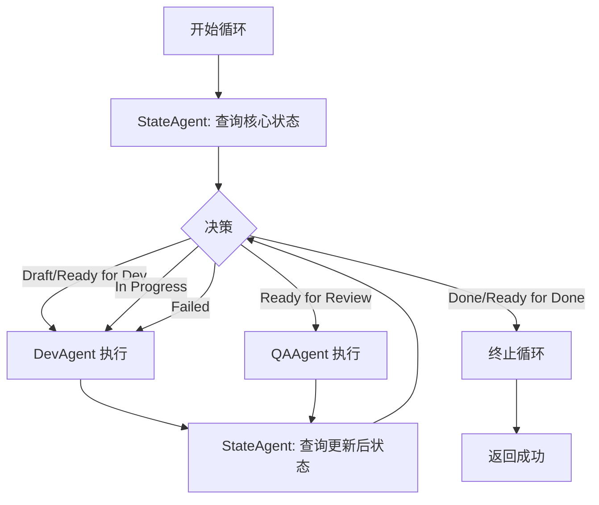

# State Agent 驱动的 Dev-QA 循环解决方案

## 问题定义

当前实现违背重构文档规范：
1. **EpicDriver** 在 `_execute_story_processing` 中使用数据库状态（`completed`/`qa_waived`）决定是否跳过 Dev-QA 循环
2. **execute_dev_phase** 在开发完成后自动写入 `status="completed"` 到数据库
3. 数据库处理状态值被用于业务决策，违背"仅依赖核心状态值"的设计原则

## 设计原则（重构文档规范）

1. **唯一决策依据**：故事文档的核心状态值（Draft / Ready for Development / In Progress / Ready for Review / Ready for Done / Done / Failed）
2. **StateAgent 职责**：专门负责从故事文档解析核心状态值，作为所有 Agent 和控制器的统一状态源
3. **数据库定位**：仅用于持久化记录和报告，不参与业务流程决策
4. **循环模式**：State → Dev/QA → State，每次循环开始和结束都通过 StateAgent 获取最新状态

## 解决方案架构

### 1. DevQaController 重构为 State-Dev-QA-State 循环



**核心改动**：

- `_make_decision` 方法每次调用时：
  1. 先通过 `StateAgent.execute()` 在 TaskGroup 内获取核心状态
  2. 根据核心状态决定执行 Dev 或 QA
  3. Agent 执行完成后，**递归调用 `_make_decision`** 再次查询状态
  4. 形成 State → Agent → State 的闭环

- StateAgent 始终在 DevQaController 的 TaskGroup 内执行，确保生命周期隔离

### 2. EpicDriver 移除数据库状态判断

**移除逻辑**（`_execute_story_processing` L1336-1342）：

```python
# ❌ 旧逻辑（已移除）
existing_status = await self.state_manager.get_story_status(story_path)
if existing_status and existing_status.get("status") in ["completed", "qa_waived"]:
    logger.info("Story already processed...")
    return True
```

**新逻辑**：

```python
# ✅ 直接进入 Dev-QA 循环，由核心状态值驱动
iteration = 1
max_dev_qa_cycles = 10

while iteration <= max_dev_qa_cycles:
    current_status = await self._parse_story_status(story_path)  # 解析故事文档核心状态
    # ... 根据核心状态决策
```

### 3. execute_dev_phase 移除数据库状态写入

**移除逻辑**（L1223-1234）：

```python
# ❌ 旧逻辑（已移除）
state_update_success = await self.state_manager.update_story_status(
    story_path=story_path,
    status="completed",  # 不应在 Dev 阶段写 completed
    phase="dev",
    iteration=iteration,
)
```

**新逻辑**：

```python
# ✅ 不在 execute_dev_phase 写入状态
# DevAgent/QAAgent 自行负责更新故事文档
# StateAgent 解析文档作为循环决策依据
result = await devqa_controller.execute(story_path)
return result
```

## 实施修改清单

### 文件 1: `autoBMAD/epic_automation/controllers/devqa_controller.py`

**修改点 1**：`_make_decision` 方法（L94-173）

```python
async def _make_decision(self, current_state: str) -> str:
    """
    基于 StateAgent 解析的核心状态值做出 Dev-QA 决策
    
    循环模式：State → Dev/QA → State
    每次循环开始和结束都通过 StateAgent 获取最新核心状态
    """
    if not self._story_path:
        return "Error"

    # 🎯 关键：每次决策前，先通过 StateAgent 获取核心状态值
    self._log_execution("[State-Dev-QA Cycle] Querying StateAgent for current status")
    
    async def query_state():
        return await self.state_agent.execute(self._story_path)
    
    current_status = await self._execute_within_taskgroup(query_state)
    
    if not current_status:
        return "Error"
    
    self._log_execution(f"[State Result] Core status: {current_status}")
    
    # 🎯 状态决策逻辑：基于核心状态值，不依赖数据库
    if current_status in ["Done", "Ready for Done"]:
        return current_status
    
    elif current_status in ["Draft", "Ready for Development", "In Progress", "Failed"]:
        # 执行 Dev
        await self._execute_within_taskgroup(lambda: self.dev_agent.execute(self._story_path))
        
        # 🎯 Dev 完成后，再次查询状态（递归）
        self._log_execution("[Post-Dev] Querying StateAgent for updated status")
        return await self._make_decision("AfterDev")
    
    elif current_status == "Ready for Review":
        # 执行 QA
        await self._execute_within_taskgroup(lambda: self.qa_agent.execute(self._story_path))
        
        # 🎯 QA 完成后，再次查询状态（递归）
        self._log_execution("[Post-QA] Querying StateAgent for updated status")
        return await self._make_decision("AfterQA")
    
    return current_status
```

### 文件 2: `autoBMAD/epic_automation/epic_driver.py`

**修改点 1**：`_execute_story_processing` 移除数据库状态检查（L1336-1342）

```python
# ❌ 删除这段代码
# existing_status = await self.state_manager.get_story_status(story_path)
# if existing_status and existing_status.get("status") in ["completed", "qa_waived"]:
#     logger.info("Story already processed...")
#     return True

# ✅ 新逻辑：直接进入循环，由核心状态驱动
try:
    # 🎯 关键修复：移除数据库状态检查，完全依赖故事文档核心状态
    # 所有决策由核心状态值驱动，数据库仅用于持久化记录
    
    iteration = 1
    max_dev_qa_cycles = 10
    ...
```

**修改点 2**：`execute_dev_phase` 移除状态写入（L1223-1234）

```python
# ❌ 删除这段代码
# state_update_success = await self.state_manager.update_story_status(
#     story_path=story_path,
#     status="completed",
#     phase="dev",
#     iteration=iteration,
# )

# ✅ 新逻辑：不写入状态
result = await devqa_controller.execute(story_path)

# 🎯 改进：不再在 execute_dev_phase 中写入 completed
# 状态由 DevAgent/QAAgent 在执行后更新故事文档
# StateAgent 解析文档状态作为循环决策依据
# 数据库 update_story_status 仅用于记录/报告，不影响循环决策

logger.info(f"Dev phase completed for {story_path}")
return result
```

## 验证要点

### 1. 循环决策验证

**测试场景**：故事文档状态为 `Ready for Development`

**预期行为**：
1. DevQaController 查询 StateAgent → 返回 "Ready for Development"
2. 决策执行 DevAgent
3. DevAgent 完成后，递归调用 StateAgent → 返回 "Ready for Review"（假设 Dev 成功）
4. 决策执行 QAAgent
5. QAAgent 完成后，递归调用 StateAgent → 返回 "Ready for Done"
6. 决策终止，返回成功

**关键日志**：
```
[State-Dev-QA Cycle] Querying StateAgent for current status
[State Result] Core status: Ready for Development
[Decision] Ready for Development → Dev phase
[Post-Dev] Querying StateAgent for updated status
[State Result] Core status: Ready for Review
[Decision] Ready for Review → QA phase
[Post-QA] Querying StateAgent for updated status
[State Result] Core status: Ready for Done
Story reached terminal state: Ready for Done
```

### 2. 数据库隔离验证

**测试场景**：数据库中 story 状态为 `completed`，但文档状态为 `Ready for Development`

**预期行为**：
- EpicDriver **不会**短路跳过该 story
- 循环正常进入，StateAgent 读取文档状态 `Ready for Development`
- 执行完整的 Dev-QA 流程

**旧行为（已修复）**：
- EpicDriver 检查数据库状态为 `completed` → 直接返回 True → 跳过 Dev-QA

### 3. StateAgent 生命周期验证

**测试场景**：连续处理多个 story

**预期行为**：
- 每个 story 的 DevQaController 有独立的 TaskGroup
- StateAgent 在该 TaskGroup 内执行，与其他 story 隔离
- 不会出现 "cancel scope accessed by different task" 错误

## 设计优势

1. **符合重构文档规范**：所有决策依据是故事文档核心状态值，StateAgent 作为唯一状态源
2. **数据库角色正确**：仅用于持久化和报告，不参与业务流程控制
3. **状态一致性**：循环中每次决策前都重新查询最新状态，避免缓存过期问题
4. **灵活性**：支持人工修改故事文档状态后立即生效，无需清理数据库
5. **可测试性**：StateAgent 可独立 Mock，验证不同状态下的决策分支

## 后续优化建议

1. **StateManager 职责重构**：考虑将 `update_story_status` 改为 `log_story_event`，明确其仅用于记录
2. **状态映射优化**：`processing_to_core_mapping` 中 `cancelled`/`error` 映射为 `Ready for Development` 已实现容错
3. **循环次数监控**：当前 `max_rounds=3`，可考虑根据状态转换情况动态调整

## 实施状态

- ✅ DevQaController._make_decision 改为 State-Dev-QA-State 循环（递归查询）
- ✅ EpicDriver._execute_story_processing 移除数据库状态检查
- ✅ EpicDriver.execute_dev_phase 移除 completed 状态写入
- ⏳ 集成测试验证（待运行）
- ⏳ 日志输出验证（待观察实际运行）

---

**创建时间**：2026-01-12  
**方案版本**：1.0  
**修改文件数**：2（devqa_controller.py, epic_driver.py）  
**代码行数变更**：+45 / -38
