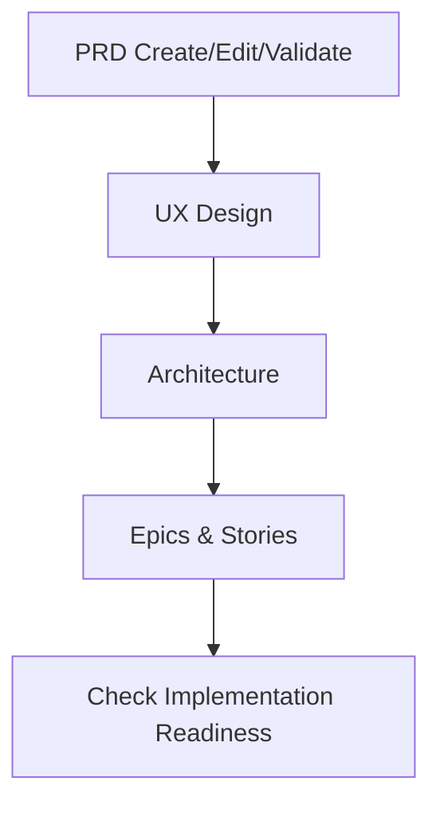

## BMM 模块 PRD / UX / ARCHITECT / EPICS / STORIES 工作流深度研究报告

### 一、文档信息

| 属性 | 值 |
|------|----|
| 版本 | 1.0 |
| 创建日期 | 2026-03-01 |
| 分析对象 | `_bmad/bmm` 模块中与 PRD、UX、架构、Epics & Stories 相关的工作流 |
| 关联模块 | `bmm`（BMAD Method Module）、`core`、`tea`、`autoBMAD/docuswarm` |
| 使用场景 | 需要系统理解从 PRD→UX→Architecture→Epics 的端到端规划工作流，以及它们在 DocuSwarm 中与自动化流水线的衔接方式时 |

---

### 二、BMM 模块与规划产物总览

#### 2.1 BMM 模块配置与角色

根据 [`_bmad/bmm/config.yaml`](file:///d:/GITHUB/DocuSwarm/_bmad/bmm/config.yaml)：

- **project_name**: `ClawTeams`
- **planning_artifacts**: `{project-root}/_bmad-output/planning-artifacts`
- **implementation_artifacts**: `{project-root}/_bmad-output/implementation-artifacts`
- **project_knowledge**: `{project-root}/docs`
- **communication_language**: Chinese
- **document_output_language**: English

这意味着：

- BMM 工作流产出的 **规划类文档（PRD、UX、Architecture、Epics & Stories）**，应优先写入 `_bmad-output/planning-artifacts`，与 DocuSwarm 的项目知识（`docs/`）协同使用。
- 所有交互均以中文进行，但正式交付物默认是英文，这与项目整体“中文协作 + 英文文档”的策略一致。

#### 2.2 四大核心规划产物

结合 `_bmad/_config/workflow-manifest.csv` 与 `autoBMAD/docuswarm/storage/files.py` 中的 `FILENAME_MAP`，BMM 规划工作流围绕下列四类核心文档展开：

- **PRD** – 产品需求文档
  - 对应工作流：`create-prd` / `edit-prd` / `validate-prd`
  - 在自动化流水线中，对应文件名：`prd.md`
- **UX Design** – 用户体验与界面设计文档
  - 对应工作流：`create-ux-design`
  - 在自动化流水线中，对应文件名：`ux-design.md`
- **Architecture** – 架构决策与系统设计文档
  - 对应工作流：`create-architecture`
  - 在自动化流水线中，对应文件名：`architecture.md`
- **Epics & Stories** – 史诗与用户故事集合
  - 对应工作流：`create-epics-and-stories`
  - 在自动化流水线中，对应文件名：`epics-stories.md`

DocuSwarm 的 FileStorage 层使用以下映射（节选自 [`autoBMAD/docuswarm/storage/files.py`](file:///d:/GITHUB/DocuSwarm/autoBMAD/docuswarm/storage/files.py))：

- `"prd"` / `"pm"` → `prd.md`
- `"ux"` → `ux-design.md`
- `"architecture"` / `"architect"` → `architecture.md`
- `"epics"` / `"po"` → `epics-stories.md`

因此，**如果 BMM 工作流产物命名与此保持一致**，将更容易被 autoBMAD 流水线与 DocuSwarm pipeline 统一消费。

---

### 三、PRD 工作流族：create / edit / validate

相关入口文件：

- [`_bmad/bmm/workflows/2-plan-workflows/create-prd/workflow-create-prd.md`](file:///d:/GITHUB/DocuSwarm/_bmad/bmm/workflows/2-plan-workflows/create-prd/workflow-create-prd.md)
- [`_bmad/bmm/workflows/2-plan-workflows/create-prd/workflow-edit-prd.md`](file:///d:/GITHUB/DocuSwarm/_bmad/bmm/workflows/2-plan-workflows/create-prd/workflow-edit-prd.md)
- [`_bmad/bmm/workflows/2-plan-workflows/create-prd/workflow-validate-prd.md`](file:///d:/GITHUB/DocuSwarm/_bmad/bmm/workflows/2-plan-workflows/create-prd/workflow-validate-prd.md)

#### 3.1 create-prd：从零创建 PRD

- **定位**：
  - `name: create-prd`
  - `description: Create a comprehensive PRD (Product Requirements Document) through structured workflow facilitation`
  - `main_config: '{project-root}/_bmad/bmm/config.yaml'`
  - `nextStep: './steps-c/step-01-init.md'`
- **角色设定**：
  - 代理扮演 **Product-focused PM facilitator**，与专家同伴协作，通过结构化对话逐步构建 PRD。
- **架构特征**：
  - 完整采用 BMAD 标准的 **step-file architecture**：
    - 微文件设计（每步一个指令文件）。
    - 只加载当前 step，禁止预读未来步骤。
    - 必须按顺序执行，不允许跳步或“优化路径”。
    - 在输出文档 frontmatter 中使用 `stepsCompleted` 跟踪进度。
    - 使用“追加式构建”原则逐步形成完整 PRD。
- **初始化阶段**：
  - 从 `main_config` 读取：
    - `project_name`、`planning_artifacts`、`output_folder`、`user_name`；
    - `communication_language`、`document_output_language`、`user_skill_level`；
    - 系统时间 `date`。
  - 强制要求：所有输出必须使用配置中的 `communication_language`（即中文）进行交互说明。
  - 之后切换到 `steps-c/step-01-init.md`，开始实际 PRD 内容的构建。

**要点总结**：

- create-prd 是从“空白 PRD”起步的完整引导工作流，适合新项目/新产品或现有 PRD 需要重写的场景。
- 执行过程中逐步收集：背景、目标用户、核心需求、非功能要求、依赖与风险等，为后续 UX / Architecture / Epics 工作流提供输入。

#### 3.2 edit-prd：改进现有 PRD

- **定位**：
  - `name: edit-prd`
  - `description: Edit and improve an existing PRD - enhance clarity, completeness, and quality`
  - `editWorkflow: './steps-e/step-e-01-discovery.md'`
- **角色设定**：
  - 代理扮演 **PRD improvement specialist**，专注于在不破坏原意的前提下提升 PRD 质量。
- **执行流程**：
  - 初始化同 create-prd（读取 `bmm/config.yaml` 中的关键字段）。
  - 然后 **提示用户提供 PRD 路径**：
    - “Which PRD would you like to edit? Please provide the path to the PRD.md file.”
  - 读取用户指定的 PRD 文件后，转入 `steps-e/step-e-01-discovery.md`，执行诊断与改写流程。

**适用场景**：

- 现有 PRD 由人工或其他流程生成，存在结构杂乱、缺失重要字段或表达不清的问题。
- 需要在保持业务意图与决策不变的前提下，显式化验收标准、增补非功能需求，并提高可读性与一致性。

#### 3.3 validate-prd：校验 PRD 与 BMAD 标准的一致性

- **定位**：
  - `name: validate-prd`
  - `description: Validate an existing PRD against BMAD standards - comprehensive review for completeness, clarity, and quality`
  - `validateWorkflow: './steps-v/step-v-01-discovery.md'`
- **角色设定**：
  - 代理扮演 **Validation Architect and Quality Assurance Specialist**，重点检查 PRD 是否符合 BMAD 标准和项目质量门控要求。
- **执行流程**：
  - 同样先加载 `bmm/config.yaml`。
  - 再进入 `steps-v/step-v-01-discovery.md`，通过一系列检查清单和结构化问题，对 PRD 进行全面审查。

**输出特征**：

- 不直接重写 PRD，而是输出 **问题清单与改进建议**，帮助用户决定是否再运行 `edit-prd` 或重新走 `create-prd` 流程。
- 与 TEA 与质量门控文档（如 `docs/qa/gates`）可以形成闭环：
  - PRD 的质量直接影响后续测试设计与门控配置。

---

### 四、UX Design 工作流：create-ux-design

入口文件：[`_bmad/bmm/workflows/2-plan-workflows/create-ux-design/workflow.md`](file:///d:/GITHUB/DocuSwarm/_bmad/bmm/workflows/2-plan-workflows/create-ux-design/workflow.md)

#### 4.1 工作流定位

- `name: create-ux-design`
- `description: Work with a peer UX Design expert to plan your applications UX patterns, look and feel.`
- **目标**：为应用创建完整的 UX 设计规格，包括交互模式、信息架构、视觉风格等。
- **角色**：UX facilitator，与产品干系人协作，通过可视化与对话驱动 UX 决策。

#### 4.2 架构与初始化

- 采用 **micro-file architecture**，与 PRD/Architecture/Epics 工作流风格一致：
  - 步骤为独立文件，顺序执行。
  - 前置条件与状态记录在 frontmatter 中。
  - 文档采用追加式构建方式。
- 初始化时：
  - 从 `bmm/config.yaml` 加载：
    - `project_name`、`output_folder`、`planning_artifacts`、`user_name`；
    - `communication_language`、`document_output_language`、`user_skill_level`；
    - `date`。
  - 约定关键路径：
    - `installed_path` = `_bmad/bmm/workflows/2-plan-workflows/create-ux-design`
    - `template_path` = `ux-design-template.md`
    - `default_output_file` = `{planning_artifacts}/ux-design-specification.md`
  - 执行入口：`steps/step-01-init.md`。

#### 4.3 与 PRD / Architecture 的关系

- UX 工作流通常在 PRD 已大致成型情况下执行：
  - 使用 PRD 中的用户画像、场景和功能需求作为输入。
  - 填补从“业务语言”到“界面/交互语言”之间的鸿沟。
- Architecture 工作流在读取 PRD 的同时，也**推荐结合 UX 产物**：
  - 对 UI 密集型系统，UX 文档将直接影响架构中的前端层、API 形状和路由设计。

**实践建议**：

- 对存在 Web UI 的特性，建议顺序为：
  - `create-prd` → `create-ux-design` → `create-architecture` → `create-epics-and-stories`。
- 对纯后端/CLI 工具，可以简化为：
  - `create-prd` → `create-architecture` → `create-epics-and-stories`，跳过 UX。

---

### 五、Architecture 工作流：create-architecture

入口文件：[`_bmad/bmm/workflows/3-solutioning/create-architecture/workflow.md`](file:///d:/GITHUB/DocuSwarm/_bmad/bmm/workflows/3-solutioning/create-architecture/workflow.md)

#### 5.1 工作流定位

- `name: create-architecture`
- `description`: 协同架构决策工作流，关注 **AI 代理一致性** 与 **冲突预防**。
- **目标**：通过渐进式对话和决策记录，形成一个“以决策为中心”的架构文档，使多个 AI 代理在实现阶段能一致理解并遵守架构约束。
- **角色**：架构引导者（architectural facilitator），与产品/技术干系人平等协作。

#### 5.2 架构与初始化

- 架构模式与其它 BMM 工作流一致：
  - 微文件、顺序执行、frontmatter 状态、追加式构建。
  - 特别强调：**如 step 文件要求“用户必须确认并选择继续”，则禁止自动进入下一步**。
- 初始化从 `bmm/config.yaml` 读取：
  - `project_name`、`output_folder`、`planning_artifacts`、`user_name`；
  - `communication_language`、`document_output_language`、`user_skill_level`；
  - `date`。
- 路径约定：
  - `installed_path` = `_bmad/bmm/workflows/3-solutioning/architecture`（注意：当前路径声明中写的是 `architecture`，与实际目录名需要核对）
  - `template_path` = `architecture-decision-template.md`（由 `_config/files-manifest.csv` 指向）
  - `data_files_path` = `data/`（包含 `project-types.csv`、`domain-complexity.csv` 等，辅助选择架构模式与复杂度等级）。

#### 5.3 决策导向的架构文档

- 相较于传统“填空式”架构模板，此工作流强调：
  - **决策列表**：记录做过哪些关键决策（技术栈、部署模型、边界划分、状态管理策略等）。
  - **决策理由**：为什么选择 A 而不是 B，与业务场景、NFR 的关联。
  - **约束与禁止事项**：明确指出在哪些地方“不能做什么”，以防 AI 代理生成违背架构的实现。
- 配合 `TEA` 与质量门控工作流，可将高风险架构决策与测试策略关联起来（例如：高可用、性能、安全等 NFR 需要在 `testarch-nfr` 中体现测试策略）。

#### 5.4 与 PRD / UX / Epics 的关系

- **输入**：
  - 来自 `create-prd` 的业务需求与非功能要求。
  - 来自 `create-ux-design` 的交互与界面需求（如存在）。
- **输出**：
  - 架构文档（建议与 `architecture.md` 对齐命名）。
  - 该架构文档在 `create-epics-and-stories` 工作流中作为约束上下文，用于指导故事拆分和验收标准设计。

---

### 六、Epics & Stories 工作流：create-epics-and-stories

入口文件：[`_bmad/bmm/workflows/3-solutioning/create-epics-and-stories/workflow.md`](file:///d:/GITHUB/DocuSwarm/_bmad/bmm/workflows/3-solutioning/create-epics-and-stories/workflow.md)

#### 6.1 工作流定位

- `name: create-epics-and-stories`
- `description`: 在 PRD 与架构决策完成后，将需求转化为“按用户价值组织”的 epics 与 stories，形成可实现、可测试的工作项集合。
- **目标**：
  - 将 PRD 中的高层需求拆解为 epics；
  - 将 epics 进一步拆解为细粒度 stories；
  - 为每个 story 附带完整、可执行的 Acceptance Criteria。
- **角色**：
  - 代理既是 **product strategist** 又是 **technical specifications writer**，与产品负责人协作。

#### 6.2 架构与初始化

- 同样使用标准的 step-file 架构：
  - 微文件、顺序执行、frontmatter `stepsCompleted`、追加构建。
  - 严格禁止跳步与并行加载。
- 初始化时：
  - 从 `bmm/config.yaml` 读取：
    - `project_name`、`output_folder`、`planning_artifacts`、`user_name`；
    - `communication_language`、`document_output_language`。
  - 第一步直接指定：
    - 进入 `steps/step-01-validate-prerequisites.md`，检查前置条件是否就绪：
      - PRD 文档是否存在且质量可接受；
      - 架构文档是否已完成；
      - （如有）UX 文档是否可用。

#### 6.3 拆解逻辑与输出形态

- 拆解过程一般遵循以下逻辑（由 step 文件细化）：
  - 从 PRD 中识别主要功能域与用户目标，形成 epics 列表。
  - 在每个 epic 下，根据架构与 UX 约束划分 stories。
  - 对每个 story，补充：
    - 背景描述；
    - 前置条件；
    - 明确的验收标准（Acceptance Criteria）；
    - 关键约束与依赖。
- 输出建议：
  - 最终输出文件建议与 `epics-stories.md` 对齐，以便 autoBMAD 与 DocuSwarm 流水线可直接消费。

---

### 七、Implementation Readiness 工作流：check-implementation-readiness

入口文件：[`_bmad/bmm/workflows/3-solutioning/check-implementation-readiness/workflow.md`](file:///d:/GITHUB/DocuSwarm/_bmad/bmm/workflows/3-solutioning/check-implementation-readiness/workflow.md)

#### 7.1 工作流定位

- `name: check-implementation-readiness`
- `description`: 在进入 Phase 4 实施前，对 **PRD、Architecture、Epics & Stories** 进行关键性验证，采用“对抗式审查”方式查找规划缺陷。
- **目标**：
  - 确认所有必要文档存在且互相一致；
  - 检查 epics/stories 是否覆盖所有 PRD 需求；
  - 识别规划中的漏洞（遗漏场景、未考虑的风险、模糊验收标准等）。
- **角色**：
  - 代理扮演兼具 **Product Manager + Scrum Master** 的角色，专长在于 **需求追踪与规划缺陷识别**。

#### 7.2 执行特征

- 架构与前述工作流一致：微文件、顺序执行、frontmatter 记录。
- 初始化时：从 `bmm/config.yaml` 加载项目配置与输出路径。
- 第一阶段：
  - `step-01-document-discovery.md` 负责发现并加载 PRD、Architecture、Epics & Stories 文档。
- 后续步骤（由 step 文件实现）：
  - 交叉检查：
    - PRD 需求 → 是否都在 epics/stories 中有所体现？
    - 架构决策 → 是否在 stories 的验收标准或任务中被体现？
  - 输出：
    - Implementation Readiness 评估报告（可作为 `docs/evaluation` 或 `_bmad-output` 中的参考文档）。

#### 7.3 与 TEA / 质量门控的衔接

- 虽然 check-implementation-readiness 本身不直接调用 `tea` 工作流，但其输出可为后续的：
  - `testarch-test-design`（测试设计）；
  - `testarch-trace`（需求–测试追踪矩阵）；
  - `docs/qa/gates` 中的质量门控配置；
  提供结构化输入。

---

### 八、端到端 PRD→UX→Architecture→Epics 链路概览

可以将 BMM 中的四类规划工作流及 Implementation Readiness 用简化流程表示为：

结合 BMAD 方法论与 DocuSwarm 实际使用场景，推荐的典型执行顺序为：

1. **PRD（create-prd / edit-prd / validate-prd）**
   - 先完成或改进 PRD，确保需求与非功能要求清晰。
2. **UX（create-ux-design）**（如适用）
   - 针对 UI/UX 重度特性，尽早锁定交互与信息架构。
3. **Architecture（create-architecture）**
   - 基于 PRD 与 UX 产物，以决策为中心定义系统架构和约束。
4. **Epics & Stories（create-epics-and-stories）**
   - 将需求分解为可实施、可测试的故事集合，为 autoBMAD 流水线与 Dev/QA 工作提供输入。
5. **Implementation Readiness（check-implementation-readiness）**
   - 在进入 Phase 4 实施前，做一次“规划层面的质量门控”。

---

### 九、与 DocuSwarm 流水线的集成建议

基于对 `_bmad/bmm` 与 `autoBMAD/docuswarm` 的分析，给出以下可落地建议：

1. **文件命名与位置对齐**
   - PRD：优先生成/维护为 `_bmad-output/planning-artifacts/prd.md`。
   - UX：输出为 `_bmad-output/planning-artifacts/ux-design.md`。
   - Architecture：输出为 `_bmad-output/planning-artifacts/architecture.md`。
   - Epics & Stories：输出为 `_bmad-output/planning-artifacts/epics-stories.md`。
   - 这样可以与 FileStorage 的 `FILENAME_MAP` 完全对齐，减少 glue code。

2. **在 autoBMAD Epic 中引用 BMM 产物**
   - 在 Epic 文档中增加对上述四类规划文档的链接，确保自动化执行时可以通过工具读到 PRD/UX/Architecture/Epics 的最新版本。

3. **将 Implementation Readiness 作为必经质量门**
   - 在 Epic 或 Story 级工作流中，将 `check-implementation-readiness` 结果作为进入 Phase 4 实施或运行 `dev-story` / `quick-dev` 的前置条件。

4. **与 TEA 工作流结合**
   - 在 `testarch-test-design` 与 `testarch-trace` 工作流中，将 PRD、Architecture 与 Epics & Stories 作为主要输入源，以确保：
     - 每个 story 至少对应一个测试条目；
     - 每个关键架构决策在测试中有对应验证。

---

### 十、结论

- `_bmad/bmm` 模块已经提供了覆盖 **PRD → UX → Architecture → Epics & Stories → Implementation Readiness** 的完整规划工作流链条，并通过统一的 step-file 架构保证了执行的可控性与可审计性。
- 这些工作流与 DocuSwarm 的 autoBMAD 流水线、TEA 质量门控以及 `docs/qa/gates`、`docs/evaluation` 中的评估文档天然契合，是组织项目从“想法”到“可实施计划”再到“质量可控交付”的核心骨架。
- 后续演进可以聚焦于：
  - 明确约定 BMM 规划输出在文件系统中的标准位置与命名；
  - 为 DocuSwarm 特定子系统（如 orchestrator、pipeline、RAG）定制专题 PRD/Architecture/Epics 工作流变体；
  - 在评估文档中引入对 Implementation Readiness 结果的长期跟踪，为跨迭代的规划质量提升提供依据。
