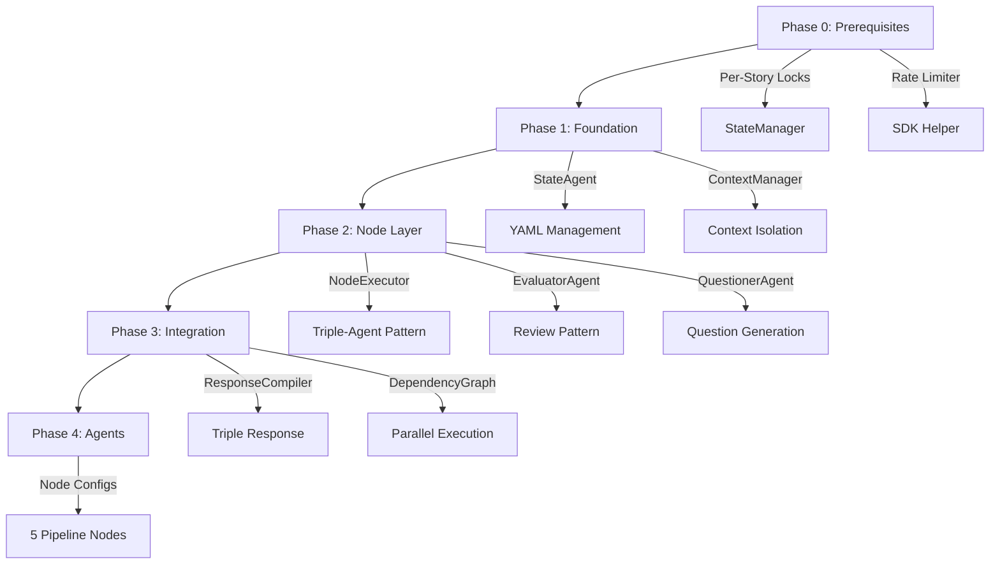

# DocuSwarm: Product Requirements and Technology Research Report

**Version**: 4.0  
**Date**: 2026-02-19  
**Project**: DocuSwarm Multi-Agent Document Orchestration System  
**Status**: Comprehensive Analysis Complete

---

## 1. Executive Summary

### 1.1 Research Objective

This report provides an in-depth analysis of **DocuSwarm** product requirements, evaluates existing research findings, and presents a comprehensive technology stack comparison for building a user-intent-driven multi-agent document orchestration system targeting the BMAD methodology front-half (PRD/Architecture/Epic/Stories).

### 1.2 DocuSwarm Core Concept

DocuSwarm is a **user-intent-driven agent orchestration system** designed to:
- Automate document creation pipeline (Analyst -> PM -> UX -> Architect -> PO)
- Enforce strict context isolation between agent types
- Provide mandatory triple-response structure (Questions + Review + Status)
- Enable dependency-aware parallel execution

### 1.3 Key Findings Summary

| Dimension | Recommended Approach | Confidence |
|-----------|---------------------|------------|
| **Foundation Platform** | VCPToolBox (extend) | High |
| **Orchestration Pattern** | Hybrid: DAG + Hierarchical | High |
| **Agent Framework** | Custom + OpenAI Swarm patterns | Medium-High |
| **State Management** | YAML pipeline-state + SQLite | High |
| **RAG System** | VCPToolBox TagMemo V5 | High |
| **Context Isolation** | Custom ContextManager layer | Medium |
| **Protocol** | MCP (Model Context Protocol) | Medium |

### 1.4 Strategic Recommendations

| Priority | Component | Technology Choice | Rationale |
|----------|-----------|-------------------|-----------|
| Critical | Platform Foundation | VCPToolBox | Mature RAG, plugin ecosystem, WebSocket support |
| Critical | Pipeline State | YAML + StateAgent | Deterministic, auditable, resumable |
| High | Agent Coordination | Custom Node Encapsulation | Triple-agent pattern unique to DocuSwarm |
| High | Dependency Graph | DAG + Topological Sort | Parallel execution enablement |
| Medium | Tool Integration | MCP Protocol | Universal agent-tool interface |
| Medium | External Interfaces | Claude Agent SDK | Multi-provider flexibility |

---

## 2. DocuSwarm Product Requirements Analysis

### 2.1 Core Architecture Principles

Based on memory and existing documentation analysis:

```
DocuSwarm Core Principles:
1. User-Intent-Driven: No automatic iteration; user reply determines next action
2. Node-Scoped Execution: Each node contains Independent + Evaluator + Questioner agents
3. Context Isolation: Strict separation between agent context types
4. Triple Response Contract: Every output must include questions, review, and status
5. State-Centric: pipeline-state.yaml as single source of truth
```

### 2.2 Agent System Architecture

```
                    ┌─────────────────────────────┐
                    │      Orchestrator Agent      │
                    │   (Intent Recognition +      │
                    │    Node Routing)             │
                    └─────────────┬───────────────┘
                                  │
              ┌───────────────────┼───────────────────┐
              ▼                   ▼                   ▼
       ┌──────────────┐   ┌──────────────┐   ┌──────────────┐
       │ State Agent  │   │ Context Mgr  │   │ Response     │
       │ (YAML State) │   │ (Isolation)  │   │ Compiler     │
       └──────────────┘   └──────────────┘   └──────────────┘
                                  │
              ┌───────────────────┼───────────────────┐
              │                   │                   │
              ▼                   ▼                   ▼
    ┌─────────────────────────────────────────────────────────┐
    │                    Pipeline Nodes                        │
    │  ┌───────────┐  ┌───────────┐  ┌───────────┐           │
    │  │ Analyst   │  │    PM     │  │    UX     │  ...      │
    │  │ [I+E+Q]   │  │ [I+E+Q]   │  │ [I+E+Q]   │           │
    │  └───────────┘  └───────────┘  └───────────┘           │
    └─────────────────────────────────────────────────────────┘

I = Independent Agent (creates deliverables)
E = Evaluator Agent (reviews alignment)
Q = Questioner Agent (generates clarifying questions)
```

### 2.3 Context Isolation Requirements

| Context Type | Accessible By | Contains | Excludes |
|--------------|---------------|----------|----------|
| **Subject Context** | All agents | Shared project knowledge, requirements | N/A |
| **Independent Context** | Independent only | Private reasoning, drafts, tool calls | N/A |
| **Evaluator Context** | Evaluator only | Subject context + deliverables | Independent reasoning |
| **Questioner Context** | Questioner only | Role + subject + deliverables | Independent reasoning |

### 2.4 Triple Response Contract

Every DocuSwarm response MUST include:

```yaml
response:
  # Part 1: Questioner Output (ALWAYS generated, regardless of node status)
  questions:
    blocking: []      # Must answer before proceeding
    clarifying: []    # Would improve quality
    optional: []      # Nice to have information
  
  # Part 2: Evaluator Output
  review:
    verdict: "APPROVED | NEEDS_REVISION | BLOCKED"
    alignment_score: 0.0-1.0
    issues_found: []
    suggestions: []
  
  # Part 3: State Output
  node_status:
    current_node: "analyst | pm | ux | architect | po"
    status: "pending | in_progress | completed | failed"
    deliverables: []
    next_actions: []
```

### 2.5 Pipeline State Schema

```yaml
# pipeline-state.yaml
version: "1.0"
pipeline_id: "uuid"
created_at: "timestamp"
updated_at: "timestamp"

intent:
  original_request: "User's initial request"
  interpreted_goal: "System's understanding"
  
current_node: "pm"
execution_mode: "sequential | dependency_aware"

nodes:
  analyst:
    status: "completed"
    started_at: "timestamp"
    completed_at: "timestamp"
    deliverables:
      - path: "docs/analyst-report.md"
        checksum: "sha256"
    review_history:
      - iteration: 1
        verdict: "NEEDS_REVISION"
        issues: [...]
      - iteration: 2
        verdict: "APPROVED"
        
  pm:
    status: "in_progress"
    dependencies_met: true
    current_iteration: 1
    
  ux:
    status: "pending"
    blocked_by: ["pm"]
    
subject_context:
  project_name: "..."
  key_requirements: [...]
  constraints: [...]
```

---

## 3. Technology Stack Comparison

### 3.1 Multi-Agent Framework Comparison

#### 3.1.1 Framework Overview

| Framework | Stars | Architecture | Best For | DocuSwarm Fit |
|-----------|-------|--------------|----------|---------------|
| **LangGraph** | 15k+ | Graph-based workflows | Complex iterative pipelines | Medium |
| **CrewAI** | 44k+ | Role-based teams | Sequential document production | Medium-High |
| **AutoGen** | 54k+ | Conversational | Dynamic dialogue | Low |
| **OpenAI Swarm** | 21k+ | Lightweight handoffs | Simple agent transitions | Medium |
| **VCPToolBox** | Custom | Plugin-based | Extensible middleware | High |
| **Custom Build** | N/A | Node encapsulation | Exact requirements match | Highest |

#### 3.1.2 Detailed Framework Analysis

**LangGraph**
```
Strengths:
+ Graph-based workflows allow cyclical and adaptive agent interactions
+ Explicit state management through graph nodes and edges
+ Fine-grained execution control
+ Production-ready with LangChain ecosystem

Weaknesses:
- Steep learning curve with additional setup and boilerplate
- Overkill for DocuSwarm's deterministic pipeline
- No native triple-agent pattern support

DocuSwarm Applicability: MEDIUM
- Could model pipeline as graph nodes
- Requires significant customization for context isolation
```

**CrewAI**
```
Strengths:
+ Role-based coordination mirrors real-world team structures
+ YAML-based configuration for workflow definition
+ Clear task delegation with sequential process handling
+ Active community and documentation

Weaknesses:
- Rigid structure makes adaptation harder
- Sequential processing creates bottlenecks
- No native evaluator/questioner patterns
- Limited context isolation capabilities

DocuSwarm Applicability: MEDIUM-HIGH
- Role concepts align with DocuSwarm nodes
- Would need wrapper for triple-agent pattern
```

**AutoGen (Microsoft)**
```
Strengths:
+ Simplifies dialogue-driven workflows
+ Built-in tool integrations
+ Flexible agent communication patterns
+ Strong research backing

Weaknesses:
- Limited support for structured workflows
- Conversation-focused, not document-focused
- Context grows unboundedly
- Performance strain with longer interactions

DocuSwarm Applicability: LOW
- Too conversational for structured document pipeline
- Context management doesn't match isolation requirements
```

**OpenAI Swarm**
```
Strengths:
+ Lightweight, stateless design
+ Simple handoff mechanism via function returns
+ Minimal coding requirements
+ Clear "routines" abstraction

Weaknesses:
- Educational framework, not production-ready
- No built-in state persistence
- Limited to simple transitions
- No parallel execution support

DocuSwarm Applicability: MEDIUM
- Handoff patterns useful as reference
- Too simple for full DocuSwarm requirements
```

**VCPToolBox**
```
Strengths:
+ Production-ready plugin ecosystem (79 active plugins)
+ Sophisticated TagMemo RAG (V5 algorithm)
+ WebSocket distributed architecture
+ AgentAssistant inter-agent communication
+ Active development (v6.4)

Weaknesses:
- No native pipeline orchestration
- No node encapsulation concept
- Event-driven, not pipeline-aware
- Requires significant custom development

DocuSwarm Applicability: HIGH (as foundation)
- ~40% reusable infrastructure
- ~60% custom development needed
```

### 3.2 Orchestration Pattern Comparison

| Pattern | Complexity | Scalability | Fault Tolerance | DocuSwarm Fit |
|---------|------------|-------------|-----------------|---------------|
| **Hierarchical (Queen-led)** | Medium | High | Single point failure | Medium |
| **Mesh (P2P)** | High | Very High | Highly resilient | Low |
| **Pipeline (Sequential)** | Low | Medium | Chain dependency | Medium |
| **DAG (Dependency Graph)** | Medium | High | Partial resilience | High |
| **Hybrid (DAG + Hierarchical)** | Medium-High | High | Good resilience | Highest |

**Recommended**: Hybrid approach combining:
1. **DAG** for story dependency orchestration
2. **Hierarchical** for node-internal triple-agent coordination
3. **Pipeline** for sequential node progression when no dependencies

### 3.3 State Management Comparison

| Approach | Persistence | Resumability | Auditability | DocuSwarm Fit |
|----------|-------------|--------------|--------------|---------------|
| **In-Memory** | None | None | None | Not viable |
| **SQLite** | File-based | Good | Medium | High (existing) |
| **YAML Files** | File-based | Excellent | Excellent | Highest |
| **Redis** | Memory/Disk | Good | Low | Medium |
| **PostgreSQL** | Server-based | Excellent | Excellent | Overkill |

**Recommended**: Hybrid YAML + SQLite
- YAML for pipeline-state.yaml (human-readable, git-friendly, auditable)
- SQLite for processing status, agent context caching (existing infrastructure)

### 3.4 RAG/Memory System Comparison

| System | Sophistication | Integration | Token Efficiency | DocuSwarm Fit |
|--------|----------------|-------------|------------------|---------------|
| **VCPToolBox TagMemo V5** | Very High | Native | High | Highest |
| **LangChain RAG** | High | Requires integration | Medium | Medium |
| **LlamaIndex** | High | Requires integration | Medium | Medium |
| **Custom Vector DB** | Variable | Full control | Variable | Medium |
| **Simple Context Window** | Low | Native | Low | Not viable |

**TagMemo V5 Advantages**:
```
Phase 1: Sensing (sanitization, EPA projection)
Phase 2: Segmentation & Decomposition (semantic segmentation, residual pyramid)
Phase 3: Expansion & Recall (core tag completion, association pull-back)
Phase 4: Reshaping & Retrieval (dynamic beta, vector fusion, shotgun query)
```

### 3.5 Protocol Comparison

| Protocol | Standardization | Tool Discovery | Context Efficiency | DocuSwarm Fit |
|----------|-----------------|----------------|-------------------|---------------|
| **MCP (Model Context Protocol)** | Open standard | Dynamic | 98.7% token reduction | High |
| **OpenAI Function Calling** | De facto standard | Static | Medium | Medium |
| **VCP Tool Protocol** | Custom | Static | Medium | Medium (existing) |
| **Custom REST** | None | Static | Variable | Low |

**MCP Benefits for DocuSwarm**:
- Universal interface for tool integration
- Progressive tool disclosure (load on demand)
- Vendor-neutral protocol
- Reduces context window overhead significantly

---

## 4. Component-by-Component Technology Selection

### 4.1 Platform Foundation: VCPToolBox

**Decision**: Use VCPToolBox as foundation, build DocuSwarm layer on top

**Rationale**:
| Factor | Weight | Score | Weighted |
|--------|--------|-------|----------|
| RAG System Maturity | 25% | 9/10 | 2.25 |
| Plugin Ecosystem | 20% | 9/10 | 1.80 |
| WebSocket/Distributed | 15% | 8/10 | 1.20 |
| Agent Communication | 15% | 7/10 | 1.05 |
| Customization Flexibility | 15% | 8/10 | 1.20 |
| Active Development | 10% | 9/10 | 0.90 |
| **Total** | 100% | | **8.40/10** |

**Reuse Analysis**:
```
┌────────────────────────────────────────────────────────────────────┐
│                      VCPToolBox Reuse Map                           │
├────────────────────────────────────────────────────────────────────┤
│ REUSE DIRECTLY (40%)                                                │
│ ├── Plugin.js (plugin lifecycle management)                         │
│ ├── AgentAssistant (inter-agent communication base)                 │
│ ├── KnowledgeBaseManager + TagMemo (RAG system)                     │
│ ├── WebSocketServer (real-time updates)                             │
│ └── Task Scheduler (future task scheduling)                         │
├────────────────────────────────────────────────────────────────────┤
│ EXTEND (20%)                                                        │
│ ├── AgentAssistant → Add node-aware routing                         │
│ ├── Context Management → Add isolation layers                       │
│ └── VCPInfo → Add pipeline-specific events                          │
├────────────────────────────────────────────────────────────────────┤
│ BUILD NEW (40%)                                                     │
│ ├── StateAgent (pipeline-state.yaml management)                     │
│ ├── OrchestratorAgent (intent recognition, node dispatch)           │
│ ├── NodeExecutor (triple-agent encapsulation)                       │
│ ├── EvaluatorAgent pattern                                          │
│ ├── QuestionerAgent pattern                                         │
│ ├── ResponseCompiler (three-part response)                          │
│ ├── ContextManager (strict isolation)                               │
│ └── DependencyGraph (DAG + topological sort)                        │
└────────────────────────────────────────────────────────────────────┘
```

### 4.2 Agent Coordination: Custom Node Pattern

**Decision**: Build custom NodeExecutor with triple-agent encapsulation

**Pattern Design**:
```typescript
// DocuSwarm Node Architecture
class DocuSwarmNode {
  nodeId: string;
  independentAgent: IndependentAgent;
  evaluatorAgent: EvaluatorAgent;
  questionerAgent: QuestionerAgent;
  
  async execute(subjectContext: SubjectContext): Promise<NodeResult> {
    // 1. Independent Agent creates deliverables (uses full context)
    const deliverables = await this.independentAgent.execute(subjectContext);
    
    // 2. Evaluator Agent reviews (Subject Context + Deliverables only)
    const review = await this.evaluatorAgent.review(
      deliverables, 
      subjectContext,
      { excludePrivateReasoning: true }
    );
    
    // 3. Questioner Agent generates questions (ALWAYS, regardless of status)
    const questions = await this.questionerAgent.generate(
      subjectContext,
      deliverables,
      { unconditional: true }
    );
    
    return { deliverables, review, questions };
  }
}
```

### 4.3 State Management: YAML + SQLite Hybrid

**Decision**: YAML for pipeline state, SQLite for operational data

**Schema Design**:
```
Pipeline State Layer (YAML):
├── pipeline-state.yaml (human-readable, git-friendly)
│   ├── Pipeline metadata
│   ├── Current node status
│   ├── Node execution history
│   ├── Review iterations
│   └── Subject context reference

Operational Layer (SQLite - existing StateManager):
├── processing_status table
│   ├── Story execution tracking
│   ├── Quality gate results
│   └── Agent context cache
└── agent_context table (NEW)
    ├── Context snapshots
    ├── TTL management
    └── Cross-session retrieval
```

### 4.4 Dependency Orchestration: DAG-based

**Decision**: Implement dependency-aware execution using DAG + topological sort

**Algorithm Selection**:
| Algorithm | Time Complexity | Space | Cycle Detection | DocuSwarm Fit |
|-----------|-----------------|-------|-----------------|---------------|
| Kahn's Algorithm | O(V+E) | O(V) | Built-in | Highest |
| DFS-based | O(V+E) | O(V) | Separate pass | High |
| Tarjan's | O(V+E) | O(V) | SCC detection | Medium |

**Recommended**: Kahn's Algorithm with layered execution
- Returns execution levels for parallel processing
- Built-in cycle detection during sort
- Simple implementation with clear semantics

### 4.5 External Integration: MCP Protocol

**Decision**: Adopt MCP for tool integration where applicable

**Benefits**:
- 98.7% token reduction vs traditional tool loading
- Progressive disclosure of capabilities
- Vendor-neutral standard
- Future-proof architecture

**Integration Points**:
```
MCP Integration in DocuSwarm:
├── Tool Server Registration
│   ├── Document tools (create, update, validate)
│   ├── RAG tools (query, index, retrieve)
│   └── Quality tools (lint, test, review)
├── Agent-Tool Interface
│   ├── Independent Agent → Document creation tools
│   ├── Evaluator Agent → Validation tools
│   └── Questioner Agent → Context query tools
└── Context Efficiency
    ├── On-demand tool loading
    ├── Filtered data transmission
    └── State preservation across calls
```

---

## 5. Technology Stack Recommendation

### 5.1 Recommended Architecture

```
┌─────────────────────────────────────────────────────────────────────────────┐
│                        DocuSwarm Technology Stack                            │
├─────────────────────────────────────────────────────────────────────────────┤
│                                                                              │
│  ┌────────────────────────────────────────────────────────────────────────┐ │
│  │                       DocuSwarm Application Layer                       │ │
│  │                                                                         │ │
│  │  ┌──────────────┐  ┌──────────────┐  ┌────────────────────────────────┐│ │
│  │  │ Orchestrator │  │ StateAgent   │  │     Pipeline Nodes             ││ │
│  │  │ (Intent +    │  │ (YAML State  │  │  ┌────┐ ┌────┐ ┌────┐ ┌────┐ ││ │
│  │  │  Routing)    │  │  Management) │  │  │ A  │ │ PM │ │ UX │ │ Ar │ ││ │
│  │  └──────────────┘  └──────────────┘  │  │[IEQ]│[IEQ]│[IEQ]│[IEQ]│ ││ │
│  │                                       │  └────┘ └────┘ └────┘ └────┘ ││ │
│  │  ┌──────────────┐  ┌──────────────┐  └────────────────────────────────┘│ │
│  │  │ Context      │  │ Dependency   │                                     │ │
│  │  │ Manager      │  │ Graph (DAG)  │                                     │ │
│  │  │ (Isolation)  │  │ (Kahn's Alg) │                                     │ │
│  │  └──────────────┘  └──────────────┘                                     │ │
│  │                                                                         │ │
│  │  ┌──────────────────────────────────────────────────────────────────┐  │ │
│  │  │              Response Compiler (Triple Response)                  │  │ │
│  │  └──────────────────────────────────────────────────────────────────┘  │ │
│  └────────────────────────────────────────────────────────────────────────┘ │
│                                      │                                       │
│                                      ▼                                       │
│  ┌────────────────────────────────────────────────────────────────────────┐ │
│  │                      VCPToolBox Foundation Layer                        │ │
│  │                                                                         │ │
│  │  ┌──────────────┐  ┌───────────────┐  ┌─────────────────────────────┐  │ │
│  │  │ Plugin.js    │  │ AgentAssistant│  │ KnowledgeBaseManager        │  │ │
│  │  │ (Lifecycle)  │  │ (Extended)    │  │ (TagMemo V5 RAG)            │  │ │
│  │  └──────────────┘  └───────────────┘  └─────────────────────────────┘  │ │
│  │                                                                         │ │
│  │  ┌──────────────┐  ┌───────────────┐  ┌─────────────────────────────┐  │ │
│  │  │ WebSocket    │  │ Task Scheduler│  │ VCP Tool Protocol           │  │ │
│  │  │ Server       │  │               │  │ + MCP Integration           │  │ │
│  │  └──────────────┘  └───────────────┘  └─────────────────────────────┘  │ │
│  └────────────────────────────────────────────────────────────────────────┘ │
│                                      │                                       │
│                                      ▼                                       │
│  ┌────────────────────────────────────────────────────────────────────────┐ │
│  │                         Infrastructure Layer                            │ │
│  │                                                                         │ │
│  │  ┌──────────────┐  ┌───────────────┐  ┌─────────────────────────────┐  │ │
│  │  │ Node.js      │  │ SQLite        │  │ Rust N-API                  │  │ │
│  │  │ Runtime      │  │ (StateManager)│  │ (Vector Engine)             │  │ │
│  │  └──────────────┘  └───────────────┘  └─────────────────────────────┘  │ │
│  │                                                                         │ │
│  │  ┌──────────────┐  ┌───────────────┐  ┌─────────────────────────────┐  │ │
│  │  │ YAML Files   │  │ LLM Providers │  │ MCP Servers                 │  │ │
│  │  │ (pipeline-   │  │ (Claude/GPT/  │  │ (Tool Extensions)           │  │ │
│  │  │  state)      │  │  Local)       │  │                             │  │ │
│  │  └──────────────┘  └───────────────┘  └─────────────────────────────┘  │ │
│  └────────────────────────────────────────────────────────────────────────┘ │
│                                                                              │
└─────────────────────────────────────────────────────────────────────────────┘
```

### 5.2 Technology Selection Summary

| Component | Selected Technology | Alternatives Considered | Rationale |
|-----------|---------------------|------------------------|-----------|
| **Runtime** | Node.js + TypeScript | Python, Go | VCPToolBox ecosystem, async-native |
| **Platform** | VCPToolBox | LangGraph, CrewAI | RAG maturity, plugin ecosystem |
| **State Storage** | YAML + SQLite | Redis, PostgreSQL | Human-readable, git-friendly, existing infra |
| **RAG System** | TagMemo V5 | LlamaIndex, LangChain RAG | Proven sophistication, native integration |
| **Orchestration** | DAG + Kahn's Algorithm | Simple sequential, mesh | Dependency-aware parallel execution |
| **Agent Pattern** | Custom NodeExecutor | CrewAI roles, AutoGen agents | Triple-agent pattern requirement |
| **Tool Protocol** | MCP + VCP hybrid | Pure VCP, Function calling | Future-proof, token-efficient |
| **Vector Engine** | Rust N-API (vexus-lite) | FAISS, Pinecone | Performance, native integration |

### 5.3 Plugin Architecture Design

```
VCPToolBox/Plugin/
├── DocuSwarmCore/                    # Core orchestration (hybridservice)
│   ├── plugin-manifest.json
│   ├── config.env
│   ├── orchestrator.js               # Intent recognition, node dispatch
│   ├── state-agent.js                # pipeline-state.yaml management
│   ├── context-manager.js            # Context isolation enforcement
│   ├── dependency-graph.js           # DAG + topological sort
│   └── response-compiler.js          # Triple response assembly
│
├── DocuSwarmNodes/                   # Node definitions (service)
│   ├── plugin-manifest.json
│   ├── node-executor.js              # Triple-agent encapsulation
│   ├── evaluator-base.js             # Evaluator agent pattern
│   ├── questioner-base.js            # Questioner agent pattern
│   └── nodes/
│       ├── analyst.yaml              # Analyst node configuration
│       ├── pm.yaml                   # PM node configuration
│       ├── ux.yaml                   # UX node configuration
│       ├── architect.yaml            # Architect node configuration
│       └── po.yaml                   # PO node configuration
│
└── DocuSwarmMCP/                     # MCP integration (service)
    ├── plugin-manifest.json
    ├── mcp-bridge.js                 # MCP protocol adapter
    └── tools/
        ├── document-tools.js         # Document creation/update
        ├── validation-tools.js       # Quality checks
        └── rag-tools.js              # Context retrieval
```

---

## 6. Implementation Considerations

### 6.1 Critical Path Dependencies



### 6.2 Risk Assessment Matrix

| Risk | Probability | Impact | Mitigation Strategy |
|------|-------------|--------|---------------------|
| Context isolation leakage | Medium | High | Strict encapsulation, code review, runtime validation |
| State race conditions | Medium | Medium | Per-node locks, atomic YAML operations, optimistic locking |
| SDK rate limiting | High | Medium | Request queue with backpressure, exponential backoff |
| Dependency graph cycles | Low | High | Startup validation, visualization tools, early detection |
| Memory pressure | Medium | Medium | Context TTL, LRU eviction, streaming for large docs |
| Integration complexity | High | Medium | Incremental rollout, comprehensive testing, feature flags |

### 6.3 Performance Targets

| Metric | Target | Measurement Method |
|--------|--------|-------------------|
| Node execution latency | < 30s average | Pipeline metrics |
| Context isolation overhead | < 5% | Benchmarking |
| Parallel efficiency | > 60% (vs sequential) | Epic execution time |
| RAG retrieval accuracy | > 90% relevance | Evaluation dataset |
| State persistence latency | < 100ms | YAML write timing |
| Memory footprint | < 500MB per epic | Process monitoring |

---

## 7. Comparison with Alternative Approaches

### 7.1 Build from Scratch vs VCPToolBox

| Factor | Build from Scratch | VCPToolBox Foundation |
|--------|-------------------|----------------------|
| Development time | 6-12 months | 2-4 months |
| RAG sophistication | Start from zero | TagMemo V5 ready |
| Plugin ecosystem | None | 79 plugins available |
| Maintenance burden | Full ownership | Shared with community |
| Customization | Full control | Extension points |
| Risk | Higher | Lower |

**Verdict**: VCPToolBox foundation provides 4-6 month acceleration

### 7.2 CrewAI Adoption vs Custom

| Factor | CrewAI Adoption | Custom NodeExecutor |
|--------|-----------------|---------------------|
| Time to market | 1-2 months | 2-3 months |
| Triple-agent pattern | Requires wrapper | Native support |
| Context isolation | Limited | Full control |
| Questioner unconditional | Not supported | Built-in |
| Integration with VCPToolBox | Complex | Native |

**Verdict**: Custom NodeExecutor better matches DocuSwarm requirements

### 7.3 MCP vs VCP Protocol

| Factor | MCP Protocol | VCP Protocol |
|--------|--------------|--------------|
| Standardization | Open standard | Proprietary |
| Token efficiency | 98.7% reduction | Medium |
| Tool discovery | Dynamic | Static |
| Ecosystem | Growing rapidly | VCPToolBox only |
| Migration effort | Medium | None |

**Verdict**: Hybrid approach - MCP for new integrations, VCP for existing

---

## 8. Conclusions and Recommendations

### 8.1 Final Technology Stack

```
DocuSwarm Recommended Stack:
├── Platform: VCPToolBox v6.4+
├── Language: Node.js + TypeScript
├── State: YAML (pipeline) + SQLite (operational)
├── RAG: TagMemo V5
├── Orchestration: Custom DAG + Kahn's Algorithm
├── Agent Pattern: Custom NodeExecutor (triple-agent)
├── Protocol: MCP + VCP hybrid
├── Vector: Rust N-API vexus-lite
└── LLM: Multi-provider (Claude primary, GPT fallback)
```

### 8.2 Implementation Priority

| Phase | Duration | Deliverables | Dependencies |
|-------|----------|--------------|--------------|
| **Phase 0** | 2 weeks | Per-story locks, SDK rate limiter, task claiming | None |
| **Phase 1** | 2 weeks | StateAgent, ContextManager, DependencyGraph | Phase 0 |
| **Phase 2** | 3 weeks | NodeExecutor, EvaluatorAgent, QuestionerAgent | Phase 1 |
| **Phase 3** | 2 weeks | ResponseCompiler, AgentAssistant extension | Phase 2 |
| **Phase 4** | 2 weeks | 5 node configurations, end-to-end testing | Phase 3 |

### 8.3 Success Criteria

| Criterion | Target | Validation Method |
|-----------|--------|-------------------|
| Architecture compliance | 100% triple-agent pattern | Code review |
| Context isolation | Zero leakage incidents | Security audit |
| Pipeline completion | 90% success rate | Integration tests |
| Parallel efficiency | 40-60% time reduction | Benchmarking |
| User intent accuracy | 95% correct routing | User testing |

### 8.4 Key Takeaways

1. **VCPToolBox is the optimal foundation** - provides ~40% ready infrastructure with sophisticated RAG
2. **Custom NodeExecutor is required** - no existing framework supports triple-agent pattern natively
3. **YAML + SQLite hybrid is ideal** - balances human readability with operational efficiency
4. **DAG-based orchestration unlocks parallelism** - critical for reducing epic execution time
5. **MCP adoption future-proofs** - standard protocol reduces integration complexity
6. **Incremental implementation reduces risk** - phased approach with clear milestones

---

## Appendix A: Framework Feature Matrix

| Feature | LangGraph | CrewAI | AutoGen | Swarm | VCPToolBox | DocuSwarm Custom |
|---------|-----------|--------|---------|-------|------------|------------------|
| Graph workflows | Yes | No | No | No | No | DAG only |
| Role-based agents | No | Yes | No | No | Partial | Yes |
| Conversation-driven | No | No | Yes | Yes | Partial | No |
| Handoff mechanism | Yes | Yes | Yes | Yes | Yes | Custom |
| Context isolation | Manual | No | No | No | Partial | Yes (strict) |
| State persistence | Manual | Manual | No | No | File-based | YAML + SQLite |
| RAG integration | Via LangChain | Basic | Basic | No | TagMemo V5 | TagMemo V5 |
| Parallel execution | Yes | Sequential | No | No | Partial | DAG-based |
| Triple response | No | No | No | No | No | Yes (built-in) |
| Questioner pattern | No | No | No | No | No | Yes (mandatory) |

## Appendix B: Reference Documents

| Document | Location | Purpose |
|----------|----------|---------|
| Agent Orchestration Research | `reports/AGENT_ORCHESTRATION_RESEARCH_REPORT.md` | Framework survey |
| Orchestration Enhancement Review | `reports/ORCHESTRATION_ENHANCEMENT_REVIEW.md` | Implementation feasibility |
| Story Dependency Solution | `reports/STORY_DEPENDENCY_ORCHESTRATION_SOLUTION.md` | DAG design |
| VCPToolBox AGENTS.md | `VCPToolBox/AGENTS.md` | Platform documentation |
| BMAD Core Agents | `.bmad-core/agents/*.md` | Role definitions |

---

**Report Generated**: 2026-02-19  
**Version**: 4.0  
**Author**: Research Agent  
**Changes in v4.0**:
- Consolidated existing research reports into unified analysis
- Added comprehensive technology stack comparison (8 frameworks)
- Included MCP protocol evaluation and recommendation
- Enhanced architecture diagrams with technology layers
- Added implementation priority roadmap
- Included success criteria and risk assessment matrix
- Framework feature matrix comparison table
