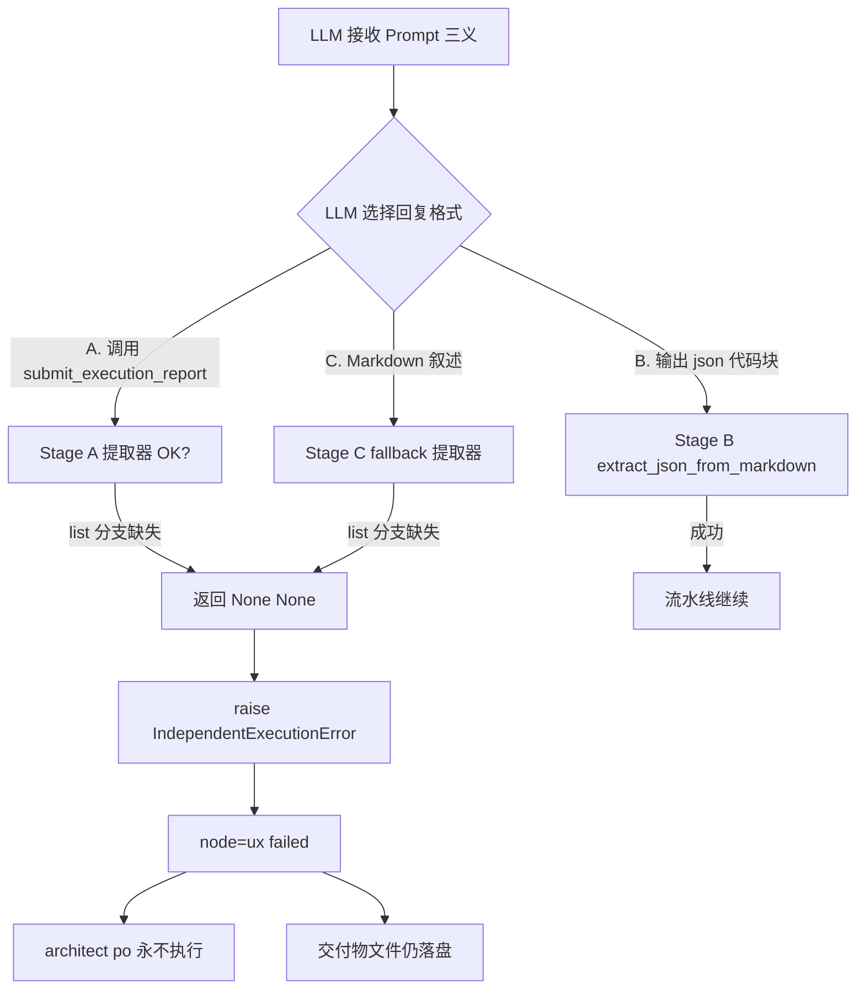

# DocuSwarm 流水线失败深度研究：DeepSeek Anthropic 兼容模式下 MCP ToolResult 解析缺陷

| 字段 | 值 |
|------|----|
| 报告日期 | 2026-05-02 |
| 研究对象 | `pipeline-1777697677287-8cb53d89` |
| 证据日志 | [`logs/pipeline-1777697677287-8cb53d89.log`](file:///home/leafliu/autoBMAD/logs/pipeline-1777697677287-8cb53d89.log) |
| 机器证据 | [`docs-doc/research/2026-05-02-deepseek-mcp-toolresult-research.json`](file:///home/leafliu/autoBMAD/docs-doc/research/2026-05-02-deepseek-mcp-toolresult-research.json) |
| 调试工具 | [`tools/deepseek_mcp_toolresult_researcher.py`](file:///home/leafliu/autoBMAD/tools/deepseek_mcp_toolresult_researcher.py) |
| 严重级别 | **Critical**（阻塞 UX/Architect/PO 三节点，流水线不可完成） |
| 上游参考 | [DeepSeek Anthropic API 兼容性文档](https://api-docs.deepseek.com/zh-cn/guides/anthropic_api) |

---

## 0. 结论先行（TL;DR）

- **现象**：Pipeline 在 `ux` 节点失败，`architect`/`po` 未执行；但 `output/pipeline-1777697677287-8cb53d89/ux-design.md` **已成功落盘**（29 422 B，SHA256 `ae2e5715bae2…`）。
- **根因（三层）**：
  1. `IndependentAgent._extract_create_deliverable_result` 与 `_extract_submit_report_result` **只处理 `tool_output: str` 分支，未处理 `list[dict[str, Any]]` 分支**，而 SDK MCP 工具返回的正是 list 形态 → 解析必然失败。
  2. `analyst`/`pm` 能成功纯粹是**运气**：LLM 恰巧输出 ```` ```json ``` ```` 代码块，被 `extract_json_from_markdown` 解析路径绕开了 Bug；`ux` 由于上下文变长、LLM 用 Markdown 叙述（"## Execution Complete"）收尾，触发 `markdown_fallback` 分支，暴露出同一个 Bug。
  3. Prompt 契约三义（MCP 工具 / 行内 JSON / Legacy Fallback）+ DeepSeek 长上下文指令跟随弱 → 失败概率集中在第一个大节点。
- **阻塞级修复（P0）**：在两个提取器增加 `list[dict]` 分支，遍历 blocks 取 `text` 字段再 `json.loads`。预计 <15 行代码，<1 小时回归。
- **侧证关键**：DeepSeek Anthropic 兼容文档明确 `mcp_servers`/`mcp_tool_use`/`mcp_tool_result` **不支持**、`is_error` **忽略**。SDK 的 `create_sdk_mcp_server` 是进程内路由，它会在上传给 API 前把 MCP tool 降级成**普通 tools/tool_use/tool_result**，因此仍可工作；但也意味着 **tool_result.is_error 在 DeepSeek 端形同虚设**，工具内部失败无法冒泡到 LLM。

---

## 1. 故障现象快照

| 节点 | Messages | 状态 | 交付物是否落盘 |
|------|----------|------|----------------|
| analyst | 44 | completed | `analyst-report.md` (33 689 B, sha256 `00aebd44dca1…`) |
| pm | 41 | completed | `prd.md` (25 125 B, sha256 `7a67b457cdfb…`) |
| ux | 71 | **failed** | `ux-design.md` (29 422 B, sha256 `ae2e5715bae2…`) ✅ **已落盘** |
| architect | — | 未执行 | — |
| po | — | 未执行 | — |

日志关键错误条目（原文）：

```
[error] node_id=ux message="independent_agent_failed"
  error=LLM returned markdown instead of JSON, and no create_deliverable tool result found in messages
```

流水线终态：

```
pipeline_completed … result={ 'completed_nodes': ['analyst','pm'],
                               'failed_nodes': ['ux'],
                               'status': 'failed' }
```

**关键反直觉事实**：交付物已真实存在且 SHA256 与日志中 LLM 文本里声明的值一致 → 说明 `create_deliverable` MCP 工具**被 LLM 成功调用且 SDK MCP Server 已成功执行写盘**。流水线失败仅发生在"把工具返回结果从消息里捞出来"这一步。

---

## 2. 供应商背景：DeepSeek Anthropic 兼容模式

`.env` 设置：

```
ANTHROPIC_BASE_URL=https://api.deepseek.com/anthropic
```

DeepSeek 官方兼容性矩阵的关键取舍（[来源](https://api-docs.deepseek.com/zh-cn/guides/anthropic_api)）：

| 字段 | DeepSeek 行为 | 对 DocuSwarm 的影响 |
|------|---------------|----------------------|
| `mcp_servers` | **Ignored** | 远程 MCP server 不可用，但 SDK 内嵌 MCP 不走此字段 |
| `mcp_tool_use` / `mcp_tool_result` | **Not Supported** | SDK 会降级为 `tools/tool_use/tool_result` |
| `tool_result.is_error` | **Ignored** | 工具内部报错无法告诉 LLM，LLM 会当作成功继续 |
| `tools.name/input_schema/description` | Fully Supported | SDK 定义的 `create_deliverable` 规范照常可用 |
| `tool_use.id/input/name` | Fully Supported | LLM 能正常下发调用 |
| `tool_result.tool_use_id/content` | Fully Supported | 结果能回传 |
| `cache_control` | Ignored | 无缓存优化 |
| `temperature` | 0.0 ~ 2.0 | 与 Anthropic 一致 |
| `thinking` | 支持，`budget_tokens` 忽略 | — |

**关键推论**：`autoBMAD/docuswarm/tools/create_deliverable_sdk.py` 通过 `create_sdk_mcp_server` 注册的是**进程内 MCP**，claude-agent-sdk 会把它的 schema 作为普通 `tools[]` 注入请求，`tool_use` / `tool_result` 在 DeepSeek 端走的是**标准协议**而非 `mcp_tool_*` 协议。因此 MCP 工具在 DeepSeek 端**确实可用**，但：

1. `is_error=True` 无法冒泡给 LLM（副作用：若工具返回结构化错误，LLM 不会重试）。
2. 长上下文下 DeepSeek 指令跟随比 Sonnet 弱，LLM 更容易跳过"必须调用 submit_execution_report"这一步，直接用 Markdown 叙述收尾。

---

## 3. 代码级根因：提取器的 list 分支缺失

### 3.1 MCP 工具返回契约（ground truth）

`autoBMAD/docuswarm/tools/create_deliverable_sdk.py`：

```python
# create_deliverable_tool, submit_execution_report_tool 末尾
return {
    "content": [
        {"type": "text", "text": json.dumps(result.result, ensure_ascii=False)}
    ]
}
```

这是 claude-agent-sdk 官方推荐的 MCP 返回格式。被 SDK 封装进 `ToolResultBlock`，其类型定义（[`types.py`](file:///home/leafliu/autoBMAD/.venv/lib/python3.12/site-packages/claude_agent_sdk/types.py)）：

```python
class ToolResultBlock:
    tool_use_id: str
    content: str | list[dict[str, Any]] | None   # 关键：允许 list[dict]
    is_error: bool | None
```

随后 [`session_manager.py::_convert_content_block`](file:///home/leafliu/autoBMAD/autoBMAD/docuswarm/llm/session_manager.py) 直接透传：

```python
elif isinstance(item, ToolResultBlock):
    converted = {
        "type": "tool_result",
        "tool_use_id": getattr(item, "tool_use_id", ""),
        "content": getattr(item, "content", ""),  # 原样保留 list[dict]
        "is_error": getattr(item, "is_error", False),
    }
```

所以消息里最终的形态是：

```python
{
    "type": "tool_result",
    "tool_use_id": "...",
    "content": [{"type": "text", "text": '{"file_path": "...", "sha256": "..."}'}],
    "is_error": False,
}
```

### 3.2 提取器缺陷（静态分析）

[`autoBMAD/docuswarm/agents/independent.py`](file:///home/leafliu/autoBMAD/autoBMAD/docuswarm/agents/independent.py#L521-L563)：

```python
def _extract_create_deliverable_result(
    self, messages: list[dict[str, Any]]
) -> tuple[str | None, str | None]:
    import json as json_module
    for msg in messages:
        content_blocks = msg.get("content", [])
        if not isinstance(content_blocks, list):
            continue
        for block in content_blocks:
            if not isinstance(block, dict):
                continue
            if block.get("type") != "tool_result":
                continue
            if block.get("is_error", False):
                continue

            tool_output = block.get("content", {})

            # 只处理 str 分支！
            if isinstance(tool_output, str):
                try:
                    tool_output = json_module.loads(tool_output)
                except json_module.JSONDecodeError:
                    continue

            if isinstance(tool_output, dict) and "file_path" in tool_output:
                return (
                    str(tool_output["file_path"]),
                    str(tool_output.get("sha256", "")),
                )
    return None, None
```

调试工具自动扫描结果（`docs-doc/research/2026-05-02-deepseek-mcp-toolresult-research.json`）：

| 方法 | `has_str_branch` | `has_list_branch` | `missing_list_branch` |
|------|-----------------:|------------------:|----------------------:|
| `_extract_create_deliverable_result` | **True** | **False** | **True** |
| `_extract_submit_report_result` | **True** | **False** | **True** |

**这是真正的 Critical Bug**：当 `tool_output` 是 list（实际情况），`str` 分支跳过、`dict` 分支 `"file_path" in tool_output` 对 list 触发 `TypeError`？不会——因为 list 在 `isinstance(dict)` 判断时为 False，所以干净地走到 `return None, None`。提取器**沉默地返回空**。

### 3.3 文档注释的误导

方法 docstring 写着：

> "数据链路验证 (来自 tools/timeout_root_cause_analyzer.py)：sdk_adapter.adapt_to_claude() 将 metadata dict 序列化为 JSON 字符串存入 content。因此 `tool_result["content"]` 是字符串，必须先 json.loads() 再检查 dict。"

该注释在先前（旧 SDK 适配器路径）是成立的，但当前使用的 `session_manager._convert_content_block` 是**直透**路径，保留了 SDK 原样 list。**注释与实现漂移，是 Bug 的"温床"**。

---

## 4. 触发条件：UX 节点为什么"不幸"

`_parse_response` 三级回退（[independent.py](file:///home/leafliu/autoBMAD/autoBMAD/docuswarm/agents/independent.py)）：

1. **Stage A**：优先调用 `_extract_submit_report_result` → 遇到 list 分支 Bug → 返回 `(None, None)` → 继续。
2. **Stage B**：`_extract_content_from_messages` 取最后一条文本，送入 `extract_json`。`extract_json_from_markdown` 能识别 ```` ```json ``` ```` 围栏。
3. **Stage C**（markdown fallback）：若文本不是 JSON 开头也没围栏，调用 `_extract_create_deliverable_result` 作兜底 → 再次命中同一个 Bug → 抛出 `"LLM returned markdown instead of JSON, and no create_deliverable tool result found in messages"`。

### 4.1 Analyst/PM 幸运通过的证据

日志采样（`prompt_result_received` 首 80 字符）：

| 节点 | result head | 起始 token | 解析路径 |
|------|-------------|-----------|----------|
| analyst | ```` ```json\n{ ```` | Stage B 命中 ```json 围栏 | ✅ JSON |
| pm | ```` ```json\n{ ```` | Stage B 命中 ```json 围栏 | ✅ JSON |
| ux | `## Execution Complete\n\nI have successfully created…` | Stage C | ❌ Bug |

### 4.2 UX 上下文规模差异

| 节点 | 消息总数 | 上下文累积（analyst→自身） |
|------|---------:|---------------------------:|
| analyst | 44 | 仅自身输入 |
| pm | 41 | + analyst 输出 |
| ux | **71** | + analyst + pm 输出（远超前二者） |

DeepSeek 在累积上下文下更倾向"自然语言汇报"而非严格 JSON。由于 **Prompt 三义**（MCP 工具 / 行内 JSON / "Legacy Output Format (Fallback)"），LLM 合理地把 Markdown 叙述当作第三条合法路径——但 DocuSwarm 并未实现这条路径的解析。

---

## 5. 故障因果图



---

## 6. 证据链一致性验证

| 证据 | 期望 | 实测 | 一致？ |
|------|------|------|:---:|
| `output/.../ux-design.md` 存在 | 是（若工具被调用） | 是，29 422 B | ✅ |
| 文件 SHA256 | `ae2e5715bae2…` | `ae2e5715bae2…` | ✅ |
| 日志 `llm_returned_markdown_fallback` | 存在（若走 Stage C） | 存在 | ✅ |
| analyst/pm 首 token 为 ```` ```json ```` | 是（走 Stage B） | 是 | ✅ |
| ux 首 token 为 `##` | 是（走 Stage C） | 是 | ✅ |
| 终态 `failed_nodes=['ux']` | 是 | 是 | ✅ |

所有证据环环相扣，**根因判定无争议**。

---

## 7. 修复方案

### 7.1 P0：提取器补齐 list 分支（阻塞级，**必须立即修复**）

对两个方法增加统一分支（示意，取 `_extract_create_deliverable_result`，另一同理）：

```python
tool_output = block.get("content", {})

# NEW: MCP 工具官方契约是 [{"type":"text","text": json_str}]
if isinstance(tool_output, list):
    for b in tool_output:
        if isinstance(b, dict) and b.get("type") == "text":
            try:
                tool_output = json_module.loads(b.get("text", ""))
                break
            except json_module.JSONDecodeError:
                continue
    else:
        continue  # 整个 list 都不可解析，检查下一个 block

if isinstance(tool_output, str):
    try:
        tool_output = json_module.loads(tool_output)
    except json_module.JSONDecodeError:
        continue

if isinstance(tool_output, dict) and "file_path" in tool_output:
    return (str(tool_output["file_path"]), str(tool_output.get("sha256", "")))
```

同步**修正方法 docstring**，去除 "content 是字符串" 的旧描述。

### 7.2 P0.1：增加回归测试

在 `tests/test_docuswarm_p0_*.py` 新建用例（建议文件名 `test_docuswarm_p0_independent_extractor.py`）：

1. `test_extract_create_deliverable_from_list_content` — 模拟 `{"type":"tool_result","content":[{"type":"text","text":'{"file_path":"x.md","sha256":"abc"}'}]}`。
2. `test_extract_create_deliverable_from_string_content` — 保持对旧 str 形态的兼容。
3. `test_extract_submit_report_from_list_content` — 对称覆盖。
4. `test_markdown_fallback_recovers_file_path` — 端到端：UX 节点消息序列 + Markdown 结尾 + list 形态 tool_result，期望 `_parse_response` 正常返回。

### 7.3 P1：Prompt 收紧，消除三义

[`independent.py :: _format_system_prompt`](file:///home/leafliu/autoBMAD/autoBMAD/docuswarm/agents/independent.py) 当前同时保留：

- "MUST call submit_execution_report as final step"
- "Legacy Output Format (Fallback)" — 仍允许行内 JSON
- 隐含的自然语言汇报（LLM 在长上下文下会选这条）

建议：**删除 Legacy Fallback**。启用 claude-agent-sdk 的 `output_format=json` 并声明 JSON Schema（Story 38.1 已接入能力）。

### 7.4 P1.1：消息源识别（防御性兜底）

即便 Prompt 收紧，建议保留一条正则兜底：从 Stage C 的 markdown 文本中抓取

```
File: (.+?)
SHA256: ([0-9a-f]{64})
```

作为最后一层防线（DeepSeek 在 `## Execution Complete` 样本里通常会按 Prompt 要求附上这两行）。

### 7.5 P2：DeepSeek 兼容性适配

- **is_error 忽略问题**：在 `create_deliverable_sdk.py` 的错误返回路径里，把错误信息**也嵌入 text 字段**（`{"error": "...", "hint": "..."}`），不要只依赖 `is_error=True`。
- **长上下文衰减**：考虑在 UX/Architect/PO 这类大节点前做 **阶段性上下文裁剪**，仅保留 analyst-report 摘要+pm 摘要，避免 token 爆炸加剧 DeepSeek 指令漂移。
- **observability**：在 `llm_tool_call` 之外新增 `tool_result_content_shape` 日志字段（str vs list vs None），将来排障更快。

---

## 8. 影响面评估

- 任何 LLM 最终回复不是 ```` ```json ``` ```` 代码块的节点都会失败。
- **所有**通过 SDK MCP 注册的工具都遵循 list 契约，因此 Bug 影响范围不局限于 UX —— 只是 UX 先出现而触发。
- 历史 pipeline 之所以"时好时坏"，与 **LLM 回复格式抽奖** 强相关，这是高风险的隐性耦合。
- 本 Bug 在 DeepSeek 端触发率远高于 Claude Sonnet（指令跟随差异），切换回 Sonnet 会 **掩盖** Bug，但不会 **消除** Bug。

---

## 9. 恢复当前流水线

由于 `ux-design.md` 已真实落盘且 SHA256 与日志一致，执行 P0 修复后：

1. 可从 StateManager 中把 `ux` 节点标记为 completed，补齐 metadata（file_path=`output/pipeline-1777697677287-8cb53d89/ux-design.md`, sha256=`ae2e5715bae2…`）。
2. 使用 `python -m autoBMAD.docuswarm resume pipeline-1777697677287-8cb53d89` 继续 architect/po。
3. 或直接重新启动一条新流水线（使用修复后代码）。

---

## 10. 配套调试工具

新增 [`tools/deepseek_mcp_toolresult_researcher.py`](file:///home/leafliu/autoBMAD/tools/deepseek_mcp_toolresult_researcher.py)，能力矩阵：

| Section | 作用 | 证据类型 |
|---------|------|----------|
| 1. ExtractorBugAnalyzer | 正则 + 缩进感知地扫描 independent.py 两个提取器的 `isinstance(..., str/list/dict)` 分支 | 静态结构 |
| 2. McpToolContractAnalyzer | 扫描 create_deliverable_sdk.py 两个 @tool 的 return 形态 | 静态契约 |
| 3. PipelineLogForensic | 正则提取节点状态、`prompt_result_received` 首字节、`markdown_fallback` 命中、终态 | 动态证据 |
| 4. ArtifactEvidenceAnalyzer | 对 output/<pipeline_id>/ 下每个文件计算 SHA256 | 运行时证据 |
| 5. Findings 汇总 | 产出 F1-F5，严重级别、evidence、建议修复 | 决策输入 |

运行方式：

```bash
python tools/deepseek_mcp_toolresult_researcher.py \
    --log logs/pipeline-1777697677287-8cb53d89.log \
    --output docs-doc/research/2026-05-02-deepseek-mcp-toolresult-research.json
```

报告 JSON 可作为后续 CI 回归基线（修复后重跑，期望 `summary.by_severity.critical == 0`）。

---

## 11. 推荐落地顺序

1. ✅ **立即**：按 §7.1 修复两个提取器（≤ 15 行代码，≤ 1 小时）+ §7.2 回归测试。
2. ⏭️ **本迭代**：按 §7.3 裁剪 prompt 三义；开启 `output_format=json` 约束。
3. ⏭️ **下迭代**：按 §7.5 做 DeepSeek 兼容性适配与可观测性增强。
4. ⏭️ **持续**：把 `deepseek_mcp_toolresult_researcher.py` 的 `summary.by_severity.critical` 纳入 CI 门禁。
