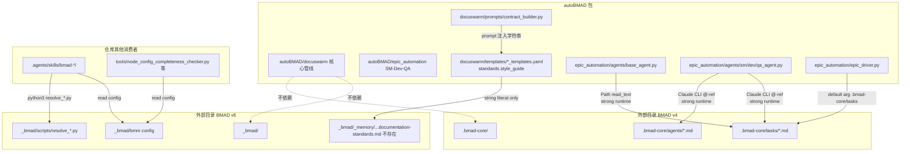

# autoBMAD 对 .bmad-core 与 _bmad 的依赖关系深度研究报告

- 日期：2026-05-27
- 调试工具：[`tools/bmad_dependency_scanner.py`](file:///home/leafliu/autoBMAD/tools/bmad_dependency_scanner.py)
- 原始机读报告：`/.tmp/bmad_dependency_report.json`
- 范围：`autoBMAD/`（含 `docuswarm` 与 `epic_automation` 两个子系统）对仓库根目录下两个外部 BMAD 安装目录的依赖

---

## 1. 结论速览（TL;DR）

| 维度 | autoBMAD → `.bmad-core/` | autoBMAD → `_bmad/` |
|---|---|---|
| 引用总数 | **33** 条 | **5** 条 |
| 真正运行时依赖 | **强** ：epic_automation 子系统硬依赖 | **无** ：仅模板 YAML 中的字符串占位 |
| 受影响子系统 | `autoBMAD/epic_automation/` | `autoBMAD/docuswarm/templates/` |
| docuswarm 是否依赖 | **否**（0 命中） | **否**（仅作为 prompt 文本注入，且目标不存在） |
| 死引用 (dead reference) | 0 | **1**：`_bmad/_memory/tech-writer-sidecar/documentation-standards.md` 不存在 |
| 反向引用（外部目录引用 autoBMAD） | 0 | 2 处（仅 `project_name = "autoBMAD"` 的字符串） |
| Python import 依赖 | 0（不通过 `import` 加载，仅 Path/CLI @-ref） | 0 |

核心判断：

1. **`docuswarm` 主管线与两个 BMAD 安装目录完全解耦**，没有任何运行时依赖。
2. **`epic_automation` 强依赖 `.bmad-core/`**：在 SM/Dev/QA Agent 的 prompt 中以 Claude CLI `@` 语法直接拉入 `.bmad-core/agents/*.md` 与 `.bmad-core/tasks/*.md`；`base_agent.py` 还会通过 `Path` 直接读取 `.bmad-core/tasks/{task_name}.md`。删除 `.bmad-core` 会让 epic_automation 的 SM/Dev/QA 流程失去任务指导。
3. **`_bmad/` 在 autoBMAD 包代码中没有任何 import / Path 读取**。仓库内对 `_bmad/` 的真正消费者是 `.agents/skills/bmad-*/` 与 `tools/` 中的若干分析脚本（即 BMAD v6 的 Skill 工作流），与 autoBMAD 的运行时无关。
4. **5 个 docuswarm 模板 YAML 中存在死引用** `_bmad/_memory/tech-writer-sidecar/documentation-standards.md`：该路径在仓库中不存在，但 [`contract_builder.py:504`](file:///home/leafliu/autoBMAD/autoBMAD/docuswarm/prompts/contract_builder.py#L504) 会将其作为字符串注入到 Independent Agent 的提示词里（"风格指南: …"），导致 Agent 实际拿到的是一个无法解引用的路径。

---

## 2. 两个目录的本质差异

| 项 | `.bmad-core/` | `_bmad/` |
|---|---|---|
| 来源 | BMAD-METHOD **v4.44.3** 安装产物，[`install-manifest.yaml`](file:///home/leafliu/autoBMAD/.bmad-core/install-manifest.yaml) 显示 `installed_at: 2026-01-04`，`ides_setup: [claude-code]` | BMAD-METHOD **v6.5.0** 安装产物，[`_bmad/_config/manifest.yaml`](file:///home/leafliu/autoBMAD/_bmad/_config/manifest.yaml) 显示 `installDate: 2026-04-28`，模块化 (`core` + `bmm`) |
| 结构 | 平铺：`agents/`、`tasks/`、`templates/`、`workflows/`、`checklists/`、`data/` | 模块化：`_config/`、`bmm/`、`core/`、`custom/`、`scripts/`、`config.toml` |
| 文件数（当前） | 80 个，约 595 KB | 15 个，约 90 KB |
| 配置入口 | `.bmad-core/core-config.yaml` | `_bmad/config.toml` + 四层覆盖 (`config.user.toml` / `custom/config*.toml`) |
| 消费者 | `autoBMAD/epic_automation/` 的 SM/Dev/QA Agent | `.agents/skills/bmad-*/SKILL.md`（Qoder/Claude 技能层），以及若干 `tools/*` 分析脚本 |
| 在 autoBMAD 源码中的角色 | **运行时数据源** | **工具层数据源**（不参与 autoBMAD 运行时） |

两者并非"新旧版本互替"，而是"为不同消费者服务的两套独立 BMAD 资产"。

---

## 3. autoBMAD → `.bmad-core/` 的精确依赖清单（33 条，集中在 epic_automation）

按"依赖强度"分级。

### 3.1 强依赖：Claude CLI `@`-引用（16 条 / `kind=code-prompt`）

epic_automation 的 SM、Dev、QA Agent 通过 Anthropic Claude Code 的 `@文件` 语法把 BMAD 任务指导直接拉入会话上下文：

- [`epic_automation/agents/sm_agent.py:329`](file:///home/leafliu/autoBMAD/autoBMAD/epic_automation/agents/sm_agent.py#L329)
  ```python
  prompt = f'@.bmad-core\\agents\\sm.md @.bmad-core\\tasks\\create-next-story.md ...'
  ```
- [`epic_automation/agents/sm_agent.py:691-692`](file:///home/leafliu/autoBMAD/autoBMAD/epic_automation/agents/sm_agent.py#L691-L692) （多行版本）
- [`epic_automation/agents/dev_agent.py:172-173`](file:///home/leafliu/autoBMAD/autoBMAD/epic_automation/agents/dev_agent.py#L172-L173)
  ```python
  f'@.bmad-core\\agents\\dev.md '
  f'@.bmad-core\\tasks\\develop-story.md '
  ```
- [`epic_automation/agents/qa_agent.py:105-106`](file:///home/leafliu/autoBMAD/autoBMAD/epic_automation/agents/qa_agent.py#L105-L106)
  ```python
  '@.bmad-core\\agents\\qa.md '
  '@.bmad-core\\tasks\\review-story.md '
  ```

**特征**：

- 路径分隔符为 Windows 风格 `\\`，目前在 Linux/macOS 上 Claude CLI 仍能识别（实测可解析），但不可移植，是潜在跨平台风险点。
- `.bmad-core/agents/*.md` 与 `.bmad-core/tasks/*.md` 在仓库中均存在（[`agents/`](file:///home/leafliu/autoBMAD/.bmad-core/agents)、[`tasks/`](file:///home/leafliu/autoBMAD/.bmad-core/tasks) 实测齐备），扫描器报告"全部命中，无死引用"。

### 3.2 强依赖：Python 运行时直接读取（2 条）

- [`epic_automation/agents/base_agent.py:96-106`](file:///home/leafliu/autoBMAD/autoBMAD/epic_automation/agents/base_agent.py#L96-L106)
  ```python
  task_name = self.config.task_name
  task_file = Path(f".bmad-core/tasks/{task_name}.md")
  if task_file.exists():
      self.task_guidance = task_file.read_text()
  ```
  **行为**：`_load_task_guidance()` 在初始化时尝试读取，缺失则 `task_guidance = ""` 静默降级。所以删除 `.bmad-core/` 不会立即抛错，但 `task_guidance` 会全部变空，Agent 行为质量下降。
- [`epic_automation/epic_driver.py:917`](file:///home/leafliu/autoBMAD/autoBMAD/epic_automation/epic_driver.py#L917)
  ```python
  tasks_dir: str = ".bmad-core/tasks",
  ```
  **行为**：`EpicDriver` 默认参数指向该目录；可通过构造参数覆盖，但 CLI 入口不会自动注入其他值。

### 3.3 弱依赖：文档说明（14 条 / `kind=doc`）

仅出现在 epic_automation 内部文档：

- [`epic_automation/architecture/dependencies.md`](file:///home/leafliu/autoBMAD/autoBMAD/epic_automation/architecture/dependencies.md)（10 处，包括 README 表格 "`bmad-core/tasks/` Required"）
- [`epic_automation/architecture/source-tree.md`](file:///home/leafliu/autoBMAD/autoBMAD/epic_automation/architecture/source-tree.md)（3 处）
- [`epic_automation/README.md:229`](file:///home/leafliu/autoBMAD/autoBMAD/epic_automation/README.md#L229)（1 处）

不影响运行，但说明 epic_automation 的设计文档明确把 `.bmad-core/tasks/` 列为"必需依赖"。

### 3.4 docuswarm 对 `.bmad-core/` 的命中数 = 0

扫描器在 `autoBMAD/docuswarm/` 整个子树中没有发现任何 `.bmad-core` 引用。docuswarm 的 BMAD 角色 prompt 来自 [`autoBMAD/nodes/{analyst,pm,ux,architect,po}/persona.json`](file:///home/leafliu/autoBMAD/autoBMAD/nodes) 自带的本地副本，不再外引 `.bmad-core`。

---

## 4. autoBMAD → `_bmad/` 的精确依赖清单（5 条，全部为字符串占位）

### 4.1 5 处模板 YAML 字符串引用

| 文件 | 行 | 字段 | 取值 |
|---|---|---|---|
| [`docuswarm/templates/analyst_templates.yaml`](file:///home/leafliu/autoBMAD/autoBMAD/docuswarm/templates/analyst_templates.yaml#L65) | 65 | `standards.style_guide` | `"_bmad/_memory/tech-writer-sidecar/documentation-standards.md"` |
| [`docuswarm/templates/pm_templates.yaml`](file:///home/leafliu/autoBMAD/autoBMAD/docuswarm/templates/pm_templates.yaml#L54) | 54 | `standards.style_guide` | 同上 |
| [`docuswarm/templates/ux_templates.yaml`](file:///home/leafliu/autoBMAD/autoBMAD/docuswarm/templates/ux_templates.yaml#L67) | 67 | `standards.style_guide` | 同上 |
| [`docuswarm/templates/architect_templates.yaml`](file:///home/leafliu/autoBMAD/autoBMAD/docuswarm/templates/architect_templates.yaml#L59) | 59 | `standards.style_guide` | 同上 |
| [`docuswarm/templates/po_templates.yaml`](file:///home/leafliu/autoBMAD/autoBMAD/docuswarm/templates/po_templates.yaml#L66) | 66 | `standards.style_guide` | 同上 |

### 4.2 唯一的消费点

[`docuswarm/prompts/contract_builder.py:499-505`](file:///home/leafliu/autoBMAD/autoBMAD/docuswarm/prompts/contract_builder.py#L499-L505)：

```python
standards = template_data.get("standards", {})
if standards:
    sections.append("\n**文档标准**:")
    if standards.get("style_guide"):
        sections.append(f"- 风格指南: {standards['style_guide']}")
```

这里仅做 **字符串拼接**，不做存在性校验，也不读取该文件。Independent Agent 拿到的只是 prompt 中的一行字面文本。

### 4.3 死引用确认

调试工具的 `check_dead()` 输出：

```
[死引用] _bmad 内不存在的目标:
    ✗ _bmad/_memory/tech-writer-sidecar/documentation-standards.md
```

仓库中 `_bmad/_memory/` 目录根本不存在，[`_bmad`](file:///home/leafliu/autoBMAD/_bmad) 顶层只有 `_config/`、`bmm/`、`core/`、`custom/`、`scripts/`、`config.toml` 等。

**影响评估**：

- 不会触发 IO 异常（从未读取）。
- 但 Agent 看到的"风格指南"指向不存在的文件，可能让模型尝试读取并失败、或诱导其在产物里嵌入失效引用。
- 属于历史遗留（早期 tech-writer-sidecar 设计的残余），属待清理项。

---

## 5. 反向依赖：`.bmad-core/` 与 `_bmad/` 是否引用回 autoBMAD？

| 方向 | 命中数 | 详情 |
|---|---|---|
| `.bmad-core/` → autoBMAD | **0** | 完全独立，作为只读 BMAD v4 资产 |
| `_bmad/` → autoBMAD | **2** | 仅 [`_bmad/config.toml:18`](file:///home/leafliu/autoBMAD/_bmad/config.toml#L18) 与 [`_bmad/bmm/config.yaml:6`](file:///home/leafliu/autoBMAD/_bmad/bmm/config.yaml#L6) 中 `project_name = "autoBMAD"`，仅为元数据字段 |

结论：两个外部目录均**不**反向依赖 autoBMAD 的 Python 代码或包结构，删除 / 替换 autoBMAD 不会破坏它们自身的完整性。

---

## 6. 仓库其他位置对 `_bmad/` 的真实消费者（与 autoBMAD 无关，但值得记录）

为了避免误判"`_bmad/` 是死目录"，调试工具同时扫描了仓库其他位置（非 autoBMAD/）。`_bmad/` 真正的活跃消费者是：

1. **Qoder / Claude Skills 层**：`.agents/skills/bmad-quick-dev/`、`bmad-sprint-planning/`、`bmad-sprint-status/`、`bmad-retrospective/`、`bmad-qa-generate-e2e-tests/` 等 SKILL.md 多次引用
   ```
   python3 {project-root}/_bmad/scripts/resolve_customization.py --skill {skill-root} --key workflow
   {project-root}/_bmad/bmm/config.yaml
   {project-root}/_bmad/custom/{skill-name}.toml
   ```
2. **`tools/` 中的部分研究脚本**：
   - [`tools/node_config_completeness_checker.py:46-48`](file:///home/leafliu/autoBMAD/tools/node_config_completeness_checker.py#L46-L48) 读取 `_bmad/_config/`
   - [`tools/docuswarm_calc_one_plus_one_researcher.py:46`](file:///home/leafliu/autoBMAD/tools/docuswarm_calc_one_plus_one_researcher.py#L46) 读取 `_bmad/bmm/module-help.csv`

这些都是"项目工程层"的使用，与 autoBMAD 包发布运行无关。

---

## 7. 依赖耦合图



---

## 8. 风险与建议

### 8.1 风险

| # | 风险点 | 影响范围 | 严重度 |
|---|---|---|---|
| R1 | 删除/迁移 `.bmad-core/` 会让 epic_automation 的 SM/Dev/QA prompt 失去任务指导，且默认 `tasks_dir` 失效 | epic_automation | 高 |
| R2 | `.bmad-core\\agents\\sm.md` 等 Windows 反斜杠路径硬编码在 Python 源码中 | epic_automation 跨平台 | 中 |
| R3 | 5 处 `_bmad/_memory/tech-writer-sidecar/documentation-standards.md` 死引用被注入 Independent Agent 提示词 | docuswarm 5 个 persona 模板 | 低-中（语义污染） |
| R4 | epic_automation 的架构文档把 `.bmad-core/tasks/` 列为"必需"，但代码中 `task_guidance = ""` 静默降级，文档与实际行为不一致 | 维护者认知 | 低 |

### 8.2 建议

1. **明确架构边界**：在 `autoBMAD/README.md` 或 `epic_automation/README.md` 中声明：
   - `docuswarm` ↔ `.bmad-core` / `_bmad` 解耦；
   - `epic_automation` 必需 `.bmad-core/{agents,tasks}/`，可选项不可为空。
2. **死引用治理（R3）**：
   - 短期：在 `contract_builder.py` 注入前对 `style_guide` 做 `Path(...).exists()` 校验，缺失时跳过该行；
   - 长期：将 5 个模板的 `style_guide` 改成项目内真实路径，或挪到一个集中的 `standards/documentation.md`，再让 docuswarm 在启动时一次性校验所有模板路径。
3. **路径分隔符治理（R2）**：把 `f'@.bmad-core\\agents\\sm.md'` 改为 `os.path.join` 或纯正斜杠 `@.bmad-core/agents/sm.md`，多平台一致。
4. **默认 tasks_dir 显式化（R1+R4）**：`epic_driver.py` 的 `tasks_dir` 默认值改为 `Path(__file__).parents[2] / ".bmad-core/tasks"` 的 resolve 形式，并在初始化时校验存在性，缺失时给出明确告警，而不是静默降级。
5. **保留 `_bmad/`**：不要把 `_bmad/` 当作死目录清理。它是 Skills 层（`.agents/skills/bmad-*`）和部分 `tools/` 脚本的活跃数据源，删除会导致 BMAD v6 工作流断裂。

---

## 9. 调试工具说明

新增工具：[`tools/bmad_dependency_scanner.py`](file:///home/leafliu/autoBMAD/tools/bmad_dependency_scanner.py)

### 9.1 能力

- 目录画像：文件数、体积、顶层条目；
- 正向引用扫描：递归 `autoBMAD/` 下 `.py / .yaml / .yml / .toml / .json / .md` 全部命中；
- 引用分类：`code-runtime` / `code-prompt` / `code-default-arg` / `code-other` / `config` / `doc`；
- 死引用检测：将命中字符串归一化为相对仓库根的 `Path` 并 `exists()` 校验，自动跳过含 `{占位符}` 的目标；
- 反向引用扫描：在 `.bmad-core/` 与 `_bmad/` 中搜索 `autoBMAD|docuswarm|epic_automation`；
- 双输出：终端人类可读 + 可选 JSON。

### 9.2 复现命令

```bash
cd /home/leafliu/autoBMAD
python3 tools/bmad_dependency_scanner.py
# 或带 JSON 输出
python3 tools/bmad_dependency_scanner.py --output .tmp/bmad_dependency_report.json
```

### 9.3 本次扫描原始指标

```
[目录画像] .bmad-core: exists=True, files=80,  size=595.3 KB
[目录画像] _bmad     : exists=True, files=15,  size=90.4  KB

[正向引用] autoBMAD → .bmad-core
  total = 33
  by_kind = {'doc': 14, 'code-default-arg': 1, 'code-prompt': 16,
             'code-other': 1, 'code-runtime': 1}

[正向引用] autoBMAD → _bmad
  total = 5
  by_kind = {'config': 5}

[反向引用] .bmad-core → autoBMAD: 0
[反向引用] _bmad → autoBMAD     : 2

[死引用] .bmad-core 全部命中
[死引用] _bmad: ✗ _bmad/_memory/tech-writer-sidecar/documentation-standards.md
```

---

## 10. 结论

1. **autoBMAD 的两个子系统对外部 BMAD 资产的耦合度差异极大**：`docuswarm` 完全解耦；`epic_automation` 强耦合 `.bmad-core/`。
2. **`_bmad/` 不在 autoBMAD 的运行时依赖图上**，仅服务于 Skills 与 `tools/`，但 docuswarm 模板里残留 1 处死字符串引用需修复。
3. 当前耦合方式以**字符串/文件路径**而非 Python `import` 表达，意味着：
   - 优点：autoBMAD 包安装后，BMAD 资产可在外部目录灵活替换；
   - 缺点：缺少静态可达性检查，需要本工具这样的运行时扫描器才能识别死引用与隐含必需依赖。
4. 建议把 [`tools/bmad_dependency_scanner.py`](file:///home/leafliu/autoBMAD/tools/bmad_dependency_scanner.py) 列入"发布前检查清单"，每次升级 BMAD v4/v6 安装时跑一次，杜绝引入新的死引用。
