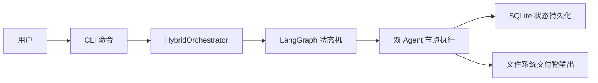

## DocuSwarm 实际工作流程（基于 autoBMAD/docuswarm 代码实现）

### 1. 总览：从命令行到交付物

**端到端主链路**（以 `python -m autoBMAD.docuswarm start -c proposal.md` 为例）：

1. **CLI 入口**：Python 通过模块入口 [`__main__.py`](file:///d:/GITHUB/DocuSwarm/autoBMAD/docuswarm/__main__.py) 调用 [`cli`](file:///d:/GITHUB/DocuSwarm/autoBMAD/docuswarm/main.py)。
2. **配置与日志初始化**：`cli` 加载 `.env` 和 `docuswarm.yaml`，创建全局配置 [`Config`](file:///d:/GITHUB/DocuSwarm/autoBMAD/docuswarm/config.py)，并初始化日志系统。
3. **启动流水线命令**：用户执行 `start --context <文件>`，命令实现位于 [`main.py`](file:///d:/GITHUB/DocuSwarm/autoBMAD/docuswarm/main.py) 的 `start` 函数：
   - 校验并读取上下文文件内容
   - 构建 `subject_context = {subject, context_file, content}`
   - 创建 [`HybridOrchestrator`](file:///d:/GITHUB/DocuSwarm/autoBMAD/docuswarm/pipeline/orchestrator.py) 实例
   - 通过 `asyncio.run(orchestrator.start_pipeline(subject_context))` 启动流水线
4. **混合编排器执行**：`HybridOrchestrator.start_pipeline`：
   - 调用 LLM 对上下文做一次**有效性校验**
   - 使用 [`StateManager`](file:///d:/GITHUB/DocuSwarm/autoBMAD/docuswarm/storage/state_manager.py) 在 SQLite 中创建流水线记录
   - 将流水线状态标记为 `running`，并设置当前节点为第一个节点
   - 构建 LangGraph 的 [`StateGraph`](file:///d:/GITHUB/DocuSwarm/autoBMAD/docuswarm/pipeline/graph.py) 编排图
   - 调用 `graph.ainvoke(initial_state, config)` 依次执行 analyst → pm → ux → architect → po
5. **节点执行与双 Agent 协作**：
   - 编排图中的每个节点使用集成执行器 `_create_integrated_node_executor`，其内部调用 [`create_node_executor`](file:///d:/GITHUB/DocuSwarm/autoBMAD/docuswarm/node_execution/executor.py)
   - `create_node_executor` 会：加载节点配置 → 创建 `DualAgentNode`（独立 Agent + 评估 Agent）→ 调用 `node.execute(...)`
   - 每个节点的执行结果（deliverable / questions / evaluation）会写回管道状态，并在 SQLite 中持久化节点运行历史
6. **文件输出**：
   - 在节点执行完成后，编排图会通过 [`FileStorage`](file:///d:/GITHUB/DocuSwarm/autoBMAD/docuswarm/storage/files.py) 将交付物写入磁盘：
     - 路径：`<autoBMAD>/output/<pipeline_id>/<节点对应文件名>`（例如 `analyst-report.md`、`prd.md` 等）
     - 可选地生成 `_metadata.json` 描述流水线输出
7. **流水线完成与 CLI 反馈**：
   - 当所有节点执行完成后，`HybridOrchestrator` 将状态更新为 `completed`
   - CLI 打印最终的 `pipeline_id`，后续可以通过 `status / export / questions / answer` 等命令继续操作

整体上，运行时工作流程是：

> **CLI 命令 → 混合编排器 → LangGraph 状态机 → 双 Agent 节点执行 → SQLite 状态持久化 → 文件系统交付物输出**。

下图给出了该端到端流程的时序概览：

---

### 2. CLI 层工作流程

#### 2.1 模块入口与命令分发

- **入口文件**：[`__main__.py`](file:///d:/GITHUB/DocuSwarm/autoBMAD/docuswarm/__main__.py)
  - 提供 `python -m autoBMAD.docuswarm` 入口
  - 直接导入并调用 [`cli`](file:///d:/GITHUB/DocuSwarm/autoBMAD/docuswarm/main.py#L37-L80)
- **命令组定义**：[`cli`](file:///d:/GITHUB/DocuSwarm/autoBMAD/docuswarm/main.py#L37-L80)
  - 负责：
    - 解析全局参数：`--verbose`、`--log-level`、`--log-file`、`--json-log`
    - 调用 [`load_config`](file:///d:/GITHUB/DocuSwarm/autoBMAD/docuswarm/config.py#L171-L199) 加载配置
    - 初始化日志（`configure_logging`）
    - 将配置和 verbose 状态保存到 `CliContext`，供后续子命令使用

#### 2.2 `start` 命令：启动新流水线

实现位置：[`main.start`](file:///d:/GITHUB/DocuSwarm/autoBMAD/docuswarm/main.py#L82-L147)

1. **输入校验与读取**：
   - 校验 `--context` 指定的文件存在且为普通文件
   - 以 UTF‑8 读取文件内容到 `content`
2. **构建 subject_context**：
   - `subject = context_path.stem`（文件名去扩展名）
   - `subject_context = {"subject", "context_file", "content"}`
3. **创建编排器并启动**：
   - 调用 `load_config()` 获取 `db_path / api_key / base_url`
   - 使用这些参数实例化 [`HybridOrchestrator`](file:///d:/GITHUB/DocuSwarm/autoBMAD/docuswarm/pipeline/orchestrator.py#L129-L168)
   - 通过 `asyncio.run(orchestrator.start_pipeline(subject_context))` 运行异步管道
4. **输出反馈**：
   - 成功时，打印 `Pipeline started: <pipeline_id>` 及上下文信息
   - 失败时，捕获异常并转换为 `click.ClickException`

#### 2.3 其它 CLI 命令与工作流

- `status`：[`main.status`](file:///d:/GITHUB/DocuSwarm/autoBMAD/docuswarm/main.py#L149-L242)
  - 使用 [`StateManager.get_pipeline`](file:///d:/GITHUB/DocuSwarm/autoBMAD/docuswarm/storage/state_manager.py#L249-L322) 查询管道状态
  - 使用 Rich 表格展示整体信息和每个节点的状态（Completed / Running / Pending）
- `resume`：
  - 支持两种路径：
    - 从最近检查点继续（`orchestrator.resume_pipeline`）
    - 从指定节点重启（`orchestrator.restart_from_node`）
- `export`：
  - 配合 [`FileStorage`](file:///d:/GITHUB/DocuSwarm/autoBMAD/docuswarm/storage/files.py) 和输出目录，将交付物复制/导出到指定目录
- `questions / answer`：
  - 基于 [`QuestionHandler`](file:///d:/GITHUB/DocuSwarm/autoBMAD/docuswarm/pipeline/questions.py) 对问题进行查询与回答
- `cancel / cancel-all / clean`：
  - 使用 `HybridOrchestrator.cancel_current_node` 以及 `StateManager` 对数据库记录进行更新或清理

CLI 层负责**参数解析、用户交互与错误提示**，具体的执行逻辑全部下沉到编排器和节点执行系统中。

---

### 3. 编排层工作流程：HybridOrchestrator

核心类：[`HybridOrchestrator`](file:///d:/GITHUB/DocuSwarm/autoBMAD/docuswarm/pipeline/orchestrator.py#L107-L169)

#### 3.1 初始化与依赖

- 初始化参数：`db_path, checkpointer, session_manager, work_dir, api_key, base_url`
- 内部依赖：
  - [`StateManager`](file:///d:/GITHUB/DocuSwarm/autoBMAD/docuswarm/storage/state_manager.py)：负责管道和节点结果的持久化
  - [`KimiSessionManager`](file:///d:/GITHUB/DocuSwarm/autoBMAD/docuswarm/llm/session_manager.py)：管理 LLM 会话和 SDK 调用
  - [`create_pipeline_graph`](file:///d:/GITHUB/DocuSwarm/autoBMAD/docuswarm/pipeline/graph.py#L492-L639)：创建 LangGraph 状态机
  - [`create_checkpoint_config` / `generate_thread_id`](file:///d:/GITHUB/DocuSwarm/autoBMAD/docuswarm/storage/checkpoints.py)：生成线程隔离配置
- `work_dir` 默认指向 `<autoBMAD>/output`，用于存放与 SDK 会话相关的工作目录

#### 3.2 `start_pipeline`：启动完整流水线

位置：[`HybridOrchestrator.start_pipeline`](file:///d:/GITHUB/DocuSwarm/autoBMAD/docuswarm/pipeline/orchestrator.py#L363-L495)

1. **上下文校验**：
   - 调用 `_validate_context(subject_context)` 使用 Kimi Instant LLM 对输入上下文做结构化校验
   - 若校验失败（`valid=False`），抛出 `ContextValidationError` 阻止流水线启动
   - 校验失败但结果无法解析时，采取“**fail-open**”策略，允许流水线继续，以提高健壮性
2. **创建流水线记录**：
   - 从 `subject_context` 中取 `subject`
   - 调用 [`StateManager.create_pipeline`](file:///d:/GITHUB/DocuSwarm/autoBMAD/docuswarm/storage/state_manager.py#L98-L132)，生成唯一 `pipeline_id` 并插入 `pipelines` 表
3. **初始化状态并标记为运行中**：
   - 使用 [`create_initial_state`](file:///d:/GITHUB/DocuSwarm/autoBMAD/docuswarm/pipeline/state.py#L79-L108) 构造 `PipelineState`
   - 将流水线状态更新为 `running`，`current_node` 设置为第一个节点 `PIPELINE_NODES[0]`（analyst）
   - 建立日志上下文（`set_log_context`）
4. **准备工作目录与检查点**：
   - 在 `self._work_dir/<pipeline_id>` 下创建流水线专属工作目录
   - 通过 `generate_thread_id` + `create_checkpoint_config` 为 LangGraph 构造线程隔离配置
   - 若未提供 `checkpointer`，则使用 SQLite 数据库创建异步 `AsyncSqliteSaver` 作为检查点存储
5. **构建并执行状态图**：
   - 调用 [`create_pipeline_graph`](file:///d:/GITHUB/DocuSwarm/autoBMAD/docuswarm/pipeline/graph.py#L492-L639)，并传入 `session_manager`：
     - 当提供 `session_manager` 时，使用集成执行器 `_create_integrated_node_executor`，即走**真实双 Agent 执行路径**
   - 通过 `graph.ainvoke(initial_state, config)` 启动状态机执行，LangGraph 负责驱动各个节点按顺序运行
6. **完成与错误处理**：
   - 正常结束时，从最终 `result` 中读取 `current_node`，并将状态更新为 `completed`
   - 发生异常时，将状态更新为 `failed` 并记录日志

#### 3.3 恢复、重启与取消

- **恢复**：[`resume_pipeline`](file:///d:/GITHUB/DocuSwarm/autoBMAD/docuswarm/pipeline/orchestrator.py#L495-L643)
  - 从数据库读取 `state`，检查是否已有 `completed` 状态
  - 若有中断的 SDK 会话，则尝试通过 `_attempt_session_resume` 恢复；否则回退到从检查点状态继续执行
  - 重新构造 LangGraph，恢复 `PipelineState` 后再次 `ainvoke`
- **从节点重启**：[`restart_from_node`](file:///d:/GITHUB/DocuSwarm/autoBMAD/docuswarm/pipeline/orchestrator.py#L645-L802)
  - 在现有检查点状态上，清理指定节点之后的 deliverables / questions / evaluations
  - 调整 `completed_nodes` 并重新执行后续节点
- **取消当前节点**：[`cancel_current_node`](file:///d:/GITHUB/DocuSwarm/autoBMAD/docuswarm/pipeline/orchestrator.py#L987-L1086)
  - 从状态中读取 `current_node_session_id`
  - 通过 `KimiSessionManager` 找到活跃会话并调用 `session.cancel()`
  - 将流水线状态标记为 `cancelled`

---

### 4. LangGraph 状态机工作流程

核心定义：[`create_pipeline_graph`](file:///d:/GITHUB/DocuSwarm/autoBMAD/docuswarm/pipeline/graph.py#L492-L639)

#### 4.1 状态结构：PipelineState

由 [`PipelineState`](file:///d:/GITHUB/DocuSwarm/autoBMAD/docuswarm/pipeline/state.py#L57-L78) 描述，包含：

- `pipeline_id`：流水线标识
- `subject_context`：原始上下文（来自 CLI 的 `subject_context`）
- `current_node` / `completed_nodes`：节点执行进度
- `deliverables` / `questions` / `evaluations`：各节点交付物与评估结果
- `node_iterations`：每个节点已执行的迭代次数
- `session_ids` / `session_metadata` / `current_node_session_id`：会话与恢复信息
- `status` / `error`：流水线整体状态与错误信息

#### 4.2 节点与边

- `PIPELINE_NODES = ["analyst", "pm", "ux", "architect", "po"]`
- 图结构：
  - `__start__ → analyst → pm → ux → architect → po → __finalize__ → END`
  - `__finalize__` 通过 [`finalize_pipeline_state`](file:///d:/GITHUB/DocuSwarm/autoBMAD/docuswarm/pipeline/state.py#L267-L297) 将状态标记为 `completed`

#### 4.3 节点执行器：集成 node_execution.executor

- 当 `session_manager` 不为空时，`create_pipeline_graph` 为每个节点创建 `_create_integrated_node_executor(node_id, session_manager)`：
  - 在执行器内部：
    1. 从当前 `PipelineState` 生成 `NodeRunState`：
       - 使用 `_convert_pipeline_to_node_state`
       - 构造 `context_file`（JSON），其中包含 `subject_context` 和所有前序节点的 deliverable（通过 `accumulate_context` 聚合）
    2. 调用 [`create_node_executor`](file:///d:/GITHUB/DocuSwarm/autoBMAD/docuswarm/node_execution/executor.py#L34-L72) 创建异步执行器
    3. 运行异步执行器（`async` → `sync` 转换）
    4. 将执行结果通过 `_convert_node_to_pipeline_state` 回写到 `PipelineState` 中
    5. 成功时，使用 [`FileStorage`](file:///d:/GITHUB/DocuSwarm/autoBMAD/docuswarm/storage/files.py#L40-L179) 将交付物保存为 Markdown 文件

---

### 5. 节点执行层工作流程：Dual Agent 节点

节点执行入口：[`create_node_executor`](file:///d:/GITHUB/DocuSwarm/autoBMAD/docuswarm/node_execution/executor.py#L34-L72)

#### 5.1 NodeRunState 与状态流转

- 输入类型：[`NodeRunState`](file:///d:/GITHUB/DocuSwarm/autoBMAD/docuswarm/node_execution/state.py)，主要字段：
  - `run_id` / `pipeline_id` / `node_id`
  - `context_file`（字符串）：来自 `PipelineState` 聚合后的上下文 JSON
  - `iteration`：当前迭代计数
  - `deliverable` / `questions` / `evaluation`
  - `chained_context`：历史节点输出
  - `status`：`pending / running / completed / blocked / failed`

#### 5.2 `_execute_node` 执行流程

位置：[`_execute_node`](file:///d:/GITHUB/DocuSwarm/autoBMAD/docuswarm/node_execution/executor.py#L75-L215)

1. **初始化**：
   - 复制输入状态为 `new_state`，将状态标记为 `running`
2. **加载节点配置**：
   - 使用 [`NodeLoader`](file:///d:/GITHUB/DocuSwarm/autoBMAD/docuswarm/nodes/loader.py) 读取当前节点配置
3. **构造双 Agent 节点**：
   - 通过 [`create_dual_agent_node`](file:///d:/GITHUB/DocuSwarm/autoBMAD/docuswarm/nodes/dual_agent.py) 创建 `DualAgentNode`
   - 其中包含：
     - `IndependentAgent`：负责生成交付物和问题
     - `EvaluatorAgent`：负责评估和给出 verdict
4. **构建执行输入**：
   - `subject_context`：来自 `NodeRunState.context_file`（首选从 JSON 中解析 `subject_context.content`）
   - `task`：通过 `_extract_task_from_state` 从 context 或链式上下文补充任务描述
   - `pipeline_id`：供 Agent 侧用于标识运行
5. **执行节点**：
   - 调用 `node.execute(subject_context=..., task=..., pipeline_id=...)`
   - 返回结果中包含：`deliverable / questions / evaluation`
6. **更新状态与判定**：
   - 将结果写入 `new_state`
   - 根据 `evaluation.verdict` 决定 `status`：
     - `APPROVED` / `FORCE_APPROVED` → `COMPLETED`
     - `BLOCKED` → `BLOCKED`
     - 其他或缺失 → `RUNNING`（需要进一步迭代）
   - 迭代计数 `iteration` + 1
7. **异常处理**：
   - 任意异常时，将 `status` 标记为 `FAILED`，并记录错误信息

---

### 6. 状态持久化与输出文件工作流程

#### 6.1 SQLite 状态管理：StateManager

位置：[`autoBMAD/docuswarm/storage/state_manager.py`](file:///d:/GITHUB/DocuSwarm/autoBMAD/docuswarm/storage/state_manager.py)

- **管道级别**：
  - `create_pipeline`：插入 `pipelines` 表，初始状态为 `pending`，`state_json` 中保存 `subject_context`
  - `update_pipeline_status`：更新 `status` 和 `current_node`，并刷新 `updated_at`
  - `get_pipeline`：根据 `pipeline_id` 查询管道及所有 `node_results`，并将 `state_json` 反序列化为 Python 字典
  - `list_pipelines`：按状态过滤并按 `created_at DESC` 排序
  - `update_subject_context`：在 `state_json` 中合并新的上下文信息
- **节点级别**：
  - `save_node_result`：将单次节点执行结果写入 `node_results` 表（JSON 字段存储 deliverable / questions / evaluation）
  - `get_latest_successful_run` / `list_node_runs`：按 `context_hash` 查询历史运行记录，支持重用已有交付物
  - `create_node_run` / `update_node_run`：为 node_execution 层的独立 run 记录执行过程和结束状态

#### 6.2 文件存储：FileStorage

位置：[`autoBMAD/docuswarm/storage/files.py`](file:///d:/GITHUB/DocuSwarm/autoBMAD/docuswarm/storage/files.py)

- 输出目录：
  - 默认根目录：`output_root`（在 `HybridOrchestrator` 中默认指向 `<autoBMAD>/output`）
  - 每个流水线单独使用子目录：`<output_root>/<pipeline_id>/`
- 核心方法：
  - `save_deliverable(pipeline_id, node_type, content, ...)`：
    - 根据 `node_type` 映射文件名（如 `analyst-report.md`、`prd.md`、`ux-design.md` 等）
    - 使用临时文件 + 重命名的原子写入方式保存 Markdown 内容
    - 可选写入 YAML frontmatter 包含 `pipeline_id` / `node` / `created_at` / `evaluation_score`
  - `save_metadata(pipeline_id, deliverables_info)`：
    - 在流水线目录下生成 `_metadata.json`，记录交付物清单和时间戳

---

### 7. 实际运行示例：一次完整 DocuSwarm 流水线

以 `python -m autoBMAD.docuswarm start -c docs/epics/EPIC-01.md` 为例，实际执行顺序如下：

1. `python` 解析 `-m autoBMAD.docuswarm` → 调用 [`__main__.py`](file:///d:/GITHUB/DocuSwarm/autoBMAD/docuswarm/__main__.py) → 进入 [`cli`](file:///d:/GITHUB/DocuSwarm/autoBMAD/docuswarm/main.py#L37-L80)
2. `cli` 加载配置、初始化日志，并将 `CliContext` 存入 `ctx.obj`
3. Click 将命令分派到 `start` 子命令：
   - 校验并读取 `docs/epics/EPIC-01.md`
   - 构建 `subject_context = {subject="EPIC-01", context_file, content}`
4. `start` 创建 `HybridOrchestrator`，并触发 `start_pipeline(subject_context)`：
   - LLM 进行一次上下文结构化校验
   - 在 SQLite 中创建 `pipelines` 记录，生成 `pipeline-<timestamp>-<uuid>`
   - 将状态置为 `running`，当前节点为 `analyst`
5. `start_pipeline` 构建 LangGraph 状态机，并携带 `session_manager` 执行：
   - 依次为 `analyst / pm / ux / architect / po` 五个节点构造 NodeRunState，并调用双 Agent 节点
   - 每个节点执行结束后：
     - 更新 `PipelineState`（deliverables / questions / evaluations / node_iterations / completed_nodes）
     - 更新 SQLite 中的 `node_results`、相关运行记录
     - 通过 `FileStorage` 将交付物保存到 `<autoBMAD>/output/<pipeline_id>/...`
6. 所有节点完成后，`__finalize__` 节点将状态标记为 `completed`，`HybridOrchestrator` 将最终状态写回数据库
7. CLI 打印 `Pipeline started: <pipeline_id>`，用户可通过：
   - `status <pipeline_id>` 查看进度与节点状态
   - `questions / answer` 查看并回答问题
   - `export <pipeline_id>` 导出交付物到工作目录

至此，DocuSwarm 在当前代码实现下的**实际工作流程**从入口到输出完成闭环。