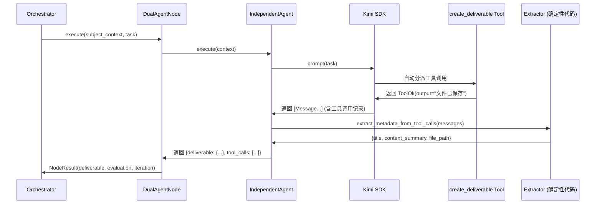
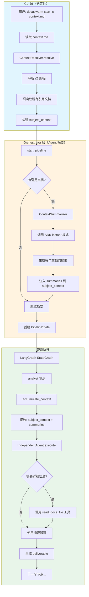

# DocuSwarm 重构详细研究报告 - Part 2

> **版本**: 1.0
> **创建日期**: 2026-03-01
> **基于**: [DocuSwarm-重构详细研究报告.md](DocuSwarm-重构详细研究报告.md) (Part 1)
> **协调文档**: [DocuSwarm-重构详细研究报告-Part3.md](DocuSwarm-重构详细研究报告-Part3.md) (SDK 替换)
> **TDD 方案**: 
> - [TDD-03: Tool Result Extractor](../solution/TDD-03-ToolResultExtractor-Refactor.md) - 纯工具输出模式
> - [TDD-04: Context Resolver](../solution/TDD-04-ContextResolver-Refactor.md) - @路径注入
> **聚焦领域**: 
> 1. 移除提问 Agent 机制
> 2. 纯工具输出模式改造（与 Part 3 工具系统改造协调）
> 3. "@" 路径上下文注入系统

---

## 一、执行摘要

本报告是 DocuSwarm 重构研究的第二部分，聚焦于三个关键架构改造：

1. **移除提问 Agent**：删除 `QuestionHandler`、CLI `questions/answer` 命令及相关代码，简化系统复杂度
2. **纯工具输出模式**：取消要求 LLM 返回 JSON 元数据，交付物完全通过 `create_deliverable` / `create_document_set` 工具产生，元数据从工具调用参数中确定性提取
3. **"@" 路径上下文注入**：实现混合方案——CLI 层解析 "@" 路径，Orchestrator 层注入文档摘要（通过 Agent 调用 SDK 生成），各节点通过 `accumulate_context` 继承

---

## 二、移除提问 Agent 机制

### 2.1 当前实现分析

#### 涉及代码位置

| 文件 | 行号范围 | 功能 |
|------|---------|------|
| [questions.py](../../autoBMAD/docuswarm/pipeline/questions.py) | 1-277 | `QuestionPriority` 枚举、`Question` 数据类、`QuestionHandler` 类 |
| [main.py](../../autoBMAD/docuswarm/main.py) | 467-549 | `questions` CLI 命令 |
| [main.py](../../autoBMAD/docuswarm/main.py) | 552-612 | `answer` CLI 命令 |
| [independent.py](../../autoBMAD/docuswarm/agents/independent.py) | 161-182 | Agent 指令中的 questions 输出要求 |
| [state.py](../../autoBMAD/docuswarm/pipeline/state.py) | 69 | `PipelineState.questions` 字段 |
| [dual_agent.py](../../autoBMAD/docuswarm/nodes/dual_agent.py) | 337-340 | 从 IndependentAgent 输出中提取 questions |

#### 当前工作流程

```
IndependentAgent.execute()
    ↓
返回 JSON: {deliverable, questions: [{question, priority, context}]}
    ↓
DualAgentNode.execute()
    ↓ 提取 questions
    ↓
NodeResult.questions
    ↓ 存入
PipelineState.questions[node_id]
    ↓ CLI 查询
questions / answer 命令
```

### 2.2 移除方案

#### 2.2.1 删除的文件

```
autoBMAD/docuswarm/pipeline/questions.py  # 完全删除（277行）
```

#### 2.2.2 修改的文件

**A. `main.py` - 删除 CLI 命令**

```python
# 删除以下代码块：
# - questions 命令（行 467-549）
# - answer 命令（行 552-612）
# - 相关导入：QuestionHandler, QuestionPriority
```

**B. `state.py` - 移除 questions 字段**

```python
# 修改 PipelineState TypedDict
class PipelineState(TypedDict):
    pipeline_id: str
    subject_context: dict[str, Any]
    current_node: str | None
    completed_nodes: list[str]
    deliverables: dict[str, dict[str, Any]]
    # questions: dict[str, list[dict[str, Any]]]  # 删除此行
    evaluations: dict[str, dict[str, Any]]
    # ... 其他字段保持不变
```

**C. `create_initial_state()` - 移除 questions 初始化**

```python
# 修改 state.py 中的 create_initial_state()
def create_initial_state(pipeline_id: str, subject_context: dict[str, Any]) -> PipelineState:
    return PipelineState(
        pipeline_id=pipeline_id,
        subject_context=subject_context,
        current_node=None,
        completed_nodes=[],
        deliverables={},
        # questions={},  # 删除此行
        evaluations={},
        # ...
    )
```

**D. `independent.py` - 简化输出格式要求**

```python
# 修改 _format_system_prompt() 中的 JSON 输出要求
# 删除 questions 相关指令（行 161-182 中的 questions 部分）
```

**E. `dual_agent.py` - 移除 questions 提取逻辑**

```python
# 修改 execute() 方法
# 删除 final_questions 变量和相关逻辑（行 289, 337-340）
# 修改 NodeResult dataclass，移除 questions 字段
```

**F. `response.py` - 简化验证函数**

```python
# 修改 validate_independent_output()
# 移除 questions 字段的必需验证（行 140-210 中的 questions 部分）
```

#### 2.2.3 影响范围评估

| 影响组件 | 改动类型 | 风险等级 |
|---------|---------|---------|
| `questions.py` | 删除 | 低 |
| CLI 命令 | 删除 | 低 |
| `PipelineState` | 字段移除 | 中 |
| `NodeResult` | 字段移除 | 中 |
| Agent 输出验证 | 简化 | 低 |
| 数据库 Schema | 无影响 | - |

---

## 三、纯工具输出模式改造

> **TDD 方案**: [TDD-03: Tool Result Extractor](../solution/TDD-03-ToolResultExtractor-Refactor.md)

### 3.1 当前问题分析

#### 当前设计的问题

```
IndependentAgent 当前要求：
1. 调用 create_deliverable 工具 → 写入 Markdown 文件
2. 返回 JSON 元数据 → {deliverable: {title, content}, questions, action}
    ↑
    问题：LLM 经常忘记步骤 2，返回纯 Markdown
    ↓
解决方案：Markdown 回退机制（independent.py:370-397）
```

**问题根因**：要求 LLM 在同一次调用中执行两种不同类型的输出——工具调用和结构化 JSON。这违反了 12-Factor Agents 的 Factor 4（"Tools Are Just Structured Outputs"）。

**实施方案**: 详见 [TDD-03](../solution/TDD-03-ToolResultExtractor-Refactor.md)

#### 理想模式（12-Factor #4）

```
Agent 唯一输出方式：工具调用
    ↓
工具调用参数 = 结构化输出
    ↓
确定性代码从工具调用记录中提取元数据
```

### 3.2 纯工具输出方案设计

#### 3.2.1 新的工作流程



#### 3.2.2 核心代码改造

> **完整实现**: [TDD-03: Tool Result Extractor](../solution/TDD-03-ToolResultExtractor-Refactor.md)

**A. 新增 `tools/tool_result_extractor.py`** (TDD-03)

```python
"""从工具调用记录中提取结构化元数据的确定性提取器。"""

from __future__ import annotations

from dataclasses import dataclass
from typing import Any

from kimi_agent_sdk import Message


@dataclass
class DeliverableMetadata:
    """从 create_deliverable 工具调用中提取的元数据。"""
    
    title: str
    content_summary: str  # 前 500 字符
    file_path: str
    metadata: dict[str, Any]


def extract_deliverable_from_messages(
    messages: list[Message],
) -> DeliverableMetadata | None:
    """从消息记录中确定性地提取 create_deliverable 工具调用的参数。
    
    遍历所有消息，找到 tool_use 类型的内容，提取参数。
    
    Args:
        messages: Kimi SDK 返回的消息列表。
        
    Returns:
        DeliverableMetadata 或 None（如果未找到工具调用）。
    """
    for msg in messages:
        if not hasattr(msg, "content"):
            continue
            
        content = msg.content
        if isinstance(content, list):
            for part in content:
                if hasattr(part, "type") and part.type == "tool_use":
                    if part.name == "create_deliverable":
                        params = part.input  # Pydantic 模型参数
                        return DeliverableMetadata(
                            title=params.get("title", "Untitled"),
                            content_summary=params.get("content", "")[:500],
                            file_path=f"{_slugify(params.get('title', 'doc'))}.md",
                            metadata=params.get("metadata", {}),
                        )
    return None


def extract_document_set_from_messages(
    messages: list[Message],
) -> list[DeliverableMetadata]:
    """从消息记录中提取 create_document_set 工具调用的参数。"""
    results = []
    for msg in messages:
        if not hasattr(msg, "content"):
            continue
            
        content = msg.content
        if isinstance(content, list):
            for part in content:
                if hasattr(part, "type") and part.type == "tool_use":
                    if part.name == "create_document_set":
                        params = part.input
                        for doc in params.get("documents", []):
                            results.append(DeliverableMetadata(
                                title=doc.get("title") or doc.get("template_id"),
                                content_summary=doc.get("content", "")[:500],
                                file_path=f"{_slugify(doc.get('title', 'doc'))}.md",
                                metadata=doc.get("metadata", {}),
                            ))
    return results


def _slugify(title: str) -> str:
    """将标题转换为文件名。"""
    import re
    slug = title.lower().replace(" ", "-")
    slug = re.sub(r"[^a-z0-9\-]", "", slug)
    return slug or "document"
```

**B. 修改 `independent.py` - 简化输出处理**

```python
# 修改 _format_system_prompt() 方法
def _format_system_prompt(self) -> str:
    """格式化系统提示词 - 纯工具输出模式。"""
    persona_prompt = PersonaLoader.format_system_prompt(self.persona, max_tokens=2000)
    
    # 简化指令 - 只需调用工具，无需返回 JSON
    instructions = """## Agent Instructions

You are an Independent Agent that creates deliverables.

## Execution Workflow

1. **Analyze the context**: Understand the task requirements
2. **Create Deliverable**: Use the 'create_deliverable' tool to save your document
   - title: Brief descriptive title
   - content: Complete Markdown document content
   - metadata: Any relevant metadata (optional)

## CRITICAL: Tool-Only Output

Your ONLY output should be through the 'create_deliverable' tool.
Do NOT output any text after calling the tool.
The system will automatically extract metadata from your tool call.

## Example

For a task "Create market analysis report":
1. Call create_deliverable with:
   - title: "Market Analysis Report"
   - content: "# Market Analysis Report\\n\\n## Executive Summary\\n..."
   - metadata: {"node": "analyst", "type": "report"}
2. Done. No additional output needed.
"""
    return f"{persona_prompt}\n\n{instructions}"


# 修改 execute() 方法 - 使用确定性提取器
async def execute(self, context: dict[str, Any]) -> IndependentOutput:
    """执行 Independent Agent - 纯工具输出模式。"""
    # ... 现有的上下文提取逻辑 ...
    
    # 调用 LLM
    response = await self._call_llm(user_message=enriched_task)
    
    # 从工具调用记录中确定性提取元数据（替代 JSON 解析）
    from autoBMAD.docuswarm.tools.tool_result_extractor import (
        extract_deliverable_from_messages,
        extract_document_set_from_messages,
    )
    
    deliverable_meta = extract_deliverable_from_messages(response)
    
    if deliverable_meta is None:
        # 尝试 document_set
        doc_set = extract_document_set_from_messages(response)
        if doc_set:
            deliverable_meta = doc_set[0]  # 使用第一个文档作为主交付物
    
    if deliverable_meta is None:
        raise IndependentAgentError("Agent did not call any deliverable creation tool")
    
    # 构建输出（从工具调用参数确定性生成）
    return {
        "deliverable": {
            "title": deliverable_meta.title,
            "content": deliverable_meta.content_summary,
            "metadata": deliverable_meta.metadata,
        },
        "tool_calls": [
            {"tool": "create_deliverable", "params": asdict(deliverable_meta)}
        ],
    }
```

**C. 修改 `response.py` - 简化验证**

```python
# 简化 validate_independent_output()
def validate_independent_output(data: dict[str, Any]) -> None:
    """验证 Independent Agent 输出格式（纯工具模式）。
    
    新的验证规则（简化版）：
    - deliverable.title: 必需，字符串
    - deliverable.content: 必需，字符串（摘要）
    - deliverable.metadata: 可选，字典
    
    不再验证：
    - questions（已移除）
    - action（已移除）
    - private_reasoning（移至内部日志）
    """
    if "deliverable" not in data:
        raise ValidationError("Missing 'deliverable' field")
    
    deliverable = data["deliverable"]
    if not isinstance(deliverable, dict):
        raise ValidationError("'deliverable' must be a dictionary")
    
    if "title" not in deliverable or not isinstance(deliverable["title"], str):
        raise ValidationError("'deliverable.title' must be a string")
    
    if "content" not in deliverable or not isinstance(deliverable["content"], str):
        raise ValidationError("'deliverable.content' must be a string")
```

**D. 修改 `dual_agent.py` - 移除 JSON 解析依赖**

```python
# 修改 NodeResult dataclass
@dataclass
class NodeResult:
    """纯工具输出模式的节点结果。"""
    
    deliverable: dict[str, Any]  # 从工具调用参数提取
    # questions: list[dict[str, Any]]  # 已移除
    evaluation: dict[str, Any]
    iteration: int
    timestamp: datetime
    tool_calls: list[dict[str, Any]]  # 新增：工具调用记录
    force_completion: ForceCompletion | None = None


# 修改 execute() 方法
async def execute(self, ...) -> NodeResult:
    # ... 迭代循环 ...
    
    independent_output = await self.independent_agent.execute(independent_context)
    
    # 从工具输出中获取 deliverable（不再从 JSON 解析）
    final_deliverable = independent_output.get("deliverable", {})
    tool_calls = independent_output.get("tool_calls", [])
    
    # ... Evaluator 执行 ...
    
    return NodeResult(
        deliverable=final_deliverable,
        evaluation=final_evaluation,
        iteration=iteration,
        timestamp=datetime.now(),
        tool_calls=tool_calls,
        force_completion=final_force_completion,
    )
```

### 3.3 改造收益评估

| 指标 | 改造前 | 改造后 |
|------|--------|--------|
| LLM 输出可靠性 | 需要 Markdown 回退逻辑 | 100% 确定性（工具调用记录） |
| Agent 指令复杂度 | 高（需要记住两种输出格式） | 低（只需调用工具） |
| 代码复杂度 | `extract_json()` + 多层回退 | `extract_from_tool_calls()`（确定性） |
| 元数据一致性 | 可能与实际文件不一致 | 保证一致（同一参数来源） |
| 测试难度 | 需要 mock JSON 解析 | 只需 mock 工具调用 |

---

## 四、"@" 路径上下文注入系统

> **TDD 方案**: [TDD-04: Context Resolver](../solution/TDD-04-ContextResolver-Refactor.md)

### 4.1 设计目标

实现混合方案：
1. **CLI 层**（确定性）：解析 `@` 路径，预读取文档
2. **Orchestrator 层**（Agent 摘要）：调用 SDK 生成文档摘要，注入 PipelineState
3. **节点层**（继承 + 按需）：通过 `accumulate_context` 获得摘要，可用 `read_docs_file` 读取全文

**实施方案**: 详见 [TDD-04](../solution/TDD-04-ContextResolver-Refactor.md)

### 4.2 "@" 路径语法规范

```markdown
# context_file.md 中的 @ 路径语法

支持的格式：
- @docs/research/报告A.md          → 相对于项目 docs/ 目录
- @./local/file.md                  → 相对于 context_file 所在目录
- @/absolute/path/file.md           → 绝对路径（不推荐）

示例 context_file：
```
## 项目背景

请参考以下研究报告：
- @docs/evaluation/12-Factor-Agents-深度研究报告.md
- @docs/evaluation/BMAD-Method-工作流体系深度分析报告.md
- @docs/research/DocuSwarm-程序实际工作流程.md

## 任务要求

基于上述报告，创建重构方案...
```
```

### 4.3 实现方案

> **完整实现**: [TDD-04: Context Resolver](../solution/TDD-04-ContextResolver-Refactor.md)

#### 4.3.1 新增 `utils/context_resolver.py` (TDD-04)

```python
"""上下文文件 @ 路径解析器。"""

from __future__ import annotations

import re
from dataclasses import dataclass, field
from pathlib import Path
from typing import Any


@dataclass
class ReferencedDocument:
    """被引用的文档信息。"""
    
    original_reference: str  # 原始 @ 引用，如 "@docs/research/报告.md"
    resolved_path: Path      # 解析后的绝对路径
    content: str             # 文档内容
    summary: str = ""        # 摘要（由 Agent 生成）
    exists: bool = True      # 文件是否存在
    error: str | None = None # 解析错误信息


@dataclass
class ResolvedContext:
    """解析后的上下文。"""
    
    original_content: str                    # 原始 context_file 内容
    cleaned_content: str                     # 移除 @ 引用后的内容
    referenced_documents: list[ReferencedDocument] = field(default_factory=list)
    total_tokens_estimate: int = 0           # 预估 token 数
    

class ContextResolver:
    """解析 context_file 中的 @ 路径引用。"""
    
    # @ 路径正则：匹配 @开头，后跟路径字符，直到空白或行尾
    PATH_PATTERN = re.compile(r"@([\w./\-\u4e00-\u9fff]+\.(?:md|txt|yaml|json))", re.UNICODE)
    
    def __init__(self, project_root: Path | None = None):
        """初始化解析器。
        
        Args:
            project_root: 项目根目录，用于解析 @docs/ 路径。
        """
        self.project_root = project_root or Path.cwd()
        self.docs_root = self.project_root / "docs"
    
    def resolve(
        self,
        content: str,
        context_file_path: Path | None = None,
    ) -> ResolvedContext:
        """解析 context_file 内容中的 @ 路径。
        
        Args:
            content: context_file 的原始内容。
            context_file_path: context_file 的路径（用于解析相对路径）。
            
        Returns:
            ResolvedContext 包含所有解析结果。
        """
        result = ResolvedContext(
            original_content=content,
            cleaned_content=content,
        )
        
        # 查找所有 @ 引用
        matches = self.PATH_PATTERN.findall(content)
        
        for ref_path in matches:
            doc = self._resolve_single_reference(
                ref_path,
                context_file_path,
            )
            result.referenced_documents.append(doc)
            
            # 估算 token 数（粗略：4 字符 ≈ 1 token）
            if doc.exists:
                result.total_tokens_estimate += len(doc.content) // 4
        
        return result
    
    def _resolve_single_reference(
        self,
        ref_path: str,
        context_file_path: Path | None,
    ) -> ReferencedDocument:
        """解析单个 @ 引用。"""
        try:
            # 确定解析策略
            if ref_path.startswith("docs/"):
                # @docs/... → 相对于 project_root
                resolved = self.project_root / ref_path
            elif ref_path.startswith("./"):
                # @./... → 相对于 context_file 所在目录
                if context_file_path:
                    resolved = context_file_path.parent / ref_path[2:]
                else:
                    resolved = Path.cwd() / ref_path[2:]
            elif ref_path.startswith("/"):
                # 绝对路径
                resolved = Path(ref_path)
            else:
                # 默认：相对于 docs/
                resolved = self.docs_root / ref_path
            
            resolved = resolved.resolve()
            
            # 安全检查：防止路径遍历攻击
            if not self._is_safe_path(resolved):
                return ReferencedDocument(
                    original_reference=f"@{ref_path}",
                    resolved_path=resolved,
                    content="",
                    exists=False,
                    error="Path traversal denied",
                )
            
            # 读取文件
            if not resolved.exists():
                return ReferencedDocument(
                    original_reference=f"@{ref_path}",
                    resolved_path=resolved,
                    content="",
                    exists=False,
                    error=f"File not found: {resolved}",
                )
            
            content = resolved.read_text(encoding="utf-8")
            
            return ReferencedDocument(
                original_reference=f"@{ref_path}",
                resolved_path=resolved,
                content=content,
                exists=True,
            )
            
        except Exception as e:
            return ReferencedDocument(
                original_reference=f"@{ref_path}",
                resolved_path=Path(ref_path),
                content="",
                exists=False,
                error=str(e),
            )
    
    def _is_safe_path(self, resolved: Path) -> bool:
        """检查路径是否安全（在项目目录内）。"""
        try:
            resolved.relative_to(self.project_root)
            return True
        except ValueError:
            return False
```

#### 4.3.2 新增 `pipeline/context_summarizer.py` (TDD-04)

```python
"""使用 Agent 调用 SDK 生成文档摘要。"""

from __future__ import annotations

from typing import Any

import structlog

from autoBMAD.docuswarm.llm.session_manager import KimiSessionManager
from autoBMAD.docuswarm.utils.context_resolver import ReferencedDocument

logger = structlog.get_logger(__name__)


SUMMARIZE_PROMPT = """You are a technical document summarizer. Create a concise summary of the following document.

**Document Title**: {title}

**Document Content**:
{content}

**Requirements**:
1. Summary should be 200-500 words
2. Capture key points, main arguments, and conclusions
3. Preserve technical accuracy
4. Use bullet points for clarity
5. Output ONLY the summary, no additional commentary

**Summary**:"""


class ContextSummarizer:
    """使用 LLM 生成文档摘要。"""
    
    def __init__(
        self,
        session_manager: KimiSessionManager,
        max_content_length: int = 50000,  # 50K 字符上限
    ):
        self.session_manager = session_manager
        self.max_content_length = max_content_length
    
    async def summarize_document(
        self,
        document: ReferencedDocument,
    ) -> str:
        """为单个文档生成摘要。
        
        Args:
            document: 已解析的文档引用。
            
        Returns:
            摘要文本。
        """
        if not document.exists or not document.content:
            return f"[Document not available: {document.error}]"
        
        # 截断过长的内容
        content = document.content
        if len(content) > self.max_content_length:
            content = content[:self.max_content_length] + "\n\n[... content truncated ...]"
        
        # 提取标题（从文件名或第一行）
        title = document.resolved_path.stem
        first_line = content.split("\n")[0].strip()
        if first_line.startswith("#"):
            title = first_line.lstrip("#").strip()
        
        # 构建 prompt
        prompt = SUMMARIZE_PROMPT.format(
            title=title,
            content=content,
        )
        
        try:
            # 使用 single_prompt 进行快速摘要
            messages = await self.session_manager.single_prompt(
                prompt=prompt,
                mode="instant",  # 使用快速模式
                yolo=True,
            )
            
            # 提取摘要文本
            from autoBMAD.docuswarm.llm.response import extract_text_from_messages
            summary = extract_text_from_messages(messages)
            
            if not summary:
                return f"[Failed to generate summary for {title}]"
            
            logger.info(
                "document_summarized",
                title=title,
                content_length=len(document.content),
                summary_length=len(summary),
            )
            
            return summary
            
        except Exception as e:
            logger.error(
                "summarization_failed",
                document=str(document.resolved_path),
                error=str(e),
            )
            return f"[Summarization failed: {e}]"
    
    async def summarize_all(
        self,
        documents: list[ReferencedDocument],
    ) -> dict[str, str]:
        """为所有文档生成摘要。
        
        Args:
            documents: 文档列表。
            
        Returns:
            字典：{原始引用 → 摘要}
        """
        summaries: dict[str, str] = {}
        
        for doc in documents:
            summary = await self.summarize_document(doc)
            doc.summary = summary
            summaries[doc.original_reference] = summary
        
        return summaries
```

#### 4.3.3 修改 `main.py` - CLI 层解析

```python
# 在 start 命令中添加 @ 路径解析

@cli.command()
@click.option("--context", "-c", "context_file", required=True, ...)
@click.pass_context
def start(ctx: click.Context, context_file: str) -> None:
    """Start a new pipeline with the provided context file."""
    
    # ... 现有的文件读取逻辑 ...
    
    # 新增：解析 @ 路径
    from autoBMAD.docuswarm.utils.context_resolver import ContextResolver
    
    resolver = ContextResolver(project_root=Path.cwd())
    resolved = resolver.resolve(
        content=content,
        context_file_path=context_path,
    )
    
    # 构建 subject_context（包含解析结果）
    subject_context = {
        "subject": subject,
        "context_file": str(context_path),
        "content": resolved.original_content,  # 原始内容
        "referenced_documents": [
            {
                "reference": doc.original_reference,
                "path": str(doc.resolved_path),
                "content": doc.content,  # 完整内容（供 Orchestrator 摘要）
                "exists": doc.exists,
                "error": doc.error,
            }
            for doc in resolved.referenced_documents
        ],
        "total_referenced_tokens": resolved.total_tokens_estimate,
    }
    
    # ... 继续现有的 orchestrator.start_pipeline() 调用 ...
```

#### 4.3.4 修改 `orchestrator.py` - Orchestrator 层摘要注入

```python
# 在 start_pipeline() 中添加摘要生成

async def start_pipeline(
    self,
    subject_context: dict[str, Any],
    pipeline_id: str | None = None,
) -> str:
    """启动管道 - 包含文档摘要生成。"""
    
    # ... 现有的验证和初始化逻辑 ...
    
    # 新增：生成引用文档的摘要
    referenced_docs = subject_context.get("referenced_documents", [])
    
    if referenced_docs:
        from autoBMAD.docuswarm.pipeline.context_summarizer import ContextSummarizer
        from autoBMAD.docuswarm.utils.context_resolver import ReferencedDocument
        
        # 重建 ReferencedDocument 对象
        docs = [
            ReferencedDocument(
                original_reference=d["reference"],
                resolved_path=Path(d["path"]),
                content=d["content"],
                exists=d["exists"],
                error=d.get("error"),
            )
            for d in referenced_docs
        ]
        
        # 获取或创建 session_manager
        session_manager = self._get_or_create_session_manager(pipeline_id)
        
        # 生成摘要
        summarizer = ContextSummarizer(session_manager)
        summaries = await summarizer.summarize_all(docs)
        
        # 更新 subject_context：用摘要替换完整内容
        subject_context["referenced_document_summaries"] = summaries
        
        # 清理完整内容（节省 state 存储）
        for doc_dict in subject_context["referenced_documents"]:
            doc_dict["content"] = ""  # 清空完整内容
            doc_dict["summary"] = summaries.get(doc_dict["reference"], "")
        
        logger.info(
            "document_summaries_generated",
            count=len(summaries),
            total_summary_length=sum(len(s) for s in summaries.values()),
        )
    
    # ... 继续现有的管道创建和执行逻辑 ...
```

#### 4.3.5 修改 `state.py` - accumulate_context 增强

```python
def accumulate_context(
    subject_context: dict[str, Any],
    deliverables: dict[str, dict[str, Any]],
    current_node: str,
) -> dict[str, Any]:
    """积累上下文 - 包含引用文档摘要。
    
    每个节点接收：
    1. 原始 subject_context（含 @ 引用的原始文本）
    2. 引用文档的摘要（referenced_document_summaries）
    3. 所有之前节点的 deliverables
    """
    # ... 现有逻辑 ...
    
    accumulated: dict[str, Any] = {
        "subject_context": subject_context.copy() if subject_context else {},
    }
    
    # 新增：确保摘要被传递
    if "referenced_document_summaries" in subject_context:
        accumulated["document_summaries"] = subject_context["referenced_document_summaries"]
    
    # 构建可供 Agent 读取的上下文描述
    if accumulated.get("document_summaries"):
        summaries_text = "\n\n".join(
            f"### {ref}\n{summary}"
            for ref, summary in accumulated["document_summaries"].items()
        )
        accumulated["context_with_summaries"] = f"""## Referenced Documents

{summaries_text}

## Original Context

{subject_context.get('content', '')}
"""
    
    # 添加之前节点的 deliverable
    for node_id in previous_nodes:
        if node_id in deliverables and deliverables[node_id]:
            accumulated[f"{node_id}_deliverable"] = deliverables[node_id].copy()
    
    return accumulated
```

#### 4.3.6 Agent 工具增强 - 按需读取完整文档

Agent 可以通过 `read_docs_file` 工具读取完整文档：

```python
# 已有的 read_docs_file.py 支持这一需求
# Agent 在需要详细信息时可以调用：
# read_docs_file(file_path="research/DocuSwarm-程序实际工作流程.md")
```

### 4.4 完整流程图



### 4.5 上下文窗口管理策略

| 场景 | 策略 | 预估 Token |
|------|------|-----------|
| 引用文档 < 3 个，总量 < 50K 字符 | 直接注入摘要 | ~2K-5K |
| 引用文档 3-10 个，总量 < 200K 字符 | 注入摘要 + 按需读取 | ~5K-15K |
| 引用文档 > 10 个或总量 > 200K | 仅注入摘要列表，完全依赖工具读取 | ~2K |

---

## 五、实施路线图

> **与 Part 3 的协调**: 本报告的 Phase 2（纯工具输出模式）应与 Part 3 的 SDK 替换协同实施。
> 建议在完成 Part 3 Phase 2（SDK 封装层）后，再开始本报告的 Phase 2。

### 5.1 Phase 1: 移除提问 Agent（1-2 天）

| 步骤 | 任务 | 影响文件 |
|------|------|---------|
| 1.1 | 删除 `questions.py` | `pipeline/questions.py` |
| 1.2 | 移除 CLI 命令 | `main.py` |
| 1.3 | 更新 `PipelineState` | `state.py` |
| 1.4 | 更新 `NodeResult` | `dual_agent.py` |
| 1.5 | 简化验证函数 | `response.py` |
| 1.6 | 运行测试套件 | - |

### 5.2 Phase 2: 纯工具输出模式（2-3 天）

> **前提**: 完成 Part 3 Phase 2（SDK 封装层），确保新 SDK 支持工具调用记录访问

| 步骤 | 任务 | 影响文件 | 与 Part 3 协调 |
|------|------|---------|---------------|
| 2.1 | 创建 `tool_result_extractor.py` | `tools/tool_result_extractor.py` | 适配 claude-agent-sdk 消息格式（Part 3 第4.1节） |
| 2.2 | 改造工具系统 | `tools/*.py` | 移除 `CallableTool2`，改为标准函数（Part 3 第5节） |
| 2.3 | 修改 Agent 指令 | `independent.py` | 使用新 SDK 调用方式（Part 3 第6.1节） |
| 2.4 | 更新 execute() 方法 | `independent.py` | 调用 `SessionManager.single_prompt()`（Part 3 第4.2节） |
| 2.5 | 简化验证逻辑 | `response.py` | - |
| 2.6 | 更新 `DualAgentNode` | `dual_agent.py` | - |
| 2.7 | 删除 Markdown 回退逻辑 | `independent.py` | - |
| 2.8 | 编写单元测试 | `tests/` | - |

### 5.3 Phase 3: "@" 路径上下文注入（3-4 天）

| 步骤 | 任务 | 影响文件 |
|------|------|---------|
| 3.1 | 创建 `context_resolver.py` | `utils/context_resolver.py` |
| 3.2 | 创建 `context_summarizer.py` | `pipeline/context_summarizer.py` |
| 3.3 | 修改 CLI start 命令 | `main.py` |
| 3.4 | 修改 `start_pipeline()` | `orchestrator.py` |
| 3.5 | 增强 `accumulate_context()` | `state.py` |
| 3.6 | 编写集成测试 | `tests/integration/` |
| 3.7 | 文档更新 | `README.md`, `CLAUDE.md` |

### 5.4 验收标准

每个 Phase 完成后：

```bash
# 类型检查
basedpyright autoBMAD/docuswarm/

# 代码风格
ruff check autoBMAD/docuswarm/

# 测试
pytest tests/ -v --tb=short

# 功能验证
python -m autoBMAD.docuswarm start -c docs/test_context.md
```

---

## 六、附录

### 6.1 影响范围汇总

| 文件 | Phase 1 | Phase 2 | Phase 3 |
|------|---------|---------|---------|
| `pipeline/questions.py` | 删除 | - | - |
| `main.py` | 修改 | - | 修改 |
| `pipeline/state.py` | 修改 | - | 修改 |
| `nodes/dual_agent.py` | 修改 | 修改 | - |
| `agents/independent.py` | 修改 | 修改 | - |
| `llm/response.py` | 修改 | 修改 | - |
| `tools/tool_result_extractor.py` | - | 新增 | - |
| `utils/context_resolver.py` | - | - | 新增 |
| `pipeline/context_summarizer.py` | - | - | 新增 |
| `pipeline/orchestrator.py` | - | - | 修改 |

### 6.2 删除代码行数估算

| 组件 | 删除行数 | 新增行数 | 净变化 |
|------|---------|---------|--------|
| 移除提问 Agent | ~400 | ~0 | -400 |
| 纯工具输出模式 | ~100 | ~200 | +100 |
| @ 路径上下文注入 | ~0 | ~500 | +500 |
| **总计** | ~500 | ~700 | **+200** |

### 6.3 风险缓解

| 风险 | 可能性 | 影响 | 缓解 |
|------|--------|------|------|
| SDK 工具调用记录格式变更 | 中 | 高 | 抽象提取逻辑，添加版本检查 |
| 摘要质量不稳定 | 中 | 中 | 使用 instant 模式 + 明确 prompt |
| 大文档摘要耗时 | 低 | 中 | 并行摘要 + 进度显示 |
| @ 路径解析边界情况 | 中 | 低 | 完善正则 + 错误处理 |

---

> **本报告为 DocuSwarm 重构详细研究报告的第二部分**
> - **Part 1**: [DocuSwarm-重构详细研究报告.md](DocuSwarm-重构详细研究报告.md) - 核心架构问题与 12-Factor 对齐
> - **Part 2**: 本文档 - 提问 Agent 移除 + 纯工具输出 + "@" 路径注入
> - **Part 3**: [DocuSwarm-重构详细研究报告-Part3.md](DocuSwarm-重构详细研究报告-Part3.md) - SDK 替换 (kimi-agent-sdk → claude-agent-sdk)
> 
> **实施顺序建议**: Part 1 Phase 1 → Part 3 Phase 1-2 → Part 2 Phase 1-2 → Part 3 Phase 3-4 → Part 2 Phase 3 → Part 1 Phase 3-4
