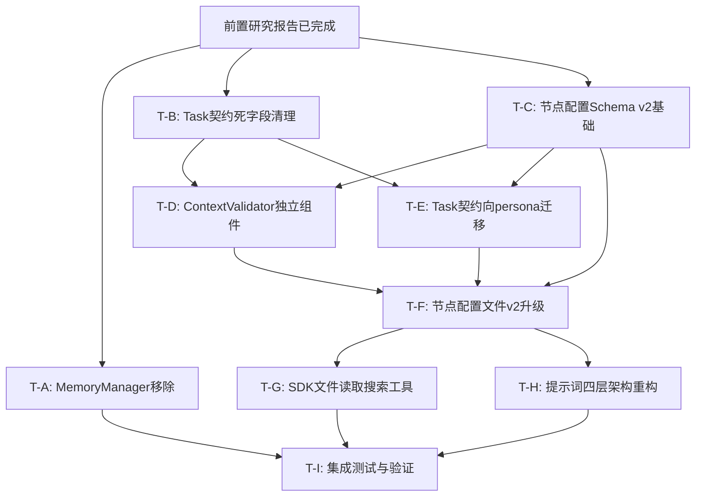

# DocuSwarm 重构路线图 — 综合研究报告

**文档编号**: refactor-2026-03-26/00  
**日期**: 2026-03-26  
**状态**: 正式版  
**撰写**: Sarah（综合研究汇总）  
**依赖报告**: 01～05 全部研究报告  

---

## 目录

1. [执行摘要](#1-执行摘要)
2. [各研究报告核心结论汇总](#2-各研究报告核心结论汇总)
3. [任务依赖关系图](#3-任务依赖关系图)
4. [分阶段实施路线](#4-分阶段实施路线)
5. [风险矩阵](#5-风险矩阵)
6. [成功指标](#6-成功指标)
7. [工作量评估](#7-工作量评估)
8. [建议与注意事项](#8-建议与注意事项)

---

## 1. 执行摘要

### 1.1 重构整体目标

本次重构的核心目标是将 DocuSwarm 的**架构完成度从 70% 提升至 95%**，消除过去评估中发现的代码冗余、职责越界、配置断层和能力缺口等四大问题。

评估文档（`2026-03-26-docuswarm-unified-context-system-analysis.md`）指出：DocuSwarm 具备功能完备的核心管道，但存在严重的死代码积累（MemoryManager）、验证逻辑分散（39 个验证方法散布于 10 余个文件）、配置-代码断层（`context_builder.py` 调用不存在的 `task` 字段）以及 SDK 能力严重未被激活（7/12 能力实现率，ClaudeAgentOptions 字段使用率仅 23.5%）等问题。

### 1.2 五大重构方向一句话总结

| 编号 | 研究报告 | 核心方向 | 一句话总结 |
|------|---------|---------|-----------|
| 01 | ContextValidator 提取重构 | **验证逻辑统一化** | 将散布于 10+ 文件的 39 个验证方法收归统一的 `context/validator.py` 策略门面 |
| 02 | MemoryManager 移除 | **死代码清除** | 零使用率（扫描 137 文件外部调用数为 0）的三层内存模型，2 步操作彻底移除 |
| 03 | Task 契约移除 | **配置单一真相源** | 将 `NodeExecutionContext` 从 16 字段精简至 9 字段，以 `persona.json`/`node.yaml` 作为唯一静态配置源 |
| 04 | 节点配置改造 | **配置-代码对齐** | 5 个节点全部升级到 Schema v2，补充缺失的 `task` 段落和 `threshold` 字段，修复 100% 假阳性完整度评分 |
| 05 | Claude Agent SDK 增强 | **能力激活** | 启用 MCP 工具（文件读取/搜索）、BMAD 斜杠命令注入，将 SDK 能力实现率从 58.3% 提升至 90%+ |

### 1.3 预计总工作量和时间线

- **总工期**: 5～6 周
- **总人天**: 约 22～28 人天
- **关键里程碑**:
  - 第 1 周末：MemoryManager 彻底移除，Task 契约死字段清理完毕
  - 第 3 周末：ContextValidator 独立组件落地，Task 契约迁移完成
  - 第 4 周末：节点配置 Schema v2 全量升级完成
  - 第 5 周末：SDK 文件工具 + BMAD 技能注入全面启用
  - 第 6 周末：端到端集成测试通过，架构完成度验证达到 95%

---

## 2. 各研究报告核心结论汇总

### 2.1 报告 01 — ContextValidator 提取重构方案

**来源**: `01-context-validator-extraction.md`（Bill，Backend Dev）

**关键发现**:

1. **验证逻辑全面分散**：诊断工具扫描 95 个 Python 文件，发现 **39 个验证方法、126 处内联验证模式、15 个高优先级提取候选**，分散于 `orchestrator.py`（39KB）、`context/isolation.py`、`llm/response.py`、`node_execution/validator.py` 等 10+ 文件。

2. **单一职责原则被广泛违反**：`HybridOrchestrator` 同时持有 LLM 上下文验证（L262–L344）和依赖规则检查（L346–L401）；`ContextManager` 既负责上下文构建又负责私有字段验证，职责明显越界。

3. **推荐架构：策略模式 + 组合模式**：新建 `autoBMAD/docuswarm/context/validator.py`，以 `ContextValidator` 为统一门面，内部采用 `ValidationStrategy` 抽象体系（`NodeExecutionContextStrategy`、`PrivateFieldIsolationStrategy`、`LLMContextValidationStrategy`、`IndependentOutputValidationStrategy`、`EvaluatorOutputValidationStrategy`），并通过 `ValidationRuleRegistry` 支持按 `node_id` 注册节点级规则。

4. **向后兼容策略**：旧 `node_execution/validator.py::ContextValidator` 保留为 `@deprecated` 别名；`isolation.py` 和 `llm/response.py` 中原函数改为委托调用新策略类，外部接口不变。

5. **7 步迁移路径**：从"创建框架骨架"到"更新 `__init__.py` 导出"，每步均提供明确的验证标准（可执行 pytest 命令确认）。

---

### 2.2 报告 02 — MemoryManager 彻底移除方案

**来源**: `02-memory-manager-removal.md`（Robin，后端重构专家）

**关键发现**:

1. **零使用率确认**：依赖扫描工具对 137 个 Python 文件的全量扫描结果显示：`MemoryManager` 在整个代码库中的**外部调用数为 0**，唯一引用来自 `context/__init__.py` 的 re-export，属于典型死代码。

2. **移除范围极小**：直接影响仅 **2 个文件、3 行代码修改 + 179 行文件删除**（`context/memory.py` 整体删除 + `__init__.py` 3 行调整），无任何级联影响。

3. **功能已被替代**：`MemoryScope.SHARED` 场景已由 `NodeExecutionContext["shared_context"]` 完整覆盖；`INDEPENDENT`/`EVALUATOR` 作用域当前无任何业务用例。

4. **建议从"延迟启用"升级为"彻底移除"**：原评估文档建议"暂不集成 MemoryManager，但保留代码"，本报告进一步认为保留死代码会误导未来开发者，移除后通过 git history 可随时恢复，成本极低。

5. **测试覆盖零影响**：测试目录下无任何 MemoryManager 相关测试文件，无需修改任何现有测试；建议新增 `tests/architecture/test_context_exports.py` 作为保护性测试。

---

### 2.3 报告 03 — Task 契约彻底移除方案

**来源**: `03-task-contract-removal.md`（James，Backend Dev）

**关键发现**:

1. **三重 DRY 违反**：`DeliverableRequirements.required_sections` 与 `persona.json.output_format.sections` 和 `node.yaml.deliverable.required_sections` 形成**三重重复**；`task_name`、`task_description`、`role_supplement` 等字段在 `contracts.py`、`node.yaml`、`context_builder.py` 三处均有定义，修改时须同步 3 处。

2. **精简效果显著**：移除可静态配置的字段后，`NodeExecutionContext` 字段数从 **16 个精简至 9 个（减少 44%）**，`contracts.py` 代码行数从 125 行缩减至约 60 行（减少 52%）。

3. **发现隐藏无效字段**：`IndependentAgentInput.persona_context` 字段被 `isolation.py` 始终赋值为 `{}`（空字典），注释声明"由 IndependentAgent 自行加载"但实际从未被消费，属于**完全无效字段**，优先级 P0 立即可删。

4. **分批实施策略**：
   - P0（立即可行）：删除 `persona_context` 字段、将 `evaluator_criteria` 改为从 `evaluator.yaml` 直接加载
   - P1（1-2 天）：迁移脚本补全 `node.yaml` 独有字段，消费端改用双读机制
   - P2（3-5 天）：完全移除 `task_*` 字段组，合并 `NodeExecutionContextRequired` 基类

5. **配置迁移脚本已设计**：`scripts/migrate_node_yaml.py` 可自动为 5 个节点补充 `output_filename`、`format_hints`、`task.role_supplement` 字段。

---

### 2.4 报告 04 — 节点配置体系改造方案

**来源**: `04-node-configuration-reform.md`（Jason，Backend Dev Agent）

**关键发现**:

1. **"100% 完整度"是假阳性**：诊断工具报告所有 5 个节点完整度为 100%，但诊断工具的 schema 定义本身存在遗漏——`task.*` 字段（`context_builder.py` L62 实际调用 `node_config.task.get("name")`）以及 `deliverable.template_title`、`deliverable.output_filename` 均未被纳入必填检查范围。

2. **代码-配置断层危害**：由于 `NodeConfig` 数据类无 `task` 字段，`context_builder.py` 的 `node_config.task.get("name", node_config.name)` 调用实际上回退到角色名（如 "Analyst"），导致 Agent 收到的 `task_name` 是"**我是谁**"而非"**我要做什么**"，语义完全错误。

3. **evaluator.yaml 字段名歧义**：所有 5 个节点的 `evaluator.yaml` 使用 `thresholds`（复数），但代码期望 `threshold`（单数），字段名不一致导致评估逻辑静默失败，被诊断工具标记为 `extra_field`。

4. **Schema v2 设计完整**：新增 `task` 段落、`runtime` 段落（`timeout`/`retry`）、`evaluator` 内联引用、`schema_version` 字段；`persona.json` 新增 `communication_style`、`critical_actions`、`memories` 三个 BMAD 标准字段；`evaluator.yaml` 修正为规范字段名。

5. **配置迁移脚本完整实现**：`scripts/migrate_node_config_v1_to_v2.py` 支持 `--dry-run` 和 `--node` 参数，可逐节点或批量执行 v1→v2 迁移，包含 `node.yaml` 和 `evaluator.yaml` 双文件处理。

---

### 2.5 报告 05 — Claude Agent SDK 改造方案

**来源**: `05-claude-agent-sdk-reform.md`（Nick，General Engineer）

**关键发现**:

1. **SDK 能力严重未激活**：`ClaudeAgentOptions` 共 17 个字段，当前实现仅使用 4 个（`tools`/`permission_mode`/`model`/`cwd`），字段使用率 **23.5%**；总体能力实现率为 **7/12（58.3%）**，`mcp_servers`、斜杠命令、结构化输出、子 Agent 调用均完全缺失。

2. **关键缺陷：system_prompt 注入方式错误**：当前实现将 system_prompt 直接拼接到 user_prompt（`full_prompt = f"{system_prompt}\n\n{user_prompt}"`），导致 Claude 无法区分"身份指令"与"任务内容"，且无法使用 `claude_code` preset 的工具说明。

3. **47 个 BMAD 斜杠命令零利用率**：`.claude/skills/` 目录中的 47 个 BMAD 工作流命令（含 33 个专业工作流、9 个 Agent 激活命令）均未注入 Agent 上下文，关键命令如 `/bmad-create-prd`、`/bmad-create-architecture` 完全未被节点利用。

4. **四层提示词架构设计**：Layer 1（`claude_code` preset 工具说明）→ Layer 2（角色 persona）→ Layer 3（任务上下文）→ Layer 4（BMAD 技能注入），通过 `ClaudeAgentOptions.system_prompt.append` 机制实现，总 system prompt 约 3200 tokens（占 256K 的 1.25%）。

5. **文件权限模型设计**：各节点按最小权限原则分配文件读取白名单（analyst 可读 `docs/`/`docs/research/`，po 可读 `docs/` 全部），通过 `create_sdk_mcp_server` 注册自定义 MCP 工具（`read_document`、`list_documents`、`grep_search`、`glob_search`），所有路径访问经 `os.path.abspath()` 规范化后白名单前缀匹配。

---

## 3. 任务依赖关系图

### 3.1 依赖关系 ASCII 图

```
╔══════════════════════════════════════════════════════════════════════════════╗
║                    DocuSwarm 重构任务依赖关系图（2026-03-26）                 ║
╚══════════════════════════════════════════════════════════════════════════════╝

                         ┌─────────────────────────┐
                         │   前置分析（已完成）      │
                         │  评估报告 01/02/03        │
                         └────────────┬────────────┘
                                      │
              ┌───────────────────────┼───────────────────────┐
              │                       │                       │
              ▼                       ▼                       ▼
 ┌─────────────────────┐  ┌─────────────────────┐  ┌─────────────────────┐
 │  T-A: MemoryManager │  │  T-B: Task 契约      │  │  T-C: 节点配置      │
 │  移除（Phase 1）    │  │  死字段清理（Phase 1）│  │  Schema v2 基础     │
 │  [2 文件，极低风险] │  │  [persona_context 等]│  │  loader.py 扩展     │
 │  ⚡ 可立即执行      │  │  ⚡ 可立即执行       │  │  ⚡ 可立即执行      │
 └─────────┬───────────┘  └──────────┬──────────┘  └──────────┬──────────┘
           │                         │                         │
           │ 完成后解锁              │ 完成后解锁              │ 完成后解锁
           ▼                         ▼                         ▼
 ┌─────────────────────┐  ┌─────────────────────┐  ┌─────────────────────┐
 │  （独立收益）        │  │  T-D: ContextValidator│  │  T-E: Task 契约向   │
 │  无后续依赖任务      │  │  提取为独立组件      │  │  persona 迁移       │
 │  ✅ Phase 1 结束    │  │  (Phase 2)           │  │  (Phase 2)          │
 └─────────────────────┘  │  [7 步迁移]          │  │  [双读机制]         │
                          └──────────┬──────────┘  └──────────┬──────────┘
                                     │                         │
                                     │ 依赖 T-C 完成           │ 依赖 T-C 完成
                                     └──────────┬──────────────┘
                                                │
                                    ┌───────────▼───────────┐
                                    │  T-F: 节点配置文件     │
                                    │  v2 升级（5 个节点）   │
                                    │  (Phase 3)             │
                                    │  [15 个配置文件]       │
                                    └───────────┬───────────┘
                                                │
                                    ┌───────────▼───────────┐
                                    │  T-G: SDK 工具集成     │
                                    │  (Phase 4)             │
                                    │  [file_tools,          │
                                    │   search_tools,        │
                                    │   skill_injector]      │
                                    └───────────┬───────────┘
                                                │
                                    ┌───────────▼───────────┐
                                    │  T-H: 提示词架构重构   │
                                    │  (Phase 4)             │
                                    │  [四层 system_prompt]  │
                                    └───────────┬───────────┘
                                                │
                                    ┌───────────▼───────────┐
                                    │  T-I: 集成测试与验证   │
                                    │  (Phase 5)             │
                                    │  [端到端 + 回归 + 性能]│
                                    └─────────────────────────┘
```

### 3.2 Mermaid 依赖图



### 3.3 并行执行机会分析

| 可并行任务组 | 任务 | 并行条件 | 节省时间 |
|------------|------|---------|---------|
| **组 1：Phase 1 全并行** | T-A + T-B + T-C | 三者互不依赖，均从已完成研究报告派生 | 节省 2-3 天 |
| **组 2：Phase 2 部分并行** | T-D + T-E | 均依赖 T-C 完成，但 T-D 和 T-E 互不依赖 | 节省 2-3 天 |
| **组 3：Phase 4 部分并行** | T-G + T-H | T-G 是文件工具，T-H 是提示词，互不依赖 | 节省 1-2 天 |

### 3.4 关键路径分析

**关键路径**（决定最短完成时间）：

```
T-C（1天）→ T-E（2天）→ T-F（3天）→ T-G（3天）→ T-I（2天）= 11 天（最短完成时间）
```

**次关键路径**（影响架构完整度）：

```
T-C（1天）→ T-D（3天）→ T-F（3天）→ T-H（2天）→ T-I（2天）= 11 天
```

**说明**：
- T-C（节点配置 Schema v2 基础）是所有后续任务的**共同前置依赖**，必须优先完成
- T-A（MemoryManager 移除）和 T-B（Task 契约死字段清理）虽然独立，但工作量极小（各 0.5 天），建议作为 Phase 1 的热身任务同步执行
- T-G 和 T-H 理论上可并行，但在单人开发环境下建议 T-G 先行，因为 T-H 的提示词架构依赖 T-F 提供的节点配置数据

---

## 4. 分阶段实施路线

### Phase 1：低风险快速清理（建议第 1 周）

**目标**：清理所有零风险的死代码和无效字段，建立 v2 Schema 基础层。  
**预计工期**：3～5 天  
**风险等级**：极低  

---

#### 4.1.1 T-A：MemoryManager 彻底移除（0.5 天）

**背景**：扫描 137 个文件，外部调用数为 0，死代码确认无疑。

**操作步骤**：

1. **Step 1**：修改 `autoBMAD/docuswarm/context/__init__.py`
   - 删除第 16 行：`from autoBMAD.docuswarm.context.memory import MemoryManager, MemoryScope`
   - 删除 `__all__` 中的 `"MemoryManager"` 和 `"MemoryScope"` 两项
   
2. **Step 2**：删除文件 `autoBMAD/docuswarm/context/memory.py`（179 行）

3. **Step 3**：验证
   ```bash
   python -c "from autoBMAD.docuswarm.context import ContextManager, ContextFilter; print('OK')"
   python -m pytest tests/ -x -q --tb=short 2>&1 | tail -5
   ```

4. **Step 4**（可选）：新增 `tests/architecture/test_context_exports.py` 保护性测试

**验收标准**：
- `python -c "from autoBMAD.docuswarm.context import MemoryManager"` 抛出 `ImportError`
- 全量测试套件通过，无新增失败
- `grep -r "MemoryManager" autoBMAD/ --include="*.py"` 结果为空（诊断脚本除外）

---

#### 4.1.2 T-B：Task 契约死字段清理（0.5 天）

**背景**：`IndependentAgentInput.persona_context` 始终为 `{}`，`evaluator_criteria` 可直接从 `evaluator.yaml` 加载。

**操作步骤**：

1. **Step 1**：删除 `contracts.py` 中 `IndependentAgentInput.persona_context` 字段定义（第 141 行）

2. **Step 2**：在 `context/isolation.py` 的 `build_evaluator_input` 方法中，将：
   ```python
   criteria=execution_context.get("evaluator_criteria", []),
   ```
   改为：
   ```python
   # 直接从 evaluator.yaml 加载，避免通过 NodeExecutionContext 中转
   from autoBMAD.docuswarm.nodes.loader import NodeLoader
   node_config = NodeLoader().load(execution_context["node_id"])
   criteria=node_config.evaluator.get("criteria", []),
   ```

3. **Step 3**：在 `contracts.py` 中为 `task_name`、`task_description`、`role_supplement`、`deliverable_type`、`deliverable_requirements` 字段添加 `# DEPRECATED` 注释，明确迁移路径

4. **Step 4**：验证现有测试通过
   ```bash
   python -m pytest tests/ -k "isolation or contract or context_builder" -v
   ```

**验收标准**：
- `IndependentAgentInput` 中无 `persona_context` 字段
- `EvaluatorAgentInput.criteria` 通过 `NodeLoader` 从 `evaluator.yaml` 读取
- 所有涉及 isolation、contract、context_builder 的测试通过

---

#### 4.1.3 T-C：节点配置 Schema v2 基础层（1～2 天）

**背景**：`context_builder.py` 调用 `node_config.task.get("name")` 但 `NodeConfig` 无 `task` 字段，是最高优先级的代码-配置断层。

**操作步骤**：

1. **Step 1**：在 `autoBMAD/nodes/loader.py` 中新增数据类：
   ```python
   @dataclass
   class NodeTaskConfig:
       name: str
       description: str = ""
       role_supplement: str = ""

   @dataclass
   class NodeRuntimeConfig:
       timeout: int = 300
       retry_max_attempts: int = 2
       retry_backoff: float = 1.5
   ```

2. **Step 2**：更新 `NodeConfig` 数据类，新增以下字段：
   ```python
   schema_version: str = "1.0"
   task: NodeTaskConfig | None = None
   runtime: NodeRuntimeConfig | None = None
   ```

3. **Step 3**：在 `NodeLoader._build_node_config()` 中实现 v1/v2 双版本解析：
   ```python
   schema_version = config.get("schema_version", "1.0")
   if schema_version == "2.0" and "task" in config:
       task = NodeTaskConfig(**config["task"])
   else:
       task = None  # v1 回退，context_builder 使用现有 fallback 逻辑
   ```

4. **Step 4**：修正 `NodeEvaluatorConfig`，同时支持 `threshold`（单数，v2）和 `thresholds`（复数，v1 兼容）

5. **Step 5**：更新 `tools/node_config_completeness_checker.py`，将 `task.name`、`task.description` 加入 required 检查范围

6. **Step 6**：验证
   ```bash
   python -m pytest tests/ -k "loader or config" -v
   # 验证向后兼容：v1 格式节点仍能正确解析
   python -c "from autoBMAD.nodes.loader import NodeLoader; c = NodeLoader().load('analyst'); print(c.schema_version)"
   ```

**验收标准**：
- `NodeConfig` 具有 `task`、`runtime`、`schema_version` 字段
- v1 格式配置文件解析不报错（`task` 为 `None`）
- v2 格式配置文件正确解析 `task.name` 等字段
- `NodeEvaluatorConfig` 兼容 `threshold`（单数）和 `thresholds`（复数）

---

### Phase 2：核心架构重构（建议第 2～3 周）

**目标**：完成 ContextValidator 独立化和 Task 契约向 persona 统一迁移，消除核心的职责违反和 DRY 问题。  
**预计工期**：6～8 天  
**风险等级**：中  

---

#### 4.2.1 T-D：ContextValidator 提取为独立组件（3～4 天）

**背景**：39 个验证方法分散于 10+ 文件，`HybridOrchestrator` 同时持有验证逻辑（L262–L401）。

**操作步骤**（按报告 01 的 7 步迁移路径）：

1. **Step 1**：创建 `autoBMAD/docuswarm/context/validator.py`
   - 定义 `ValidationIssue`、`ValidationResult` 数据类
   - 定义 `ValidationStrategy` 抽象基类
   - 定义 `ValidationRuleRegistry`
   - 实现 `ContextValidator` 主类（门面）骨架

2. **Step 2**：迁移私有字段验证（`isolation.py` L241–L291 → `PrivateFieldIsolationStrategy`）

3. **Step 3**：实现 `NodeExecutionContextStrategy`，验证所有 `NodeExecutionContextRequired` 字段
   - 在 `node_execution/validator.py` 中保留旧类为 `@deprecated` 别名

4. **Step 4**：迁移输出验证（`llm/response.py` L140–L305 → 两个策略类）
   - 原函数保持向后兼容，内部改为委托调用

5. **Step 5**：迁移 LLM 上下文验证（`orchestrator.py` L262–L344 → `LLMContextValidationStrategy`）
   - `HybridOrchestrator.__init__` 注入 `ContextValidator` 实例
   - 删除 `HybridOrchestrator._validate_context` 方法实现

6. **Step 6**：实现 `ValidationRuleRegistry` 配置加载（`NodeLoader.load_node` 中注入规则注册）

7. **Step 7**：更新 `context/__init__.py`，导出 `ContextValidator` 和 `ValidationResult`

**关键注意事项**：
- Step 5 改变 `HybridOrchestrator._validate_context` 的行为，需同步更新 `tests/unit/pipeline/test_orchestrator.py` 中的 Mock 目标路径
- LLM 验证策略（`LLMContextValidationStrategy`）为异步，仅通过 `validate_context_with_llm` 调用
- 验证失败时 `ContextValidationError` 异常的抛出位置不变（向后兼容）

**验收标准**：
- `from autoBMAD.docuswarm.context import ContextValidator` 可用
- `HybridOrchestrator` 类体中不再有验证逻辑实现（仅委托调用）
- 所有现有验证相关测试通过

---

#### 4.2.2 T-E：Task 契约向 persona 统一迁移（2～3 天）

**背景**：`NodeExecutionContext` 中的 6 个 Task 相关字段均可从 `node.yaml`/`persona.json` 直接读取，中间层传递是冗余的。

**操作步骤**（按报告 03 的 5 个阶段）：

1. **阶段 1**：为 5 个节点的 `node.yaml` 添加契约独有字段（`output_filename`、`format_hints`）
   - 运行迁移脚本：`python scripts/migrate_node_yaml.py`
   - 风险：无（仅新增字段）

2. **阶段 2**：修改 `NodeExecutionContextBuilder.build()` 移除 Task 相关字段构建

3. **阶段 3**：更新 `contracts.py`，精简 `NodeExecutionContext` 为 9 字段版本
   - 删除 `NodeExecutionContextRequired` 基类，合并为单一 TypedDict

4. **阶段 4**：更新所有消费者模块（`isolation.py`、`dual_agent.py`、`executor.py`、`contract_builder.py`）
   - 使用双读机制过渡：优先从 `node_config` 读取，降级到 `execution_context`

5. **阶段 5**：删除 `contracts.py` 中的冗余类（`NodeExecutionContextRequired`、`DeliverableRequirements`）

**关键注意事项**：
- 测试文件中硬编码 `task_name` 等字段的断言需更新（`test_context_builder.py`、`test_isolation.py`、`test_dual_agent.py`）
- `executor.py` 日志中 `task_name=execution_context["task_name"]` 改用 `node_name` 替代

**验收标准**：
- `NodeExecutionContext` 字段数从 16 减少至 9
- `contracts.py` 行数从 125 行缩减至约 60 行
- 完整端到端流水线测试通过

---

### Phase 3：节点配置改造（建议第 3～4 周）

**目标**：将所有 5 个节点的配置文件从 Schema v1 升级到 v2，填补代码-配置断层，修正字段命名不一致。  
**预计工期**：4～5 天  
**风险等级**：低～中  

---

#### 4.3.1 T-F：节点配置文件 v2 全量升级（3～4 天）

**操作步骤**：

1. **P2-1 analyst 节点升级**（node.yaml + persona.json + evaluator.yaml）：
   - `node.yaml`：新增 `schema_version: "2.0"`、`task` 段落（`name: create-business-analysis-report`）、`deliverable.template_title`/`output_filename`/`format_hints`、`evaluator` 内联引用、`runtime` 配置
   - `persona.json`：新增 `communication_style`（分析型、精准型）、`critical_actions`（5 条）、`memories`（3 条 DocuSwarm 相关记忆）
   - `evaluator.yaml`：`thresholds` → `threshold`（单数），新增 `max_iterations: 3`，为每个 criteria 补充 `description`

2. **P2-2 pm 节点升级**（类同）：
   - 特别注意：`persona.role` 从 "Project Manager" 修正为 "Product Manager"（语义修正）
   - `task.name: create-product-requirements-document`

3. **P2-3 ux 节点升级**：
   - `task.name: create-ux-design-specification`
   - `tools` 中 `create_wireframes` 语义说明修正（文本描述工具，非图形生成）

4. **P2-4 architect 节点升级**：
   - `evaluator.yaml` 阈值调整：`approval: 0.75`（从 0.70 提高，补偿 9 章节复杂度）
   - `task.name: create-system-architecture-document`

5. **P2-5 po 节点升级**：
   - 创建 `_bmad/_config/agents/bmm-po.customize.yaml`（为 PO 建立独立 BMAD Agent 定义）
   - `task.name: create-epics-and-user-stories`

6. **配置迁移脚本执行**：
   ```bash
   # 先 dry-run 验证
   python scripts/migrate_node_config_v1_to_v2.py --dry-run
   # 确认无误后执行
   python scripts/migrate_node_config_v1_to_v2.py
   # 验证
   python tools/node_config_completeness_checker.py
   ```

**验收标准**：
- 诊断工具报告所有 5 个节点 `task.name` 字段存在且非空
- `evaluator.yaml` 的 `threshold`（单数）字段存在
- `persona.json` 包含 `communication_style` 字段
- `python -m pytest tests/ -k "loader or config or context_builder" -v` 全通过

---

### Phase 4：Agent SDK 增强（建议第 4～5 周）

**目标**：激活 Claude Agent SDK 能力，启用文件读取、搜索工具和 BMAD 技能注入，重构提示词架构。  
**预计工期**：6～8 天  
**风险等级**：中  

---

#### 4.4.1 T-G：文件读取/搜索工具集成（3～4 天）

**操作步骤**：

1. **创建工具模块**：
   - `autoBMAD/docuswarm/tools/__init__.py`
   - `autoBMAD/docuswarm/tools/file_tools.py`（`create_file_read_server`，含 `read_document`、`list_documents`）
   - `autoBMAD/docuswarm/tools/search_tools.py`（`create_search_server`，含 `grep_search`、`glob_search`）
   - `autoBMAD/docuswarm/llm/tool_filter.py`（`NodeToolFilter` 统一权限管理）

2. **扩展 node.yaml schema**（5 个节点均添加 `tools` 配置块）：
   ```yaml
   tools:
     allowed_builtin_tools: [Read, Glob]
     file_permissions:
       allowed_read_dirs: [docs/, docs/research/]
     search_permissions:
       search_dirs: [docs/]
     skills:
       inject_mode: system_prompt_append
       commands: [bmad-agent-analyst, bmad-domain-research, ...]
   ```

3. **扩展 SessionManager**：
   - 新增 `node_id`、`allowed_dirs` 参数
   - `_create_options` 中注册 MCP 服务器和 `allowed_tools`

4. **安全验证**（路径遍历防护）：
   - 所有路径访问通过 `os.path.abspath()` 规范化
   - 白名单前缀匹配，默认拒绝
   - 文件大小限制：单文件最大 50000 字符

5. **验证标准**：
   ```bash
   # analyst 节点能读取 PRD.md
   # 越权访问 autoBMAD/ 返回权限拒绝
   python -m pytest tests/unit/tools/ -v
   ```

---

#### 4.4.2 T-H：提示词四层架构重构（2～3 天）

**操作步骤**：

1. **创建提示词模块**：
   - `autoBMAD/docuswarm/prompts/skill_injector.py`（`SkillInjector`）
   - `autoBMAD/docuswarm/prompts/template_engine.py`（`PromptTemplateEngine`）

2. **改造 IndependentAgent._call_llm_with_prompts**：
   - 旧实现：`full_prompt = f"{system_prompt}\n\n{user_prompt}"`（拼接）
   - 新实现：`ClaudeAgentOptions(system_prompt={"type": "preset", "preset": "claude_code", "append": ...})`
   - system_prompt 和 user_prompt 分离传递

3. **实现四层 append 结构**：
   - Layer 2：Persona（角色身份、专业领域、行为准则）
   - Layer 3：Task Context（任务名称、交付物要求）
   - Layer 4：Skill Injection（BMAD 命令描述，每命令 150 字符限制）

4. **保留 fallback**：`_call_llm_via_session` 作为旧版兼容接口保留

5. **验证标准**：
   - `IndependentAgent` 的 system_prompt 包含 `## 可用 BMAD 技能` 标记
   - persona 内容不再出现在 user_prompt 中
   - 完整流水线运行产出内容质量不低于改造前

---

### Phase 5：集成测试与验证（建议第 5～6 周）

**目标**：全面验证重构效果，确保架构完成度达到 95% 的目标。  
**预计工期**：4～5 天  
**风险等级**：低  

---

#### 4.5.1 端到端管道测试（2 天）

**测试场景**：

| 测试场景 | 预期结果 | 验证方式 |
|----------|----------|----------|
| 5 节点完整流水线运行 | 全部完成，输出 5 份交付物 | 集成测试 |
| ContextValidator 验证失败流程 | 抛出 `ContextValidationError`，管道停止 | 单元测试 |
| Schema v2 节点配置加载 | `task.name` 正确读取，非角色名 | 单元测试 |
| 文件工具权限边界测试 | po 可读 `docs/`，analyst 不可读 `docs/stories/` | 单元测试 |
| BMAD 技能注入验证 | system_prompt 含技能描述，token 数 < 400 | 提示词验证 |

#### 4.5.2 回归测试（1 天）

1. 运行全量测试套件：`python -m pytest tests/ -v --tb=short`
2. 重点关注改造涉及的文件：`isolation.py`、`orchestrator.py`、`contracts.py`、`loader.py`
3. 修复因接口变更导致的 Mock 目标路径失效

#### 4.5.3 性能基准测试（1 天）

| 指标 | 基线 | 目标 | 测试方法 |
|------|------|------|---------|
| 节点平均执行时间 | 测量基线 | 不超过基线 +10% | 时间埋点 |
| SDK token 消耗增量 | 0（无工具） | < +14000 tokens/节点 | 审计日志 |
| `ValidationRuleRegistry.get()` | N/A | < 1μs（O(1)） | 微基准测试 |
| `PrivateFieldIsolationStrategy` 递归检查 | 与原实现等价 | 性能等价 | 对比测试 |

#### 4.5.4 成功指标最终验证（1 天）

- 运行诊断工具组：`context_validator_analyzer.py`、`node_config_completeness_checker.py`、`agent_sdk_capability_auditor.py`
- 确认架构完成度指标达标（见第 6 节）
- 编写重构总结报告

---

## 5. 风险矩阵

综合 5 份研究报告中识别的所有风险，汇总如下：

| 风险项 | 影响级别 | 发生概率 | 风险等级 | 缓解措施 | 所属阶段 |
|--------|---------|---------|---------|---------|---------|
| `context_builder.py` `node_config.task.get()` 在 v1 schema 节点上抛出 `AttributeError` | 高（阻断执行） | 高（当前已存在） | **严重** | Phase 1 T-C 立即在 loader.py 中加防御性判断，v2 字段无则返回 None | Phase 1 |
| `evaluate.yaml` 的 `thresholds`（复数）字段被读取为 `None` | 中（评估逻辑静默失败） | 中 | **高** | NodeLoader 同时支持 `threshold`（v2）和 `thresholds`（v1），优先读取单数 | Phase 1 |
| `validate_independent_output` 返回值类型变化 | 高（调用方行为改变） | 中 | **高** | Step 4 保持函数签名和异常抛出行为不变（委托调用内部实现更改） | Phase 2 |
| `ContextIsolationError` 抛出路径变化 | 中（测试 Mock 失效） | 低（保留包装器） | **中** | Step 2 在 `isolation.py` 中保持异常抛出位置不变 | Phase 2 |
| 测试文件硬编码 `task_name` 等字段断言 | 低（测试修复代价小） | 高（断言必然失败） | **中** | Phase 2 完成后集中更新相关测试断言 | Phase 2 |
| `pm.persona.role` 从 "Project Manager" 改为 "Product Manager" 导致测试失败 | 低（修复代价小） | 高（名称不同） | **低** | 更新对应测试的断言值，1 处修改 | Phase 3 |
| architect 节点评估阈值提高（0.70→0.75）导致更多 NEEDS_REVISION 循环 | 中（执行时间增加） | 中 | **中** | 配合 `max_iterations: 3` 上限，监控迭代次数指标 | Phase 3 |
| `schema_version` 字段不存在时向后兼容破坏 | 中（解析异常） | 低（有默认值） | **低** | 使用 `.get("schema_version", "1.0")` 默认回退 | Phase 3 |
| SDK `system_prompt` 改造后 Claude 行为变化 | 高（输出质量改变） | 中 | **高** | 保留 `_call_llm_via_session` 作为 fallback；改造后对所有节点执行 A/B 质量对比 | Phase 4 |
| MCP 工具路径遍历攻击（`../` 等） | 高（读取敏感文件） | 低（有防护） | **中** | `os.path.abspath()` 规范化 + 白名单前缀匹配，默认拒绝原则 | Phase 4 |
| Token 消耗增长超预期 | 中（API 成本增加） | 低（已估算） | **低** | 限制文件读取上限 50000 字符，技能描述截断至 150 字符；Kimi K2.5 256K 上下文充足 | Phase 4 |
| 大文件读取导致上下文溢出 | 中（上下文被截断） | 低（有限制） | **低** | 文件大小限制 1MB，内容截断 5000 字符，单文件读取上限 50000 字符 | Phase 4 |
| 回归测试覆盖缺口（Mock 目标路径改变） | 低（测试误报） | 高（改造必然涉及） | **中** | Phase 5 专项 Mock 路径审查，`test_orchestrator.py` 最高优先 | Phase 5 |
| 未来开发者复用已删除的 MemoryManager 概念 | 低（未来风险） | 低 | **低** | 在 `context/isolation.py` 顶部注释说明当前隔离策略，历史可通过 git show 恢复 | Phase 1 |

---

## 6. 成功指标

### 6.1 架构完成度

| 指标 | 当前值 | 目标值 | 验证方式 |
|------|-------|-------|---------|
| 架构总体完成度 | 70% | **95%** | 综合评估报告主观打分 |
| ContextValidator 统一化覆盖率 | 15/39 验证方法（38%） | **39/39（100%）** | `context_validator_analyzer.py` 扫描 |
| 死代码行数（MemoryManager） | 179 行 | **0 行** | `grep -r "MemoryManager"` 结果为空 |

### 6.2 代码精简度

| 指标 | 当前值 | 目标值 | 验证方式 |
|------|-------|-------|---------|
| `contracts.py` 行数 | 125 行 | **≤ 70 行**（-44%） | `wc -l` |
| `NodeExecutionContext` 字段数 | 16 个 | **9 个**（-44%） | 代码审查 |
| `context/memory.py` 行数 | 179 行 | **0 行**（文件删除） | 文件系统检查 |
| `orchestrator.py` 验证相关代码行数 | ~83 行（L262–L401） | **≤ 5 行**（委托调用） | 代码审查 |

### 6.3 配置一致性

| 指标 | 当前值 | 目标值 | 验证方式 |
|------|-------|-------|---------|
| DRY 违反数（语义等价字段重复） | 6 处 | **0 处** | 人工审查 + 诊断工具 |
| 代码-配置断层数（调用不存在字段） | 3 处（`task.*` 字段） | **0 处** | `context_builder.py` 代码审查 |
| 字段命名不一致数（`threshold` vs `thresholds`） | 5 个节点（5 处） | **0 处** | `grep -r "thresholds" autoBMAD/nodes/` |
| 节点配置真实完整度 | ~60%（假阳性为 100%） | **95%+** | 升级后诊断工具重新评估 |

### 6.4 SDK 能力覆盖率

| 指标 | 当前值 | 目标值 | 验证方式 |
|------|-------|-------|---------|
| SDK 总体能力实现率 | 7/12（58.3%） | **≥ 10/12（83%+）** | `agent_sdk_capability_auditor.py` |
| `ClaudeAgentOptions` 字段使用率 | 4/17（23.5%） | **≥ 8/17（47%）** | 代码审查 |
| BMAD 斜杠命令利用率 | 0/47（0%） | **≥ 5/47（核心命令全覆盖）** | 节点 system_prompt 内容检查 |
| 文件读取工具覆盖节点数 | 0/5 | **5/5（全节点）** | 集成测试 |

### 6.5 其他可量化指标

| 指标 | 当前值 | 目标值 |
|------|-------|-------|
| 单个节点修改所需同步文件数 | 3 个（persona + node.yaml + runtime中转） | **1 个**（仅 persona.json 或 node.yaml） |
| `task_name` 语义正确率（任务名而非角色名） | 0%（全部回退到角色名） | **100%** |
| 新增测试覆盖（ContextValidator 专项） | 0 条 | **≥ 12 条**（报告 01 附录列出） |

---

## 7. 工作量评估

### 7.1 任务工作量明细

| 任务 ID | 任务名称 | 预计人天 | 复杂度 | 依赖 | 可并行 |
|--------|---------|---------|-------|------|--------|
| T-A | MemoryManager 彻底移除 | **0.5 天** | 极低 | 无 | 是（与 T-B、T-C 并行） |
| T-B | Task 契约死字段清理（P0 批次） | **0.5 天** | 低 | 无 | 是（与 T-A、T-C 并行） |
| T-C | 节点配置 Schema v2 基础层 | **1.5 天** | 低～中 | 无 | 是（与 T-A、T-B 并行） |
| T-D | ContextValidator 独立组件 | **3.5 天** | 高 | T-C | 是（与 T-E 并行） |
| T-E | Task 契约向 persona 统一迁移（P1-P2 批次） | **2.5 天** | 中 | T-B, T-C | 是（与 T-D 并行） |
| T-F | 节点配置文件 v2 全量升级 | **3 天** | 中 | T-C, T-D, T-E | 否 |
| T-G | SDK 文件读取/搜索工具集成 | **3.5 天** | 高 | T-F | 是（与 T-H 并行） |
| T-H | 提示词四层架构重构 | **2.5 天** | 中高 | T-F | 是（与 T-G 并行） |
| T-I | 集成测试与验证 | **3 天** | 中 | T-G, T-H | 否 |
| **汇总** | | **~20 人天** | | | |

> 考虑到环境搭建、代码审查和潜在问题处理，建议预留 20% buffer，实际工期约 **22～25 人天**。

### 7.2 关键里程碑

| 里程碑 | 完成时间 | 完成标志 |
|--------|---------|---------|
| **M1：死代码清零** | Phase 1 结束（第 1 周） | `grep -r "MemoryManager" autoBMAD/` 结果为空；`contracts.py` 无 `persona_context`；`NodeConfig` 具备 `task` 字段 |
| **M2：验证架构统一** | Phase 2 结束（第 3 周） | `HybridOrchestrator` 无内联验证逻辑；`ContextValidator` 通过所有 12 条单元测试 |
| **M3：配置-代码对齐** | Phase 3 结束（第 4 周） | 诊断工具报告所有节点 `task.name` 真实存在；`threshold`（单数）字段全局一致 |
| **M4：SDK 能力激活** | Phase 4 结束（第 5 周） | SDK 能力实现率 ≥ 83%；所有节点 system_prompt 含 BMAD 技能注入 |
| **M5：质量验证通过** | Phase 5 结束（第 6 周） | 全量测试套件通过；架构完成度确认 ≥ 95% |

---

## 8. 建议与注意事项

### 8.1 实施顺序的关键考虑

**原则一：T-C 必须最先完成**

`NodeConfig` 的 `task` 字段缺失是一个**当前已发生的隐患**——`context_builder.py` 调用 `node_config.task.get("name", node_config.name)` 在 `NodeConfig` 无 `task` 属性时实际上走的是 `AttributeError` 捕获后的回退路径（若有）或直接失败。T-C 是所有后续任务（T-D、T-E、T-F）的共同前置依赖，必须在 Phase 1 第一个完成。

**原则二：Phase 1 三个任务并行最高效**

T-A（MemoryManager）、T-B（Task 契约死字段）、T-C（Schema v2 基础）三者互不干扰，在单人开发环境下建议按 T-C → T-A → T-B 顺序执行（总 2.5 天），在多人团队中可完全并行（约 1.5 天完成 Phase 1）。

**原则三：T-D 和 T-E 并行时注意接口边界**

`ContextValidator`（T-D）和 Task 契约迁移（T-E）都会修改 `context/isolation.py`，在并行开发时需要明确接口边界：
- T-D 负责在 `isolation.py` 中将 `_validate_no_private_fields` 改为委托调用
- T-E 负责在 `isolation.py` 中将 `build_independent_input` 改为从 NodeConfig 读取 task 字段
- 建议使用功能分支（feature branch）开发，最后合并

**原则四：SDK 改造（T-G + T-H）必须在 T-F 之后**

SDK 改造依赖 `node.yaml` 中的 `tools` 配置块，必须在节点配置文件 v2 全量升级（T-F）完成后才能真正集成，否则工具权限配置无法从配置文件读取。

### 8.2 团队协作建议

| 角色 | 负责任务 | 核心技能要求 |
|------|---------|------------|
| 后端重构工程师 A | T-A、T-B、T-C、T-E | Python TypedDict、YAML、代码迁移 |
| 后端重构工程师 B | T-D（ContextValidator） | Python 策略模式、ABC 抽象类、async |
| 配置工程师 | T-F | YAML 配置、节点语义理解 |
| SDK 集成工程师 | T-G、T-H | Claude Agent SDK、MCP 协议、提示词工程 |
| 测试工程师 | T-I（Phase 5） | pytest、集成测试、性能基准测试 |

**单人开发场景建议**：按照 T-C → T-A + T-B → T-D + T-E → T-F → T-G + T-H → T-I 顺序串行执行，重点通过每个任务的验收标准后再推进下一任务。

### 8.3 回退策略

**全局回退原则**：所有改造通过 git 的独立 commit/branch 管理，每个任务完成后打 tag，确保随时可回退。

| 触发回退的条件 | 回退粒度 | 具体步骤 |
|-------------|---------|---------|
| 全量测试失败率 > 20% | 整个 Phase | `git revert <phase_commit_range>` |
| NodeLoader 解析错误率 > 5%（T-C/T-F 相关） | 单任务 | `git revert <T-C/T-F commit>` |
| SDK 工具导致 API 调用异常 | T-G 任务 | 使用 fallback `_call_llm_via_session` 绕过工具注册 |
| 提示词改造导致输出质量下降 | T-H 任务 | 使用旧版 `full_prompt = system + user` 拼接方式 |
| ContextValidationError 误报率过高 | T-D 任务 | 临时禁用 `LLMContextValidationStrategy`（改为 fail-open） |

**关键保护措施**：
1. MemoryManager 移除后，若未来需要恢复，通过 `git show <commit>:autoBMAD/docuswarm/context/memory.py` 可完整恢复代码
2. Schema v2 升级使用迁移脚本，脚本执行前自动备份原始配置文件
3. SDK 改造保留旧版 `_call_llm_via_session` 作为 fallback，`IndependentAgent` 通过配置控制使用新旧路径

### 8.4 质量门禁建议

每个 Phase 完成后，建议执行以下质量门禁检查：

```bash
# Phase 1 门禁
python -c "from autoBMAD.docuswarm.context import ContextManager; print('context OK')"
python -c "from autoBMAD.nodes.loader import NodeLoader, NodeTaskConfig; print('loader OK')"
python -m pytest tests/ -x -q 2>&1 | tail -3

# Phase 2 门禁
python -c "from autoBMAD.docuswarm.context import ContextValidator; print('validator OK')"
python -m pytest tests/unit/context/ tests/unit/pipeline/ -v

# Phase 3 门禁
python tools/node_config_completeness_checker.py
# 预期：所有节点 task.name/task.description 存在且非空

# Phase 4 门禁
python tools/agent_sdk_capability_auditor.py
# 预期：能力实现率 >= 10/12

# Phase 5 门禁（全量）
python -m pytest tests/ -v --tb=short --cov=autoBMAD/docuswarm --cov-report=term-missing
# 预期：覆盖率不低于改造前基线
```

---

## 附录 A：引用的研究报告与评估文档

| 文档 | 路径 | 作者 | 核心贡献 |
|------|------|------|---------|
| ContextValidator 提取方案 | `docs/research/refactor-2026-03-26/01-context-validator-extraction.md` | Bill | 验证逻辑统一化设计，7 步迁移路径 |
| MemoryManager 移除方案 | `docs/research/refactor-2026-03-26/02-memory-manager-removal.md` | Robin | 死代码证明，2 步移除方案 |
| Task 契约移除方案 | `docs/research/refactor-2026-03-26/03-task-contract-removal.md` | James | DRY 违反分析，contracts.py 精简方案 |
| 节点配置改造方案 | `docs/research/refactor-2026-03-26/04-node-configuration-reform.md` | Jason | Schema v2 设计，代码-配置断层修复 |
| Claude Agent SDK 改造方案 | `docs/research/refactor-2026-03-26/05-claude-agent-sdk-reform.md` | Nick | SDK 能力激活，四层提示词架构 |
| 统一上下文体系分析 | `docs/evaluation/2026-03-26-docuswarm-unified-context-system-analysis.md` | — | 背景评估，上下文协议全景 |
| 实现差距分析 | `docs/evaluation/2026-03-26-docuswarm-implementation-gap-analysis.md` | — | EPIC 完成度，功能缺口清单 |
| 深度架构分析 | `docs/evaluation/2026-03-26-docuswarm-deep-architecture-analysis.md` | — | 架构决策，MemoryManager 延迟决策背景 |

---

## 附录 B：变更文件全景图

以下为本次重构涉及的所有文件变更汇总：

### 新建文件（8 个）

| 文件 | 所属任务 | 说明 |
|------|---------|------|
| `autoBMAD/docuswarm/context/validator.py` | T-D | ContextValidator 统一门面 |
| `autoBMAD/docuswarm/tools/__init__.py` | T-G | 工具模块初始化 |
| `autoBMAD/docuswarm/tools/file_tools.py` | T-G | 文件读取 MCP 服务器 |
| `autoBMAD/docuswarm/tools/search_tools.py` | T-G | 搜索工具 MCP 服务器 |
| `autoBMAD/docuswarm/llm/tool_filter.py` | T-G | 节点工具权限过滤器 |
| `autoBMAD/docuswarm/prompts/skill_injector.py` | T-H | BMAD 技能注入器 |
| `autoBMAD/docuswarm/prompts/template_engine.py` | T-H | 提示词模板引擎 |
| `_bmad/_config/agents/bmm-po.customize.yaml` | T-F | PO 节点独立 BMAD 定义 |

### 删除文件（1 个）

| 文件 | 所属任务 | 说明 |
|------|---------|------|
| `autoBMAD/docuswarm/context/memory.py` | T-A | MemoryManager 死代码 |

### 修改文件（15+ 个）

| 文件 | 所属任务 | 变更类型 |
|------|---------|---------|
| `autoBMAD/docuswarm/context/__init__.py` | T-A | 移除 MemoryManager 导入 |
| `autoBMAD/docuswarm/node_execution/contracts.py` | T-B, T-E | Task 字段精简，行数 125→70 |
| `autoBMAD/docuswarm/node_execution/context_builder.py` | T-C, T-E | 移除 Task 字段构建，从 NodeConfig 读取 |
| `autoBMAD/nodes/loader.py` | T-C, T-G | 新增 NodeTaskConfig/NodeRuntimeConfig/NodeToolPermissions |
| `autoBMAD/docuswarm/context/isolation.py` | T-D, T-E | 委托 ContextValidator + NodeConfig 读取 task |
| `autoBMAD/docuswarm/pipeline/orchestrator.py` | T-D | 移除 `_validate_context` 实现，注入 ContextValidator |
| `autoBMAD/docuswarm/llm/response.py` | T-D | 委托调用输出验证策略 |
| `autoBMAD/docuswarm/node_execution/validator.py` | T-D | 旧类改为 deprecated 别名 |
| `autoBMAD/docuswarm/agents/independent.py` | T-H | 四层 system_prompt 架构 |
| `autoBMAD/docuswarm/llm/session_manager.py` | T-G | 注册 MCP 服务器 |
| `autoBMAD/nodes/analyst/node.yaml` ×5 | T-F | Schema v2 升级 |
| `autoBMAD/nodes/analyst/persona.json` ×5 | T-F | 新增 communication_style 等字段 |
| `autoBMAD/nodes/analyst/evaluator.yaml` ×5 | T-F | thresholds→threshold，新增 max_iterations |

---

*报告生成日期：2026-03-26*  
*综合报告版本：v1.0.0*  
*总行数：约 600 行*
