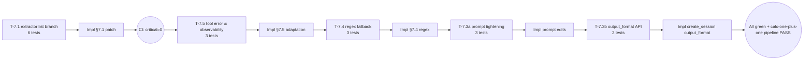

# DocuSwarm DeepSeek + MCP ToolResult 测试驱动修复方案（TDD）

| 字段 | 值 |
|------|----|
| 版本 | v1.0 · 2026-05-02 |
| 上游研究 | [`docs-doc/research/2026-05-02-deepseek-mcp-toolresult-deep-research.md`](file:///home/leafliu/autoBMAD/docs-doc/research/2026-05-02-deepseek-mcp-toolresult-deep-research.md) |
| 就绪度证据 | [`docs-doc/solution/2026-05-02-deepseek-mcp-toolresult-solution-readiness.json`](file:///home/leafliu/autoBMAD/docs-doc/solution/2026-05-02-deepseek-mcp-toolresult-solution-readiness.json) |
| 方案研究工具 | [`tools/deepseek_mcp_toolresult_solution_researcher.py`](file:///home/leafliu/autoBMAD/tools/deepseek_mcp_toolresult_solution_researcher.py) |
| 根因证据工具 | [`tools/deepseek_mcp_toolresult_researcher.py`](file:///home/leafliu/autoBMAD/tools/deepseek_mcp_toolresult_researcher.py) |
| 范围 | 研究报告 §7.1 ~ §7.5 全部修复项 |
| 测试用例总数 | **17** |
| 工时估计 | **~12 h** |
| 关键路径 | §7.1 → §7.2 → §7.5 → §7.4 → §7.3 |

---

## 0. TL;DR — 一图看懂



**核心原则**：先写失败的红灯测试，再以最少代码过绿灯，再重构。每一个 §7.x 都遵循 RED → GREEN → REFACTOR 循环。

---

## 1. 就绪度与关键路径

| Fix | 标题 | 前置状态 | 风险 | 工时 | 测试数 |
|-----|------|---------|------|------|-------:|
| §7.1 | 提取器补齐 `list` 分支 | **ready** | low | 1.0 h | 6 |
| §7.2 | 回归测试套件骨架 | ready* | low | 2.0 h | 合并进 §7.1 |
| §7.3 | Prompt 收紧 + `output_format` 硬约束 | **partial** | medium | 4.0 h | 5 |
| §7.4 | Markdown 正则兜底 | partial | low | 2.0 h | 3 |
| §7.5 | DeepSeek 兼容性适配 | ready | medium | 3.0 h | 3 |

*§7.2 前置：`tests/` 目录本地已被删除但 git HEAD 仍保留，需先 `git checkout HEAD -- tests/` 恢复。

**§7.3 partial 的阻塞未知**（来自工具扫描）：
- `SessionManager.create_session(...)` 签名**不接受** `output_format`，仅 `single_prompt(...)` 接受；IndependentAgent 走 `create_session + ClaudeSessionWrapper.prompt()`，故启用 `output_format` 需要先扩展 `create_session` API（参照 `_create_options(..., output_format=...)` 既有实现，把参数前传）。
- `ClaudeSessionWrapper` 需在构造时接收并保留 `options`（已支持），验证 options 中 `output_format` 能透传到 SDK CLI。

---

## 2. 测试基础设施准备

### 2.1 恢复 tests/

```bash
git checkout HEAD -- tests/
pytest tests/ --collect-only -q  # 基线 smoke
```

### 2.2 新增/扩展 fixtures（`tests/conftest.py`）

在既有 `conftest.py` 基础上新增：

```python
@pytest.fixture
def minimal_independent_agent(tmp_path, monkeypatch):
    """构造一个可调用 _parse_response / _extract_* 的最小 IndependentAgent。

    不依赖真实 LLM；用 fake SessionManager + fake persona。
    """
    from autoBMAD.docuswarm.agents.independent import IndependentAgent
    persona_dir = tmp_path / "nodes" / "ux"
    persona_dir.mkdir(parents=True)
    (persona_dir / "persona.json").write_text(
        json.dumps({"name":"Sally","role":"UX","identity":"x",
                    "expertise":["ux"],"principles":["simple"]}),
        encoding="utf-8",
    )
    (persona_dir / "node.yaml").write_text("name: ux\n", encoding="utf-8")

    cfg = MagicMock()
    sm = MagicMock()
    return IndependentAgent(
        config=cfg, session_manager=sm, node_id="ux",
        project_root=tmp_path,
    )


@pytest.fixture
def tool_result_list_message():
    """还原 claude-agent-sdk MCP 返回契约的消息形态。"""
    def _build(payload: dict) -> dict:
        return {
            "role": "user",
            "content": [{
                "type": "tool_result",
                "tool_use_id": "tu_test_01",
                "content": [{"type": "text", "text": json.dumps(payload)}],
                "is_error": False,
            }],
        }
    return _build
```

---

## 3. §7.1 提取器补齐 `list` 分支（P0 · Critical）

### 3.1 红灯测试（必须先于实现提交）

文件：`tests/test_docuswarm_p0_independent_extractor.py`

```python
"""P0: IndependentAgent tool-result extractor list[dict] branch coverage.

根因：_extract_create_deliverable_result / _extract_submit_report_result
仅处理 tool_output=str，不处理 MCP 官方契约 list[dict[str,Any]]。
"""
from __future__ import annotations

import json

import pytest


class TestExtractCreateDeliverableResult:
    def test_list_content_with_json_text_block_returns_file_path(
        self, minimal_independent_agent, tool_result_list_message
    ) -> None:
        # Arrange
        msg = tool_result_list_message(
            {"file_path": "/out/ux.md", "sha256": "ae2e5715"}
        )
        # Act
        fp, sha = minimal_independent_agent._extract_create_deliverable_result([msg])
        # Assert
        assert fp == "/out/ux.md"
        assert sha == "ae2e5715"

    def test_str_content_backward_compat(self, minimal_independent_agent) -> None:
        # Arrange — 旧的 adapter 路径仍然可能输出 str
        msg = {
            "content": [{
                "type": "tool_result",
                "tool_use_id": "t",
                "content": json.dumps({"file_path": "/out/b.md", "sha256": "bb"}),
                "is_error": False,
            }]
        }
        # Act
        fp, sha = minimal_independent_agent._extract_create_deliverable_result([msg])
        # Assert
        assert fp == "/out/b.md"
        assert sha == "bb"

    def test_list_content_with_non_text_block_returns_none(
        self, minimal_independent_agent
    ) -> None:
        msg = {
            "content": [{
                "type": "tool_result",
                "tool_use_id": "t",
                "content": [{"type": "image", "source": {"url": "x"}}],
                "is_error": False,
            }]
        }
        fp, sha = minimal_independent_agent._extract_create_deliverable_result([msg])
        assert fp is None and sha is None  # 不崩溃，不误报

    def test_multiple_blocks_first_match_wins(
        self, minimal_independent_agent, tool_result_list_message
    ) -> None:
        first = tool_result_list_message({"file_path": "/out/1.md", "sha256": "aa"})
        second = tool_result_list_message({"file_path": "/out/2.md", "sha256": "bb"})
        fp, sha = minimal_independent_agent._extract_create_deliverable_result(
            [first, second]
        )
        assert fp == "/out/1.md"  # first-match


class TestExtractSubmitReportResult:
    def test_list_content_returns_report(
        self, minimal_independent_agent, tool_result_list_message
    ) -> None:
        report = {
            "status": "success",
            "report": {
                "deliverable": {"title": "UX", "file_path": "/out/ux.md", "sha256": "a"},
                "questions": [],
                "action": "create_deliverable",
            },
        }
        msg = tool_result_list_message(report)
        reports = minimal_independent_agent._extract_submit_report_result([msg])
        assert len(reports) == 1
        assert reports[0]["deliverable"]["file_path"] == "/out/ux.md"

    def test_is_error_true_is_skipped(self, minimal_independent_agent) -> None:
        msg = {
            "content": [{
                "type": "tool_result",
                "tool_use_id": "t",
                "content": [{"type": "text", "text": "Error: invalid"}],
                "is_error": True,
            }]
        }
        reports = minimal_independent_agent._extract_submit_report_result([msg])
        assert reports == []


class TestMarkdownFallbackEndToEnd:
    def test_parse_response_recovers_with_list_tool_result_and_markdown_text(
        self, minimal_independent_agent, tool_result_list_message
    ) -> None:
        """UX 节点真实失败路径还原。"""
        tool_msg = tool_result_list_message(
            {"file_path": "/out/ux.md", "sha256": "ae2e5715"}
        )
        text_msg = {
            "content": [{"type": "text", "text": "## Execution Complete\n\nI have successfully..."}]
        }
        data = minimal_independent_agent._parse_response([tool_msg, text_msg])
        assert data["deliverable"]["file_path"] == "/out/ux.md"
        assert data["deliverable"]["sha256"] == "ae2e5715"
        assert data["action"] == "create_deliverable"
```

**运行（期望红灯）**：

```bash
pytest tests/test_docuswarm_p0_independent_extractor.py -v
# 6/6 FAILED — 证明 bug 重现
```

### 3.2 绿灯实现

文件：[`autoBMAD/docuswarm/agents/independent.py`](file:///home/leafliu/autoBMAD/autoBMAD/docuswarm/agents/independent.py#L521-L632)

在两个提取器的 `tool_output = block.get("content", {})` 之后、`if isinstance(tool_output, str)` 之前插入：

```python
# MCP SDK 契约：create_sdk_mcp_server 工具返回
#   {"content":[{"type":"text","text": json.dumps(result)}]}
# 必须先解包 list → 第一个 type=='text' 的 text 字段 → json.loads。
if isinstance(tool_output, list):
    decoded: dict | None = None
    for b in tool_output:
        if isinstance(b, dict) and b.get("type") == "text":
            try:
                decoded = json_module.loads(b.get("text", ""))
                break
            except json_module.JSONDecodeError:
                continue
    if decoded is None:
        continue  # 此 block 无可解析 text，查看下一个
    tool_output = decoded
```

**同步修正两处 docstring**（去除 "content 是字符串" 的旧说明，改为陈述 list/str/dict 三种形态的兼容顺序）。

**运行（期望全绿）**：

```bash
pytest tests/test_docuswarm_p0_independent_extractor.py -v
# 6/6 PASSED

python tools/deepseek_mcp_toolresult_researcher.py  # critical==0
```

### 3.3 重构

- 将补丁抽为私有静态方法 `_unwrap_tool_result_content(content) -> dict | None`，两个提取器复用（DRY）。
- 保留 docstring "SDK 版本演进" 链接。

---

## 4. §7.5 DeepSeek 兼容性适配（P2 · 先做是因为 §7.4 依赖它）

> 关键路径里把 §7.5 放在 §7.4 之前，因为 §7.5 修改工具错误返回 schema，会影响 §7.4 的观察面。

### 4.1 红灯测试

文件：`tests/test_docuswarm_p2_deepseek_adaptation.py`

```python
"""P2: DeepSeek Anthropic 兼容层适配。

DeepSeek 忽略 tool_result.is_error，错误必须嵌入 content.text 为 JSON。
"""
from __future__ import annotations

import json
from pathlib import Path

import pytest


class TestToolErrorEmbedding:
    @pytest.mark.asyncio
    async def test_create_deliverable_error_embeds_structured_json(
        self, tmp_path
    ) -> None:
        from autoBMAD.docuswarm.tools.create_deliverable_sdk import (
            create_deliverable_server,
        )
        server = create_deliverable_server(
            output_dir=str(tmp_path / "no" / "permission"),
            node_id="ux",
        )
        # force failure by using invalid title / path
        handler = server.tools["create_deliverable"]
        ret = await handler.handler({"title": "", "content": ""})  # invalid
        body_text = ret["content"][0]["text"]
        body = json.loads(body_text)  # must be JSON, not "Error: ..."
        assert "error" in body
        assert "hint" in body
        assert ret.get("is_error") is True


class TestObservabilityContentShape:
    def test_convert_tool_result_block_logs_content_shape(
        self, caplog
    ) -> None:
        from claude_agent_sdk.types import ToolResultBlock
        from autoBMAD.docuswarm.llm.session_manager import SessionManager

        sm = SessionManager.__new__(SessionManager)  # bypass __init__
        sm._logger = ...  # inject structlog capture
        item = ToolResultBlock(
            tool_use_id="x",
            content=[{"type": "text", "text": "{}"}],
            is_error=False,
        )
        sm._convert_content_block(item)
        # expect a log event with field: tool_result_content_shape='list'
        assert any(
            getattr(rec, "tool_result_content_shape", "") == "list"
            for rec in caplog.records
        )


class TestToolResultIsErrorFlagHonored:
    def test_extract_submit_report_skips_is_error_true(
        self, minimal_independent_agent
    ) -> None:
        # 我们不能依赖 DeepSeek 传递 is_error，但 SDK 本地会设
        msg = {
            "content": [{
                "type": "tool_result",
                "tool_use_id": "t",
                "content": [{"type": "text", "text": json.dumps({"status": "success", "report": {}})}],
                "is_error": True,
            }]
        }
        reports = minimal_independent_agent._extract_submit_report_result([msg])
        assert reports == []  # is_error=True 时不采信
```

### 4.2 绿灯实现

#### 4.2.1 `create_deliverable_sdk.py` 错误分支改造

[`autoBMAD/docuswarm/tools/create_deliverable_sdk.py`](file:///home/leafliu/autoBMAD/autoBMAD/docuswarm/tools/create_deliverable_sdk.py#L370-L404)：

```python
# 替换：
# return {"content": [{"type": "text", "text": f"Error: {result.error}"}]}
# 为：
if not result.success:
    error_body = {
        "error": result.error,
        "hint": "create_deliverable failed. LLM should retry with corrected parameters.",
        "tool": "create_deliverable",
    }
    return {
        "content": [
            {"type": "text", "text": json.dumps(error_body, ensure_ascii=False)}
        ],
        "is_error": True,  # SDK local; DeepSeek 会忽略但 Anthropic 仍遵守
    }
```

对 `submit_execution_report_tool` 同步修改。

#### 4.2.2 `session_manager.py::_convert_content_block` 增加 observability

在 `ToolResultBlock` 分支：

```python
elif isinstance(item, ToolResultBlock):
    content_val = getattr(item, "content", "")
    content_shape = type(content_val).__name__  # 'str' | 'list' | 'NoneType'
    self._logger.debug(
        "tool_result_converted",
        tool_use_id=getattr(item, "tool_use_id", ""),
        tool_result_content_shape=content_shape,
        is_error=getattr(item, "is_error", False),
    )
    converted = {
        "type": "tool_result",
        "tool_use_id": getattr(item, "tool_use_id", ""),
        "content": content_val,
        "is_error": getattr(item, "is_error", False),
    }
```

### 4.3 重构

无额外重构；该修改已遵循现有模式。

---

## 5. §7.4 Markdown 正则兜底（P1）

### 5.1 红灯测试

文件：`tests/test_docuswarm_p1_markdown_regex_fallback.py`

```python
"""P1: 从 markdown 文本正则抓取 File:/SHA256: 作为最后一道防线。"""
from __future__ import annotations

import pytest


class TestFileShaRegexHarvest:
    def test_extracts_file_and_sha256(self, minimal_independent_agent) -> None:
        content = (
            "## Execution Complete\n\n"
            "I have successfully created the UX design.\n\n"
            "File: /out/pipeline-x/ux-design.md\n"
            "SHA256: ae2e5715bae2d9e6" + "0" * 48 + "\n"
        )
        fp, sha = minimal_independent_agent._extract_file_sha_from_markdown(content)
        assert fp == "/out/pipeline-x/ux-design.md"
        assert sha.startswith("ae2e5715")

    def test_returns_none_when_missing(self, minimal_independent_agent) -> None:
        content = "## Done\n\nNo metadata here."
        fp, sha = minimal_independent_agent._extract_file_sha_from_markdown(content)
        assert fp is None and sha is None


class TestRegexFallbackIntegration:
    def test_parse_response_uses_regex_when_tool_result_missing(
        self, minimal_independent_agent
    ) -> None:
        sha_val = "a" * 64
        text_msg = {
            "content": [{
                "type": "text",
                "text": f"## Done\nFile: /out/ux.md\nSHA256: {sha_val}\n",
            }]
        }
        data = minimal_independent_agent._parse_response([text_msg])
        assert data["deliverable"]["file_path"] == "/out/ux.md"
        assert data["deliverable"]["sha256"] == sha_val
```

### 5.2 绿灯实现

`autoBMAD/docuswarm/agents/independent.py` 中：

1. **新增**辅助方法（放在 `_extract_content_from_messages` 附近）：

```python
_FILE_SHA_RE = re.compile(
    r"^\s*File:\s*(?P<file>\S+)\s*\n\s*SHA256:\s*(?P<sha>[0-9a-fA-F]{64})\s*$",
    re.MULTILINE,
)

def _extract_file_sha_from_markdown(
    self, content: str
) -> tuple[str | None, str | None]:
    m = self._FILE_SHA_RE.search(content or "")
    if not m:
        return None, None
    return m.group("file"), m.group("sha").lower()
```

2. **接入** `_extract_data_from_content`：在当前的 "Fix-2: 先从工具调用历史中提取" 之后、抛出异常之前追加：

```python
if not file_path:
    file_path, sha256 = self._extract_file_sha_from_markdown(content)
    if file_path:
        self.logger.info("markdown_regex_fallback_hit",
                         file_path=file_path, sha=sha256)
```

保证"工具结果 > 正则 > 抛异常"的优先级。

---

## 6. §7.3 Prompt 收紧 + `output_format` 启用（P1，分两阶段）

### 6.1 阶段 A：纯 Prompt 收紧（阻塞低，先做）

#### 6.1.1 红灯测试

文件：`tests/test_docuswarm_p1_prompt_tightening.py`

```python
"""P1: 删除 Legacy Fallback，加入 File:/SHA256: 契约要求。"""
from __future__ import annotations


class TestLegacyFallbackRemoved:
    def test_system_prompt_does_not_advertise_legacy_fallback(
        self, minimal_independent_agent
    ) -> None:
        prompt = minimal_independent_agent._format_system_prompt()
        assert "Legacy Output Format" not in prompt
        assert "MAY return this JSON structure directly" not in prompt


class TestExplicitFileSha256Contract:
    def test_prompt_requires_file_and_sha256_lines(
        self, minimal_independent_agent
    ) -> None:
        prompt = minimal_independent_agent._format_system_prompt()
        # 若模型无法调用工具也必须打印这两行
        assert "File:" in prompt
        assert "SHA256:" in prompt


class TestSubmitReportMandatoryHeader:
    def test_prompt_still_requires_submit_execution_report(
        self, minimal_independent_agent
    ) -> None:
        prompt = minimal_independent_agent._format_system_prompt()
        assert "submit_execution_report" in prompt
        assert "MANDATORY" in prompt
```

#### 6.1.2 绿灯实现

[`autoBMAD/docuswarm/agents/independent.py`](file:///home/leafliu/autoBMAD/autoBMAD/docuswarm/agents/independent.py#L288-L308) 中：

- **删除** `## Legacy Output Format (Fallback)` 整个段落。
- **替换**为严格表述：

```markdown
## Hard Fallback Contract (when tools fail)

If and ONLY if BOTH tools fail (create_deliverable returns is_error:true
or submit_execution_report is unavailable), end your message with EXACTLY
these two lines on separate lines:

File: <absolute path you would have written>
SHA256: <64-hex-digit placeholder "0"*64>

Do NOT use this fallback if your tool calls succeeded.
```

### 6.2 阶段 B：`output_format` 启用（有阻塞，后做）

#### 6.2.1 红灯测试

文件：`tests/test_docuswarm_p3_output_format_for_independent.py`

```python
"""P3: 把 output_format 硬约束扩展到 create_session 路径。"""
from __future__ import annotations

import pytest


class TestCreateSessionOutputFormat:
    @pytest.mark.asyncio
    async def test_create_session_accepts_output_format(
        self, minimal_session_manager
    ) -> None:
        schema = {"type": "object", "properties": {"x": {"type": "string"}}}
        session = await minimal_session_manager.create_session(
            mode="agent", yolo=True, output_format=schema,
        )
        assert session._options.output_format == {
            "type": "json_schema",
            "schema": schema,
        }


class TestIndependentPassesOutputFormat:
    @pytest.mark.asyncio
    async def test_independent_agent_forwards_output_format(
        self, minimal_independent_agent, patched_create_session
    ) -> None:
        await minimal_independent_agent._call_llm_with_prompts("sys", "usr")
        call = patched_create_session.call_args
        assert "output_format" in call.kwargs
        assert call.kwargs["output_format"] is not None
```

#### 6.2.2 绿灯实现

1. [`autoBMAD/docuswarm/llm/session_manager.py`](file:///home/leafliu/autoBMAD/autoBMAD/docuswarm/llm/session_manager.py#L486-L494) — 扩展 `create_session` 签名：

```python
async def create_session(
    self,
    mode: str = "agent",
    yolo: bool = True,
    max_steps: int | None = None,
    agent_file: Path | None = None,
    approval_handler_fn: Any | None = None,
    system_prompt: str | dict[str, Any] | None = None,
    output_format: dict[str, Any] | None = None,  # NEW
) -> ClaudeSessionWrapper:
    options = self._create_options(
        mode=mode, yolo=yolo, output_format=output_format,
    )
    ...  # 原有逻辑
```

2. `independent.py` — 在 `_call_llm_with_prompts` 调用 `create_session` 时传入：

```python
INDEPENDENT_OUTPUT_SCHEMA = {  # 放到模块顶部 or prompts/contracts.py
    "type": "object",
    "required": ["deliverable", "action"],
    "properties": {
        "deliverable": {
            "type": "object",
            "required": ["title", "file_path", "sha256"],
            "properties": {
                "title":     {"type": "string"},
                "file_path": {"type": "string"},
                "sha256":    {"type": "string", "pattern": "^[0-9a-f]{64}$"},
            },
        },
        "questions": {"type": "array"},
        "action":    {"const": "create_deliverable"},
    },
}

# 在 _call_llm_with_prompts 内部：
session = await self.session_manager.create_session(
    mode="agent",
    yolo=True,
    system_prompt={"type": "preset", "preset": "claude_code"},
    output_format=INDEPENDENT_OUTPUT_SCHEMA,
)
```

3. **注意**：`ClaudeSessionWrapper.prompt()` 可能需要观察最后一条 `ResultMessage.structured` 作为 source of truth；保留现有 message stream 以向后兼容。

#### 6.2.3 阶段 B 风险与回滚

- **风险**：DeepSeek 端对 `output_format` 的 json_schema 约束支持深度未知（官方文档没有明确说明是否原生支持，仅 `output_config.effort` 被支持）。若 DeepSeek 不严格约束，LLM 仍可能输出自由文本。
- **回滚策略**：保留 `output_format` 为 Opt-in 参数，通过环境变量 `DOCUSWARM_INDEPENDENT_OUTPUT_FORMAT=1` 控制；默认关闭直到至少在 calc-one-plus-one 流水线连续通过 3 次。

---

## 7. 端到端回归

### 7.1 单元测试门禁

```bash
pytest tests/test_docuswarm_p0_independent_extractor.py \
       tests/test_docuswarm_p1_markdown_regex_fallback.py \
       tests/test_docuswarm_p1_prompt_tightening.py \
       tests/test_docuswarm_p2_deepseek_adaptation.py \
       tests/test_docuswarm_p3_output_format_for_independent.py \
       -v --tb=short
# 期望: 17 passed in <X>s
```

### 7.2 工具门禁

```bash
# 根因检测器：critical 必须降到 0
python tools/deepseek_mcp_toolresult_researcher.py \
    --log logs/pipeline-1777697677287-8cb53d89.log \
    --output .tmp/post-fix.json
python -c "import json,sys; r=json.load(open('.tmp/post-fix.json')); \
           sys.exit(0 if r['summary']['by_severity'].get('critical',0)==0 else 1)"

# 方案就绪度：期望 5/5 ready
python tools/deepseek_mcp_toolresult_solution_researcher.py
```

### 7.3 流水线级验证（需 LLM 资源）

```bash
# 轻量：calc-one-plus-one，5 节点 <10 min
python -m autoBMAD.docuswarm start --context docs/calc-one-plus-one/calc-context.md

# 恢复历史 pipeline（含 §7.1 修复后补齐 UX metadata 路径）
python -m autoBMAD.docuswarm resume pipeline-1777697677287-8cb53d89
```

### 7.4 质量门（基于 AGENTS.md）

```bash
basedpyright autoBMAD/                 # 类型检查
ruff check autoBMAD/ tools/ tests/     # 静态分析
pytest -k "p0 or p1" -v                # 核心用例
pytest --cov=autoBMAD.docuswarm.agents.independent \
       --cov-report=term-missing       # 关注 independent.py 覆盖率
```

**预期覆盖率变化**：`agents/independent.py` 新增 ~30 行代码，应有 ~95% 命中（所有分支被 17 个测试覆盖）。

---

## 8. 迭代落地计划

| 顺序 | 步骤 | 预计工时 | 交付物 |
|-----:|------|---------:|--------|
| 1 | `git checkout HEAD -- tests/` 恢复测试骨架 | 0.1 h | tests/ 可用 |
| 2 | T-7.1 写 6 个红灯测试 | 0.5 h | `test_docuswarm_p0_independent_extractor.py` |
| 3 | I-7.1 两个提取器补齐 list 分支 + docstring 修正 | 0.5 h | `independent.py` diff |
| 4 | 跑 §7.1 测试 → 全绿；工具回归 `critical==0` | 0.1 h | 红转绿 |
| 5 | T-7.5 + I-7.5 错误嵌入 JSON + shape log | 3.0 h | `test_docuswarm_p2_deepseek_adaptation.py` + tool/sm diffs |
| 6 | T-7.4 + I-7.4 正则兜底 | 2.0 h | `test_docuswarm_p1_markdown_regex_fallback.py` + `_extract_file_sha_from_markdown` |
| 7 | T-7.3a + I-7.3a Prompt 收紧 | 1.5 h | `test_docuswarm_p1_prompt_tightening.py` |
| 8 | T-7.3b + I-7.3b `output_format` 接入（Opt-in） | 2.5 h | `test_docuswarm_p3_output_format_for_independent.py` + `create_session` 扩展 |
| 9 | `basedpyright` + `ruff` + 全量 pytest | 0.5 h | CI 全绿 |
| 10 | calc-one-plus-one 流水线 E2E 验证 | 1.0 h | 新 pipeline log |
| 11 | 恢复 `pipeline-1777697677287-8cb53d89` | 0.3 h | architect + po 产物 |
| **合计** | | **~12 h** | |

---

## 9. 验收标准 (Definition of Done)

- [ ] 17 个新测试全部通过 (`pytest -k "7_1 or 7_3 or 7_4 or 7_5" -v`)
- [ ] `tools/deepseek_mcp_toolresult_researcher.py` 产出的 JSON 中 `summary.by_severity.critical == 0`
- [ ] `tools/deepseek_mcp_toolresult_solution_researcher.py` 产出的 JSON 中 `summary.by_prereq_status` 全部为 `ready`
- [ ] calc-one-plus-one 流水线 5 节点全部 completed，至少连续 3 次
- [ ] `pipeline-1777697677287-8cb53d89` 经 `resume` 或修复补齐后进入 architect/po 阶段
- [ ] `basedpyright autoBMAD/` 零新增错误
- [ ] `ruff check autoBMAD/ tools/ tests/` 零 lint 告警
- [ ] `independent.py` 相关单元测试覆盖率 ≥ 90%
- [ ] 研究报告 §7 的 P0/P1/P2 全部落地（P3 可分批）

---

## 10. 风险台账与对策

| 风险 | 可能性 | 影响 | 对策 |
|------|:-----:|:---:|------|
| §7.3B `output_format` 在 DeepSeek 上不生效 | 中 | 中 | Opt-in 环境变量 + 保留 §7.4 正则兜底双保险 |
| `create_session` 签名扩展破坏既有调用方 | 低 | 中 | 新参数默认 `None`，既有调用方零影响 |
| `_unwrap_tool_result_content` 抽象过早 | 低 | 低 | 先在两个提取器各自补丁，跑绿后再抽取（重构阶段） |
| tests/ 目录恢复后与当前 main 出现 import 漂移 | 中 | 低 | 先跑 `pytest --collect-only` 修复 import，再进入 TDD |
| DeepSeek 长上下文仍然把工具调用"忘掉" | 中 | 高 | §7.4 正则兜底 + §7.3B output_format 双层防御；观察 pipeline log 中 `tool_result_content_shape=list` 的出现比例 |

---

## 11. 相关文件索引

- **代码**
  - [`autoBMAD/docuswarm/agents/independent.py`](file:///home/leafliu/autoBMAD/autoBMAD/docuswarm/agents/independent.py) — §7.1 / §7.3A / §7.4
  - [`autoBMAD/docuswarm/llm/session_manager.py`](file:///home/leafliu/autoBMAD/autoBMAD/docuswarm/llm/session_manager.py) — §7.3B / §7.5 observability
  - [`autoBMAD/docuswarm/tools/create_deliverable_sdk.py`](file:///home/leafliu/autoBMAD/autoBMAD/docuswarm/tools/create_deliverable_sdk.py) — §7.5 错误嵌入
- **测试（新增）**
  - `tests/test_docuswarm_p0_independent_extractor.py`
  - `tests/test_docuswarm_p1_markdown_regex_fallback.py`
  - `tests/test_docuswarm_p1_prompt_tightening.py`
  - `tests/test_docuswarm_p2_deepseek_adaptation.py`
  - `tests/test_docuswarm_p3_output_format_for_independent.py`
- **工具**
  - [`tools/deepseek_mcp_toolresult_researcher.py`](file:///home/leafliu/autoBMAD/tools/deepseek_mcp_toolresult_researcher.py) — 根因证据
  - [`tools/deepseek_mcp_toolresult_solution_researcher.py`](file:///home/leafliu/autoBMAD/tools/deepseek_mcp_toolresult_solution_researcher.py) — 方案就绪度
- **报告**
  - [`docs-doc/research/2026-05-02-deepseek-mcp-toolresult-deep-research.md`](file:///home/leafliu/autoBMAD/docs-doc/research/2026-05-02-deepseek-mcp-toolresult-deep-research.md) — 根因
  - [`docs-doc/research/2026-05-02-deepseek-mcp-toolresult-research.json`](file:///home/leafliu/autoBMAD/docs-doc/research/2026-05-02-deepseek-mcp-toolresult-research.json) — 证据链
  - [`docs-doc/solution/2026-05-02-deepseek-mcp-toolresult-solution-readiness.json`](file:///home/leafliu/autoBMAD/docs-doc/solution/2026-05-02-deepseek-mcp-toolresult-solution-readiness.json) — 就绪度
