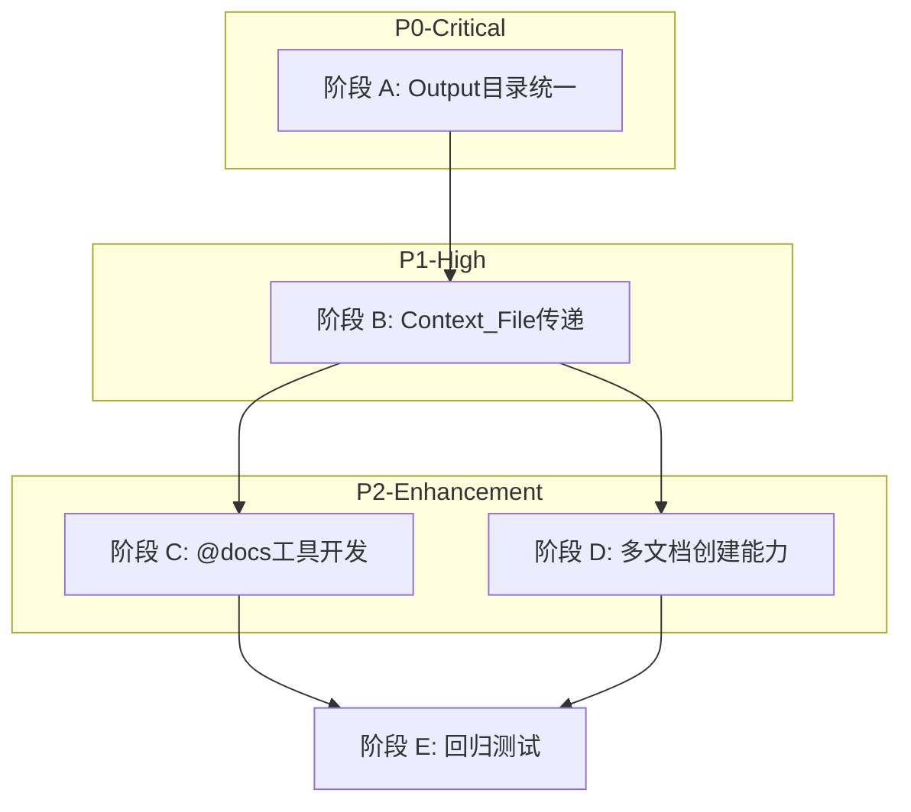

# Output 目录统一与 Context_File 传递 — 解决方案概览

**创建日期**: 2026-02-24  
**需求来源**: 用户需求分析  
**分析范围**: `autoBMAD\docuswarm`  
**文档状态**: 拆分完成

---

## 执行摘要

### 需求描述

1. **统一输出路径**: 所有节点交付物保存到 `autoBMAD\output\{pipeline_id}\`
2. **Context_File 传递**: 每个独立 Agent 根据 `<context_file>` 独立创建交付物
3. **@docs 文档修改能力**: 允许每个独立 Agent 根据节点交付物修改主目录下的 `@docs` 相关文档

### 问题识别

| 问题编号 | 优先级 | 问题描述 | 影响范围 |
|---------|--------|----------|----------|
| P-001 | **P0** | 输出目录重复创建 - `Orchestrator._work_dir` 未初始化 | Pipeline 全流程 |
| P-002 | **P1** | Context_File 未正确传递到 LLM Prompt | Agent 交付物质量 |
| P-003 | **P2** | Agent 无法修改 @docs 目录文档 | 文档同步能力 |
| P-004 | **P2** | Agent 只能创建单一交付物 | 文档产出效率 |

---

## 解决方案架构

### 四阶段实施方案

```
┌─────────────────────────────────────────────────────────────────┐
│                    解决方案实施路线图                              │
├─────────────────────────────────────────────────────────────────┤
│                                                                 │
│  阶段 A (P0)          阶段 B (P1)         阶段 C/D (P2)          │
│  ┌─────────────┐     ┌─────────────┐     ┌─────────────┐        │
│  │ Output 目录  │────▶│ Context_File│────▶│ @docs 工具  │        │
│  │ 统一修复     │     │ 传递修复     │     │ + 多文档能力 │        │
│  └─────────────┘     └─────────────┘     └─────────────┘        │
│        │                   │                   │                │
│        ▼                   ▼                   ▼                │
│  orchestrator.py     independent.py      tools/*.py            │
│  main.py                                 templates/*.yaml      │
│                                                                 │
└─────────────────────────────────────────────────────────────────┘
```

### 方案文档导航

| 阶段 | 文档 | 优先级 | 预估工时 | 依赖 |
|------|------|--------|----------|------|
| **A** | [P0-Output目录统一-TDD方案.md](./P0-Output目录统一-TDD方案.md) | **P0** | 20 min | 无 |
| **B** | [P1-Context_File传递-TDD方案.md](./P1-Context_File传递-TDD方案.md) | **P1** | 30 min | A |
| **C** | [P2-docs文档修改能力-TDD方案.md](./P2-docs文档修改能力-TDD方案.md) | **P2** | 90 min | A, B |
| **D** | [P2-多文档创建能力-TDD方案.md](./P2-多文档创建能力-TDD方案.md) | **P2** | 120 min | A, B |

---

## 当前问题分析

### 问题 1: 输出目录重复创建 (P0)

**现象**:
- `autoBMAD\output\pipeline-xxx\` — 正确位置 (IndependentAgent 创建)
- `d:\GITHUB\DocuSwarm\pipeline-xxx\` — 意外位置 (Orchestrator 默认 work_dir)

**根因**:
```python
# orchestrator.py:181
work_dir = KaosPath(self._work_dir) if self._work_dir else KaosPath.cwd()
#                                                          ↑ 当 _work_dir=None 时使用当前工作目录
```

**详细分析**: 见 [P0-Output目录统一-TDD方案.md](./P0-Output目录统一-TDD方案.md)

### 问题 2: Context_File 未正确传递 (P1)

**传递链断裂点**:
```
CLI读取文件 → subject_context → PipelineState → accumulate_context → NodeRunState
     ↓                                                                     ↓
  content: "..."                                               ❌ IndependentAgent 只提取 task
```

**详细分析**: 见 [P1-Context_File传递-TDD方案.md](./P1-Context_File传递-TDD方案.md)

### 问题 3: @docs 文档修改受限 (P2)

**当前限制**:
- Agent 只有 `create_deliverable` 和 `update_context` 工具
- 无法读取、列出、修改现有 @docs 目录文档
- 破坏了文档与代码同步的能力

**详细分析**: 见 [P2-docs文档修改能力-TDD方案.md](./P2-docs文档修改能力-TDD方案.md)

### 问题 4: 单文档创建限制 (P2)

**当前限制**:
- Agent 只能调用一次 `create_deliverable`，创建单一文档
- 无文档模板机制
- 无文档质量标准引用
- 无多文档协调机制

**详细分析**: 见 [P2-多文档创建能力-TDD方案.md](./P2-多文档创建能力-TDD方案.md)

---

## 文件修改清单

### 源码修改

| 文件 | 修改类型 | 阶段 | 优先级 |
|------|---------|------|--------|
| `autoBMAD/docuswarm/pipeline/orchestrator.py` | 源码修复 | A | **P0** |
| `autoBMAD/docuswarm/main.py` | 源码修复 | A | P0 |
| `autoBMAD/docuswarm/agents/independent.py` | 源码修复 | B | **P1** |
| `autoBMAD/docuswarm/config.py` | 配置扩展 | C | P2 |
| `autoBMAD/docuswarm/agents/persona.py` | 源码扩展 | D | P2 |

### 新增工具

| 文件 | 功能 | 阶段 | 优先级 |
|------|------|------|--------|
| `autoBMAD/docuswarm/tools/read_docs_file.py` | @docs 文件读取 | C | **P2** |
| `autoBMAD/docuswarm/tools/update_docs_file.py` | @docs 文件更新 | C | **P2** |
| `autoBMAD/docuswarm/tools/list_docs_files.py` | @docs 文件列表 | C | **P2** |
| `autoBMAD/docuswarm/tools/create_document_set.py` | 多文档创建 | D | **P2** |

### 新增模板

| 文件 | 用途 | 阶段 |
|------|------|------|
| `autoBMAD/docuswarm/templates/analyst_templates.yaml` | Analyst 节点模板 | D |
| `autoBMAD/docuswarm/templates/architect_templates.yaml` | Architect 节点模板 | D |
| `autoBMAD/docuswarm/templates/pm_templates.yaml` | PM 节点模板 | D |
| `autoBMAD/docuswarm/templates/ux_templates.yaml` | UX 节点模板 | D |
| `autoBMAD/docuswarm/templates/po_templates.yaml` | PO 节点模板 | D |

### 新增测试

| 文件 | 测试范围 | 阶段 | 优先级 |
|------|----------|------|--------|
| `tests/unit/test_orchestrator_work_dir.py` | Orchestrator work_dir | A | **P0** |
| `tests/unit/test_independent_agent_context.py` | Context 传递 | B | **P1** |
| `tests/unit/test_docs_tools.py` | @docs 工具 | C | P2 |
| `tests/unit/test_create_document_set.py` | 多文档创建 | D | P2 |
| `tests/integration/test_context_file_transmission.py` | 端到端集成 | B | P2 |
| `tests/integration/test_docs_modification.py` | @docs 修改集成 | C | P2 |

---

## 实施顺序

### 推荐实施路径



### 实施时间估算

| 阶段 | 任务 | 预估时间 |
|------|------|----------|
| A | work_dir 修复 | 20 min |
| B | context 传递修复 | 30 min |
| C | @docs 工具开发 | 90 min |
| D | 多文档创建能力 | 120 min |
| E | 回归测试 | 20 min |
| **总计** | | **~280 min (~4.7 小时)** |

---

## 验证清单

### 阶段 A 验收标准
- [ ] `orchestrator._work_dir` 指向 `autoBMAD/output`
- [ ] 运行 pipeline 后只在 `autoBMAD\output\` 创建目录
- [ ] 根目录无 `pipeline-xxx\` 文件夹
- [ ] 单元测试 `test_orchestrator_work_dir.py` 全部通过

### 阶段 B 验收标准
- [ ] LLM Prompt 包含 `## Original Context` 部分
- [ ] `context_content` 正确提取
- [ ] 日志显示 `has_context_content=True`
- [ ] 单元测试 `test_independent_agent_context.py` 全部通过

### 阶段 C 验收标准
- [ ] Agent 可以使用 `read_docs_file` 读取 @docs 文件
- [ ] Agent 可以使用 `update_docs_file` 更新 @docs 文件
- [ ] Agent 可以使用 `list_docs_files` 列出 @docs 文件
- [ ] 自动备份机制正常工作
- [ ] 路径访问控制防止目录穿越
- [ ] 单元测试 `test_docs_tools.py` 全部通过

### 阶段 D 验收标准
- [ ] Agent 可以使用 `create_document_set` 创建多个文档
- [ ] 模板验证正常工作 (必需章节检查)
- [ ] Mermaid 图表语法验证正常
- [ ] Persona 包含文档标准引用
- [ ] 单元测试 `test_create_document_set.py` 全部通过

### 全局验收标准
- [ ] 所有单元测试保持通过
- [ ] 集成测试无回归
- [ ] basedpyright 类型检查通过
- [ ] ruff 代码风格检查通过

---

## 相关文档

- [原始详细方案](./Output目录统一与Context_File传递-TDD解决方案.md) - 完整的技术细节 (已归档)
- [Pytest测试失败解决方案](./Pytest-测试失败解决方案.md) - 测试修复参考
- [集成测试LLM响应格式问题](./集成测试LLM响应格式问题-TDD解决方案.md) - LLM 响应处理参考

---

## 更新记录

| 日期 | 版本 | 变更内容 |
|------|------|----------|
| 2026-02-24 | 1.0 | 初始创建，从原始文档拆分 |
