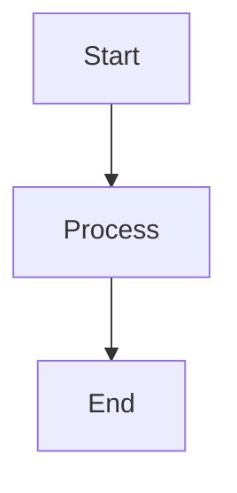
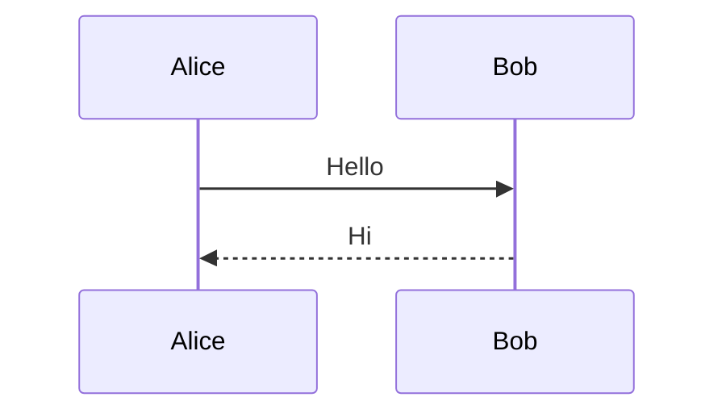

# P2: 多文档创建能力 — 测试驱动开发方案

**优先级**: P2 (Enhancement)  
**预估工时**: 120 分钟  
**依赖**: [P0](./P0-Output目录统一-TDD方案.md), [P1](./P1-Context_File传递-TDD方案.md)  
**影响范围**: Agent 文档产出效率

---

## 目录

1. [需求描述](#1-需求描述)
2. [技术设计](#2-技术设计)
3. [模板系统](#3-模板系统)
4. [工具实现](#4-工具实现)
5. [TDD 测试用例](#5-tdd-测试用例)
6. [实施步骤](#6-实施步骤)
7. [验证清单](#7-验证清单)

---

## 1. 需求描述

### 1.1 需求背景

当前 Agent 只能通过 `create_deliverable` 工具创建单一文档。在实际场景中，一个节点往往需要创建多个相关文档。

### 1.2 BMAD 参考

从 `_bmad` 方法论中学习：

| BMAD 实践 | DocuSwarm 应用 |
|-----------|---------------|
| Tech Writer Agent | 专职文档创建角色 |
| Document Templates | 预定义文档模板 |
| Documentation Standards | 统一质量标准 |
| Multi-document Workflows | 系统化文档生成 |

### 1.3 应用场景

**Analyst 节点**:
- Market Research Report
- Competitor Analysis
- User Persona Documents
- Risk Assessment

**Architect 节点**:
- System Architecture Overview
- Component Design Documents
- API Specifications
- Database Schema Design

**PM 节点**:
- Product Requirements Document (PRD)
- Project Schedule
- Risk Assessment
- Release Plan

**UX 节点**:
- User Personas
- User Flows
- Wireframes
- Usability Testing Plan

**PO 节点**:
- Product Vision
- Product Roadmap
- Epic List
- Story Prioritization

### 1.4 功能需求

| 功能 | 描述 |
|------|------|
| 多文档创建 | 一次调用创建多个文档 |
| 模板验证 | 验证必需章节是否存在 |
| Mermaid 验证 | 验证图表语法正确性 |
| 文档标准引用 | 自动注入 BMAD 文档标准 |

---

## 2. 技术设计

### 2.1 系统架构

```
┌─────────────────────────────────────────────────────────────────┐
│                     IndependentAgent                             │
├─────────────────────────────────────────────────────────────────┤
│                                                                 │
│  ┌───────────────────────────────────────────────────────────┐  │
│  │                   CreateDocumentSetTool                    │  │
│  │                                                           │  │
│  │  documents: [                                             │  │
│  │    {template_id, title, content, metadata},               │  │
│  │    {template_id, title, content, metadata},               │  │
│  │    ...                                                    │  │
│  │  ]                                                        │  │
│  └───────────────────────────────────────────────────────────┘  │
│           │                                                      │
│           ▼                                                      │
│  ┌───────────────────────────────────────────────────────────┐  │
│  │                   Template Validation                      │  │
│  │  - Required sections check                                │  │
│  │  - Mermaid diagram validation                             │  │
│  │  - CommonMark compliance (future)                         │  │
│  └───────────────────────────────────────────────────────────┘  │
│           │                                                      │
│           ▼                                                      │
│  ┌───────────────────────────────────────────────────────────┐  │
│  │              autoBMAD/output/{pipeline_id}/                │  │
│  │  ├── market-research-report.md                            │  │
│  │  ├── user-personas.md                                     │  │
│  │  └── risk-assessment.md                                   │  │
│  └───────────────────────────────────────────────────────────┘  │
│                                                                 │
└─────────────────────────────────────────────────────────────────┘
```

### 2.2 目录结构

```
autoBMAD/docuswarm/
├── tools/
│   ├── __init__.py
│   ├── create_deliverable.py     # 现有工具
│   └── create_document_set.py    # 新增
└── templates/
    ├── __init__.py               # 新增
    ├── analyst_templates.yaml    # 新增
    ├── architect_templates.yaml  # 新增
    ├── pm_templates.yaml         # 新增
    ├── ux_templates.yaml         # 新增
    └── po_templates.yaml         # 新增
```

### 2.3 数据模型

```python
# 文档规格
class DocumentSpec:
    template_id: str       # 模板标识符
    title: str | None      # 自定义标题 (可选)
    content: str           # 文档内容 (Markdown)
    metadata: dict         # 元数据

# 工具参数
class CreateDocumentSetParams:
    documents: list[DocumentSpec]  # 文档列表 (1-10)
    node_id: str                   # 节点标识符
```

---

## 3. 模板系统

### 3.1 模板配置格式

**文件**: `autoBMAD/docuswarm/templates/analyst_templates.yaml`

```yaml
# Analyst 节点文档模板配置
version: "1.0"
node_id: analyst
description: "Templates for Analyst node deliverables"

templates:
  - template_id: market_research
    title: "Market Research Report"
    filename_pattern: "market-research-report.md"
    description: "Comprehensive market analysis and trends"
    sections:
      - heading: "Executive Summary"
        required: true
        description: "High-level overview of findings"
      - heading: "Market Overview"
        required: true
        description: "Current market state and trends"
      - heading: "Target Segments"
        required: true
        description: "Identified customer segments"
      - heading: "Competitive Landscape"
        required: true
        description: "Competitor analysis"
      - heading: "Market Opportunities"
        required: true
        description: "Growth opportunities"
      - heading: "Recommendations"
        required: true
        description: "Strategic recommendations"

  - template_id: user_personas
    title: "User Persona Analysis"
    filename_pattern: "user-personas.md"
    description: "Detailed user persona definitions"
    sections:
      - heading: "Overview"
        required: true
      - heading: "Primary Personas"
        required: true
      - heading: "Secondary Personas"
        required: false
      - heading: "User Journey Maps"
        required: true
        note: "Use Mermaid sequence diagrams"

  - template_id: risk_assessment
    title: "Risk Assessment Report"
    filename_pattern: "risk-assessment.md"
    description: "Project risk identification and mitigation"
    sections:
      - heading: "Risk Overview"
        required: true
      - heading: "Technical Risks"
        required: true
      - heading: "Business Risks"
        required: true
      - heading: "Mitigation Strategies"
        required: true

# 文档标准引用
standards:
  style_guide: "_bmad/_memory/tech-writer-sidecar/documentation-standards.md"
  diagram_format: "mermaid"
  no_time_estimates: true
  commonmark_strict: true
```

### 3.2 Architect 模板

**文件**: `autoBMAD/docuswarm/templates/architect_templates.yaml`

```yaml
version: "1.0"
node_id: architect
description: "Templates for Architect node deliverables"

templates:
  - template_id: system_architecture
    title: "System Architecture Overview"
    filename_pattern: "system-architecture.md"
    description: "High-level system architecture"
    sections:
      - heading: "Architecture Vision"
        required: true
      - heading: "System Components"
        required: true
      - heading: "Data Flow"
        required: true
        note: "Use Mermaid flowchart"
      - heading: "Technology Stack"
        required: true
      - heading: "Architecture Diagrams"
        required: true
        note: "Use Mermaid or C4 model"

  - template_id: api_specification
    title: "API Specification"
    filename_pattern: "api-specification.md"
    description: "RESTful API design and contracts"
    sections:
      - heading: "API Overview"
        required: true
      - heading: "Authentication"
        required: true
      - heading: "Endpoints"
        required: true
      - heading: "Data Models"
        required: true
      - heading: "Error Handling"
        required: true

  - template_id: database_schema
    title: "Database Schema Design"
    filename_pattern: "database-schema.md"
    description: "Database structure and relationships"
    sections:
      - heading: "Schema Overview"
        required: true
      - heading: "Entity Definitions"
        required: true
      - heading: "Relationships"
        required: true
        note: "Use Mermaid erDiagram"
      - heading: "Indexes and Constraints"
        required: true
      - heading: "Migration Strategy"
        required: true

standards:
  style_guide: "_bmad/_memory/tech-writer-sidecar/documentation-standards.md"
  diagram_format: "mermaid"
  no_time_estimates: true
  commonmark_strict: true
```

### 3.3 PM 模板

**文件**: `autoBMAD/docuswarm/templates/pm_templates.yaml`

```yaml
version: "1.0"
node_id: pm
description: "Templates for PM (Project Manager) node deliverables"

templates:
  - template_id: prd
    title: "Product Requirements Document"
    filename_pattern: "product-requirements.md"
    description: "Comprehensive product requirements specification"
    sections:
      - heading: "Product Overview"
        required: true
        description: "High-level product description"
      - heading: "Problem Statement"
        required: true
        description: "Problem being solved"
      - heading: "User Stories"
        required: true
        description: "User-centric requirements"
      - heading: "Functional Requirements"
        required: true
        description: "Detailed feature requirements"
      - heading: "Non-Functional Requirements"
        required: true
        description: "Performance, security, scalability"
      - heading: "Acceptance Criteria"
        required: true
        description: "Verification criteria"
      - heading: "Timeline"
        required: false
        note: "High-level milestones only, no time estimates"
      - heading: "Risks"
        required: true
        description: "Risk identification and mitigation"

  - template_id: risk_assessment
    title: "Risk Assessment Report"
    filename_pattern: "risk-assessment.md"
    description: "Project risk analysis"
    sections:
      - heading: "Risk Overview"
        required: true
      - heading: "Technical Risks"
        required: true
      - heading: "Business Risks"
        required: true
      - heading: "Schedule Risks"
        required: true
      - heading: "Mitigation Strategies"
        required: true

standards:
  style_guide: "_bmad/_memory/tech-writer-sidecar/documentation-standards.md"
  diagram_format: "mermaid"
  no_time_estimates: true
  commonmark_strict: true
```

### 3.4 UX 模板

**文件**: `autoBMAD/docuswarm/templates/ux_templates.yaml`

```yaml
version: "1.0"
node_id: ux
description: "Templates for UX (User Experience Designer) node deliverables"

templates:
  - template_id: user_personas
    title: "User Personas"
    filename_pattern: "user-personas.md"
    description: "Detailed user persona definitions"
    sections:
      - heading: "Persona Overview"
        required: true
      - heading: "Primary Personas"
        required: true
      - heading: "Secondary Personas"
        required: false
      - heading: "User Goals"
        required: true
      - heading: "Pain Points"
        required: true

  - template_id: user_flows
    title: "User Flows"
    filename_pattern: "user-flows.md"
    description: "User interaction flow diagrams"
    sections:
      - heading: "Flow Overview"
        required: true
      - heading: "Core User Flows"
        required: true
        note: "Use Mermaid flowchart"
      - heading: "Edge Cases"
        required: true
      - heading: "Error States"
        required: true

  - template_id: wireframes
    title: "Wireframes"
    filename_pattern: "wireframes.md"
    description: "UI wireframe specifications"
    sections:
      - heading: "Design Overview"
        required: true
      - heading: "Page Layouts"
        required: true
      - heading: "Component Specifications"
        required: true
      - heading: "Responsive Considerations"
        required: true

  - template_id: usability_testing
    title: "Usability Testing Plan"
    filename_pattern: "usability-testing-plan.md"
    description: "Usability test strategy"
    sections:
      - heading: "Test Objectives"
        required: true
      - heading: "Test Scenarios"
        required: true
      - heading: "Success Metrics"
        required: true
      - heading: "Participant Criteria"
        required: true

standards:
  style_guide: "_bmad/_memory/tech-writer-sidecar/documentation-standards.md"
  diagram_format: "mermaid"
  no_time_estimates: true
  commonmark_strict: true
```

### 3.5 PO 模板

**文件**: `autoBMAD/docuswarm/templates/po_templates.yaml`

```yaml
version: "1.0"
node_id: po
description: "Templates for PO (Product Owner) node deliverables"

templates:
  - template_id: product_vision
    title: "Product Vision"
    filename_pattern: "product-vision.md"
    description: "Product vision and strategy"
    sections:
      - heading: "Vision Statement"
        required: true
      - heading: "Target Market"
        required: true
      - heading: "Value Proposition"
        required: true
      - heading: "Success Metrics"
        required: true

  - template_id: roadmap
    title: "Product Roadmap"
    filename_pattern: "product-roadmap.md"
    description: "Product development roadmap"
    sections:
      - heading: "Roadmap Overview"
        required: true
        note: "Use Mermaid gantt or timeline"
      - heading: "Phase 1 Goals"
        required: true
      - heading: "Future Phases"
        required: true
      - heading: "Dependencies"
        required: true

  - template_id: epic_list
    title: "Epic List"
    filename_pattern: "epic-list.md"
    description: "Product epics and features"
    sections:
      - heading: "Epic Overview"
        required: true
      - heading: "Epic Details"
        required: true
      - heading: "Prioritization Rationale"
        required: true
        note: "Use MoSCoW, RICE, or Kano"
      - heading: "Dependencies"
        required: true

  - template_id: story_list
    title: "Story Prioritization"
    filename_pattern: "story-prioritization.md"
    description: "User story breakdown and prioritization"
    sections:
      - heading: "Story Overview"
        required: true
      - heading: "Story List"
        required: true
      - heading: "Acceptance Criteria"
        required: true
      - heading: "Release Plan"
        required: true

standards:
  style_guide: "_bmad/_memory/tech-writer-sidecar/documentation-standards.md"
  diagram_format: "mermaid"
  no_time_estimates: true
  commonmark_strict: true
```

---

## 4. 工具实现

### 4.1 CreateDocumentSetTool

**文件**: `autoBMAD/docuswarm/tools/create_document_set.py`

```python
"""CreateDocumentSetTool - 创建多个结构化文档的工具.

This module provides a tool for creating multiple documents based on
node templates with structure validation.
"""

from __future__ import annotations

import re
from pathlib import Path
from typing import Any, override

import aiofiles
import yaml
from kimi_agent_sdk import CallableTool2, ToolError, ToolOk, ToolReturnValue
from pydantic import BaseModel, Field


class DocumentSpec(BaseModel):
    """Single document specification.
    
    Attributes:
        template_id: Template identifier from templates YAML.
        title: Document title (overrides template default).
        content: Document content in Markdown.
        metadata: Additional metadata.
    """
    
    template_id: str = Field(description="Template ID from node templates")
    title: str | None = Field(default=None, description="Custom title (optional)")
    content: str = Field(description="Document content in Markdown")
    metadata: dict[str, Any] = Field(
        default_factory=dict,
        description="Additional metadata"
    )


class CreateDocumentSetParams(BaseModel):
    """Parameters for creating a document set.
    
    Attributes:
        documents: List of documents to create (1-10).
        node_id: Node identifier for template loading.
    """
    
    documents: list[DocumentSpec] = Field(
        description="List of documents to create",
        min_length=1,
        max_length=10
    )
    node_id: str = Field(
        default="unknown",
        description="Node identifier for template loading (analyst, pm, ux, architect, po)"
    )


def _slugify_filename(title: str) -> str:
    """Convert title to a valid filename slug.
    
    Args:
        title: The document title.
    
    Returns:
        A slugified filename with .md extension.
    """
    slug = title.lower()
    slug = slug.replace(" ", "-")
    slug = re.sub(r"[^a-z0-9\-]", "", slug)
    slug = re.sub(r"-+", "-", slug)
    slug = slug.strip("-")
    return f"{slug}.md" if slug else "document.md"


class CreateDocumentSetTool(CallableTool2[CreateDocumentSetParams]):
    """Tool for creating multiple structured documents based on templates.
    
    This tool extends create_deliverable to support:
    - Multiple document creation in one call
    - Template-based validation
    - Mermaid diagram validation
    - Documentation standards enforcement
    
    Features:
    - Template loading from YAML files
    - Required section validation
    - Mermaid diagram syntax checking
    - Automatic filename generation
    """
    
    name: str = "create_document_set"
    description: str = "Create multiple structured documents based on node templates"
    params: type[CreateDocumentSetParams] = CreateDocumentSetParams
    
    def __init__(self) -> None:
        """Initialize the tool with template loading."""
        super().__init__()
        self.templates_cache: dict[str, Any] = {}
        self._load_templates()
    
    def _load_templates(self) -> None:
        """Load all node template configurations."""
        # Compute templates directory
        current_file = Path(__file__)
        templates_dir = current_file.parent.parent / "templates"
        
        if not templates_dir.exists():
            return
        
        # Load all YAML template files
        for template_file in templates_dir.glob("*_templates.yaml"):
            try:
                with open(template_file, encoding="utf-8") as f:
                    config = yaml.safe_load(f)
                    node_id = config.get("node_id")
                    if node_id:
                        self.templates_cache[node_id] = config
            except (yaml.YAMLError, OSError):
                pass  # Skip invalid template files
    
    def _get_template(
        self,
        node_id: str,
        template_id: str
    ) -> dict[str, Any] | None:
        """Get template configuration.
        
        Args:
            node_id: Node identifier.
            template_id: Template identifier.
        
        Returns:
            Template config dict or None if not found.
        """
        node_templates = self.templates_cache.get(node_id)
        if not node_templates:
            return None
        
        for template in node_templates.get("templates", []):
            if template.get("template_id") == template_id:
                return template
        
        return None
    
    def _validate_content_structure(
        self,
        content: str,
        template: dict[str, Any]
    ) -> tuple[bool, list[str]]:
        """Validate document content against template structure.
        
        Args:
            content: Document content.
            template: Template configuration.
        
        Returns:
            Tuple of (is_valid, list of missing sections).
        """
        missing_sections: list[str] = []
        
        required_sections = [
            section["heading"]
            for section in template.get("sections", [])
            if section.get("required", False)
        ]
        
        for section in required_sections:
            # Check for heading (both ## and # formats)
            patterns = [f"## {section}", f"# {section}", f"### {section}"]
            if not any(pattern in content for pattern in patterns):
                missing_sections.append(section)
        
        return len(missing_sections) == 0, missing_sections
    
    def _validate_mermaid_diagrams(
        self,
        content: str
    ) -> tuple[bool, list[str]]:
        """Validate Mermaid diagram syntax.
        
        Args:
            content: Document content.
        
        Returns:
            Tuple of (is_valid, list of errors).
        """
        errors: list[str] = []
        
        # Extract mermaid code blocks
        mermaid_pattern = r"```mermaid\s*\n(.*?)\n```"
        diagrams = re.findall(mermaid_pattern, content, re.DOTALL)
        
        valid_diagram_types = [
            "flowchart", "sequenceDiagram", "classDiagram",
            "erDiagram", "stateDiagram-v2", "gitGraph",
            "graph", "pie", "journey", "gantt"
        ]
        
        for i, diagram in enumerate(diagrams):
            first_line = diagram.strip().split("\n")[0].strip()
            
            # Check if starts with valid diagram type
            if not any(first_line.startswith(dtype) for dtype in valid_diagram_types):
                errors.append(
                    f"Mermaid block {i + 1}: Missing diagram type. "
                    f"Found: '{first_line[:30]}...'"
                )
        
        return len(errors) == 0, errors
    
    @override
    async def __call__(
        self,
        params: CreateDocumentSetParams
    ) -> ToolReturnValue:
        """Create multiple documents with validation.
        
        Args:
            params: Validated parameters.
        
        Returns:
            ToolOk on success, ToolError on failure.
        """
        try:
            created_files: list[str] = []
            validation_warnings: list[str] = []
            
            # Get current working directory (should be pipeline output dir)
            output_dir = Path.cwd()
            
            for doc_spec in params.documents:
                # Get template
                template = self._get_template(params.node_id, doc_spec.template_id)
                
                # Determine filename
                if template and "filename_pattern" in template:
                    filename = template["filename_pattern"]
                elif doc_spec.title:
                    filename = _slugify_filename(doc_spec.title)
                else:
                    filename = _slugify_filename(doc_spec.template_id)
                
                # Validate content structure (if template exists)
                if template:
                    is_valid, missing = self._validate_content_structure(
                        doc_spec.content,
                        template
                    )
                    if not is_valid:
                        for section in missing:
                            validation_warnings.append(
                                f"{filename}: Missing required section '{section}'"
                            )
                
                # Validate Mermaid diagrams
                is_valid, mermaid_errors = self._validate_mermaid_diagrams(
                    doc_spec.content
                )
                if not is_valid:
                    for error in mermaid_errors:
                        validation_warnings.append(f"{filename}: {error}")
                
                # Write file
                file_path = output_dir / filename
                async with aiofiles.open(file_path, "w", encoding="utf-8") as f:
                    await f.write(doc_spec.content)
                
                created_files.append(filename)
            
            # Build result message
            result_msg = f"Created {len(created_files)} document(s):\n"
            result_msg += "\n".join(f"  - {f}" for f in created_files)
            
            if validation_warnings:
                result_msg += "\n\n⚠️ Validation Warnings:\n"
                result_msg += "\n".join(f"  - {w}" for w in validation_warnings)
            
            return ToolOk(output=result_msg)
        
        except PermissionError as e:
            return ToolError(
                output="",
                message=f"Permission denied: {e}",
                brief="Permission denied"
            )
        except Exception as exc:
            return ToolError(
                output="",
                message=str(exc),
                brief="Failed to create document set"
            )
```

### 4.2 模板包初始化

**文件**: `autoBMAD/docuswarm/templates/__init__.py`

```python
"""DocuSwarm templates package.

This package provides document templates for different node types.
"""

from pathlib import Path

TEMPLATES_DIR = Path(__file__).parent

__all__ = ["TEMPLATES_DIR"]
```

---

## 5. TDD 测试用例

### 5.1 测试文件

**文件**: `tests/unit/test_create_document_set.py`

### 5.2 测试代码

```python
"""Unit tests for CreateDocumentSetTool.

This module tests:
1. Multiple document creation
2. Template validation
3. Mermaid diagram validation
4. Filename generation
5. Error handling
"""

import pytest
from pathlib import Path
from typing import Any
from unittest.mock import patch

from autoBMAD.docuswarm.tools.create_document_set import (
    CreateDocumentSetTool,
    CreateDocumentSetParams,
    DocumentSpec,
    _slugify_filename,
)


@pytest.fixture
def templates_dir(tmp_path: Path) -> Path:
    """Create a temporary templates directory."""
    templates = tmp_path / "templates"
    templates.mkdir()
    
    # Create analyst templates
    analyst_yaml = """
version: "1.0"
node_id: analyst

templates:
  - template_id: market_research
    title: "Market Research Report"
    filename_pattern: "market-research-report.md"
    sections:
      - heading: "Executive Summary"
        required: true
      - heading: "Market Overview"
        required: true
      - heading: "Recommendations"
        required: true

  - template_id: user_personas
    title: "User Personas"
    filename_pattern: "user-personas.md"
    sections:
      - heading: "Overview"
        required: true
      - heading: "Primary Personas"
        required: true
"""
    (templates / "analyst_templates.yaml").write_text(analyst_yaml)
    
    return templates


class TestSlugifyFilename:
    """Test filename slugification."""

    def test_simple_title(self) -> None:
        """Test simple title conversion."""
        assert _slugify_filename("Market Research") == "market-research.md"

    def test_special_characters(self) -> None:
        """Test removal of special characters."""
        assert _slugify_filename("User's Guide!") == "users-guide.md"

    def test_multiple_spaces(self) -> None:
        """Test multiple spaces handling."""
        assert _slugify_filename("API   Design") == "api-design.md"

    def test_empty_title(self) -> None:
        """Test empty title fallback."""
        assert _slugify_filename("") == "document.md"


class TestCreateDocumentSetTool:
    """Tests for CreateDocumentSetTool."""

    @pytest.mark.asyncio
    async def test_create_single_document(
        self,
        tmp_path: Path,
        templates_dir: Path
    ) -> None:
        """Test creating a single document."""
        tool = CreateDocumentSetTool()
        tool.templates_cache = {}  # Clear cache
        
        # Change to tmp directory
        import os
        original_cwd = os.getcwd()
        os.chdir(tmp_path)
        
        try:
            params = CreateDocumentSetParams(
                documents=[
                    DocumentSpec(
                        template_id="custom",
                        title="Test Document",
                        content="# Test Document\n\nContent here."
                    )
                ],
                node_id="analyst"
            )
            
            result = await tool(params)
            
            assert hasattr(result, "output")
            assert "Created 1 document(s)" in result.output
            assert (tmp_path / "test-document.md").exists()
        finally:
            os.chdir(original_cwd)

    @pytest.mark.asyncio
    async def test_create_multiple_documents(
        self,
        tmp_path: Path,
        templates_dir: Path
    ) -> None:
        """Test creating multiple documents."""
        tool = CreateDocumentSetTool()
        tool.templates_cache = {}
        
        import os
        original_cwd = os.getcwd()
        os.chdir(tmp_path)
        
        try:
            params = CreateDocumentSetParams(
                documents=[
                    DocumentSpec(
                        template_id="doc1",
                        title="First Document",
                        content="# First\n\nContent 1"
                    ),
                    DocumentSpec(
                        template_id="doc2",
                        title="Second Document",
                        content="# Second\n\nContent 2"
                    ),
                    DocumentSpec(
                        template_id="doc3",
                        title="Third Document",
                        content="# Third\n\nContent 3"
                    )
                ],
                node_id="analyst"
            )
            
            result = await tool(params)
            
            assert "Created 3 document(s)" in result.output
            assert (tmp_path / "first-document.md").exists()
            assert (tmp_path / "second-document.md").exists()
            assert (tmp_path / "third-document.md").exists()
        finally:
            os.chdir(original_cwd)

    @pytest.mark.asyncio
    async def test_template_validation_warnings(
        self,
        tmp_path: Path,
        templates_dir: Path
    ) -> None:
        """Test that missing required sections generate warnings."""
        tool = CreateDocumentSetTool()
        
        # Load test templates
        import yaml
        with open(templates_dir / "analyst_templates.yaml") as f:
            tool.templates_cache["analyst"] = yaml.safe_load(f)
        
        import os
        original_cwd = os.getcwd()
        os.chdir(tmp_path)
        
        try:
            # Missing "Market Overview" and "Recommendations" sections
            params = CreateDocumentSetParams(
                documents=[
                    DocumentSpec(
                        template_id="market_research",
                        content="# Market Report\n\n## Executive Summary\n\nOnly summary here."
                    )
                ],
                node_id="analyst"
            )
            
            result = await tool(params)
            
            # Should succeed but with warnings
            assert "Created 1 document(s)" in result.output
            assert "⚠️ Validation Warnings" in result.output
            assert "Market Overview" in result.output
            assert "Recommendations" in result.output
        finally:
            os.chdir(original_cwd)

    @pytest.mark.asyncio
    async def test_template_filename_pattern(
        self,
        tmp_path: Path,
        templates_dir: Path
    ) -> None:
        """Test that template filename_pattern is used."""
        tool = CreateDocumentSetTool()
        
        import yaml
        with open(templates_dir / "analyst_templates.yaml") as f:
            tool.templates_cache["analyst"] = yaml.safe_load(f)
        
        import os
        original_cwd = os.getcwd()
        os.chdir(tmp_path)
        
        try:
            params = CreateDocumentSetParams(
                documents=[
                    DocumentSpec(
                        template_id="market_research",
                        content="# Market Research\n\n## Executive Summary\n\n## Market Overview\n\n## Recommendations"
                    )
                ],
                node_id="analyst"
            )
            
            result = await tool(params)
            
            # Should use filename_pattern from template
            assert (tmp_path / "market-research-report.md").exists()
        finally:
            os.chdir(original_cwd)


class TestMermaidValidation:
    """Tests for Mermaid diagram validation."""

    @pytest.mark.asyncio
    async def test_valid_mermaid_diagram(self, tmp_path: Path) -> None:
        """Test that valid Mermaid diagrams pass validation."""
        tool = CreateDocumentSetTool()
        tool.templates_cache = {}
        
        import os
        original_cwd = os.getcwd()
        os.chdir(tmp_path)
        
        try:
            content = """# Architecture

## Diagram



## Sequence


"""
            params = CreateDocumentSetParams(
                documents=[
                    DocumentSpec(
                        template_id="arch",
                        title="Architecture",
                        content=content
                    )
                ],
                node_id="architect"
            )
            
            result = await tool(params)
            
            # Should not have Mermaid warnings
            assert "Mermaid" not in result.output or "Warning" not in result.output
        finally:
            os.chdir(original_cwd)

    @pytest.mark.asyncio
    async def test_invalid_mermaid_diagram(self, tmp_path: Path) -> None:
        """Test that invalid Mermaid diagrams generate warnings."""
        tool = CreateDocumentSetTool()
        tool.templates_cache = {}
        
        import os
        original_cwd = os.getcwd()
        os.chdir(tmp_path)
        
        try:
            # Mermaid block without diagram type
            content = """# Document

```mermaid
A --> B
B --> C
```
"""
            params = CreateDocumentSetParams(
                documents=[
                    DocumentSpec(
                        template_id="invalid",
                        title="Invalid Mermaid",
                        content=content
                    )
                ],
                node_id="pm"
            )
            
            result = await tool(params)
            
            # Should have Mermaid validation warning
            assert "⚠️ Validation Warnings" in result.output
            assert "Mermaid" in result.output
            assert "Missing diagram type" in result.output
        finally:
            os.chdir(original_cwd)


class TestTemplateLoading:
    """Tests for template loading functionality."""

    def test_load_templates_from_directory(
        self,
        templates_dir: Path
    ) -> None:
        """Test loading templates from YAML files."""
        tool = CreateDocumentSetTool()
        
        # Manually trigger template loading with test directory
        import yaml
        with open(templates_dir / "analyst_templates.yaml") as f:
            tool.templates_cache["analyst"] = yaml.safe_load(f)
        
        # Verify template was loaded
        assert "analyst" in tool.templates_cache
        templates = tool.templates_cache["analyst"]["templates"]
        
        template_ids = [t["template_id"] for t in templates]
        assert "market_research" in template_ids
        assert "user_personas" in template_ids

    def test_get_template(self, templates_dir: Path) -> None:
        """Test getting a specific template."""
        tool = CreateDocumentSetTool()
        
        import yaml
        with open(templates_dir / "analyst_templates.yaml") as f:
            tool.templates_cache["analyst"] = yaml.safe_load(f)
        
        template = tool._get_template("analyst", "market_research")
        
        assert template is not None
        assert template["title"] == "Market Research Report"
        assert template["filename_pattern"] == "market-research-report.md"

    def test_get_nonexistent_template(self) -> None:
        """Test getting a template that doesn't exist."""
        tool = CreateDocumentSetTool()
        tool.templates_cache = {}
        
        template = tool._get_template("analyst", "nonexistent")
        
        assert template is None


class TestContentValidation:
    """Tests for content structure validation."""

    def test_validate_all_sections_present(
        self,
        templates_dir: Path
    ) -> None:
        """Test validation when all required sections are present."""
        tool = CreateDocumentSetTool()
        
        import yaml
        with open(templates_dir / "analyst_templates.yaml") as f:
            tool.templates_cache["analyst"] = yaml.safe_load(f)
        
        template = tool._get_template("analyst", "market_research")
        
        content = """# Report

## Executive Summary
Summary here.

## Market Overview
Overview here.

## Recommendations
Recommendations here.
"""
        
        is_valid, missing = tool._validate_content_structure(content, template)
        
        assert is_valid is True
        assert missing == []

    def test_validate_missing_sections(
        self,
        templates_dir: Path
    ) -> None:
        """Test validation when required sections are missing."""
        tool = CreateDocumentSetTool()
        
        import yaml
        with open(templates_dir / "analyst_templates.yaml") as f:
            tool.templates_cache["analyst"] = yaml.safe_load(f)
        
        template = tool._get_template("analyst", "market_research")
        
        content = """# Report

## Executive Summary
Only summary.
"""
        
        is_valid, missing = tool._validate_content_structure(content, template)
        
        assert is_valid is False
        assert "Market Overview" in missing
        assert "Recommendations" in missing


class TestErrorHandling:
    """Tests for error handling."""

    @pytest.mark.asyncio
    async def test_permission_error(self, tmp_path: Path) -> None:
        """Test handling of permission errors."""
        tool = CreateDocumentSetTool()
        tool.templates_cache = {}
        
        import os
        original_cwd = os.getcwd()
        
        # Create a read-only directory
        readonly_dir = tmp_path / "readonly"
        readonly_dir.mkdir()
        
        os.chdir(readonly_dir)
        
        try:
            # Make directory read-only (platform-specific)
            import stat
            readonly_dir.chmod(stat.S_IRUSR | stat.S_IXUSR)
            
            params = CreateDocumentSetParams(
                documents=[
                    DocumentSpec(
                        template_id="test",
                        title="Test",
                        content="# Test"
                    )
                ],
                node_id="test"
            )
            
            result = await tool(params)
            
            # Should return error
            assert hasattr(result, "message")
        except PermissionError:
            # Some platforms may not allow chmod
            pass
        finally:
            # Restore permissions and cleanup
            try:
                readonly_dir.chmod(stat.S_IRWXU)
            except (PermissionError, NameError):
                pass
            os.chdir(original_cwd)
```

### 5.3 测试运行命令

```bash
# 激活虚拟环境
venv\Scripts\activate

# 运行测试
pytest tests/unit/test_create_document_set.py -v --tb=short

# 运行带覆盖率
pytest tests/unit/test_create_document_set.py -v --cov=autoBMAD.docuswarm.tools.create_document_set
```

---

## 6. 实施步骤

### 6.1 Step 1: 创建目录结构

```bash
# 创建 templates 目录
mkdir -p autoBMAD/docuswarm/templates

# 创建测试文件目录
mkdir -p tests/unit
```

### 6.2 Step 2: 创建测试文件

```bash
# 复制测试代码到 tests/unit/test_create_document_set.py
```

### 6.3 Step 3: 运行测试 (确认失败)

```bash
pytest tests/unit/test_create_document_set.py -v
# 预期: ImportError (工具不存在)
```

### 6.4 Step 4: 创建模板文件

创建以下文件:
- `autoBMAD/docuswarm/templates/__init__.py`
- `autoBMAD/docuswarm/templates/analyst_templates.yaml`
- `autoBMAD/docuswarm/templates/architect_templates.yaml`
- `autoBMAD/docuswarm/templates/pm_templates.yaml`
- `autoBMAD/docuswarm/templates/ux_templates.yaml`
- `autoBMAD/docuswarm/templates/po_templates.yaml`

### 6.5 Step 5: 创建工具文件

创建:
- `autoBMAD/docuswarm/tools/create_document_set.py`

更新:
- `autoBMAD/docuswarm/tools/__init__.py`

### 6.6 Step 6: 重新运行测试 (确认通过)

```bash
pytest tests/unit/test_create_document_set.py -v
# 预期: 所有测试通过
```

### 6.7 Step 7: 类型检查和风格检查

```bash
basedpyright autoBMAD/docuswarm/tools/create_document_set.py
ruff check autoBMAD/docuswarm/tools/create_document_set.py
```

---

## 7. 验证清单

### 7.1 功能验证

- [ ] `create_document_set` 可以创建单个文档
- [ ] `create_document_set` 可以创建多个文档 (最多 10 个)
- [ ] 使用 template 的 `filename_pattern` 生成文件名
- [ ] 无 template 时使用 title 生成文件名
- [ ] 模板必需章节验证工作正常
- [ ] Mermaid 图表验证工作正常

### 7.2 模板验证

- [ ] `analyst_templates.yaml` 可以正确加载
- [ ] `architect_templates.yaml` 可以正确加载
- [ ] `pm_templates.yaml` 可以正确加载
- [ ] `ux_templates.yaml` 可以正确加载
- [ ] `po_templates.yaml` 可以正确加载
- [ ] `_get_template()` 返回正确的模板配置

### 7.3 测试验证

- [ ] `pytest tests/unit/test_create_document_set.py -v` 全部通过
- [ ] `basedpyright` 无类型错误
- [ ] `ruff check` 无风格问题

### 7.4 集成验证

- [ ] 工具可以在 IndependentAgent 中使用
- [ ] 工具与 Kimi SDK CallableTool2 规范兼容
- [ ] 文档正确创建到 `autoBMAD/output/{pipeline_id}/`

---

## 附录

### A. 使用示例

**Agent Task 示例**:

```markdown
# Task

Analyze the market for a new SaaS project management tool.

Create the following deliverables using `create_document_set`:

1. **Market Research Report** (template: market_research)
   - Include competitive landscape with at least 3 competitors
   - Use Mermaid diagram for market segmentation
   - Identify 2-3 key opportunities

2. **User Persona Analysis** (template: user_personas)
   - Define 3 primary personas
   - Include user journey maps
   - Use Mermaid sequence diagrams

3. **Risk Assessment Report** (template: risk_assessment)
   - Identify technical and business risks
   - Provide mitigation strategies

All documents must follow CommonMark standards and include no time estimates.
```

**工具调用示例**:

```json
{
  "documents": [
    {
      "template_id": "market_research",
      "content": "# Market Research Report\n\n## Executive Summary\n..."
    },
    {
      "template_id": "user_personas",
      "content": "# User Persona Analysis\n\n## Overview\n..."
    },
    {
      "template_id": "risk_assessment",
      "content": "# Risk Assessment Report\n\n## Risk Overview\n..."
    }
  ],
  "node_id": "analyst"
}
```

### B. 模板验证错误示例

```
⚠️ Validation Warnings:
  - market-research-report.md: Missing required section 'Competitive Landscape'
  - market-research-report.md: Mermaid block 1: Missing diagram type. Found: 'A --> B...'
  - user-personas.md: Missing required section 'User Journey Maps'
```

### C. 参考链接

- [概览文档](./Output目录统一与Context_File传递-概览.md)
- [前一阶段: P2-docs文档修改能力-TDD方案.md](./P2-docs文档修改能力-TDD方案.md)
- [BMAD 文档标准](_bmad/_memory/tech-writer-sidecar/documentation-standards.md)
