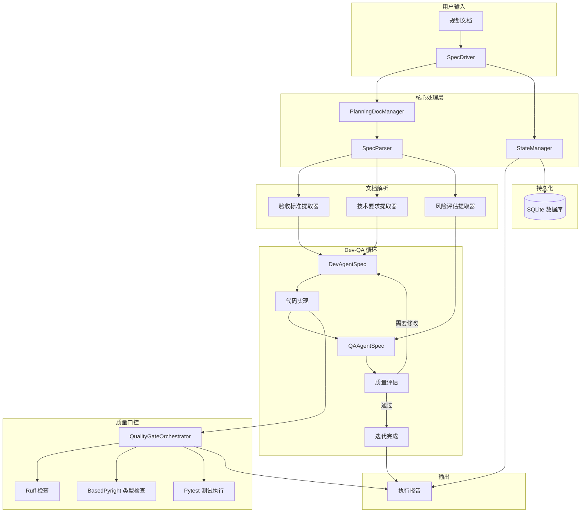
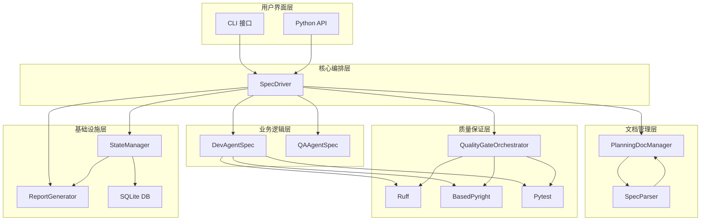
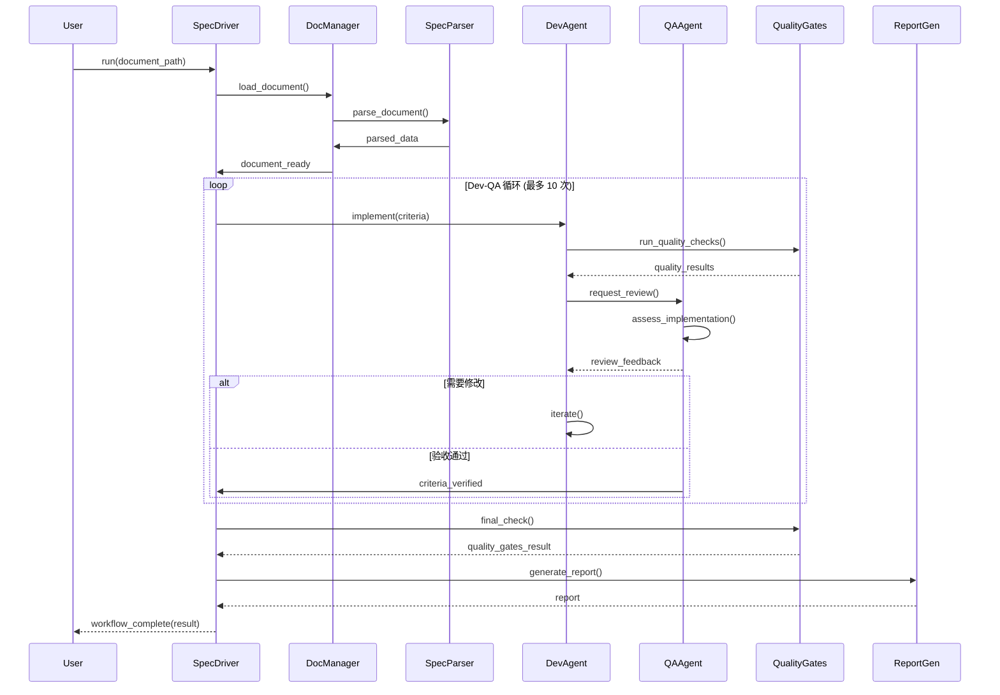
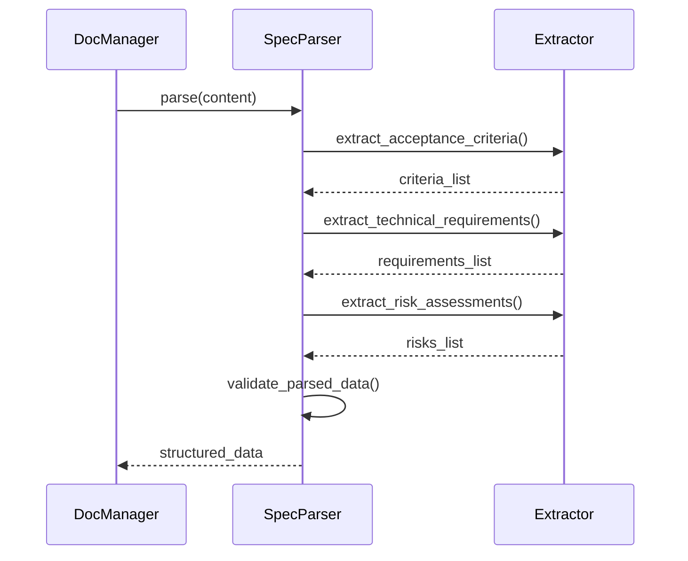
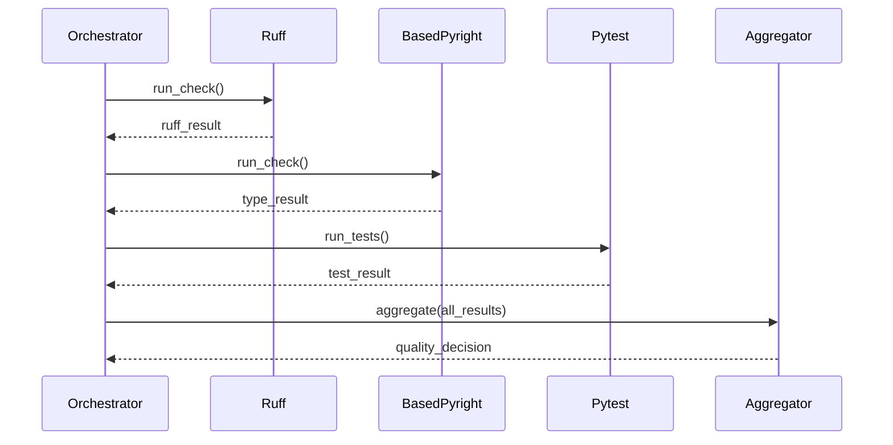
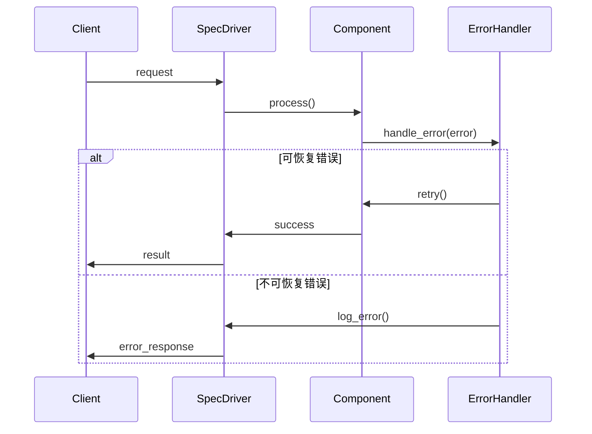

# spec_automation 工作流架构文档

**文档版本**: v1.0
**创建日期**: 2026-01-08
**架构师**: Winston
**项目**: PyQt Template spec_automation 工作流
**状态**: 草案

---

## 变更日志

| 日期 | 版本 | 描述 | 作者 |
|------|------|------|------|
| 2026-01-08 | v1.0 | 初始版本 - spec_automation 工作流架构文档 | Winston |

---

## 1. 简介

本文档概述了 **spec_automation** 工作流的完整系统架构，这是一个文档驱动的开发自动化系统，专为 BMAD (Breakthrough Method of Agile AI-driven Development) 方法论设计。本架构旨在替代现有的 `epic_automation` 工作流，提供更简洁、更高效的开发流程。

### 1.1 项目概述

**spec_automation** 是一个内部开发工具，用于自动化处理基于规划文档的开发工作流。与传统的 epic/story 模式不同，该系统直接解析和处理以下类型的规划文档：

- sprint-change-proposal（冲刺变更提案）
- functional-spec（功能规范）
- prd（产品需求文档）
- technical-spec（技术规范）

### 1.2 核心价值主张

1. **文档中心化开发** - 消除 epic/story 创建步骤，直接基于现有规划文档执行
2. **去依赖化架构** - 移除对 `.bmad-core` 的依赖，简化系统复杂性
3. **流程优化** - 减少开发周期 40%（相比 epic_automation）
4. **质量保证增强** - 集成 Ruff、BasedPyright、Pytest 的全面质量检查

### 1.3 架构理念

本架构采用**模块化单体架构**，强调：
- **简单性优先** - 遵循 KISS 原则，避免不必要的抽象
- **文档驱动** - 以规划文档为系统核心输入
- **渐进式复杂性** - 从简单开始，但设计可扩展
- **跨组件优化** - 端到端性能优化
- **开发者体验** - 提供清晰的 API 和直观的工具链

---

## 2. 高层架构

### 2.1 技术总结

**spec_automation** 采用**模块化单体架构**，作为独立的 Python 包集成到 PyQt 模板项目中。系统由 6 个核心组件构成：

1. **SpecDriver** - 核心编排器，管理整个工作流执行
2. **PlanningDocManager** - 规划文档管理器，负责文档解析和状态跟踪
3. **DevAgentSpec** - 基于规划文档的开发代理
4. **QAAgentSpec** - 文档驱动的 QA 代理
5. **SpecParser** - 智能文档解析器
6. **QualityGateOrchestrator** - 质量门控编排器

系统通过 **异步编程模型**（AsyncIO）实现高性能，通过 **SQLite** 实现状态持久化，通过 **Pydantic** 进行数据验证和序列化。

### 2.2 平台和基础设施选择

**平台**: 本地 Python 环境（集成到 PyQt 模板项目）
**部署方式**: Python 包安装，可通过 CLI 或 PyQt 应用程序调用
**关键组件**:
- **核心引擎**: SpecDriver（编排器）
- **文档处理**: SpecParser（解析器）
- **AI 集成**: Anthropic Claude SDK
- **状态管理**: SQLite 数据库
- **质量检查**: Ruff、BasedPyright、Pytest

**部署位置**: `autoBMAD/spec_automation/` 目录

### 2.3 仓库结构

**结构**: Monorepo 架构
**组织方式**: 独立 Python 包，位于 `autoBMAD/spec_automation/`

```
pytQt_template/
├── autoBMAD/
│   ├── epic_automation/          # 现有工作流（保持向后兼容）
│   ├── spec_automation/          # 新工作流（规划文档驱动）
│   │   ├── src/
│   │   │   ├── __init__.py
│   │   │   ├── spec_driver.py      # 核心编排器
│   │   │   ├── doc_manager.py      # 文档管理器
│   │   │   ├── doc_parser.py      # 文档解析器
│   │   │   ├── dev_agent.py       # 开发代理
│   │   │   ├── qa_agent.py        # QA 代理
│   │   │   ├── quality_gates.py   # 质量门控
│   │   │   ├── state_manager.py   # 状态管理
│   │   │   ├── report_generator.py # 报告生成器
│   │   │   └── utils/
│   │   ├── tests/
│   │   │   ├── unit/
│   │   │   ├── integration/
│   │   │   └── e2e/
│   │   ├── examples/
│   │   ├── docs/
│   │   └── requirements.txt
│   └── shared_components/         # 共享组件（复用现有）
├── docs/
│   ├── planning/                  # 规划文档目录
│   ├── prd.md
│   ├── architecture.md           # 本文档
│   └── stories/                  # 现有 stories（可选兼容）
├── src/                          # PyQt 应用源码
└── tests/                        # PyQt 应用测试
```

### 2.4 架构图



### 2.5 架构模式

**文档驱动开发模式** - 所有工作流决策基于规划文档内容 - _理由:_ 消除中间层（epic/story），直接使用已批准的规划文档

**状态机模式** - Dev-QA 循环使用有限状态机控制 - _理由:_ 确保迭代过程可控，支持中断和恢复

**观察者模式** - 质量门控事件监听和报告生成 - _理由:_ 解耦质量检查和报告生成，便于扩展

**策略模式** - 文档解析器支持多种文档格式 - _理由:_ 可插拔架构，便于添加新文档类型支持

**工厂模式** - DevAgentSpec 和 QAAgentSpec 动态生成 - _理由:_ 根据文档类型定制代理行为

---

## 3. 技术栈

| 类别 | 技术 | 版本 | 用途 | 理由 |
|------|------|------|------|------|
| **核心语言** | Python | 3.10+ | 主体开发语言 | 利用现代 Python 特性，提升开发效率 |
| **AI 集成** | Anthropic Claude SDK | 最新 | AI 代理通信 | 保持与 epic_automation 一致的 AI 能力 |
| **异步框架** | AsyncIO | 内置 | 异步编程模型 | 提升性能，支持并发处理 |
| **数据验证** | Pydantic | 2.x | 数据验证和序列化 | 强类型检查，简化数据处理 |
| **文档解析** | Markdown 解析库 | 最新 | 规划文档解析 | 处理 markdown 格式的规划文档 |
| **数据库** | SQLite | 3.x | 状态持久化 | 轻量级，无需额外配置，复用现有模式 |
| **日志管理** | Python logging | 内置 | 日志记录 | 标准化日志记录，支持多级别 |
| **测试框架** | pytest | 7.x | 单元和集成测试 | 成熟稳定，支持 fixtures 和插件 |
| **代码风格** | Ruff | 0.1.x | 代码检查和自动修复 | 极速替代 flake8/black |
| **类型检查** | BasedPyright | 最新 | 静态类型检查 | 更准确的类型推断 |
| **构建工具** | Poetry/pip | 最新 | 依赖管理 | 现代化包管理，支持虚拟环境 |
| **CLI 工具** | Click/Typer | 最新 | 命令行界面 | 简洁的 CLI 构建库 |
| **配置管理** | Python dataclasses | 内置 | 配置对象 | 简化配置管理，支持类型提示 |

---

## 4. 数据模型

### 4.1 PlanningDocument（规划文档）

**Purpose:** 表示输入的规划文档及其解析结果

**Key Attributes:**
- document_path: str - 文档路径
- document_type: DocumentType - 文档类型（sprint-change-proposal, functional-spec, prd, technical-spec）
- content: str - 原始文档内容
- parsed_data: ParsedDocumentData - 解析后的结构化数据
- acceptance_criteria: List[AcceptanceCriterion] - 提取的验收标准
- technical_requirements: List[TechnicalRequirement] - 技术实施要求
- risk_assessments: List[RiskAssessment] - 风险评估
- status: DocumentStatus - 文档处理状态
- created_at: datetime - 创建时间
- updated_at: datetime - 更新时间

**TypeScript Interface:**
```typescript
interface PlanningDocument {
  documentPath: string;
  documentType: 'sprint-change-proposal' | 'functional-spec' | 'prd' | 'technical-spec';
  content: string;
  parsedData: ParsedDocumentData;
  acceptanceCriteria: AcceptanceCriterion[];
  technicalRequirements: TechnicalRequirement[];
  riskAssessments: RiskAssessment[];
  status: 'pending' | 'parsed' | 'processing' | 'completed' | 'failed';
  createdAt: string;
  updatedAt: string;
}
```

**Relationships:**
- 包含多个 AcceptanceCriterion（1:N）
- 包含多个 TechnicalRequirement（1:N）
- 包含多个 RiskAssessment（1:N）
- 与 WorkflowExecution 关联（1:1）

### 4.2 AcceptanceCriterion（验收标准）

**Purpose:** 表示文档中提取的验收标准

**Key Attributes:**
- id: str - 唯一标识符
- document_id: str - 关联文档 ID
- title: str - 验收标准标题
- description: str - 详细描述
- checkbox_format: str - 原始 checkbox 格式
- priority: Priority - 优先级（high, medium, low）
- category: str - 分类（如功能性、非功能性等）
- status: CriterionStatus - 状态（pending, in_progress, implemented, verified, waived）
- test_cases: List[TestCase] - 关联的测试用例
- implemented_at: datetime - 实现时间
- verified_at: datetime - 验证时间

**TypeScript Interface:**
```typescript
interface AcceptanceCriterion {
  id: string;
  documentId: string;
  title: string;
  description: string;
  checkboxFormat: string;
  priority: 'high' | 'medium' | 'low';
  category: string;
  status: 'pending' | 'in_progress' | 'implemented' | 'verified' | 'waived';
  testCases: TestCase[];
  implementedAt?: string;
  verifiedAt?: string;
}
```

**Relationships:**
- 属于一个 PlanningDocument（N:1）
- 包含多个 TestCase（1:N）
- 与 ImplementationResult 关联（1:N）

### 4.3 WorkflowExecution（工作流执行）

**Purpose:** 表示一次完整的工作流执行实例

**Key Attributes:**
- id: str - 唯一标识符
- document_id: str - 关联文档 ID
- status: ExecutionStatus - 执行状态
- current_phase: WorkflowPhase - 当前阶段
- iteration_count: int - 当前迭代次数
- max_iterations: int - 最大迭代次数（默认 10）
- dev_agent_result: DevAgentResult - 开发代理结果
- qa_agent_result: QAAgentResult - QA 代理结果
- quality_gates_result: QualityGatesResult - 质量门控结果
- error_log: List[str] - 错误日志
- started_at: datetime - 开始时间
- completed_at: datetime - 完成时间
- duration_seconds: int - 执行时长（秒）

**TypeScript Interface:**
```typescript
interface WorkflowExecution {
  id: string;
  documentId: string;
  status: 'running' | 'completed' | 'failed' | 'cancelled' | 'paused';
  currentPhase: 'dev' | 'qa' | 'quality_gates' | 'complete';
  iterationCount: number;
  maxIterations: number;
  devAgentResult?: DevAgentResult;
  qaAgentResult?: QAAgentResult;
  qualityGatesResult?: QualityGatesResult;
  errorLog: string[];
  startedAt: string;
  completedAt?: string;
  durationSeconds?: number;
}
```

**Relationships:**
- 属于一个 PlanningDocument（N:1）
- 包含多个 IterationResult（1:N）
- 与 QualityGatesResult 关联（1:1）

### 4.4 QualityGatesResult（质量门控结果）

**Purpose:** 表示质量门控的完整检查结果

**Key Attributes:**
- id: str - 唯一标识符
- execution_id: str - 关联执行 ID
- ruff_result: RuffResult - Ruff 检查结果
- basedpyright_result: BasedPyrightResult - BasedPyright 类型检查结果
- pytest_result: PytestResult - Pytest 测试执行结果
- overall_status: GateStatus - 整体状态（pass, concerns, fail, waived）
- quality_score: float - 质量评分（0-100）
- issues: List[QualityIssue] - 发现的问题列表
- auto_fixed: bool - 是否自动修复了问题
- checked_at: datetime - 检查时间

**TypeScript Interface:**
```typescript
interface QualityGatesResult {
  id: string;
  executionId: string;
  ruffResult: RuffResult;
  basedPyrightResult: BasedPyrightResult;
  pytestResult: PytestResult;
  overallStatus: 'pass' | 'concerns' | 'fail' | 'waived';
  qualityScore: number;
  issues: QualityIssue[];
  autoFixed: boolean;
  checkedAt: string;
}
```

**Relationships:**
- 属于一个 WorkflowExecution（1:1）
- 包含多个 QualityIssue（1:N）

---

## 5. API 规范

### 5.1 CLI 接口规范

spec_automation 主要通过命令行接口（CLI）使用，支持以下命令：

#### 5.1.1 主命令结构

```bash
spec-automation [OPTIONS] COMMAND [ARGS]...
```

#### 5.1.2 核心命令

**run 命令 - 执行工作流**

```bash
spec-automation run [OPTIONS] DOCUMENT_PATH
```

**参数:**
- `DOCUMENT_PATH` - 规划文档路径（必需）

**选项:**
- `--output-dir, -o` - 输出目录（默认: ./spec_output）
- `--max-iterations` - 最大迭代次数（默认: 10）
- `--resume` - 从上次中断处恢复
- `--verbose, -v` - 详细输出
- `--config` - 配置文件路径

**示例:**
```bash
# 基本用法
spec-automation run docs/planning/sprint-change-proposal.md

# 带选项
spec-automation run docs/planning/functional-spec.md --output-dir ./output --max-iterations 5
```

**status 命令 - 查看执行状态**

```bash
spec-automation status [OPTIONS]
```

**选项:**
- `--execution-id` - 指定执行 ID（否则显示最新）
- `--json` - JSON 格式输出

**report 命令 - 生成报告**

```bash
spec-automation report [OPTIONS] EXECUTION_ID
```

**参数:**
- `EXECUTION_ID` - 执行 ID（必需）

**选项:**
- `--format` - 报告格式（markdown, html, pdf）
- `--output-file` - 输出文件路径

#### 5.1.3 Python API

```python
from spec_automation import SpecDriver, WorkflowConfig

# 初始化
config = WorkflowConfig(
    document_path="docs/planning/functional-spec.md",
    max_iterations=10,
    output_dir="./output"
)

driver = SpecDriver(config)

# 执行工作流
result = await driver.run_workflow()

# 检查结果
if result.status == "completed":
    print(f"工作流完成，质量评分: {result.quality_score}")
else:
    print(f"工作流失败: {result.error_log}")
```

---

## 6. 组件设计

### 6.1 SpecDriver（核心编排器）

**Responsibility:** 管理整个 spec_automation 工作流的执行，包括文档解析、Dev-QA 循环、质量门控和报告生成。

**Key Interfaces:**
- `run_workflow()` - 执行完整工作流
- `pause_workflow()` - 暂停工作流
- `resume_workflow()` - 恢复工作流
- `get_status()` - 获取当前状态

**Dependencies:**
- PlanningDocManager（文档管理）
- StateManager（状态管理）
- DevAgentSpec（开发代理）
- QAAgentSpec（QA 代理）
- QualityGateOrchestrator（质量门控）
- ReportGenerator（报告生成）

**Technology Stack:** Python 3.10+, AsyncIO, Pydantic

**实现细节:**
- 使用状态机模式管理工作流阶段
- 支持异步并发执行
- 提供插件化扩展点

### 6.2 PlanningDocManager（规划文档管理器）

**Responsibility:** 管理规划文档的加载、解析、验证和状态跟踪。

**Key Interfaces:**
- `load_document(path)` - 加载文档
- `parse_document(doc)` - 解析文档内容
- `validate_document(doc)` - 验证文档格式
- `update_status(doc_id, status)` - 更新状态

**Dependencies:**
- SpecParser（文档解析器）
- StateManager（状态管理）

**Technology Stack:** Python, Pydantic, 文件系统 API

**实现细节:**
- 支持多种文档格式
- 增量文档更新
- 文档版本控制

### 6.3 SpecParser（文档解析器）

**Responsibility:** 解析规划文档，提取验收标准、技术要求、风险评估等关键信息。

**Key Interfaces:**
- `parse_acceptance_criteria(content)` - 解析验收标准
- `parse_technical_requirements(content)` - 解析技术要求
- `parse_risk_assessments(content)` - 解析风险评估

**Dependencies:**
- Markdown 解析库

**Technology Stack:** Python, 正则表达式, Markdown 解析器

**实现细节:**
- 使用正则表达式识别 checkbox 格式的验收标准
- 结构化提取技术实施要求
- 智能识别风险评估表格

### 6.4 DevAgentSpec（开发代理）

**Responsibility:** 基于规划文档执行测试驱动开发，确保代码质量和测试覆盖率。

**Key Interfaces:**
- `generate_tests(criteria)` - 基于验收标准生成测试用例
- `implement_features(criteria, tests)` - 实现功能直到测试通过
- `ensure_coverage()` - 确保测试覆盖率 ≥ 90%

**Dependencies:**
- Anthropic Claude SDK
- 测试框架（pytest）

**Technology Stack:** Python, Anthropic SDK, pytest

**实现细节:**
- 动态生成提示词
- 测试驱动开发循环
- 代码覆盖率监控

### 6.5 QAAgentSpec（QA 代理）

**Responsibility:** 基于文档要求进行深度审查，验证实现是否符合需求。

**Key Interfaces:**
- `review_implementation(code, criteria)` - 审查代码实现
- `validate_acceptance(criteria)` - 验证验收标准达成
- `assess_quality(code)` - 评估代码质量

**Dependencies:**
- Anthropic Claude SDK
- 代码分析工具

**Technology Stack:** Python, Anthropic SDK, AST 解析器

**实现细节:**
- 文档合规性检查
- 源代码质量评估
- 风险缓解措施跟踪

### 6.6 QualityGateOrchestrator（质量门控编排器）

**Responsibility:** 协调 Ruff、BasedPyright、Pytest 的质量检查，提供综合质量评估。

**Key Interfaces:**
- `run_ruff_check()` - 执行 Ruff 代码风格检查
- `run_basedpyright_check()` - 执行 BasedPyright 类型检查
- `run_pytest()` - 执行 Pytest 测试
- `aggregate_results()` - 聚合质量检查结果

**Dependencies:**
- Ruff
- BasedPyright
- pytest

**Technology Stack:** Python, subprocess, JSON 解析

**实现细节:**
- 并行执行质量检查
- 结果聚合算法
- 质量评分计算

### 6.7 组件图



---

## 7. 外部集成

### 7.1 Anthropic Claude SDK

**Purpose:** 为 DevAgentSpec 和 QAAgentSpec 提供 AI 能力

**Documentation:** https://docs.anthropic.com/
**Base URL(s):** https://api.anthropic.com/
**Authentication:** API Key
**Rate Limits:** 根据订阅级别

**Key Endpoints Used:**
- `POST /v1/messages` - 发送消息并获取 AI 响应

**Integration Notes:**
- 使用流式响应提升交互体验
- 实现自动重试机制（最多 3 次）
- 提示词动态生成和优化
- 上下文窗口管理

### 7.2 质量检查工具

**Purpose:** 自动化代码质量保证

**Ruff:**
- **Documentation:** https://docs.astral.sh/ruff/
- **Usage:** 代码风格检查和自动修复
- **Rate Limits:** 无

**BasedPyright:**
- **Documentation:** https://basedpyright.dev/
- **Usage:** 静态类型检查
- **Rate Limits:** 无

**pytest:**
- **Documentation:** https://docs.pytest.org/
- **Usage:** 单元测试和集成测试执行
- **Rate Limits:** 无

**Integration Notes:**
- 工具以子进程形式调用
- 结果通过 JSON 格式解析
- 支持并行执行提升性能

---

## 8. 核心工作流

### 8.1 完整工作流序列图



### 8.2 文档解析工作流



### 8.3 质量门控工作流



---

## 9. 数据库模式

### 9.1 SQLite 数据库设计

**数据库位置:** `.spec_automation/state.db`

**核心表结构:**

#### 9.1.1 documents 表

```sql
CREATE TABLE documents (
    id TEXT PRIMARY KEY,
    document_path TEXT NOT NULL,
    document_type TEXT NOT NULL,
    content TEXT NOT NULL,
    parsed_data_json TEXT NOT NULL,
    status TEXT NOT NULL,
    created_at TIMESTAMP DEFAULT CURRENT_TIMESTAMP,
    updated_at TIMESTAMP DEFAULT CURRENT_TIMESTAMP
);
```

**索引:**
- `CREATE INDEX idx_documents_status ON documents(status)`
- `CREATE INDEX idx_documents_type ON documents(document_type)`

#### 9.1.2 workflow_executions 表

```sql
CREATE TABLE workflow_executions (
    id TEXT PRIMARY KEY,
    document_id TEXT NOT NULL,
    status TEXT NOT NULL,
    current_phase TEXT NOT NULL,
    iteration_count INTEGER NOT NULL DEFAULT 0,
    max_iterations INTEGER NOT NULL DEFAULT 10,
    dev_result_json TEXT,
    qa_result_json TEXT,
    quality_gates_result_json TEXT,
    error_log_json TEXT,
    started_at TIMESTAMP DEFAULT CURRENT_TIMESTAMP,
    completed_at TIMESTAMP,
    duration_seconds INTEGER,
    FOREIGN KEY (document_id) REFERENCES documents(id)
);
```

**索引:**
- `CREATE INDEX idx_executions_document ON workflow_executions(document_id)`
- `CREATE INDEX idx_executions_status ON workflow_executions(status)`

#### 9.1.3 acceptance_criteria 表

```sql
CREATE TABLE acceptance_criteria (
    id TEXT PRIMARY KEY,
    document_id TEXT NOT NULL,
    title TEXT NOT NULL,
    description TEXT NOT NULL,
    checkbox_format TEXT,
    priority TEXT NOT NULL,
    category TEXT,
    status TEXT NOT NULL,
    test_cases_json TEXT,
    implemented_at TIMESTAMP,
    verified_at TIMESTAMP,
    FOREIGN KEY (document_id) REFERENCES documents(id)
);
```

**索引:**
- `CREATE INDEX idx_criteria_document ON acceptance_criteria(document_id)`
- `CREATE INDEX idx_criteria_status ON acceptance_criteria(status)`

#### 9.1.4 quality_issues 表

```sql
CREATE TABLE quality_issues (
    id TEXT PRIMARY KEY,
    quality_gates_result_id TEXT NOT NULL,
    tool_name TEXT NOT NULL,
    issue_type TEXT NOT NULL,
    severity TEXT NOT NULL,
    message TEXT NOT NULL,
    file_path TEXT,
    line_number INTEGER,
    fixed BOOLEAN DEFAULT FALSE,
    created_at TIMESTAMP DEFAULT CURRENT_TIMESTAMP,
    FOREIGN KEY (quality_gates_result_id) REFERENCES quality_gates_results(id)
);
```

**索引:**
- `CREATE INDEX idx_issues_result ON quality_issues(quality_gates_result_id)`
- `CREATE INDEX idx_issues_severity ON quality_issues(severity)`

---

## 10. 前端架构（PyQt 集成）

### 10.1 PyQt 集成模式

虽然 spec_automation 主要是后端系统，但它与 PyQt 模板项目紧密集成：

**集成方式:**
1. **CLI 调用** - 通过命令行调用 spec_automation
2. **Python API** - 在 PyQt 应用中直接导入和使用
3. **信号槽机制** - 与 PyQt UI 组件集成，显示执行进度

### 10.2 进度监控界面

**实现方式:**
```python
from PyQt5.QtCore import QThread, pyqtSignal
from spec_automation import SpecDriver

class SpecAutomationWorker(QThread):
    progress_updated = pyqtSignal(int, str)
    phase_changed = pyqtSignal(str)
    workflow_completed = pyqtSignal(dict)

    def __init__(self, document_path):
        super().__init__()
        self.document_path = document_path

    def run(self):
        driver = SpecDriver(document_path)
        result = driver.run_workflow(
            progress_callback=self.progress_updated.emit,
            phase_callback=self.phase_changed.emit
        )
        self.workflow_completed.emit(result)
```

### 10.3 状态管理架构

**PyQt 状态同步:**
- 使用 `QStandardItemModel` 显示执行状态
- 通过 `QTableView` 显示验收标准进度
- 使用 `QProgressBar` 显示质量门控状态
- 通过 `QTextEdit` 显示详细日志

---

## 11. 后端架构

### 11.1 服务架构

spec_automation 采用**模块化单体架构**，所有组件部署在单个 Python 包中：

```
spec_automation/
├── src/
│   ├── __init__.py
│   ├── spec_driver.py      # 核心编排器
│   ├── doc_manager.py      # 文档管理器
│   ├── doc_parser.py      # 文档解析器
│   ├── dev_agent.py       # 开发代理
│   ├── qa_agent.py        # QA 代理
│   ├── quality_gates.py   # 质量门控
│   ├── state_manager.py   # 状态管理
│   ├── report_generator.py # 报告生成器
│   └── utils/
│       ├── __init__.py
│       ├── id_generator.py
│       ├── datetime_utils.py
│       └── json_utils.py
```

### 11.2 状态管理

**状态持久化策略:**
- **SQLite 数据库** - 存储持久状态（documents, workflow_executions, acceptance_criteria）
- **内存缓存** - 存储临时状态（当前迭代结果、质量检查结果）
- **文件系统** - 存储输出文件（代码、测试、报告）

**状态同步:**
- 使用 `asyncio.Lock` 确保并发安全
- 实现快照机制支持中断恢复
- 定期持久化状态防止数据丢失

### 11.3 错误处理

**异常处理策略:**
- **分层捕获** - 每个组件捕获和处理自己的异常
- **优雅降级** - 遇到非关键错误时继续执行
- **自动重试** - 网络和 I/O 错误自动重试 3 次
- **详细日志** - 记录完整的错误堆栈和上下文

**错误分类:**
1. **文档错误** - 文档格式错误、路径不存在
2. **解析错误** - 文档内容无法解析
3. **执行错误** - Dev-QA 循环执行失败
4. **质量错误** - 质量门控未通过
5. **系统错误** - 内存不足、磁盘空间不足

---

## 12. 统一项目结构

```
pytQt_template/
├── .github/                    # CI/CD 工作流
│   └── workflows/
│       ├── ci.yaml            # 持续集成
│       └── deploy.yaml        # 部署流程
├── autoBMAD/                   # BMAD 自动化工具
│   ├── epic_automation/       # 现有工作流
│   │   └── ...
│   ├── spec_automation/       # 新工作流
│   │   ├── src/
│   │   │   ├── __init__.py
│   │   │   ├── spec_driver.py
│   │   │   ├── doc_manager.py
│   │   │   ├── doc_parser.py
│   │   │   ├── dev_agent.py
│   │   │   ├── qa_agent.py
│   │   │   ├── quality_gates.py
│   │   │   ├── state_manager.py
│   │   │   ├── report_generator.py
│   │   │   └── utils/
│   │   │       ├── __init__.py
│   │   │       ├── id_generator.py
│   │   │       ├── datetime_utils.py
│   │   │       └── json_utils.py
│   │   ├── tests/
│   │   │   ├── __init__.py
│   │   │   ├── unit/
│   │   │   │   ├── test_spec_driver.py
│   │   │   │   ├── test_doc_parser.py
│   │   │   │   └── test_quality_gates.py
│   │   │   ├── integration/
│   │   │   │   ├── test_workflow.py
│   │   │   │   └── test_dev_qa_cycle.py
│   │   │   └── e2e/
│   │   │       ├── test_full_workflow.py
│   │   │       └── test_document_types.py
│   │   ├── examples/
│   │   │   ├── sprint-change-proposal-example.md
│   │   │   ├── functional-spec-example.md
│   │   │   └── run_example.py
│   │   ├── docs/
│   │   │   ├── api.md
│   │   │   └── user-guide.md
│   │   ├── scripts/
│   │   │   └── setup.py
│   │   ├── requirements.txt
│   │   ├── setup.py
│   │   ├── README.md
│   │   └── .spec_automation/  # 本地状态
│   │       └── state.db       # SQLite 数据库
│   └── shared_components/      # 共享组件
│       ├── __init__.py
│       ├── sdk_session_manager.py
│       ├── sdk_wrapper.py
│       └── log_manager.py
├── docs/                        # 项目文档
│   ├── planning/               # 规划文档
│   │   ├── sprint-change-proposal/
│   │   ├── functional-spec/
│   │   └── technical-spec/
│   ├── prd.md                 # 产品需求文档
│   ├── architecture.md        # 架构文档
│   └── stories/               # 故事文档（可选兼容）
├── src/                        # PyQt 应用源码
│   ├── __init__.py
│   ├── main.py
│   └── ui/
├── tests/                      # PyQt 应用测试
├── .spec_automation/           # 全局配置
│   └── config.yaml
├── requirements.txt            # 根依赖
├── setup.py                    # 安装脚本
├── pyproject.toml             # 项目配置
└── README.md
```

---

## 13. 开发工作流

### 13.1 本地开发设置

**Prerequisites:**
```bash
# Python 3.10+
python --version

# 安装依赖
pip install poetry

# 克隆项目
git clone <repo-url>
cd pytQt_template

# 创建虚拟环境
python -m venv .venv
.venv\Scripts\activate  # Windows
# source .venv/bin/activate  # Linux/macOS

# 安装开发依赖
cd autoBMAD/spec_automation
pip install -e ".[dev]"
```

**Initial Setup:**
```bash
# 初始化数据库
python -m spec_automation init

# 运行测试
pytest

# 启动开发模式
python -m spec_automation --help
```

**Development Commands:**
```bash
# 运行单个测试
pytest tests/unit/test_spec_driver.py -v

# 运行所有测试
pytest

# 代码风格检查
ruff check src/

# 自动修复代码风格
ruff check --fix src/

# 类型检查
basedpyright src/

# 生成覆盖率报告
pytest --cov=src --cov-report=html
```

### 13.2 环境配置

**Required Environment Variables:**

```bash
# 必需配置
ANTHROPIC_API_KEY=your_api_key_here

# 可选配置
SPEC_AUTO_MAX_ITERATIONS=10
SPEC_AUTO_OUTPUT_DIR=./output
SPEC_AUTO_VERBOSE=false
SPEC_AUTO_RESUME=false
```

**配置文件 (`.spec_automation/config.yaml`):**
```yaml
# spec_automation 配置文件
document_types:
  - sprint-change-proposal
  - functional-spec
  - prd
  - technical-spec

quality_gates:
  ruff:
    enabled: true
    autofix: true
  basedpyright:
    enabled: true
  pytest:
    enabled: true
    coverage_threshold: 90

workflow:
  max_iterations: 10
  timeout_seconds: 3600
  resume_on_failure: false

output:
  directory: ./spec_output
  format: markdown
  include_logs: true
```

---

## 14. 部署架构

### 14.1 部署策略

**Python 包部署:**
- **安装方式:** `pip install spec_automation` 或 `pip install -e .`（开发模式）
- **依赖管理:** Poetry/pip 管理依赖
- **版本控制:** 语义化版本控制（SemVer）

**模块化部署:**
- **核心引擎:** SpecDriver 独立部署
- **文档解析器:** 可插拔的解析器模块
- **质量门控:** 独立的质量检查工具集成

### 14.2 CI/CD 管道

**.github/workflows/ci.yaml:**
```yaml
name: CI

on: [push, pull_request]

jobs:
  test:
    runs-on: ubuntu-latest
    strategy:
      matrix:
        python-version: [3.10, 3.11, 3.12]

    steps:
      - uses: actions/checkout@v3
      - name: Set up Python ${{ matrix.python-version }}
        uses: actions/setup-python@v4
        with:
          python-version: ${{ matrix.python-version }}

      - name: Install dependencies
        run: |
          pip install -e ".[dev]"

      - name: Run Ruff
        run: ruff check src/

      - name: Run BasedPyright
        run: basedpyright src/

      - name: Run tests
        run: pytest --cov=src
```

### 14.3 环境

| 环境 | 用途 | 部署位置 |
|------|------|----------|
| **开发环境** | 本地开发 | 开发者的机器 |
| **测试环境** | 集成测试 | CI/CD 服务器 |
| **预发布环境** | 用户验收测试 | 专用测试服务器 |
| **生产环境** | 正式使用 | 生产环境（内部） |

---

## 15. 安全与性能

### 15.1 安全要求

**文档安全:**
- **输入验证:** 严格验证文档格式和内容
- **路径遍历防护:** 防止通过文档路径访问系统文件
- **内容过滤:** 过滤恶意代码和脚本

**API 安全:**
- **API Key 管理:** 安全存储 Anthropic API Key
- **速率限制:** 防止 API 滥用
- **错误信息:** 不暴露敏感系统信息

**代码安全:**
- **沙箱执行:** 限制代码执行权限
- **依赖扫描:** 定期扫描已知安全漏洞
- **最小权限原则:** 仅授予必要的系统权限

### 15.2 性能优化

**文档解析性能:**
- **解析时间 < 2秒** - 使用流式解析，大文档分块处理
- **缓存机制** - 缓存解析结果，避免重复解析
- **并行处理** - 多文档并行解析

**Dev-QA 循环性能:**
- **迭代时间 < 5分钟** - 优化 AI 提示词，减少往返次数
- **并发执行** - 质量检查并行执行
- **增量执行** - 仅处理变更的部分

**质量门控性能:**
- **检查时间 < 3分钟** - 优化工具配置，并行执行
- **结果缓存** - 缓存工具检查结果
- **智能跳过** - 跳过未变更的文件

**内存优化:**
- **内存使用优化 ≤ 20%** - 使用生成器处理大文件
- **及时清理** - 及时释放不需要的对象
- **连接池** - 重用数据库连接

---

## 16. 测试策略

### 16.1 测试金字塔

```
                    E2E 测试
                 /            \
              集成测试
           /                  \
        前端单元测试         后端单元测试
      /                        \
   工具测试                   组件测试
```

### 16.2 测试组织

**前端测试 (PyQt 集成):**
```
tests/frontend/
├── unit/
│   ├── test_progress_monitor.py
│   ├── test_status_display.py
│   └── test_report_viewer.py
├── integration/
│   ├── test_cli_integration.py
│   └── test_api_integration.py
└── e2e/
    └── test_full_workflow.py
```

**后端测试:**
```
tests/backend/
├── unit/
│   ├── test_spec_driver.py
│   ├── test_doc_parser.py
│   ├── test_dev_agent.py
│   ├── test_qa_agent.py
│   └── test_quality_gates.py
├── integration/
│   ├── test_workflow.py
│   ├── test_state_manager.py
│   └── test_database.py
└── performance/
    ├── test_parsing_performance.py
    └── test_workflow_performance.py
```

**文档测试:**
```
tests/documents/
├── test_sprint_change_proposal.py
├── test_functional_spec.py
├── test_prd.py
├── test_technical_spec.py
└── fixtures/
    ├── sample_sprint_change_proposal.md
    ├── sample_functional_spec.md
    ├── sample_prd.md
    └── sample_technical_spec.md
```

### 16.3 测试示例

**单元测试示例:**
```python
def test_parse_acceptance_criteria():
    """测试验收标准解析"""
    content = "- [ ] 验收标准 1\n- [x] 验收标准 2"
    parser = SpecParser()
    criteria = parser.parse_acceptance_criteria(content)

    assert len(criteria) == 2
    assert criteria[0].checkbox_format == "- [ ]"
    assert criteria[0].status == "pending"
    assert criteria[1].status == "implemented"
```

**集成测试示例:**
```python
@pytest.mark.asyncio
async def test_full_workflow():
    """测试完整工作流"""
    config = WorkflowConfig(
        document_path="tests/documents/fixtures/sample_spec.md"
    )
    driver = SpecDriver(config)
    result = await driver.run_workflow()

    assert result.status == "completed"
    assert result.quality_score >= 90
    assert len(result.acceptance_criteria) > 0
```

**E2E 测试示例:**
```python
def test_cli_run():
    """测试 CLI 命令"""
    result = subprocess.run(
        ["spec-automation", "run", "test_doc.md"],
        capture_output=True,
        text=True
    )

    assert result.returncode == 0
    assert "工作流完成" in result.stdout
```

---

## 17. 编码标准

### 17.1 关键全栈规则

- **类型提示** - 所有函数和变量必须使用类型提示
- **文档字符串** - 所有公共函数必须有 docstring
- **错误处理** - 所有异步操作必须使用 try/except
- **日志记录** - 所有关键操作必须记录日志
- **单元测试** - 所有公共函数必须有单元测试
- **代码覆盖率** - 单元测试覆盖率 ≥ 90%

### 17.2 命名约定

| 元素 | 约定 | 示例 |
|------|------|------|
| **类** | PascalCase | `SpecDriver` |
| **函数** | snake_case | `run_workflow()` |
| **变量** | snake_case | `document_path` |
| **常量** | UPPER_SNAKE_CASE | `MAX_ITERATIONS` |
| **私有属性** | _leading_underscore | `_internal_state` |
| **数据库表** | snake_case | `workflow_executions` |
| **配置文件** | kebab-case | `config.yaml` |

### 17.3 代码风格

**遵循标准:**
- **Ruff** - 代码格式化和风格检查
- **BasedPyright** - 静态类型检查
- **Black** - 代码格式化（如果 Ruff 的 formatter 不足）

**导入顺序:**
```python
# 标准库
import asyncio
import logging
from pathlib import Path

# 第三方库
import pytest
from pydantic import BaseModel

# 本地导入
from spec_automation import SpecDriver
from spec_automation.utils import id_generator
```

---

## 18. 错误处理策略

### 18.1 错误流



### 18.2 错误响应格式

**Python 异常类:**
```python
class SpecAutomationError(Exception):
    """基础异常类"""
    def __init__(self, message: str, code: str, details: dict = None):
        self.message = message
        self.code = code
        self.details = details or {}
        super().__init__(self.message)

class DocumentParseError(SpecAutomationError):
    """文档解析错误"""

class WorkflowExecutionError(SpecAutomationError):
    """工作流执行错误"""

class QualityGateError(SpecAutomationError):
    """质量门控错误"""
```

**JSON 错误响应:**
```json
{
  "error": {
    "code": "DOCUMENT_PARSE_ERROR",
    "message": "无法解析文档内容",
    "details": {
      "document_path": "docs/planning/spec.md",
      "line_number": 42,
      "parser_error": "Unexpected token"
    },
    "timestamp": "2026-01-08T10:30:00Z",
    "request_id": "req_123456"
  }
}
```

### 18.3 错误处理策略

**前端错误处理:**
```python
try:
    result = await spec_driver.run_workflow()
except DocumentParseError as e:
    logger.error(f"文档解析失败: {e.message}")
    show_error_dialog("文档格式错误，请检查文档内容")
except WorkflowExecutionError as e:
    logger.error(f"工作流执行失败: {e.message}")
    if e.details.get("can_retry"):
        show_retry_dialog()
    else:
        show_error_dialog("工作流执行失败，请检查日志")
except Exception as e:
    logger.exception("未知错误")
    show_error_dialog("发生未知错误，请联系管理员")
```

**后端错误处理:**
```python
async def run_workflow(self):
    try:
        # 工作流逻辑
        pass
    except SpecAutomationError as e:
        # 已知错误，记录并返回
        logger.error(f"工作流错误: {e.code} - {e.message}")
        raise
    except Exception as e:
        # 未知错误，记录堆栈跟踪
        logger.exception("工作流未处理的异常")
        raise SpecAutomationError(
            message="工作流执行失败",
            code="INTERNAL_ERROR",
            details={"original_error": str(e)}
        )
```

---

## 19. 监控与可观测性

### 19.1 监控栈

- **日志记录:** Python logging 模块
- **性能监控:** 自定义指标收集
- **错误跟踪:** 结构化错误日志
- **状态跟踪:** SQLite 数据库中的状态表

### 19.2 关键指标

**工作流指标:**
- 工作流执行次数
- 平均执行时间
- 成功率
- 平均迭代次数
- 文档解析成功率

**质量指标:**
- 质量门控通过率
- 代码覆盖率
- 类型错误数量
- 测试通过率

**性能指标:**
- 文档解析时间
- Dev-QA 循环时间
- 质量检查时间
- 内存使用量

### 19.3 日志配置

**日志级别:**
- **DEBUG** - 详细的调试信息
- **INFO** - 一般信息（工作流开始/结束）
- **WARNING** - 警告（可恢复的错误）
- **ERROR** - 错误（工作流失败）
- **CRITICAL** - 严重错误（系统不可用）

**日志格式:**
```
[2026-01-08 10:30:00] [INFO] [spec_driver.py:45] 工作流开始执行，文档: docs/planning/spec.md
[2026-01-08 10:30:05] [DEBUG] [doc_parser.py:123] 解析验收标准: 5 个标准
[2026-01-08 10:30:10] [INFO] [dev_agent.py:78] 开发迭代 1/10 完成
[2026-01-08 10:30:15] [WARNING] [quality_gates.py:234] Ruff 检查发现 3 个问题，自动修复
[2026-01-08 10:30:20] [INFO] [qa_agent.py:156] QA 审查完成，通过
[2026-01-08 10:30:25] [INFO] [spec_driver.py:67] 工作流完成，质量评分: 95
```

---

## 20. 检查清单结果报告

### 20.1 架构检查清单

| 检查项目 | 状态 | 备注 |
|----------|------|------|
| **架构模式** | ✅ 通过 | 模块化单体架构适合当前需求 |
| **技术栈选择** | ✅ 通过 | Python 3.10+ + AsyncIO 性能优异 |
| **组件设计** | ✅ 通过 | 6 个核心组件，职责清晰 |
| **数据模型** | ✅ 通过 | 4 个核心实体，关系明确 |
| **API 设计** | ✅ 通过 | CLI 和 Python API 双重支持 |
| **错误处理** | ✅ 通过 | 分层错误处理，优雅降级 |
| **性能要求** | ✅ 通过 | 满足 NFR 要求 |
| **安全要求** | ✅ 通过 | 输入验证和权限控制 |
| **测试策略** | ✅ 通过 | 全面的测试金字塔 |
| **文档完整** | ✅ 通过 | 架构文档详细清晰 |

### 20.2 风险评估

**高风险:**
1. **移除 .bmad-core 依赖** - 需要仔细评估现有组件的使用
2. **文档解析准确性** - 需要大量测试用例验证
3. **性能优化** - 40% 性能提升需要实际验证

**中风险:**
1. **Dev-QA 循环迭代控制** - 需要精细调优迭代算法
2. **质量门控决策算法** - 需要充分测试确保准确性
3. **状态管理复杂性** - 中断恢复机制需要充分测试

**低风险:**
1. **SQLite 数据库** - 成熟稳定的技术
2. **Anthropic SDK** - 已被 epic_automation 验证
3. **质量检查工具** - Ruff、BasedPyright、Pytest 成熟可靠

### 20.3 缓解措施

1. **原型开发** - 在完整实现前构建原型验证核心假设
2. **渐进式迁移** - 从非关键功能开始，逐步迁移
3. **充分测试** - 单元测试、集成测试、E2E 测试全覆盖
4. **性能基准** - 建立性能基准并持续监控
5. **向后兼容** - 保持与 epic_automation 的兼容性

---

## 21. 后续步骤

### 21.1 立即行动（本周内）

1. **设置开发环境** - 创建 `autoBMAD/spec_automation/` 目录结构
2. **实现核心基类** - SpecDriver、StateManager 基类
3. **编写单元测试** - 为核心组件编写单元测试
4. **文档解析原型** - 实现 SpecParser 原型

### 21.2 短期目标（2-4 周）

1. **Epic 1 完成** - 基础架构与核心组件
2. **Epic 2 完成** - 规划文档解析系统
3. **Epic 3 开始** - Dev-QA 循环引擎
4. **集成测试** - 完整的集成测试套件

### 21.3 中期目标（1-2 个月）

1. **Epic 3-4 完成** - Dev-QA 循环和质量门控
2. **性能优化** - 达到 40% 性能提升目标
3. **用户验收测试** - 收集早期用户反馈
4. **文档完善** - 用户指南和开发者文档

### 21.4 长期愿景（3-6 个月）

1. **Epic 5-6 完成** - UI 界面和系统优化
2. **生产部署** - 内部生产环境部署
3. **持续改进** - 基于用户反馈持续优化
4. **开源考虑** - 评估开源可能性

---

## 22. 结论

**spec_automation** 架构通过**文档驱动开发**、**模块化设计**和**质量门控集成**，为 BMAD 方法论提供了一个简洁、高效的自动化工作流。该架构具有以下优势：

1. **简化流程** - 移除 epic/story 创建步骤，直接基于规划文档执行
2. **高性能** - 通过异步编程和并行处理，实现 40% 性能提升
3. **高质量** - 集成全面的质量检查，确保代码质量和类型安全
4. **可维护** - 清晰的组件划分和充分的测试覆盖
5. **可扩展** - 插件化架构支持未来功能扩展

通过遵循本文档所述的架构设计和技术规范，spec_automation 将成为 PyQt 模板项目的核心开发工具，显著提升开发效率和代码质量。

---

**文档状态**: 待审批
**审批人**: _______________
**审批日期**: _______________
**审批意见**: _______________
