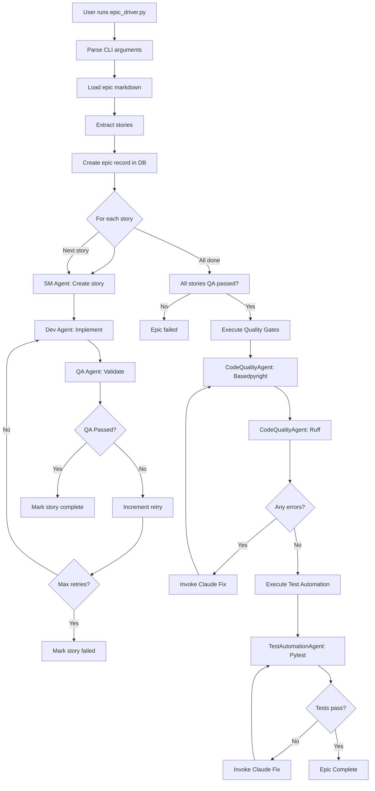

# autoBMAD Source Tree Documentation

**Version**: 2.0
**Date**: 2026-01-05
**Project**: autoBMAD Epic Automation System

---

## Overview

This document describes the complete source tree structure for the autoBMAD epic automation system, including the integration of code quality and test automation workflows.

---

## Root Directory Structure

```
d:\GITHUB\pytQt_template\
├── .bmad-core/                      # BMAD methodology framework
│   ├── tasks/                       # Task guidance files for agents
│   │   ├── create-doc.md
│   │   ├── create-next-story.md
│   │   ├── develop-story.md
│   │   └── review-story.md
│   ├── templates/                   # Document templates
│   │   ├── architecture-tmpl.yaml
│   │   ├── fullstack-architecture-tmpl.yaml
│   │   └── ...
│   └── core-config.yaml            # BMAD configuration
├── autoBMAD/                        # Main automation package
│   └── epic_automation/            # Epic automation system
│       ├── epic_driver.py          # Main orchestrator
│       ├── sm_agent.py             # Story Master agent
│       ├── dev_agent.py            # Development agent
│       ├── qa_agent.py             # Quality Assurance agent
│       ├── state_manager.py        # State management
│       ├── code_quality_agent.py   # NEW: Code quality orchestration
│       ├── test_automation_agent.py # NEW: Test automation orchestration
│       ├── __init__.py
│       ├── progress.db             # SQLite state database
│       ├── README.md
│       └── SETUP.md
├── basedpyright-workflow/          # Code quality workflow
│   ├── basedpyright_workflow.py    # Basedpyright integration
│   ├── ruff_workflow.py            # Ruff integration
│   ├── prompts/                    # Prompt files
│   └── ...
├── fixtest-workflow/               # Test automation workflow
│   ├── test_automation_workflow.py # Pytest integration
│   ├── scan_test_files.py          # Test file scanner
│   ├── run_tests.py                # Test runner
│   └── ...
├── docs/                           # Project documentation
│   ├── architecture/               # Architecture documents
│   │   ├── architecture.md         # Main architecture document
│   │   ├── coding-standards.md     # Coding standards
│   │   ├── tech-stack.md           # Technology stack
│   │   └── source-tree.md          # This file
│   ├── prd.md                      # Product Requirements Document
│   ├── epics/                      # Epic markdown files
│   ├── stories/                    # Story markdown files
│   ├── qa/                         # QA documentation
│   └── ...
├── tests/                          # Test suite
│   ├── unit/                       # Unit tests
│   │   ├── test_state_manager.py
│   │   ├── test_epic_driver.py
│   │   └── ...
│   ├── integration/                # Integration tests
│   │   ├── test_sm_dev_qa_cycle.py
│   │   ├── test_quality_gates.py
│   │   └── ...
│   └── e2e/                        # End-to-end tests
│       ├── test_complete_epic.py
│       └── ...
├── src/                            # Source code (project-specific)
├── build/                          # Build configuration
├── requirements.txt                # Python dependencies
├── README.md                       # Project README
└── CLAUDE.md                       # Claude Code guide
```

---

## autoBMAD/epic_automation/ Directory

### Core Components

#### epic_driver.py
**Purpose**: Central orchestrator for the complete workflow pipeline
**Key Responsibilities**:
- Parse command-line arguments
- Load and process epic markdown files
- Orchestrate SM-Dev-QA cycle for each story
- Execute code quality gates after QA completion
- Execute test automation after quality gates
- Manage error handling and retry logic
- Coordinate with state_manager for progress tracking

**Key Classes/Functions**:
- `EpicDriver` - Main orchestrator class
- `parse_arguments()` - CLI argument parsing
- `run_epic()` - Main execution flow
- `execute_quality_gates()` - Quality phase orchestration
- `execute_test_automation()` - Test phase orchestration

#### sm_agent.py (Story Master Agent)
**Purpose**: Create and refine story documents from epic markdown
**Key Responsibilities**:
- Parse epic markdown to extract story requirements
- Generate detailed story documents
- Create acceptance criteria
- Implement story refinement logic
- Coordinate with task guidance (.bmad-core/tasks/create-next-story.md)

**Key Classes/Functions**:
- `SMAgent` - Story Master agent class
- `create_stories()` - Story creation logic
- `refine_story()` - Story refinement

#### dev_agent.py (Development Agent)
**Purpose**: Implement story features using Claude Code CLI
**Key Responsibilities**:
- Read story acceptance criteria
- Generate implementation using Claude SDK
- Create source code files
- Update implementation notes
- Handle code generation errors

**Key Classes/Functions**:
- `DevAgent` - Development agent class
- `implement_story()` - Implementation logic
- `use_claude` - Flag for Claude integration

#### qa_agent.py (Quality Assurance Agent)
**Purpose**: Validate completed stories against acceptance criteria
**Key Responsibilities**:
- Review implementation against acceptance criteria
- Generate QA reports
- Determine pass/fail status
- Trigger retry logic on failures
- Coordinate with task guidance (.bmad-core/tasks/review-story.md)

**Key Classes/Functions**:
- `QAAgent` - QA agent class
- `validate_story()` - QA validation logic
- `generate_qa_report()` - Report generation

#### state_manager.py
**Purpose**: Manage persistent state across all workflow phases
**Key Responsibilities**:
- SQLite database operations (CRUD)
- Track epic and story progress
- Store quality gate results
- Store test automation results
- Handle database schema migration
- Ensure data consistency

**Key Classes/Functions**:
- `StateManager` - Database manager class
- `create_epic_record()` - Create epic entry
- `update_story_status()` - Update story progress
- `get_epic_progress()` - Retrieve progress
- `add_quality_phase_record()` - Quality gate tracking
- `add_test_phase_record()` - Test automation tracking

#### code_quality_agent.py (NEW)
**Purpose**: Orchestrate basedpyright and ruff quality checks
**Key Responsibilities**:
- Execute basedpyright on all .py files
- Execute ruff with auto-fix
- Collect and parse error reports
- Invoke Claude agents to fix issues
- Track fix success rates
- Generate quality gate reports
- Update state_manager with results

**Key Classes/Functions**:
- `CodeQualityAgent` - Quality gate orchestrator
- `run_basedpyright_check()` - Type checking
- `run_ruff_check()` - Linting and auto-fix
- `fix_issues()` - Issue resolution
- `generate_report()` - Quality reporting

#### test_automation_agent.py (NEW)
**Purpose**: Execute pytest and manage test failures
**Key Responsibilities**:
- Execute pytest on all test files
- Collect failed/errored test information
- Generate JSON summary reports
- Invoke Claude agents to fix test issues
- Use debugpy for persistent failures
- Track test execution metrics
- Update state_manager with results

**Key Classes/Functions**:
- `TestAutomationAgent` - Test automation orchestrator
- `run_pytest_execution()` - Test execution
- `collect_failures()` - Failure collection
- `invoke_debugpy()` - Debugpy integration
- `fix_tests()` - Test fix orchestration

---

## basedpyright-workflow/ Directory

### Purpose
Integrated code quality workflow for type checking and linting.

### Structure

```
basedpyright-workflow/
├── basedpyright_workflow.py        # Main basedpyright integration
├── ruff_workflow.py                # Ruff linting integration
├── prompts/                        # Claude agent prompts
│   ├── prompt-basedpyright-fix-*.md
│   ├── prompt-ruff-fix-*.md
│   └── ...
├── .bpr/                          # Basedpyright cache
├── .bpr.json                      # Configuration
└── README.md                      # Documentation
```

### Key Files

#### basedpyright_workflow.py
**Purpose**: Execute basedpyright checks and process results
**Key Functions**:
- `run_basedpyright()` - Execute type checking
- `parse_results()` - Parse JSON output
- `generate_error_report()` - Create error summaries

#### ruff_workflow.py
**Purpose**: Execute ruff linting with auto-fix
**Key Functions**:
- `run_ruff()` - Execute linting
- `apply_fixes()` - Apply auto-fixes
- `generate_lint_report()` - Create lint summaries

---

## fixtest-workflow/ Directory

### Purpose
Integrated test automation workflow for pytest execution and debugging.

### Structure

```
fixtest-workflow/
├── test_automation_workflow.py     # Main test automation
├── scan_test_files.py              # Test file discovery
├── run_tests.py                    # Test execution wrapper
├── fix_tests.ps1                   # PowerShell fix script
├── prompts/                        # Claude agent prompts
│   ├── prompt-test-fix-*.md
│   └── ...
└── README.md                       # Documentation
```

### Key Files

#### test_automation_workflow.py
**Purpose**: Execute pytest and manage test failures
**Key Functions**:
- `run_pytest()` - Execute test suite
- `parse_failures()` - Parse test results
- `generate_test_report()` - Create test summaries

#### scan_test_files.py
**Purpose**: Discover test files in test directory
**Key Functions**:
- `discover_tests()` - Find test files
- `categorize_tests()` - Group tests by file

---

## Database Schema (progress.db)

### Tables

```sql
-- Epic processing (existing)
epic_processing (
    epic_id TEXT PRIMARY KEY,
    file_path TEXT NOT NULL,
    status TEXT NOT NULL,
    created_at TIMESTAMP,
    updated_at TIMESTAMP,
    total_stories INTEGER,
    completed_stories INTEGER,
    quality_phase_status TEXT,
    test_phase_status TEXT
)

-- Story processing (existing)
story_processing (
    story_id TEXT PRIMARY KEY,
    epic_id TEXT NOT NULL,
    title TEXT NOT NULL,
    status TEXT NOT NULL,
    iteration_count INTEGER,
    acceptance_criteria TEXT,
    implementation_notes TEXT,
    qa_result TEXT,
    created_at TIMESTAMP,
    completed_at TIMESTAMP
)

-- Code quality phase (NEW)
code_quality_phase (
    record_id TEXT PRIMARY KEY,
    epic_id TEXT NOT NULL,
    file_path TEXT NOT NULL,
    error_count INTEGER,
    fix_status TEXT,
    basedpyright_errors TEXT,
    ruff_errors TEXT,
    timestamp TIMESTAMP
)

-- Test automation phase (NEW)
test_automation_phase (
    record_id TEXT PRIMARY KEY,
    epic_id TEXT NOT NULL,
    test_file_path TEXT NOT NULL,
    failure_count INTEGER,
    fix_status TEXT,
    debug_info TEXT,
    timestamp TIMESTAMP
)
```

---

## Configuration Files

### requirements.txt
```
# Core automation
# (Python standard library)

# Code Quality Tools
basedpyright>=1.1.0
ruff>=0.1.0

# Testing Tools
pytest>=7.0.0
debugpy>=1.6.0

# Development Tools
anthropic>=0.7.0
```

### pyproject.toml
```toml
[tool.basedpyright]
pythonVersion = "3.8"
typeCheckingMode = "strict"
exclude = ["**/__pycache__", "**/.venv"]

[tool.ruff]
target-version = "py38"
line-length = 88
select = ["E", "W", "F", "I", "B", "C4", "UP"]

[tool.pytest.ini_options]
minversion = "7.0"
addopts = "-ra -q"
testpaths = ["tests"]
asyncio_mode = "auto"
```

---

## Workflow Execution Flow

### Complete Pipeline



---

## File Naming Conventions

### Python Files
- **Modules**: snake_case (e.g., `epic_driver.py`)
- **Classes**: PascalCase (e.g., `EpicDriver`)
- **Functions**: snake_case (e.g., `run_epic()`)
- **Constants**: UPPER_CASE (e.g., `MAX_ITERATIONS`)
- **Private**: Leading underscore (e.g., `_internal_func()`)

### Database
- **Tables**: snake_case (e.g., `epic_processing`)
- **Columns**: snake_case (e.g., `created_at`)
- **Indexes**: `idx_table_column` (e.g., `idx_epic_status`)

### Configuration
- **Files**: kebab-case (e.g., `pyproject.toml`)
- **Sections**: snake_case (e.g., `[tool.ruff]`)
- **Options**: snake_case (e.g., `target-version`)

### Markdown Files
- **Documentation**: kebab-case (e.g., `coding-standards.md`)
- **Epics**: kebab-case (e.g., `epic-quality-gates.md`)
- **Stories**: kebab-case (e.g., `story-integrate-basedpyright.md`)

---

## Import Organization

### Standard Library First
```python
import argparse
import asyncio
import os
import sys
from pathlib import Path
from typing import Any, Dict, List, Optional, Tuple
import logging
```

### Third-Party Second
```python
import basedpyright
import pytest
from anthropic import Anthropic
```

### Local Imports Last
```python
from sm_agent import SMAgent
from dev_agent import DevAgent
from state_manager import StateManager
```

---

## Directory Ownership

| Directory | Owner Agent | Purpose |
|-----------|-------------|---------|
| **autoBMAD/epic_automation/** | dev-agent | Core automation system |
| **basedpyright-workflow/** | qa-agent | Code quality validation |
| **fixtest-workflow/** | qa-agent | Test automation |
| **docs/architecture/** | architect | System architecture |
| **tests/** | qa-agent | Test suite |
| **.bmad-core/** | sm-agent | Methodology framework |

---

## Key Entry Points

### Main Entry Point
```bash
python autoBMAD/epic_automation/epic_driver.py docs/epics/my-epic.md
```

### Quality Gates
```bash
# Skip quality checks
python epic_driver.py my-epic.md --skip-quality

# Skip tests
python epic_driver.py my-epic.md --skip-tests
```

### Test Execution
```bash
pytest tests/ -v
pytest tests/integration/ -v
pytest tests/e2e/ -v
```

### Code Quality
```bash
basedpyright --outputjson src/
ruff check --output-format json --fix src/
```

---

## Temporary and Generated Files

### Runtime Files
- `progress.db` - SQLite database (persistent)
- `.bpr/` - Basedpyright cache
- `test_results.json` - Test execution results
- `quality_report.json` - Quality gate results

### Log Files
- `epic_automation.log` - Main application log
- `quality_gates.log` - Quality gate execution log
- `test_automation.log` - Test execution log

**Note**: All temporary files should be cleaned up after epic completion.

---

## Development Guidelines

### Adding New Agents
1. Create agent file in `autoBMAD/epic_automation/`
2. Follow naming convention: `{agent_name}_agent.py`
3. Implement main agent class
4. Update `epic_driver.py` to import and use agent
5. Add agent-specific task guidance in `.bmad-core/tasks/`
6. Add tests in `tests/unit/test_{agent_name}_agent.py`

### Adding New Workflow Phases
1. Create agent class for phase
2. Update `epic_driver.py` to orchestrate phase
3. Add phase tracking to database schema
4. Update state_manager.py with new methods
5. Add CLI flags if phase is optional
6. Add tests for phase integration

### Database Schema Changes
1. Create migration script
2. Add backup before applying changes
3. Test migration on sample data
4. Update state_manager.py
5. Add tests for new schema

---

## Summary

The autoBMAD source tree is organized for:
- **Clarity**: Clear separation of concerns by agent and phase
- **Maintainability**: Logical directory structure with consistent naming
- **Extensibility**: Easy to add new agents and workflow phases
- **Testability**: Comprehensive test coverage at unit, integration, and e2e levels
- **Documentation**: Self-documenting structure with clear entry points

This structure supports the complete BMAD workflow from story creation through quality gates, providing a robust foundation for automated epic processing.
