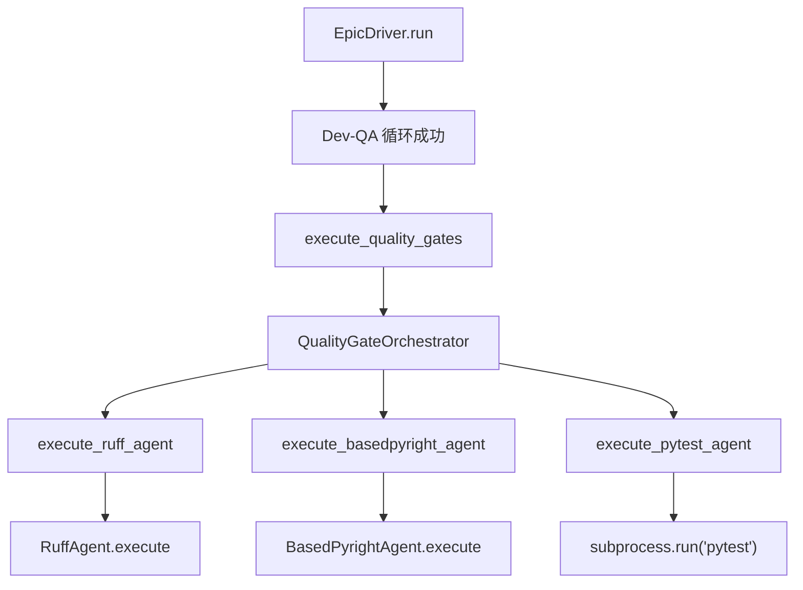
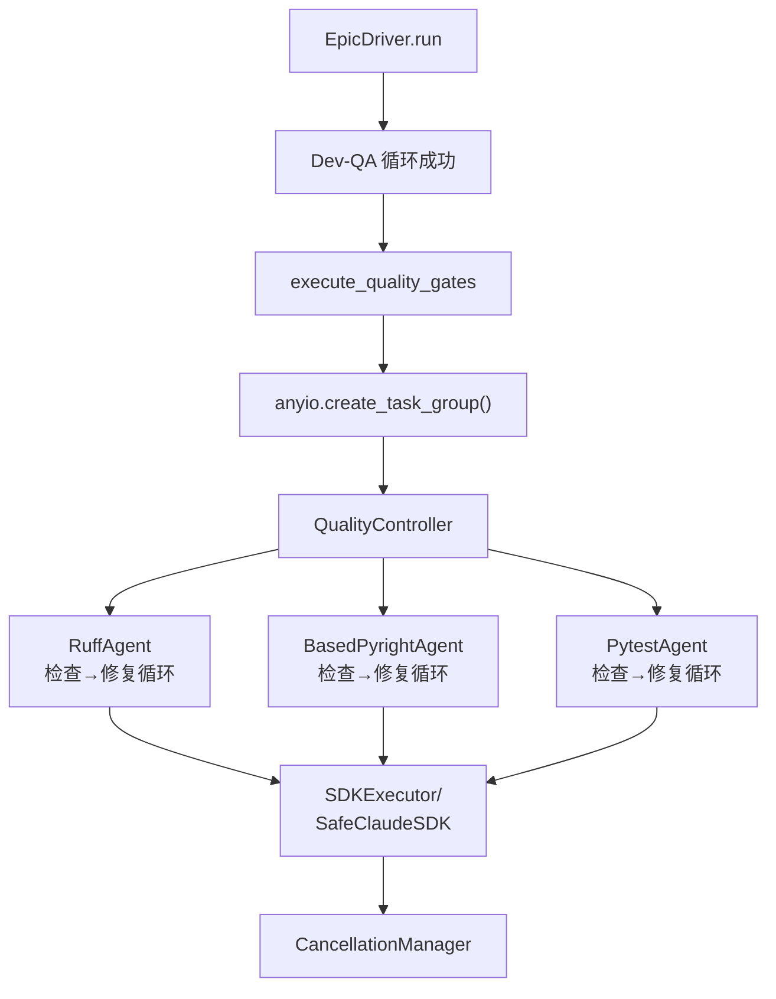

# 质量门禁阶段 TaskGroup-Controller-Agent-SDK 架构改造方案

**文档版本**: 1.0  
**创建日期**: 2026-01-13  
**对齐目标**: Epic-002 (Quality Gates Integration) / sprint-change.md

---

## 一、改造目标与背景

### 1.1 改造目标

将质量门禁阶段（Ruff / BasedPyright / Pytest）从当前的 `QualityGateOrchestrator` 直接驱动模式，改造为与 Dev-QA 阶段同构的 **TaskGroup-Controller-Agent-SDK** 执行架构。

### 1.2 对齐依据

- **Epic-002 (Quality Gates Integration)** 在 sprint-change.md 中明确要求：
  - Ruff: `ruff check --fix` → 解析 JSON → Claude SDK 修复 → 再检查（最多 3 轮）
  - BasedPyright: `basedpyright --outputjson` → 解析 → Claude SDK 修复 → 再检查（最多 3 轮）
  - Pytest: 执行测试 → 解析失败 → Claude SDK 修复 → 再测试（最多 5 轮）

- **docs/refactor 分层架构**已经定义：
  - 控制器层 (controllers/)
  - Agent 层 (agents/)
  - SDK 执行层 (core/): SDKExecutor + SafeClaudeSDK + CancellationManager

- **Dev-QA 阶段已成功落地**该架构模式，质量门禁需要复用同一套基础设施。

---

## 二、当前架构分析

### 2.1 当前质量门禁执行路径



### 2.2 当前存在的问题

| 问题点 | 描述 | 影响 |
|--------|------|------|
| **无 Quality TaskGroup** | `QualityGateOrchestrator` 不使用 AnyIO TaskGroup | CancelScope 语义与 Dev-QA 不一致 |
| **未使用 QualityController** | 已存在的 Controller 未被主流程调用 | 分层架构未完整落地 |
| **Agents 未走 SDK 修复循环** | RuffAgent/BasedPyrightAgent 只跑一次 CLI | 不符合 sprint-change 的 "检查→修复→再检查" 要求 |
| **Pytest 直接用 subprocess** | 未封装为 PytestAgent 统一模式 | 与其他 Agents 不一致 |
| **未统一使用 SafeClaudeSDK** | 质量门禁没有 AI 修复能力 | 违反"质量门控 SDK 调用统一走 SafeClaudeSDK"规范 |

---

## 三、计划架构设计

### 3.1 目标架构流程图



### 3.2 三层架构职责划分

#### 层级 1: EpicDriver（编排层）

**职责**：
- 在 Dev-QA 成功后调用质量门禁阶段
- 创建 Quality TaskGroup
- 实例化 QualityController
- 处理质量门禁的"非阻塞"语义（失败不阻止 Epic 完成）

**关键代码模式**：
```python
async def execute_quality_gates(self) -> bool:
    self.logger.info("=== Phase 2: Quality Gates ===")
    
    async with anyio.create_task_group() as tg:
        qc = QualityController(
            task_group=tg,
            project_root=Path(self.source_dir).parent
        )
        results = await qc.execute(
            source_dir=self.source_dir,
            test_dir=self.test_dir
        )
    
    # 非阻塞处理：记录结果但不阻断 Epic
    if results["overall_status"] in ["fail", "error"]:
        self.logger.warning("质量门禁失败（非阻塞）")
    
    return True  # 始终返回 True，保持非阻塞
```

#### 层级 2: QualityController（控制器层）

**职责**：
- 管理质量门禁的三步顺序执行
- 通过 `_execute_within_taskgroup` 调用各 Agent
- 汇总结果为统一格式
- 不处理 SDK 异常（委托给 SDK 执行层）

**执行流程**：
```python
async def execute(self, source_dir, test_dir) -> Dict[str, Any]:
    results = {"overall_status": "pending", "checks": {}}
    
    # Step 1: Ruff（在 TaskGroup 中）
    async def call_ruff():
        return await self.ruff_agent.execute(source_dir=source_dir)
    results["checks"]["ruff"] = await self._execute_within_taskgroup(call_ruff)
    
    # Step 2: BasedPyright
    async def call_pyright():
        return await self.pyright_agent.execute(source_dir=source_dir)
    results["checks"]["pyright"] = await self._execute_within_taskgroup(call_pyright)
    
    # Step 3: Pytest
    async def call_pytest():
        return await self.pytest_agent.execute(test_dir=test_dir)
    results["checks"]["pytest"] = await self._execute_within_taskgroup(call_pytest)
    
    # 汇总状态
    results["overall_status"] = self._evaluate_overall_status(results["checks"])
    return results
```

#### 层级 3: QualityAgents（Agent 层）

每个 Agent 实现独立的"检查→修复→再检查"循环：

##### RuffAgent 执行逻辑

```python
async def execute(self, source_dir: str, max_cycles: int = 3) -> dict:
    """Ruff 检查与自动修复循环"""
    for cycle in range(max_cycles):
        # 1. CLI 检查（含 auto-fix）
        result = await self._run_subprocess(
            f"ruff check --fix --output-format=json {source_dir}"
        )
        
        # 2. 解析错误
        errors = self._parse_ruff_json(result["stdout"])
        
        if errors == 0:
            return {"status": "completed", "errors": 0, "cycles": cycle + 1}
        
        # 3. 构造修复 prompt
        prompt = self._build_ruff_fix_prompt(errors, source_dir)
        
        # 4. 调用 SafeClaudeSDK 修复
        sdk_result = await self._execute_sdk_call(
            sdk_executor=None,  # BaseAgent 统一处理
            prompt=prompt,
            timeout=600.0
        )
        
        if not sdk_result.is_success():
            break
    
    return {"status": "failed", "errors": errors, "cycles": max_cycles}
```

##### BasedPyrightAgent 执行逻辑

```python
async def execute(self, source_dir: str, max_cycles: int = 3) -> dict:
    """BasedPyright 类型检查与修复循环"""
    for cycle in range(max_cycles):
        # 1. CLI 检查
        result = await self._run_subprocess(
            f"basedpyright --outputjson {source_dir}"
        )
        
        # 2. 解析 type issues
        issues = self._parse_pyright_json(result["stdout"])
        
        if len(issues) == 0:
            return {"status": "completed", "errors": 0, "cycles": cycle + 1}
        
        # 3. 构造修复 prompt（只针对严重错误）
        critical_issues = [i for i in issues if i["severity"] == "error"]
        if not critical_issues:
            return {"status": "completed", "warnings": len(issues)}
        
        prompt = self._build_pyright_fix_prompt(critical_issues, source_dir)
        
        # 4. SafeClaudeSDK 修复
        sdk_result = await self._execute_sdk_call(
            sdk_executor=None,
            prompt=prompt,
            timeout=600.0
        )
        
        if not sdk_result.is_success():
            break
    
    return {"status": "failed", "errors": len(critical_issues), "cycles": max_cycles}
```

##### PytestAgent 执行逻辑

```python
async def execute(self, test_dir: str, max_cycles: int = 5) -> dict:
    """Pytest 测试执行与修复循环"""
    for cycle in range(max_cycles):
        # 1. 运行 pytest
        result = await self._run_subprocess(
            f"pytest {test_dir} -v --tb=short --json-report"
        )
        
        # 2. 解析失败用例
        failures = self._parse_pytest_failures(result["stdout"])
        
        if not failures:
            return {"status": "completed", "passed": True, "cycles": cycle + 1}
        
        # 3. 构造修复 prompt
        prompt = self._build_pytest_fix_prompt(failures, test_dir)
        
        # 4. SafeClaudeSDK 修复
        sdk_result = await self._execute_sdk_call(
            sdk_executor=None,
            prompt=prompt,
            timeout=900.0  # Pytest 修复可能较慢
        )
        
        if not sdk_result.is_success():
            break
    
    return {"status": "failed", "failures": len(failures), "cycles": max_cycles}
```

#### 层级 4: SDK 执行层

**已有基础设施（复用）**：
- `SafeClaudeSDK`: 统一 SDK 调用入口，处理 CancelScope/异步生成器
- `SDKExecutor`: 管理 SDK 调用的执行与结果封装
- `CancellationManager`: 统一取消管理，跟踪 `has_target_result` + `cleanup_completed`

**Agent 调用方式**：
- 所有 Agent 通过 `BaseAgent._execute_sdk_call` 统一接口
- 内部自动路由到 SafeClaudeSDK + SDKExecutor
- 遵守"Cancel Scope 禁止跨 Task"、"取消返回 False 不抛异常"等规范

---

## 四、改造实施计划

### 4.1 文件改动清单

| 文件路径 | 改动类型 | 改动内容 |
|----------|----------|----------|
| `autoBMAD/epic_automation/epic_driver.py` | **重构** | `execute_quality_gates()` 改为创建 TaskGroup + QualityController |
| `autoBMAD/epic_automation/controllers/quality_controller.py` | **增强** | 已有架构，确保通过 `_execute_within_taskgroup` 调用 Agents |
| `autoBMAD/epic_automation/agents/quality_agents.py` | **重构** | RuffAgent/BasedPyrightAgent/PytestAgent 补齐"检查→修复循环"逻辑 |
| `autoBMAD/epic_automation/agents/base_agent.py` | **验证** | 确认 `_execute_sdk_call` 接口可被质量 Agents 复用 |

### 4.2 实施步骤

#### Step 1: 重构 EpicDriver.execute_quality_gates（优先级：高）

**目标**：将入口从 QualityGateOrchestrator 切换到 QualityController + TaskGroup

**关键点**：
- 创建 `anyio.create_task_group()`
- 实例化 `QualityController(task_group=tg, project_root=...)`
- 调用 `await qc.execute(source_dir, test_dir)`
- 保持"非阻塞"语义：质量门禁失败不返回 False

**验证**：
- Dev-QA 成功后能正确进入质量门禁
- TaskGroup 创建/退出无异常
- 质量门禁失败不阻止 Epic 完成

#### Step 2: 增强 QualityAgents 的修复循环（优先级：高）

**RuffAgent**：
- 补齐 `_build_ruff_fix_prompt(errors, source_dir)` 方法
- 在 `execute()` 中加入 for 循环（max_cycles=3）
- 每轮：CLI 检查 → 解析 → 调 `_execute_sdk_call` → 再检查

**BasedPyrightAgent**：
- 补齐 `_build_pyright_fix_prompt(issues, source_dir)` 方法
- 同样 for 循环（max_cycles=3）
- 只针对 severity="error" 的 issues 修复

**PytestAgent**：
- 补齐 `_build_pytest_fix_prompt(failures, test_dir)` 方法
- for 循环（max_cycles=5）
- 解析 pytest JSON 报告提取失败信息

**验证**：
- 单个 Agent 测试：故意引入代码错误，验证循环修复
- 确认 SafeClaudeSDK 调用成功
- 确认最多重试次数生效

#### Step 3: 集成测试与非阻塞验证（优先级：中）

**测试场景**：
1. 全通过场景：所有质量 gate 0 错误
2. Ruff 失败场景：有 lint 错误，验证循环修复
3. BasedPyright 失败场景：有 type 错误，验证循环修复
4. Pytest 失败场景：有测试失败，验证循环修复
5. 质量门禁全失败：验证 Epic 仍然完成（非阻塞）

**验证点**：
- TaskGroup 正常进入/退出
- CancelScope 无跨 Task 错误
- 质量门禁结果正确记录到日志
- `--skip-quality` / `--skip-tests` 标志仍生效

#### Step 4: 清理旧代码（优先级：低）

**可选操作**（保守起见可暂不删除）：
- 保留 `QualityGateOrchestrator` 作为备份/对比
- 在 EpicDriver 中注释掉旧入口
- 等新架构稳定后再彻底移除

---

## 五、关键设计约束

### 5.1 遵循的已有规范（来自记忆）

| 规范 | 来源 | 应用到质量门禁 |
|------|------|----------------|
| **质量门控 SDK 调用统一走 SafeClaudeSDK** | development_practice_specification | 所有 Agent 的修复必须通过 BaseAgent._execute_sdk_call |
| **Cancel Scope 禁止跨 Task 操作** | common_pitfalls_experience | 所有 SDK 调用在 TaskGroup 的 start(wrapper) 中完成 |
| **取消处理应返回 False 而非重新抛出异常** | common_pitfalls_experience | SafeClaudeSDK 取消时返回 False，Agent 传递该值，不抛 CancelledError |
| **TaskGroup start 方法需确保 wrapper 返回结果** | common_pitfalls_experience | QualityController 的 `_execute_within_taskgroup` 已实现 |
| **SDK 取消成功的资源清理双条件验证** | common_pitfalls_experience | 通过 CancellationManager 检查 `has_target_result` + `cleanup_completed` |

### 5.2 质量门禁特有约束

| 约束 | 原因 | 实现方式 |
|------|------|----------|
| **非阻塞语义** | Epic-002 设计：质量失败不阻止 Epic 完成 | `execute_quality_gates()` 始终返回 True，只记录日志 |
| **独立循环** | 每个工具的错误类型/修复策略不同 | 每个 Agent 内部独立 for 循环，不跨 Agent 汇总 |
| **最大重试次数** | 防止无限循环 | Ruff/BasedPyright: 3 次；Pytest: 5 次（对标 sprint-change） |
| **CLI 优先** | Ruff 自带 auto-fix，应先用 | RuffAgent 第一步先跑 `--fix`，再判断是否需要 SDK |

---

## 六、风险评估与缓解

### 6.1 技术风险

| 风险 | 影响 | 缓解措施 |
|------|------|----------|
| **CancelScope 跨 Task 错误复现** | 中 | 复用 Dev-QA 已验证的 BaseController._execute_within_taskgroup 模式 |
| **SDK 修复循环耗时过长** | 中 | 设置单次 SDK 调用 timeout（600-900s），总循环有最大次数 |
| **质量门禁失败影响 Epic 完成** | 高 | 明确"非阻塞"设计，execute_quality_gates() 始终返回 True |
| **Agents 修复提示词不精确** | 低 | 初期可能需要迭代优化 prompt，但不影响架构稳定性 |

### 6.2 实施风险

| 风险 | 影响 | 缓解措施 |
|------|------|----------|
| **旧流程回退困难** | 低 | 保留 QualityGateOrchestrator 作为备份，可快速切回 |
| **测试覆盖不足** | 中 | 按 Step 3 执行完整集成测试，覆盖 5 种典型场景 |
| **与现有 CLI 标志冲突** | 低 | 在 QualityController 中检查 skip_quality/skip_tests，向下传递 |

---

## 七、验收标准

### 7.1 功能验收

- [ ] EpicDriver 能通过 TaskGroup + QualityController 执行质量门禁
- [ ] RuffAgent 实现"检查→修复→再检查"循环（最多 3 次）
- [ ] BasedPyrightAgent 实现类型错误修复循环（最多 3 次）
- [ ] PytestAgent 实现测试修复循环（最多 5 次）
- [ ] 所有 Agent 的 SDK 调用走 SafeClaudeSDK
- [ ] 质量门禁失败不阻止 Epic 完成（非阻塞）
- [ ] `--skip-quality` / `--skip-tests` 标志正常工作

### 7.2 架构验收

- [ ] 质量门禁与 Dev-QA 使用相同的三层架构（Controller-Agent-SDK）
- [ ] 无 CancelScope 跨 Task 错误
- [ ] 取消信号通过 CancellationManager 统一管理
- [ ] TaskGroup 正常创建/退出，无资源泄露
- [ ] 日志清晰展示每个 Agent 的循环轮数与结果

### 7.3 性能验收

- [ ] 单个质量 gate 的总耗时 < 30 分钟（3 轮 × 10 分钟）
- [ ] 整个质量门禁阶段 < 90 分钟（3 个 gate 顺序执行）
- [ ] 内存使用无明显增长（对比 Dev-QA 阶段）

---

## 八、后续优化方向

### 8.1 短期优化（完成改造后）

- 优化各 Agent 的修复 prompt，提高 SDK 修复成功率
- 增加质量门禁详细报告（HTML / JSON），记录每轮修复内容
- 支持并行执行 Ruff 和 BasedPyright（如果测试证明安全）

### 8.2 长期演进（Epic-003+）

- 引入质量门禁的"渐进式修复"策略（先修严重错误，再修警告）
- 支持自定义质量规则集（不同项目不同标准）
- 集成更多质量工具（如 mypy / pylint）
- 质量门禁结果与 StateManager 集成（记录质量历史趋势）

---

## 九、参考文档

- **架构设计**: `docs/refactor/architecture/02-layer-architecture.md`
- **Controller 实现**: `docs/refactor/implementation/03-phase2-controllers.md`
- **SDK 集成**: `docs/refactor/SDK_INTEGRATION_FIX_PLAN.md`
- **Dev-QA 范例**: `docs/refactor/STATE_AGENT_DRIVEN_DEVQA_SOLUTION.md`
- **Sprint Change**: `docs/sprint-change.md` (Epic-002)

---

## 十、文档变更记录

| 版本 | 日期 | 变更内容 | 作者 |
|------|------|----------|------|
| 1.0 | 2026-01-13 | 初始版本：基于会话整理完整改造方案 | AI Assistant |

